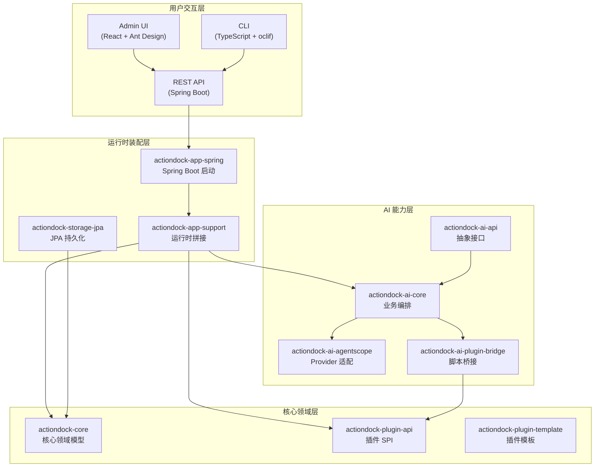
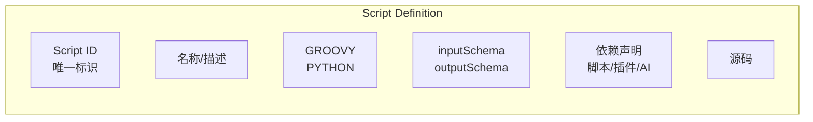
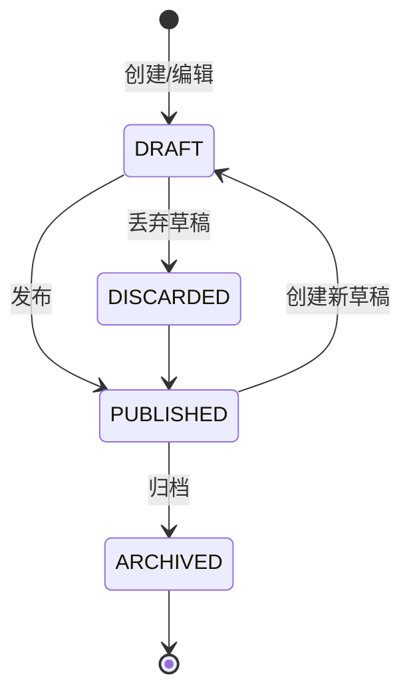

ActionDock 是一套将脚本、插件、仓库分发、AI 调用和运行治理整合在同一运行体系中的工具平台。其核心理念是：**同一份脚本定义，可以同时被人、REST API、CLI 和 Agent 使用**。无论你是通过管理台手动触发、通过命令行自动化执行、还是让 AI Agent 智能调用，底层都是同一套脚本资产，真正实现"一次编写，多端复用"。

Sources: [README.md](README.md#L1-L8)

---

## 解决的问题

在 ActionDock 出现之前，团队脚本管理通常面临以下困境：

| 痛点维度 | 传统方式的问题 | ActionDock 的解决方案 |
|----------|----------------|----------------------|
| **输入输出契约** | 脚本参数随意传递，缺乏规范 | 内建 `inputSchema` / `outputSchema` 声明式定义 |
| **草稿与发布** | 修改即生效，生产风险高 | 内建草稿、发布快照、丢弃草稿的完整流程 |
| **团队分发** | 拷文件或 Git 约定，版本混乱 | 仓库发现、安装、更新、开发同步一体化 |
| **插件扩展** | 依赖 SDK 侵入主服务 | PF4J 插件机制，脚本侧统一调用 |
| **AI 接入** | prompt 拼接，调用不稳定 | AI Toolset、Agent、脚本桥接三合一 |
| **共享状态** | 文件或 Redis 各自管理 | 内建 `namespace + key + JSON + version + CAS` |
| **多入口调用** | 每种方式各写各的 | UI、REST、CLI、Agent 共用同一脚本 |

Sources: [README.md](README.md#L18-L32)

---

## 系统架构

ActionDock 采用多模块 Maven 项目架构，分为核心领域层、运行时装配层、AI 能力层和用户交互层四大层次。



**架构分层说明**：

- **核心领域层（actiondock-core）**：定义脚本、执行、配置、调度、仓库等核心模型，不依赖 Web、JPA 或 AI Provider
- **运行时装配层（actiondock-app-*）**：将各模块真正拼接成可运行应用，包括 Spring Boot 启动、JPA 持久化适配
- **AI 能力层（actiondock-ai-*）**：基于领域抽象实现模型、Agent、Toolset 和运行时编排逻辑，支持 OpenAI、DashScope、Ollama、Gemini、Anthropic 等 Provider
- **用户交互层**：提供 Web 管理台、CLI 命令行、REST API 三种交互方式

Sources: [pom.xml](pom.xml#L1-L52)
Sources: [actiondock-core/README.md](actiondock-core/README.md#L1-L84)
Sources: [actiondock-app-spring/README.md](actiondock-admin-ui/package.json#L1-L38)

---

## 核心模块一览

| 模块 | 职责 | 关键技术 |
|------|------|----------|
| **actiondock-core** | 脚本、执行、配置、调度的核心领域模型 | 领域驱动设计、仓储模式 |
| **actiondock-storage-jpa** | JPA 持久化适配，默认 H2 数据库 | Spring Data JPA、H2 |
| **actiondock-app-support** | 运行时拼接、脚本引擎、插件运行时 | Groovy、Python、PF4J |
| **actiondock-app-spring** | Spring Boot 启动模块 | Spring Boot 3.3.5 |
| **actiondock-ai-api** | AI 领域抽象（模型、Agent、Toolset） | 纯接口定义 |
| **actiondock-ai-core** | AI 业务编排与运行时 | ReAct Agent、Toolkit |
| **actiondock-ai-agentscope** | 具体 Provider 适配 | AgentScope 框架 |
| **actiondock-ai-plugin-bridge** | AI 能力桥接为系统插件 | 系统内置插件 |
| **actiondock-plugin-api** | PF4J 插件 SPI 定义 | PF4J 3.13.0 |
| **actiondock-plugin-template** | 插件开发模板 | PF4J 插件开发 |
| **actiondock-cli** | npm 发布包，含 CLI 和运行时 | oclif、TypeScript |
| **actiondock-admin-ui** | Web 管理台 | React、Ant Design、Monaco Editor |

Sources: [actiondock-core/README.md](actiondock-core/README.md#L1)
Sources: [actiondock-ai-core/README.md](actiondock-ai-core/README.md#L1-L33)
Sources: [actiondock-plugin-api/README.md](actiondock-plugin-api/README.md#L1-L46)
Sources: [actiondock-cli/README.md](actiondock-cli/README.md#L1-L38)

---

## 核心概念

### 脚本资产

在 ActionDock 中，**脚本不是一段源码**，而是带有以下完整元数据的脚本资产：



- **inputSchema**：定义脚本的输入参数结构，驱动 CLI flag 生成、UI 表单生成、AI 工具描述
- **outputSchema**：定义脚本的输出结构
- **依赖声明**：引用其他脚本、插件或 AI 能力
- **发布快照**：发布时产生的不可变版本

Sources: [actiondock-core/README.md](actiondock-core/README.md#L17-L35)
Sources: [README.md](README.md#L51-L63)

### 脚本作用域

脚本具有不同的作用域，表示其来源和管理方式：

| 作用域 | 说明 | 可编辑性 |
|--------|------|----------|
| `PERSONAL` | 个人创建的脚本 | ✅ 完全控制 |
| `REPOSITORY` | 从仓库安装的脚本 | ❌ 只读，可更新 |
| `FORK` | 从仓库脚本 Fork 的个人副本 | ✅ 完全控制 |
| `DEVELOPMENT` | 从开发仓库同步的本地可编辑脚本 | ✅ 可同步 |
| `SAMPLE` | 系统内置示例 | ❌ 只读 |

Sources: [actiondock-core/README.md](actiondock-core/README.md#L26-L30)

### 脚本生命周期



Sources: [README.md](README.md#L94-L103)

### 插件系统

ActionDock 基于 PF4J（Plugin Framework for Java）实现插件扩展机制。插件作为独立 JAR 包动态加载，Groovy 和 Python 脚本都可通过统一的 `plugins.invoke()` 门面调用：

```groovy
// Groovy 脚本调用插件
def result = plugins.invoke("my-plugin", "hello", [name: "world"])
```

```python
# Python 脚本调用插件
result = plugins.invoke("my-plugin", "hello", {"name": "world"})
```

Sources: [actiondock-plugin-api/README.md](actiondock-plugin-api/README.md#L1-L46)
Sources: [actiondock-app-support/README.md](actiondock-app-support/README.md#L1-L85)

### AI 能力

ActionDock 将 AI 能力原生集成到平台中，提供三种核心调用方式：

| 调用方式 | 用途 | 示例 |
|----------|------|------|
| `chat` | 对话补全 | 调用模型进行多轮对话 |
| `structured` | 结构化输出 | 生成符合 Schema 的 JSON |
| `embed` | 向量嵌入 | 文本向量化 |
| `agentRun` | Agent 执行 | 带工具调用的自主推理 |

所有 AI 调用都通过统一的 `plugins.invoke("actiondock-ai", action, args)` 方式，Groovy 和 Python 完全一致。

Sources: [actiondock-ai-plugin-bridge/README.md](actiondock-ai-plugin-bridge/README.md#L1-L55)

---

## 系统要求

| 要求 | 版本 | 说明 |
|------|------|------|
| JDK | 21+ | 运行时必需 |
| Maven | 3.9+ | 本地构建时 |
| Node.js | 18+ | CLI 开发或前端构建 |
| Python | 3.x | 执行 PYTHON 类型脚本（默认 `python3`） |
| Docker | 可选 | 容器化部署时 |

Sources: [README.md](README.md#L35-L44)

---

## 快速体验

安装后，一条命令即可启动：

```bash
npm install -g actiondock
actiondock server
```

启动后访问：
- **管理台**：`http://localhost:5177/admin/app/scripts`
- **REST API**：`http://localhost:5177/api`
- **Swagger UI**：`http://localhost:5177/swagger-ui.html`

服务默认会初始化示例脚本 `hello-groovy`，可直接运行体验。

Sources: [README.md](README.md#L46-L66)

---

## 下一步

完成本项目概述后，建议按以下路径继续学习：

1. **[快速开始](2-kuai-su-kai-shi)** → 安装部署并运行第一个脚本
2. **[项目架构](3-xiang-mu-jia-gou)** → 深入理解各模块职责和交互关系
3. **[脚本生命周期管理](4-jiao-ben-sheng-ming-zhou-qi-guan-li)** → 掌握脚本的创建、编辑、发布流程

---