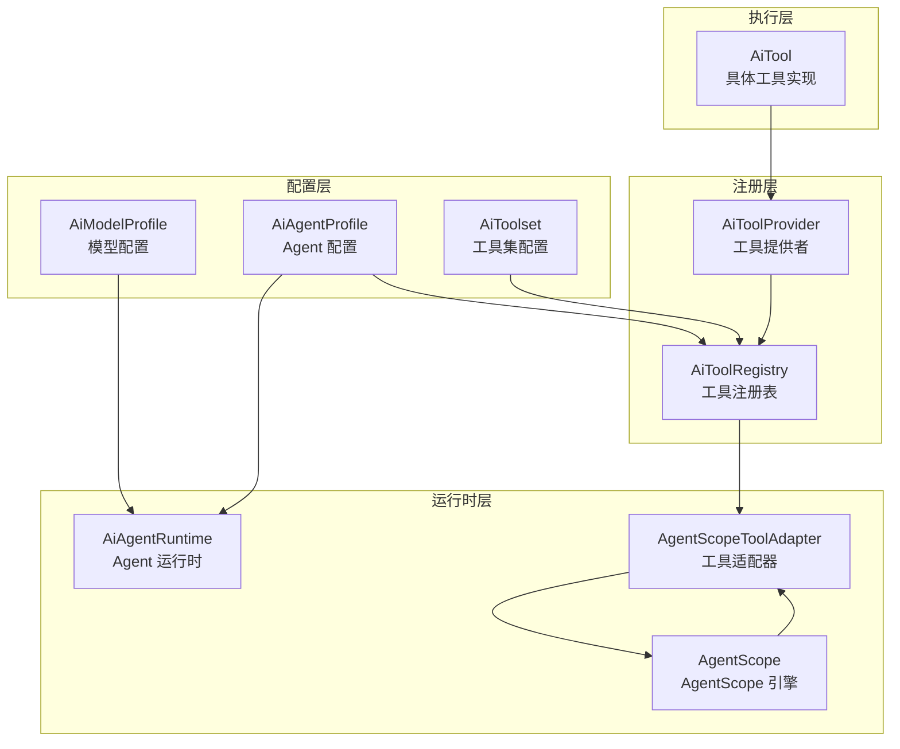
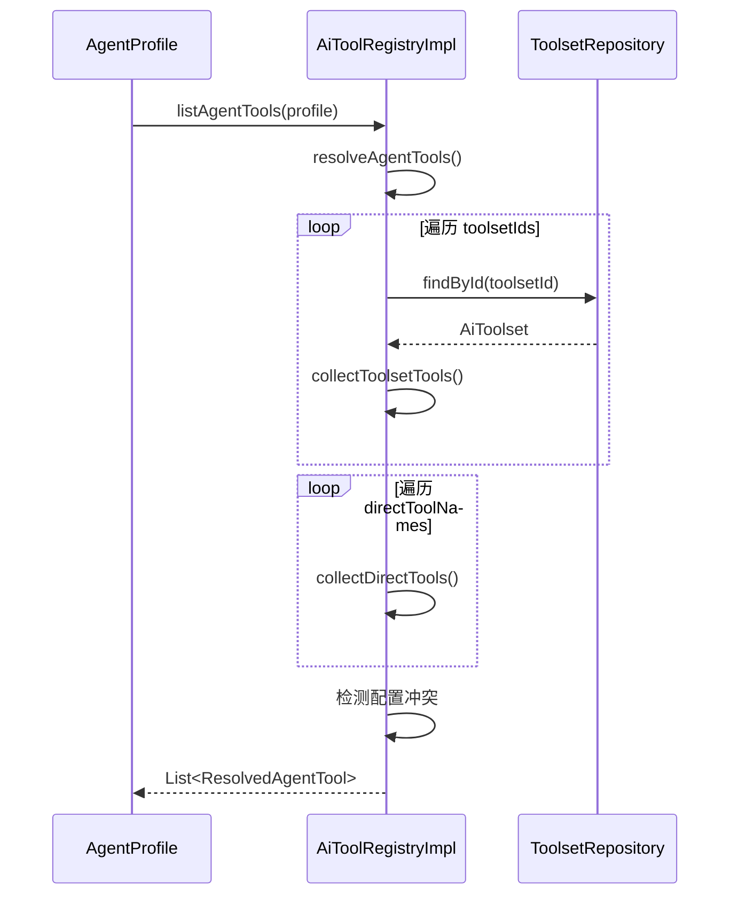
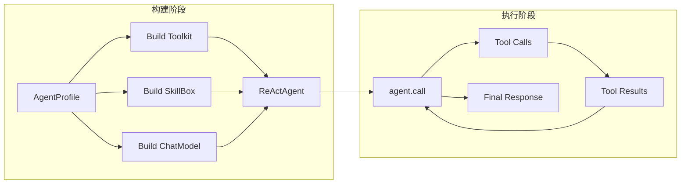

本文档详细介绍 ActionDock 中的 Agent 与 Toolset 架构设计、核心接口、运行时机制以及内置工具集成方案。

## 架构概览

ActionDock 的 AI 能力基于 **AgentScope** 框架实现，提供完整的 Agent 生命周期管理和工具调用机制。系统采用分层设计，将 Agent 配置、工具注册、执行运行时严格分离。



Sources: [AiAgentRuntime.java](actiondock-ai-api/src/main/java/org/team4u/actiondock/ai/api/AiAgentRuntime.java#L1-L14), [AiToolRegistry.java](actiondock-ai-api/src/main/java/org/team4u/actiondock/ai/api/AiToolRegistry.java#L1-L15), [AgentScopeToolAdapter.java](actiondock-ai-agentscope/src/main/java/org/team4u/actiondock/ai/agentscope/AgentScopeToolAdapter.java#L1-L50)

## Agent 配置模型

**AiAgentProfile** 是 Agent 的核心配置实体，定义了 Agent 的身份模型、关联资源以及行为参数。

### 关键配置字段

| 字段 | 类型 | 说明 |
|------|------|------|
| `id` | String | Agent 唯一标识 |
| `name` | String | 人类可读名称 |
| `provider` | AiProvider | AI 提供商，当前固定为 `AGENTSCOPE` |
| `modelProfileId` | String | 关联的模型配置 ID |
| `systemPrompt` | String | 系统提示词 |
| `toolsetIds` | List\<String\> | 关联的工具集 ID 列表 |
| `directToolNames` | List\<String\> | 直接引用的工具名 |
| `directToolOptions` | Map | 直接工具的配置参数 |
| `skillIds` | List\<String\> | 加载的 Skill ID 列表 |
| `options` | Map | Agent 特定参数（JSON） |

Agent 配置支持两种工具来源：**工具集引用** 和 **直接工具指定**。工具集提供组织化的工具分组，直接工具则允许绕过工具集直接挂载单个工具。

Sources: [AiAgentProfile.java](actiondock-ai-api/src/main/java/org/team4u/actiondock/ai/api/AiAgentProfile.java#L1-L58)

### 工具解析流程

工具解析在 `AiToolRegistryImpl.resolveAgentTools()` 中完成，支持冲突检测：



解析过程中若发现同一工具在多个来源中的配置不一致，将抛出 `IllegalArgumentException`。

Sources: [AiToolRegistryImpl.java](actiondock-ai-core/src/main/java/org/team4u/actiondock/ai/core/AiToolRegistryImpl.java#L76-L95)

## Toolset 管理机制

**AiToolset** 代表一组相关工具的集合，是 Agent 权限边界和工具分组的组织单元。

### 工具集配置结构

| 字段 | 说明 |
|------|------|
| `id` | 工具集唯一标识 |
| `name` | 人类可读名称 |
| `description` | 用途说明 |
| `toolNames` | 包含的工具名列表 |
| `toolOptions` | 各工具的私有配置 |
| `maxPermission` | 权限上限：`READ_ONLY` / `PROPOSE_CHANGE` / `CONTROLLED_ACTION` / `DANGEROUS_ACTION` |
| `enabled` | 是否启用 |

工具集可标记为 **managed** 状态（由脚本包管理），系统会限制此类工具集的删除和修改操作。

Sources: [AiToolset.java](actiondock-ai-api/src/main/java/org/team4u/actiondock/ai/api/AiToolset.java#L1-L43), [AiToolsetService.java](actiondock-ai-core/src/main/java/org/team4u/actiondock/ai/core/AiToolsetService.java#L45-L55)

### 工具集生命周期

**AiToolsetService** 提供完整的 CRUD 操作：

```java
public class AiToolsetService {
    public List<AiToolset> list(boolean includeManaged) { ... }
    public AiToolset get(String id) { ... }
    public AiToolset save(AiToolset toolset) { ... }
    public void delete(String id) { ... }
}
```

删除工具集时会检查是否有 Agent 引用该工具集，若存在引用则拒绝删除。

Sources: [AiToolsetService.java](actiondock-ai-core/src/main/java/org/team4u/actiondock/ai/core/AiToolsetService.java#L56-L65)

## 工具接口体系

### AiTool 核心接口

所有工具实现必须实现 `AiTool` 接口：

```java
public interface AiTool {
    String name();                           // 工具唯一名称
    String description();                    // 工具描述
    default AiToolSourceType sourceType() { // 来源类型
        return AiToolSourceType.SYSTEM;
    }
    Map<String, Object> inputSchema();       // 输入 JSON Schema
    Map<String, Object> outputSchema();      // 输出 JSON Schema
    AiToolPermission permission();           // 所需权限级别
    AiToolExecutionResult invoke(Map<String, Object> input, 
                                  AiToolExecutionContext context);
}
```

Sources: [AiTool.java](actiondock-ai-api/src/main/java/org/team4u/actiondock/ai/api/AiTool.java#L1-L30)

### 可配置工具扩展

`ConfigurableAiTool` 接口允许工具在实例化时接受配置参数：

```java
public interface ConfigurableAiTool extends AiTool {
    AiTool configure(Map<String, Object> options);
    default String configHelp() { return null; }
    default Map<String, Object> configExample() { return Map.of(); }
}
```

此接口支持工具的二次配置，如指定工具操作的根目录、API Key 配置键等。

Sources: [ConfigurableAiTool.java](actiondock-ai-api/src/main/java/org/team4u/actiondock/ai/api/ConfigurableAiTool.java#L1-L16)

### 工具权限体系

权限级别按限制强度递增排列：

| 权限级别 | 说明 | 允许的操作 |
|----------|------|------------|
| `READ_ONLY` | 只读权限 | 文件读取、查询操作 |
| `PROPOSE_CHANGE` | 提议变更 | 生成修改建议但不执行 |
| `CONTROLLED_ACTION` | 受控操作 | 写入文件、API 调用等 |
| `DANGEROUS_ACTION` | 危险操作 | Shell 命令执行等 |

权限校验采用 `allows()` 方法判断：`permission.ordinal() >= requested.ordinal()`。

Sources: [AiToolPermission.java](actiondock-ai-api/src/main/java/org/team4u/actiondock/ai/api/AiToolPermission.java#L1-L27)

### 工具来源类型

| 类型 | 说明 | 示例 |
|------|------|------|
| `SYSTEM` | 平台内置工具 | AgentScope 内置工具 |
| `SCRIPT` | 脚本暴露的工具 | 脚本注册的 API 工具 |
| `AGENT` | Agent 级别工具 | Agent 自定义工具 |

Sources: [AiToolSourceType.java](actiondock-ai-api/src/main/java/org/team4u/actiondock/ai/api/AiToolSourceType.java#L1-L8)

## 工具注册表

**AiToolRegistry** 是工具的中央注册机构，负责工具的发现、配置和调用。

### 注册表核心方法

```java
public interface AiToolRegistry {
    // 列出工具集中所有工具
    List<AiTool> listTools(String toolsetId);
    
    // 解析 Agent 配置中的所有可用工具
    List<AiTool> listAgentTools(AiAgentProfile agentProfile);
    
    // 获取指定工具
    AiTool getTool(String name);
    
    // 执行工具调用
    AiToolExecutionResult invoke(String toolName, 
                                 Map<String, Object> input, 
                                 AiToolExecutionContext context);
}
```

Sources: [AiToolRegistry.java](actiondock-ai-api/src/main/java/org/team4u/actiondock/ai/api/AiToolRegistry.java#L1-L15)

### 工具提供者

`AiToolProvider` 接口支持动态工具发现：

```java
public interface AiToolProvider {
    List<AiTool> listTools();
    Optional<AiTool> findTool(String name);
}
```

工具注册表初始化时接收静态工具列表和动态提供者列表，执行时优先使用静态注册，静态未命中则查询提供者。

Sources: [AiToolProvider.java](actiondock-ai-api/src/main/java/org/team4u/actiondock/ai/api/AiToolProvider.java#L1-L11), [AiToolRegistryImpl.java](actiondock-ai-core/src/main/java/org/team4u/actiondock/ai/core/AiToolRegistryImpl.java#L20-L33)

## Agent 运行时

**AiAgentRuntime** 定义 Agent 的执行入口，支持同步和异步两种运行模式。

### 运行时接口

```java
public interface AiAgentRuntime {
    // 异步提交，立即返回 Submission
    AiAgentRunSubmission submit(AiAgentRunRequest request, AiAgentRunContext context);
    
    // 同步执行，等待完成
    AiAgentRunResult run(AiAgentRunRequest request, AiAgentRunContext context);
    
    // 恢复中断的运行
    AiAgentRunResult resume(String runId, AiAgentResumeCommand command);
    
    // 取消运行
    void cancel(String runId);
    
    // 获取运行快照
    AiAgentRunSnapshot getRun(String runId);
}
```

Sources: [AiAgentRuntime.java](actiondock-ai-api/src/main/java/org/team4u/actiondock/ai/api/AiAgentRuntime.java#L1-L14)

### 运行请求与上下文

```java
// 运行请求
record AiAgentRunRequest(
    String agentProfile,       // Agent 配置 ID
    List<AiMessage> messages,   // 消息列表
    Map<String, Object> input,  // 输入参数
    Map<String, Object> options  // 运行选项
);

// 运行上下文
record AiAgentRunContext(
    AiCallerType callerType,     // 调用方类型
    String scriptId,             // 关联脚本 ID
    String executionId,          // 关联执行 ID
    String userId,               // 用户 ID
    Map<String, Object> metadata // 元数据
);
```

Sources: [AiAgentRunRequest.java](actiondock-ai-api/src/main/java/org/team4u/actiondock/ai/api/AiAgentRunRequest.java#L1-L13), [AiAgentRunContext.java](actiondock-ai-api/src/main/java/org/team4u/actiondock/ai/api/AiAgentRunContext.java#L1-L18)

### 运行状态与步骤

运行状态枚举：

| 状态 | 说明 |
|------|------|
| `RUNNING` | 运行中 |
| `SUCCESS` | 成功完成 |
| `FAILED` | 执行失败 |
| `WAITING_APPROVAL` | 等待审批 |
| `CANCELLED` | 已取消 |
| `INTERRUPTED` | 已中断 |

步骤类型枚举：

| 类型 | 说明 |
|------|------|
| `MODEL_REASONING` | 模型推理步骤 |
| `TOOL_CALL` | 工具调用 |
| `TOOL_RESULT` | 工具结果返回 |
| `APPROVAL` | 审批请求 |
| `INTERRUPT` | 中断点 |

Sources: [AiRunStatus.java](actiondock-ai-api/src/main/java/org/team4u/actiondock/ai/api/AiRunStatus.java#L1-L11), [AiStepType.java](actiondock-ai-api/src/main/java/org/team4u/actiondock/ai/api/AiStepType.java#L1-L10)

## AgentScope 集成

**AgentScopeAiProviderClient** 是 ActionDock 与 AgentScope 引擎的桥接层，负责将配置转换为 AgentScope 可执行实体。

### ReAct Agent 构建流程



Sources: [AgentScopeAiProviderClient.java](actiondock-ai-agentscope/src/main/java/org/team4u/actiondock/ai/agentscope/AgentScopeAiProviderClient.java#L119-L160)

### 工具适配器

**AgentScopeToolAdapter** 负责将 `AiTool` 转换为 AgentScope 的 `AgentTool`：

```java
class AgentScopeToolAdapter implements AgentTool {
    private final AiTool tool;
    private final AiToolRegistry toolRegistry;
    private final AtomicInteger stepIndex;
    private final List<AiAgentStep> steps;
    private final AiAgentRunObserver observer;
    
    @Override
    public Mono<ToolResultBlock> callAsync(ToolCallParam param) {
        // 1. 构建工具调用步骤
        // 2. 通过注册表执行工具
        // 3. 构建结果步骤
        // 4. 转换为 AgentScope 结果块
    }
}
```

适配器在工具调用前后自动记录步骤信息，并通过观察者通知运行时状态变更。

Sources: [AgentScopeToolAdapter.java](actiondock-ai-agentscope/src/main/java/org/team4u/actiondock/ai/agentscope/AgentScopeToolAdapter.java#L25-L100)

## 内置工具集

**AgentScopeBuiltinAiTools** 提供 AgentScope 原生能力封装为统一工具接口。

### 工具清单

| 工具名 | 权限 | 功能 |
|--------|------|------|
| `agentscope.list_directory` | READ_ONLY | 列出目录内容 |
| `agentscope.view_text_file` | READ_ONLY | 读取文本文件 |
| `agentscope.insert_text_file` | CONTROLLED_ACTION | 向文件插入内容 |
| `agentscope.write_text_file` | CONTROLLED_ACTION | 写入文本文件 |
| `agentscope.execute_shell_command` | DANGEROUS_ACTION | 执行 Shell 命令 |
| `agentscope.dashscope_*` | varies | DashScope 多模态能力 |
| `agentscope.openai_*` | varies | OpenAI 多模态能力 |

### 配置参数

文件操作工具支持 `baseDir` 参数指定根目录：

```json
{
  "baseDir": "/workspace/project"
}
```

Shell 命令工具支持 `allowedCommands` 白名单和审批回调：

```json
{
  "baseDir": ".",
  "allowedCommands": ["git", "npm", "mvn"]
}
```

多模态工具需要 `apiKeyConfigKey` 指定 API Key 配置键：

```json
{
  "apiKeyConfigKey": "dashscope.api.key"
}
```

Sources: [AgentScopeBuiltinAiTools.java](actiondock-ai-agentscope/src/main/java/org/team4u/actiondock/ai/agentscope/AgentScopeBuiltinAiTools.java#L25-L60)

### 委托执行模式

内置工具采用委托执行模式，通过 `createDelegate()` 创建对应的 AgentScope 原生工具实例：

```java
private static AgentTool createDelegate(String localName, 
                                         Map<String, Object> options, 
                                         AiSecretResolver secretResolver) {
    if ("execute_shell_command".equals(localName)) {
        return new ShellCommandTool(baseDir, allowedCommands, approvalCallback, ...);
    }
    Toolkit toolkit = new Toolkit();
    switch (localName) {
        case String s when s.startsWith("dashscope_") ->
            toolkit.registerTool(new DashScopeMultiModalTool(apiKey));
        case String s when s.startsWith("openai_") ->
            toolkit.registerTool(new OpenAIMultiModalTool(apiKey, baseUrl));
        case "list_directory", "view_text_file" ->
            toolkit.registerTool(new ReadFileTool(baseDir));
        // ...
    }
    return toolkit.getTool(localName);
}
```

Sources: [AgentScopeBuiltinAiTools.java](actiondock-ai-agentscope/src/main/java/org/team4u/actiondock/ai/agentscope/AgentScopeBuiltinAiTools.java#L155-L185)

## 执行观察机制

**AiAgentRunObserver** 支持运行过程的实时观察：

```java
public interface AiAgentRunObserver {
    void onTextDelta(String delta, String accumulatedText);
    void onStep(AiAgentStep step);
    
    AiAgentRunObserver NOOP = new AiAgentRunObserver() { ... };
}
```

运行时实现通过观察者持久化步骤信息：

```java
private AiAgentRunObserver persistenceObserver(String runId) {
    return new AiAgentRunObserver() {
        @Override
        public void onStep(AiAgentStep step) {
            stepRepository.save(step);
        }
        // ...
    };
}
```

Sources: [AiAgentRuntimeImpl.java](actiondock-ai-core/src/main/java/org/team4u/actiondock/ai/core/AiAgentRuntimeImpl.java#L160-L185)

## 工具元数据上下文

工具执行上下文携带完整的运行时信息：

```java
record AiToolExecutionContext(
    String runId,              // 运行 ID
    String stepId,             // 步骤 ID
    AiCallerType callerType,   // 调用方类型
    String scriptId,           // 关联脚本
    String executionId,        // 关联执行
    String userId,            // 用户 ID
    Map<String, Object> metadata // 扩展元数据
);
```

Sources: [AiToolExecutionContext.java](actiondock-ai-api/src/main/java/org/team4u/actiondock/ai/api/AiToolExecutionContext.java#L1-L15)

## 典型使用场景

### 场景一：创建专用 Agent

```java
// 1. 创建工具集
AiToolset toolset = new AiToolset()
    .setId("code-review-toolset")
    .setName("代码审查工具集")
    .setToolNames(List.of("agentscope.view_text_file", "agentscope.execute_shell_command"))
    .setMaxPermission(AiToolPermission.CONTROLLED_ACTION);

// 2. 创建 Agent Profile
AiAgentProfile profile = new AiAgentProfile()
    .setId("reviewer-agent")
    .setName("代码审查 Agent")
    .setModelProfileId("gpt-4o-id")
    .setToolsetIds(List.of("code-review-toolset"))
    .setSystemPrompt("你是一个专业的代码审查助手...");

// 3. 提交运行
AiAgentRunSubmission submission = agentRuntime.submit(
    new AiAgentRunRequest("reviewer-agent", messages, input, options),
    AiAgentRunContext.adminTest()
);
```

### 场景二：异步执行与状态追踪

```java
// 1. 异步提交
AiAgentRunSubmission submission = agentRuntime.submit(request, context);

// 2. 轮询状态
while (true) {
    AiAgentRunSnapshot snapshot = agentRuntime.getRun(submission.runId());
    if (snapshot.status().isTerminal()) {
        break;
    }
    Thread.sleep(1000);
}

// 3. 分析步骤
for (AiAgentStep step : snapshot.steps()) {
    log.info("Step {}: {} - {}ms", 
             step.stepType(), 
             step.toolName(), 
             step.latencyMs());
}
```

Sources: [AiAgentRuntimeImpl.java](actiondock-ai-core/src/main/java/org/team4u/actiondock/ai/core/AiAgentRuntimeImpl.java#L80-L95)

## 总结

ActionDock 的 Agent 与 Toolset 体系采用清晰的关注点分离设计：

- **配置层** 通过 `AiAgentProfile` 和 `AiToolset` 定义语义化的资源和能力组织
- **注册层** 通过 `AiToolRegistry` 提供统一的工具发现和调用接口
- **运行时层** 通过 `AiAgentRuntime` 抽象 Agent 执行的生命周期管理
- **集成层** 通过 `AgentScopeToolAdapter` 适配外部 AI 引擎能力

权限系统贯穿始终，确保工具调用始终在预期的安全边界内执行。

---

**相关文档**：
- [AI 模型配置](9-ai-mo-xing-pei-zhi) - 了解如何配置 AI 模型
- [脚本依赖与调用](6-jiao-ben-yi-lai-yu-diao-yong) - 了解如何在脚本中调用 Agent
- [AI 能力概览](ai-capabilities) - 了解管理后台的 AI 功能入口