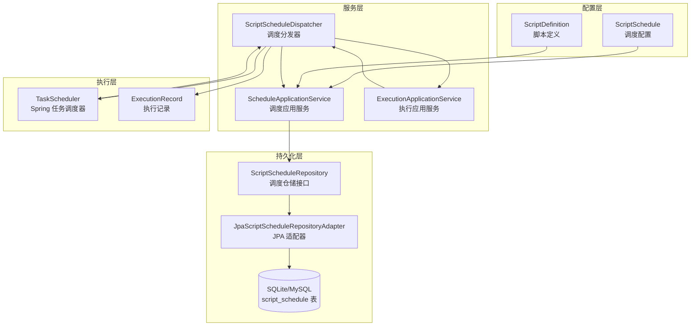
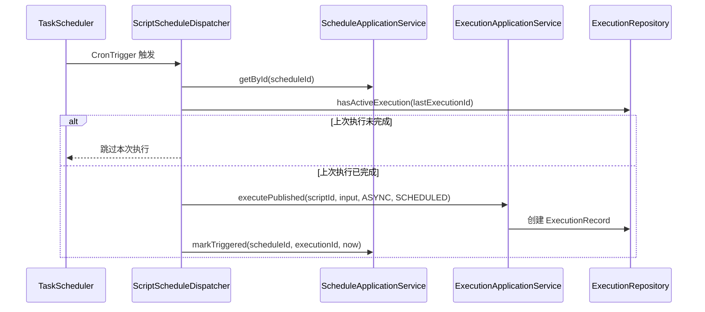

定时任务是 ActionDock 触发中心的两大自动化执行方式之一，通过 Cron 表达式实现脚本的周期性定时执行。与事件驱动相比，定时任务适用于需要按固定时间间隔或特定时间点执行的场景，例如数据同步、健康检查、报表生成等。

## 架构设计

ActionDock 的定时任务系统采用分层架构，由调度配置、调度引擎和持久化三层组成。调度配置层定义任务元数据（Cron 表达式、输入参数等），调度引擎层负责按时触发执行，持久化层确保配置和执行记录的可恢复性。



### 核心组件职责

| 组件 | 位置 | 职责 |
|------|------|------|
| `ScriptSchedule` | `actiondock-core` | 调度配置领域模型，定义 Cron 表达式、输入参数等元数据 |
| `ScheduleApplicationService` | `actiondock-core` | 调度 CRUD 操作和校验逻辑 |
| `ScriptScheduleDispatcher` | `actiondock-app-support` | 基于 Spring TaskScheduler 的调度执行引擎 |
| `ScriptScheduleRepository` | `actiondock-core` | 调度持久化端口接口 |
| `JpaScriptScheduleRepositoryAdapter` | `actiondock-storage-jpa` | JPA 实现，将调度存储到关系数据库 |

Sources: [ScriptSchedule.java](actiondock-core/src/main/java/org/team4u/actiondock/domain/model/ScriptSchedule.java#L1-L187), [ScriptScheduleDispatcher.java](actiondock-app-support/src/main/java/org/team4u/actiondock/schedule/ScriptScheduleDispatcher.java#L1-L166)

## 数据模型

### ScriptSchedule 实体

每个定时任务对应一个 `ScriptSchedule` 实体，包含以下核心字段：

| 字段 | 类型 | 说明 |
|------|------|------|
| `id` | String | 全局唯一标识（UUID） |
| `scriptId` | String | 关联脚本的唯一标识 |
| `name` | String | 人类可读的任务名称 |
| `cronExpression` | String | 标准 5 字段 Cron 表达式 |
| `input` | Map<String, Object> | 传递给脚本的输入参数（JSON 格式） |
| `enabled` | boolean | 是否启用调度 |
| `editable` | boolean | 是否可编辑（团队任务为只读） |
| `lastTriggeredAt` | LocalDateTime | 最近一次触发时间 |
| `lastExecutionId` | String | 最近一次执行的执行记录 ID |

```java
public class ScriptSchedule {
    private String id;
    private String scriptId;
    private String name;
    private String cronExpression;
    private Map<String, Object> input = new LinkedHashMap<>();
    private boolean enabled = true;
    private boolean editable = true;
    private LocalDateTime lastTriggeredAt;
    private String lastExecutionId;
    private LocalDateTime createdAt;
    private LocalDateTime updatedAt;
    // ... getters and setters
}
```

Sources: [ScriptSchedule.java](actiondock-core/src/main/java/org/team4u/actiondock/domain/model/ScriptSchedule.java#L17-L30)

### 数据库表结构

调度数据持久化到 `script_schedule` 表，Spring Data JPA 自动管理表结构：

```sql
CREATE TABLE script_schedule (
    id VARCHAR(255) PRIMARY KEY,
    script_id VARCHAR(255) NOT NULL,
    name VARCHAR(255) NOT NULL,
    cron_expression VARCHAR(255) NOT NULL,
    input_json TEXT,
    enabled BOOLEAN NOT NULL DEFAULT TRUE,
    editable BOOLEAN NOT NULL DEFAULT TRUE,
    last_triggered_at TIMESTAMP,
    last_execution_id VARCHAR(255),
    created_at TIMESTAMP,
    updated_at TIMESTAMP,
    
    INDEX idx_script_schedule_script_id (script_id),
    INDEX idx_script_schedule_enabled (enabled)
);
```

Sources: [ScriptScheduleEntity.java](actiondock-storage-jpa/src/main/java/org/team4u/actiondock/storage/jpa/entity/ScriptScheduleEntity.java#L1-L175)

## 生命周期管理

### 创建定时任务

创建定时任务需要指定脚本 ID、任务名称、Cron 表达式和输入参数。系统会自动校验以下约束：

1. **脚本已发布**：关联的脚本必须是 `PUBLISHED` 状态
2. **Cron 表达式合法**：使用 Spring `CronExpression.parse()` 验证
3. **输入参数匹配 Schema**：参数必须符合脚本的 `inputSchema` 定义

```java
public ScriptSchedule save(String scriptId, ScriptSchedule schedule) {
    // 1. 校验脚本已发布
    ScriptDefinition script = ensurePublishedScript(scriptId);
    
    // 2. 校验 Cron 表达式
    String cronExpression = normalize(schedule.getCronExpression(), "Cron 表达式不能为空");
    scheduleExpressionValidator.validate(cronExpression);
    
    // 3. 校验输入参数
    ScriptSchemaSupport.validateInput(
        script.getId(),
        configValueApplicationService.resolveMap(target.getInput()),
        script.getPublishedSnapshot().getInputSchema()
    );
    
    // 4. 保存调度配置
    return scriptScheduleRepository.save(target);
}
```

Sources: [ScheduleApplicationService.java](actiondock-core/src/main/java/org/team4u/actiondock/application/ScheduleApplicationService.java#L80-L120)

### 启用与禁用

启用调度时会重新校验 Cron 表达式合法性，禁用后调度不再被触发但配置仍保留：

```java
public ScriptSchedule enable(String scriptId, String scheduleId) {
    ensurePublishedScript(scriptId);
    ScriptSchedule schedule = get(scriptId, scheduleId);
    scheduleExpressionValidator.validate(schedule.getCronExpression());
    schedule.setEnabled(true).setUpdatedAt(LocalDateTime.now());
    return scriptScheduleRepository.save(schedule);
}

public ScriptSchedule disable(String scriptId, String scheduleId) {
    ScriptSchedule schedule = get(scriptId, scheduleId);
    schedule.setEnabled(false).setUpdatedAt(LocalDateTime.now());
    return scriptScheduleRepository.save(schedule);
}
```

Sources: [ScheduleApplicationService.java](actiondock-core/src/main/java/org/team4u/actiondock/application/ScheduleApplicationService.java#L122-L160)

### 删除定时任务

删除调度时会级联取消已注册的任务：

```java
public void delete(String scriptId, String scheduleId) {
    ScriptSchedule schedule = get(scriptId, scheduleId);
    ensureEditable(schedule);
    scriptScheduleRepository.deleteById(schedule.getId());
}
```

Sources: [ScheduleApplicationService.java](actiondock-core/src/main/java/org/team4u/actiondock/application/ScheduleApplicationService.java#L183-L195)

## 调度引擎

### 启动时加载

应用启动完成后（`ApplicationReadyEvent`），`ScriptScheduleDispatcher` 自动加载所有已启用的调度任务：

```java
@EventListener(ApplicationReadyEvent.class)
public void onApplicationReady() {
    refreshAll();
}

public synchronized void refreshAll() {
    // 1. 取消所有现有任务
    Set<String> scheduleIds = Set.copyOf(scheduledTasks.keySet());
    scheduleIds.forEach(this::synchronizedCancelSchedule);
    
    // 2. 重新注册所有启用状态的调度
    scheduleApplicationService.listEnabled().forEach(this::registerSchedule);
}
```

Sources: [ScriptScheduleDispatcher.java](actiondock-app-support/src/main/java/org/team4u/actiondock/schedule/ScriptScheduleDispatcher.java#L55-L75)

### 任务调度流程

调度分发器使用 Spring `TaskScheduler` 和 `CronTrigger` 实现定时触发：



Sources: [ScriptScheduleDispatcher.java](actiondock-app-support/src/main/java/org/team4u/actiondock/schedule/ScriptScheduleDispatcher.java#L100-L130)

### 任务分发逻辑

分发时自动处理以下边界情况：

- **任务已禁用**：自动取消注册的任务
- **脚本不存在或未发布**：自动取消注册的任务
- **上次执行未完成**：跳过本次执行，防止任务堆积

```java
private void dispatch(String scheduleId) {
    try {
        ScriptSchedule schedule = scheduleApplicationService.getById(scheduleId);
        
        if (!schedule.isEnabled()) {
            synchronizedCancelSchedule(scheduleId);
            return;
        }

        ScriptDefinition script = scriptRepository.findById(schedule.getScriptId()).orElse(null);
        if (script == null || script.getPublishedSnapshot() == null) {
            synchronizedCancelSchedule(scheduleId);
            return;
        }
        
        if (hasActiveExecution(schedule.getLastExecutionId())) {
            return;
        }

        // 执行脚本
        ExecutionRecord record = executionApplicationService.executePublished(
            schedule.getScriptId(),
            schedule.getInput(),
            SubmitMode.ASYNC,
            ExecutionTriggerSource.SCHEDULED,
            schedule.getId()
        );
        
        scheduleApplicationService.markTriggered(schedule.getId(), record.getId(), LocalDateTime.now());
    } catch (IllegalArgumentException exception) {
        synchronizedCancelSchedule(scheduleId);
    }
}
```

Sources: [ScriptScheduleDispatcher.java](actiondock-app-support/src/main/java/org/team4u/actiondock/schedule/ScriptScheduleDispatcher.java#L100-L145)

### 动态刷新

调度变更时，分发器会自动刷新相关任务：

```java
public synchronized void refreshScript(String scriptId) {
    // 取消该脚本的所有现有任务
    scheduleScriptIndex.entrySet().stream()
        .filter(entry -> entry.getValue().equals(scriptId))
        .map(Map.Entry::getKey)
        .toList()
        .forEach(this::synchronizedCancelSchedule);
    
    // 重新注册已启用的调度
    scheduleApplicationService.list(scriptId).stream()
        .filter(ScriptSchedule::isEnabled)
        .forEach(this::registerSchedule);
}
```

Sources: [ScriptScheduleDispatcher.java](actiondock-app-support/src/main/java/org/team4u/actiondock/schedule/ScriptScheduleDispatcher.java#L77-L98)

## REST API

### 全局调度接口

| 方法 | 路径 | 说明 |
|------|------|------|
| `GET` | `/api/schedules` | 查询所有调度 |
| `GET` | `/api/schedules/{scheduleId}` | 获取调度详情 |
| `POST` | `/api/schedules` | 创建调度 |
| `PUT` | `/api/schedules/{scheduleId}` | 更新调度 |
| `POST` | `/api/schedules/{scheduleId}/enable` | 启用调度 |
| `POST` | `/api/schedules/{scheduleId}/disable` | 禁用调度 |
| `DELETE` | `/api/schedules/{scheduleId}` | 删除调度 |

Sources: [ScheduleController.java](actiondock-app-spring/src/main/java/org/team4u/actiondock/web/ScheduleController.java#L1-L72)

### 脚本级调度接口

| 方法 | 路径 | 说明 |
|------|------|------|
| `GET` | `/api/scripts/{scriptId}/schedules` | 查询脚本的所有调度 |
| `POST` | `/api/scripts/{scriptId}/schedules` | 为脚本创建调度 |
| `PUT` | `/api/scripts/{scriptId}/schedules/{scheduleId}` | 更新脚本的调度 |
| `POST` | `/api/scripts/{scriptId}/schedules/{scheduleId}/enable` | 启用脚本的调度 |
| `POST` | `/api/scripts/{scriptId}/schedules/{scheduleId}/disable` | 禁用脚本的调度 |
| `DELETE` | `/api/scripts/{scriptId}/schedules/{scheduleId}` | 删除脚本的调度 |

Sources: [ScriptScheduleController.java](actiondock-app-spring/src/main/java/org/team4u/actiondock/web/ScriptScheduleController.java#L1-L61)

### 请求与响应示例

**创建调度请求：**

```json
POST /api/schedules
{
    "scriptId": "my-script-id",
    "name": "每5分钟数据同步",
    "cronExpression": "0 */5 * * * *",
    "input": {
        "source": "remote-api",
        "target": "local-db"
    },
    "enabled": true
}
```

**调度视图响应：**

```json
{
    "id": "550e8400-e29b-41d4-a716-446655440000",
    "scriptId": "my-script-id",
    "name": "每5分钟数据同步",
    "cronExpression": "0 */5 * * * *",
    "input": {
        "source": "remote-api",
        "target": "local-db"
    },
    "enabled": true,
    "nextRunAt": "2024-01-15T10:05:00",
    "lastTriggeredAt": "2024-01-15T10:00:00",
    "lastExecutionId": "exec-123",
    "lastExecutionStatus": "SUCCESS",
    "createdAt": "2024-01-14T08:00:00",
    "updatedAt": "2024-01-15T09:30:00"
}
```

Sources: [ScriptScheduleView.java](actiondock-app-spring/src/main/java/org/team4u/actiondock/web/ScriptScheduleView.java#L1-L28), [ScriptScheduleUpsertRequest.java](actiondock-app-spring/src/main/java/org/team4u/actiondock/web/ScriptScheduleUpsertRequest.java#L1-L58)

## Cron 表达式

系统使用 Spring 的 Cron 表达式解析器，支持标准 5 字段格式（秒 分 时 日 月 周）：

| 表达式 | 含义 |
|--------|------|
| `0 * * * * *` | 每分钟整点执行 |
| `0 */5 * * * *` | 每 5 分钟执行一次 |
| `0 0 * * * *` | 每小时整点执行 |
| `0 0 0 * * *` | 每天午夜执行 |
| `0 0 9 * * MON-FRI` | 工作日早上 9 点执行 |
| `0 30 4 * * *` | 每天凌晨 4:30 执行 |

### Cron 表达式校验

创建或启用调度时会自动校验表达式合法性：

```java
@Bean
public ScheduleExpressionValidator scheduleExpressionValidator() {
    return expression -> {
        try {
            CronExpression.parse(expression);
        } catch (IllegalArgumentException exception) {
            throw new IllegalArgumentException("Cron 表达式不合法: " + expression, exception);
        }
    };
}
```

Sources: [ScheduleConfiguration.java](actiondock-app-spring/src/main/java/org/team4u/actiondock/schedule/ScheduleConfiguration.java#L35-L45)

## 配置参数

### 调度线程池配置

通过 `application.yml` 或环境变量配置调度线程池大小：

```yaml
app:
  schedules:
    pool-size: 2  # 调度线程池大小，默认 2
```

默认值：`2`  
调大此值可提高高并发场景下的调度响应能力。

Sources: [AppProperties.java](actiondock-app-support/src/main/java/org/team4u/actiondock/config/AppProperties.java#L210-L225)

## 执行触发来源

定时任务触发的执行记录会标记 `ExecutionTriggerSource` 为 `SCHEDULED`，便于在执行记录中区分不同触发方式：

```java
public enum ExecutionTriggerSource {
    MANUAL,      // 用户手动触发
    SCHEDULED,   // 定时调度触发
    AI_TOOL,     // AI Agent 调用
    EVENT        // 事件触发
}
```

Sources: [ExecutionTriggerSource.java](actiondock-core/src/main/java/org/team4u/actiondock/domain/model/ExecutionTriggerSource.java#L1-L14)

## 最佳实践

### 输入参数设计

- **使用配置值占位符**：输入参数支持 `${config:key}` 占位符引用全局配置，便于在不同环境切换
- **校验必填字段**：确保脚本的 `inputSchema` 准确定义必填字段，系统会自动校验
- **幂等性设计**：定时任务应设计为幂等执行，避免重复执行导致数据问题

### 监控与告警

- **查看执行状态**：通过 `/api/executions` 查询最近执行记录状态
- **设置执行超时**：配置脚本执行超时时间，避免任务堆积
- **日志分析**：调度执行日志前缀为 `actiondock-schedule-*`，便于日志检索

### 高可用考虑

- **避免短周期调度**：过于频繁的调度（如每秒）会增加系统负担
- **检查上次执行状态**：系统默认跳过上次未完成的任务，确保任务串行执行
- **分布式部署**：多实例部署时，建议只启用一个实例的调度功能，避免重复执行

---

## 下一步

- 了解 [事件源配置](12-shi-jian-yuan-pei-zhi)：学习外部事件接入口的配置方法
- 了解 [事件触发规则](13-shi-jian-hong-fa-gui-ze)：掌握事件到脚本的路由规则配置
- 参考 [REST API 参考](19-rest-api-can-kao)：查看完整的 API 端点文档