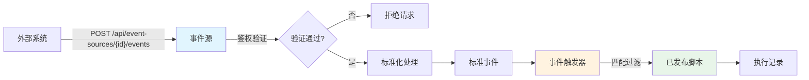

事件源（Event Source）是 ActionDock 事件驱动架构的入口层，负责定义外部系统如何向平台推送事件。它不绑定具体脚本，仅负责接收、鉴权和标准化外部请求，为下游的[事件触发器](13-shi-jian-hong-fa-gui-ze)提供统一格式的事件数据。

## 核心概念

### 事件源与事件触发的关系



**事件源** 专注于"怎么进来"，**事件触发器** 专注于"怎么出去"。这种分离设计使得同一个事件源可以被多个触发器复用，实现一对多的路由逻辑。

Sources: [EventSourceDefinition.java](actiondock-core/src/main/java/org/team4u/actiondock/domain/model/EventSourceDefinition.java#L1-L129), [event-framework.md](docs/event-framework.md#L1-L50)

## 配置字段详解

### 基础信息

| 字段 | 类型 | 必填 | 说明 |
|------|------|------|------|
| 名称 | string | 是 | 人类可读名称，建议包含系统和事件类型 |
| Key | string | 是 | 唯一业务键，格式如 `github.issue` 或 `crm.customer.created` |
| 描述 | string | 否 | 补充事件源对应的外部系统和事件范围 |
| 启用 | boolean | 否 | 默认为 true，停用后入口仍在但不处理事件 |

**Key 命名建议**：使用小写字母和点号分段，便于识别来源和事件类型。不要将供应商名称硬编码到枚举中。

Sources: [EventSourceManagementPage.tsx](actiondock-admin-ui/src/pages/EventSourceManagementPage.tsx#L295-L340)

### 传输配置

当前版本仅支持 HTTP Webhook 方式。系统会在保存后自动生成 Webhook 地址：

```json
{
  "type": "HTTP_WEBHOOK",
  "endpointPath": "/api/event-sources/{sourceId}/events"
}
```

外部系统通过 POST 请求将事件发送到此地址。系统默认接受的 Content-Type 为 `application/json`。

Sources: [EventSourceTransport.java](actiondock-core/src/main/java/org/team4u/actiondock/domain/model/EventSourceTransport.java#L1-L38), [EventSourceApplicationService.java](actiondock-core/src/main/java/org/team4u/actiondock/application/EventSourceApplicationService.java#L80-L90)

### 鉴权模式

事件源支持四种鉴权模式，适用于不同的安全需求场景：

| 模式 | 适用场景 | 配置复杂度 |
|------|----------|------------|
| NONE | 内部信任网络、开发调试 | 低 |
| HEADER_TOKEN | 内部系统通过请求头传递 Token | 中 |
| QUERY_TOKEN | 简单集成场景，Token 在 URL 参数中 | 中 |
| HMAC_SHA256 | 公开 Webhook、防伪造验证（推荐） | 高 |

#### 无鉴权模式

适用于完全受信任的内网环境或开发调试阶段：

```json
{
  "mode": "NONE"
}
```

#### Header Token 模式

适用于通过请求头传递访问令牌的场景：

```json
{
  "mode": "HEADER_TOKEN",
  "tokenHeader": "X-Access-Token"
}
```

#### Query Token 模式

适用于简单集成，Token 作为 URL 查询参数传递：

```json
{
  "mode": "QUERY_TOKEN",
  "tokenQueryParam": "token"
}
```

#### HMAC SHA256 模式

适用于需要防篡改验证的公开 Webhook 接口：

```json
{
  "mode": "HMAC_SHA256",
  "signatureHeader": "X-Signature",
  "signaturePrefix": "sha256=",
  "signaturePayload": "RAW_BODY",
  "timestampHeader": "X-Timestamp",
  "maxSkewSeconds": 300,
  "secretConfigKey": "event.webhook.secret"
}
```

**关键配置说明**：

- `signaturePayload`：签名计算方式
  - `RAW_BODY`：仅使用原始请求体
  - `TIMESTAMP_DOT_RAW_BODY`：时间戳 + "." + 原始请求体（可防止重放攻击）
- `maxSkewSeconds`：允许的时间戳偏差，用于防止重放攻击
- `secretConfigKey`：密钥从系统配置中读取，不明文保存

Sources: [EventSourceAuthMode.java](actiondock-core/src/main/java/org/team4u/actiondock/domain/model/EventSourceAuthMode.java#L1-L9), [EventSourceAuthConfig.java](actiondock-core/src/main/java/org/team4u/actiondock/domain/model/EventSourceAuthConfig.java#L1-L115), [WebhookAuthenticator.java](actiondock-core/src/main/java/org/team4u/actiondock/application/WebhookAuthenticator.java#L1-L172)

## 标准化处理器

标准化处理器（Normalization Processor）负责将原始请求转换为统一的标准化事件格式。

### 处理器类型

| 模式 | 说明 | 适用场景 |
|------|------|----------|
| JSON_PATH | 通过 JSONPath 表达式提取字段 | 简单字段映射 |
| TEMPLATE | 使用 Mustache 模板引擎拼装输出 | 结构重组、字符串组合 |
| SCRIPT_REF | 引用已发布脚本处理复杂逻辑 | 需要业务逻辑处理的场景 |

### JSON_PATH 模式

适合直接提取字段的场景：

```json
{
  "mode": "JSON_PATH",
  "jsonPath": {
    "fields": {
      "eventType": "$.headers.X-Event-Type",
      "eventId": "$.body.id",
      "actor": "$.body.user.name",
      "subject": "$.body.target.id"
    }
  }
}
```

### TEMPLATE 模式

适合拼装固定结构或组合字符串：

```json
{
  "mode": "TEMPLATE",
  "template": {
    "engine": "MUSTACHE",
    "template": {
      "eventType": "order.created",
      "eventId": "{{body.order.id}}-{{body.event.time}}",
      "subject": "{{body.customer.email}}",
      "summary": "[{{body.type}}] {{body.customer.name}} 创建了订单"
    }
  }
}
```

### SCRIPT_REF 模式

适合复杂的数据转换逻辑：

```json
{
  "mode": "SCRIPT_REF",
  "scriptRef": {
    "scriptId": "normalize-webhook-event",
    "versionMode": "PUBLISHED"
  }
}
```

脚本可访问的上下文变量包括：`headers`、`query`、`body`、`source`、`event`。

### 标准事件输出格式

处理器输出会被映射到标准事件结构：

```json
{
  "eventType": "customer.created",
  "eventId": "ext-123",
  "actor": "system",
  "subject": "customer-001",
  "timestamp": "2024-01-15T10:30:00Z",
  "headers": {},
  "query": {},
  "body": {}
}
```

Sources: [ProcessorDefinition.java](actiondock-core/src/main/java/org/team4u/actiondock/domain/model/ProcessorDefinition.java#L1-L68), [JsonPathProcessorConfig.java](actiondock-core/src/main/java/org/team4u/actiondock/domain/model/JsonPathProcessorConfig.java#L1-L18), [TemplateProcessorConfig.java](actiondock-core/src/main/java/org/team4u/actiondock/domain/model/TemplateProcessorConfig.java#L1-L31), [ProcessorEditor.tsx](actiondock-admin-ui/src/components/ProcessorEditor.tsx#L1-L200)

## 样例上下文与调试

### 样例上下文用途

`sampleContext` 用于预置测试样例，使处理器在保存时可进行可执行性检查。建议至少包含：

```json
{
  "event": {
    "headers": {},
    "query": {},
    "body": {}
  }
}
```

### 调试面板

调试面板模拟外部系统的实际请求，包含四个输入区域：

| 区域 | 用途 | 典型内容 |
|------|------|----------|
| Headers JSON | 请求头 | 事件类型、签名、delivery id |
| Query JSON | 查询参数 | 简单 token 鉴权参数 |
| Body JSON | 请求体 | 结构化的事件数据 |
| Raw Body | 原始请求体 | HMAC 签名计算的基础 |

**重要**：HMAC 签名验证基于 Raw Body，因此在使用 HMAC 鉴权时，确保 Raw Body 与 Body JSON 内容一致。

Sources: [EventSourceManagementPage.tsx](actiondock-admin-ui/src/pages/EventSourceManagementPage.tsx#L470-L534)

## API 接口

### 事件源管理

| 方法 | 路径 | 说明 |
|------|------|------|
| GET | /api/event-sources | 列出所有事件源 |
| POST | /api/event-sources | 创建事件源 |
| GET | /api/event-sources/{id} | 获取指定事件源 |
| PUT | /api/event-sources/{id} | 更新事件源 |
| DELETE | /api/event-sources/{id} | 删除事件源 |
| POST | /api/event-sources/{id}/enable | 启用事件源 |
| POST | /api/event-sources/{id}/disable | 停用事件源 |
| POST | /api/event-sources/{id}/test-normalization | 测试标准化处理 |

### 事件接入

| 方法 | 路径 | 说明 |
|------|------|------|
| POST | /api/event-sources/{id}/events | 外部系统提交事件 |

Sources: [event-framework.md](docs/event-framework.md#L400-L420)

## 配置示例：GitHub Webhook

以下是一个接收 GitHub Push 事件的完整配置示例：

```json
{
  "name": "GitHub Push Webhook",
  "key": "github.push",
  "description": "接收 GitHub 仓库的 Push 事件",
  "enabled": true,
  "transport": {
    "type": "HTTP_WEBHOOK",
    "contentTypes": ["application/json"]
  },
  "auth": {
    "mode": "HMAC_SHA256",
    "signatureHeader": "X-Hub-Signature-256",
    "signaturePrefix": "sha256=",
    "signaturePayload": "RAW_BODY",
    "secretConfigKey": "github.webhook.secret"
  },
  "normalizationProcessor": {
    "mode": "JSON_PATH",
    "jsonPath": {
      "fields": {
        "eventType": "$.headers.X-GitHub-Event",
        "eventId": "$.headers.X-GitHub-Delivery",
        "actor": "$.body.sender.login",
        "subject": "$.body.repository.full_name",
        "timestamp": "$.body.head_commit.timestamp"
      }
    }
  },
  "sampleContext": {
    "event": {
      "headers": {
        "X-GitHub-Event": "push",
        "X-GitHub-Delivery": "72d3162e-cc78-11e3-81ab-4c9367dc0958"
      },
      "query": {},
      "body": {
        "ref": "refs/heads/main",
        "repository": {
          "full_name": "owner/repo"
        },
        "sender": {
          "login": "username"
        }
      }
    }
  }
}
```

## 常见问题

### 保存失败，提示 Key 已存在

事件源的 Key 必须全局唯一。如果出现此错误，请检查是否已存在相同 Key 的事件源，或 Key 命名是否符合规范。

### 鉴权验证失败

1. 检查 `secretConfigKey` 对应的配置值是否正确设置
2. 确认外部系统的签名算法和密钥与你配置的一致
3. 对于 HMAC 模式，确保使用了正确的签名 Payload 方式
4. 检查 `maxSkewSeconds` 设置，考虑服务器时间偏差

### 标准化测试失败

1. 确认 `sampleContext` 包含完整的事件数据结构
2. 检查 JSONPath 表达式是否正确匹配字段路径
3. 对于嵌套字段，使用正确的 JSONPath 语法（如 `$.body.user.name`）

### 事件没有触发脚本

1. 确认事件源和对应的[事件触发器](13-shi-jian-hong-fa-gui-ze)都已启用
2. 检查触发器的过滤处理器是否正确配置
3. 查看事件记录页面确认事件是否被正确接收

## 后续步骤

完成事件源配置后，你需要：

1. 创建对应的[事件触发规则](13-shi-jian-hong-fa-gui-ze)，定义事件到脚本的路由逻辑
2. 查看[事件记录](16-fang-wen-ling-pai-guan-li)，监控事件接收和处理状态