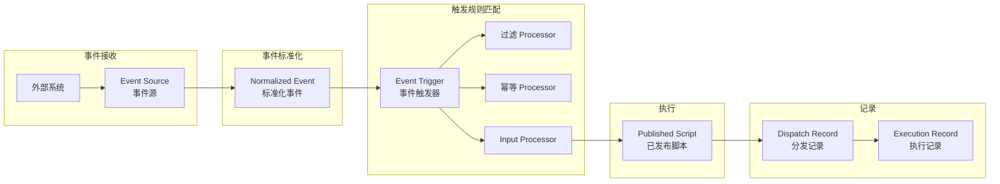
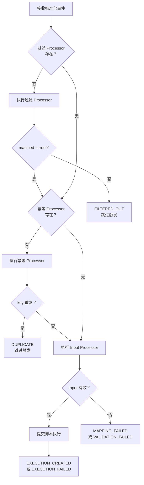

事件触发规则（Event Trigger）是 ActionDock 事件框架的核心组件，负责将标准化后的事件转换为已发布脚本的执行。当外部系统通过 Webhook 发送事件时，事件触发器负责决定是否触发、如何去重、以及如何生成脚本入参。

Sources: [EventTrigger.java](actiondock-core/src/main/java/org/team4u/actiondock/domain/model/EventTrigger.java#L1-L180) | [EventTriggerApplicationService.java](actiondock-core/src/main/java/org/team4u/actiondock/application/EventTriggerApplicationService.java#L1-L407)

## 核心概念

事件触发器是事件源（Event Source）与目标脚本之间的桥梁。一个事件源可以配置多个触发器，每个触发器可以指向不同的目标脚本，实现"一事件多响应"的场景。



### 触发器数据模型

| 字段 | 类型 | 说明 | 是否必填 |
|------|------|------|----------|
| `id` | String | 触发器唯一标识符 | 创建时自动生成 |
| `name` | String | 人类可读名称 | 必填 |
| `description` | String | 用途说明 | 可选 |
| `enabled` | Boolean | 是否启用 | 默认 true |
| `sourceId` | String | 关联的事件源 ID | 必填 |
| `targetScriptId` | String | 目标脚本 ID（必须已发布） | 必填 |
| `filterProcessor` | ProcessorDefinition | 过滤处理器 | 可选 |
| `idempotencyProcessor` | ProcessorDefinition | 幂等处理器 | 可选 |
| `inputProcessor` | ProcessorDefinition | 入参处理器 | 必填 |
| `submitMode` | SubmitMode | 提交模式 | 默认 ASYNC |
| `responseView` | String | 响应视图 | 默认 RESULT |
| `lastEventId` | String | 最近触发的事件 ID | 自动更新 |
| `lastTriggeredAt` | LocalDateTime | 最近触发时间 | 自动更新 |
| `lastExecutionId` | String | 最近执行记录 ID | 自动更新 |
| `lastExecutionStatus` | ExecutionStatus | 最近执行状态 | 自动更新 |

Sources: [EventTrigger.java](actiondock-core/src/main/java/org/team4u/actiondock/domain/model/EventTrigger.java#L1-L180)

## 处理流水线

事件触发器通过三阶段处理器实现事件的过滤、去重和入参转换。每一步都可以独立配置，也可以跳过。



### 过滤阶段（Filter Processor）

过滤处理器决定事件是否应该继续处理。如果不配置过滤处理器，则默认匹配所有事件。

**输出约定**：
```json
{
  "matched": true
}
```

**判断规则**：系统会将输出中的 `matched` 字段转换为布尔值，支持多种数据类型：

| 输出类型 | `matched` 值 | 结果 |
|----------|---------------|------|
| Boolean | `true` | 继续处理 |
| Boolean | `false` | 跳过触发 |
| Number | `0` | 跳过触发 |
| Number | 非零 | 继续处理 |
| String | 空或 `"false"` | 跳过触发 |
| String | 其他值 | 继续处理 |
| Collection | 空 | 跳过触发 |
| Collection | 非空 | 继续处理 |
| 其他 | 非 null | 继续处理 |

Sources: [EventProcessorUtils.java](actiondock-core/src/main/java/org/team4u/actiondock/application/EventProcessorUtils.java#L1-L55)

### 幂等阶段（Idempotency Processor）

幂等处理器用于防止重复触发。当输出中的 `key` 值与已存在的分发记录重复时，事件将被跳过。

**输出约定**：
```json
{
  "key": "unique-event-id"
}
```

**最佳实践**：
- 使用外部系统的事件 ID 作为 key
- 或使用业务主键 + 事件类型组合，如 `"customer.created:123"`

**存储范围**：幂等 key 在同一触发器内唯一，不同触发器之间互不影响。

Sources: [EventTriggerApplicationService.java](actiondock-core/src/main/java/org/team4u/actiondock/application/EventTriggerApplicationService.java#L265-L285)

### 入参阶段（Input Processor）

入参处理器将标准化事件转换为目标脚本的输入参数。输出必须符合目标脚本的 `inputSchema`。

**校验机制**：
- 处理器执行后，系统会验证输出是否匹配脚本的输入模式
- 如果校验失败，分发状态为 `VALIDATION_FAILED`
- 如果处理器执行失败，分发状态为 `MAPPING_FAILED`

Sources: [EventTriggerApplicationService.java](actiondock-core/src/main/java/org/team4u/actiondock/application/EventTriggerApplicationService.java#L287-L310)

## 处理器类型

系统支持三种处理器模式，适用于不同场景。

### JSON_PATH 模式

适合直接提取字段的场景，使用 JSONPath 表达式从事件数据中取值。

**配置示例**：
```json
{
  "mode": "JSON_PATH",
  "jsonPath": {
    "fields": {
      "issueId": "$.body.issue.id",
      "issueTitle": "$.body.issue.title",
      "action": "$.headers.X-Action-Type"
    }
  }
}
```

**输入上下文可用路径**：

| 路径 | 说明 | 示例 |
|------|------|------|
| `$.body` | HTTP 请求体 | `$.body.issue.title` |
| `$.headers` | HTTP 请求头 | `$.headers.X-Event-Type` |
| `$.query` | URL 查询参数 | `$.query.token` |
| `$.event` | 标准化事件字段 | `$.event.eventType` |
| `$.source` | 事件源信息 | `$.source.key` |
| `$.trigger` | 触发器信息 | `$.trigger.id` |

Sources: [JsonPathProcessorConfig.java](actiondock-core/src/main/java/org/team4u/actiondock/domain/model/JsonPathProcessorConfig.java#L1-L18) | [ProcessorContext.java](actiondock-core/src/main/java/org/team4u/actiondock/domain/model/ProcessorContext.java#L1-L90)

### TEMPLATE 模式

适合拼装固定结构或组合字符串与常量值，使用 Mustache 模板引擎。

**配置示例**：
```json
{
  "mode": "TEMPLATE",
  "template": {
    "engine": "MUSTACHE",
    "template": {
      "title": "[{{event.eventType}}] {{body.issue.title}}",
      "description": "由 {{event.actor}} 在 {{event.timestamp}} 创建",
      "priority": "HIGH"
    }
  }
}
```

**模板语法**：
- `{{path}}` - 输出变量值
- `{{#path}}...{{/path}}` - 条件块
- `{{#path}}...{{^path}}...{{/path}}` - if-else 块
- `{{{rawPath}}}` - 不转义 HTML

Sources: [TemplateProcessorConfig.java](actiondock-core/src/main/java/org/team4u/actiondock/domain/model/TemplateProcessorConfig.java#L1-L31)

### SCRIPT_REF 模式

适合复杂逻辑处理，引用已发布的脚本来执行处理器逻辑。

**配置示例**：
```json
{
  "mode": "SCRIPT_REF",
  "scriptRef": {
    "scriptId": "event-mapper-v2",
    "versionMode": "PUBLISHED"
  }
}
```

**脚本入参**：被引用的脚本会收到完整的 `ProcessorContext`，其中包含 `event`、`body`、`headers`、`query`、`source`、`trigger` 等变量。

**版本模式**：
- `PUBLISHED`（默认）- 使用脚本的最新已发布版本
- 未来支持指定具体版本号

Sources: [ScriptRefProcessorConfig.java](actiondock-core/src/main/java/org/team4u/actiondock/domain/model/ScriptRefProcessorConfig.java#L1-L28)

### 处理器上下文

处理器执行时，系统会构建 `ProcessorContext` 传递给处理器。

| 变量 | 说明 |
|------|------|
| `event` | 标准化事件，包含 eventType、eventId、actor、subject、timestamp |
| `body` | HTTP 请求体（JSON 对象） |
| `headers` | HTTP 请求头 |
| `query` | URL 查询参数 |
| `source` | 事件源信息（id、key、name） |
| `trigger` | 触发器信息（id、name、targetScriptId） |
| `variables` | 自定义变量（可扩展） |

Sources: [ProcessorContext.java](actiondock-core/src/main/java/org/team4u/actiondock/domain/model/ProcessorContext.java#L1-L90)

## 提交模式

触发器支持两种脚本提交模式。

| 模式 | 说明 | 适用场景 |
|------|------|----------|
| `ASYNC`（异步） | 提交后立即返回执行记录 ID，不等待执行完成 | 通知、归档、数据同步等 |
| `SYNC`（同步） | 等待脚本执行完成，返回执行结果 | 需要实时获取结果的场景 |

**响应视图**：
- `RESULT` - 仅返回脚本输出
- `DEBUG` - 返回完整调试信息（包含日志）

Sources: [SubmitMode.java](actiondock-core/src/main/java/org/team4u/actiondock/domain/model/SubmitMode.java#L1-L14)

## 分发状态

每次事件分发都会生成 `EventDispatchRecord`，记录处理结果。

| 状态 | 说明 | 事件记录状态 |
|------|------|--------------|
| `FILTERED_OUT` | 过滤处理器判定不匹配 | 取决于其他分发结果 |
| `DUPLICATE` | 幂等 key 重复 | `DUPLICATE` |
| `MAPPING_FAILED` | 处理器执行失败 | `FAILED` |
| `VALIDATION_FAILED` | 输入校验失败 | `FAILED` |
| `EXECUTION_CREATED` | 脚本执行已提交 | `DISPATCHED` |
| `EXECUTION_FAILED` | 脚本执行失败 | `FAILED` |

Sources: [EventDispatchStatus.java](actiondock-core/src/main/java/org/team4u/actiondock/domain/model/EventDispatchStatus.java#L1-L11) | [EventIngestionApplicationService.java](actiondock-core/src/main/java/org/team4u/actiondock/application/EventIngestionApplicationService.java#L200-L227)

## 完整分发记录

`EventDispatchRecord` 记录了完整的分发链路信息。

| 字段 | 说明 |
|------|------|
| `id` | 分发记录唯一标识符 |
| `eventId` | 关联的事件记录 ID |
| `sourceId` | 事件源 ID |
| `triggerId` | 触发器 ID |
| `targetScriptId` | 目标脚本 ID |
| `status` | 分发状态 |
| `filterMatched` | 过滤是否匹配 |
| `idempotencyKey` | 幂等 key |
| `mappedInput` | 映射后的脚本入参 |
| `executionId` | 关联的执行记录 ID |
| `executionStatus` | 脚本执行状态 |
| `errorMessage` | 错误信息（如有） |
| `createdAt` | 创建时间 |
| `updatedAt` | 更新时间 |

Sources: [EventDispatchRecord.java](actiondock-core/src/main/java/org/team4u/actiondock/domain/model/EventDispatchRecord.java#L1-L149)

## 测试与调试

### 测试模式

在保存触发器后，可以使用「测试」按钮验证处理器输出，不会真正执行目标脚本。

**测试功能**：
- 验证过滤处理器输出
- 验证幂等处理器 key 生成
- 验证入参处理器输出是否符合 schema
- 显示处理耗时

### 试运行模式

使用「试运行」按钮会创建一次真实的执行记录，用于验证端到端流程。

Sources: [EventTriggerApplicationService.java](actiondock-core/src/main/java/org/team4u/actiondock/application/EventTriggerApplicationService.java#L145-L195) | [EventTriggerManagementPage.tsx](actiondock-admin-ui/src/pages/EventTriggerManagementPage.tsx#L1-L543)

## 配置示例

### 场景：GitHub Issue 创建事件

假设外部系统发送以下标准化事件：
```json
{
  "eventType": "issue.created",
  "eventId": "gh-12345",
  "actor": "user@example.com",
  "subject": "repo-issue-42",
  "timestamp": "2026-05-01T12:00:00Z",
  "body": {
    "issue": {
      "id": 42,
      "title": "Bug: 登录失败",
      "priority": "high"
    }
  }
}
```

**触发器配置**：

```json
{
  "name": "Issue 创建通知",
  "sourceId": "github-webhook",
  "targetScriptId": "notify-slack-v3",
  "submitMode": "ASYNC",
  "filterProcessor": {
    "mode": "JSON_PATH",
    "jsonPath": {
      "fields": {
        "matched": "$.body.issue.priority == 'high'"
      }
    }
  },
  "idempotencyProcessor": {
    "mode": "JSON_PATH",
    "jsonPath": {
      "fields": {
        "key": "$.event.eventId"
      }
    }
  },
  "inputProcessor": {
    "mode": "TEMPLATE",
    "template": {
      "engine": "MUSTACHE",
      "template": {
        "channel": "#alerts",
        "message": "[{{event.eventType}}] {{body.issue.title}} 由 {{event.actor}} 创建"
      }
    }
  }
}
```

## 最佳实践

### 1. 幂等 key 设计

幂等 key 应该具有足够的唯一性，既要防止真正的重复，又要避免过度细分导致正常事件被误判。

**推荐**：
```json
{
  "key": "{{event.sourceId}}:{{event.eventId}}"
}
```

### 2. 过滤处理器使用

如果只需要简单的事件类型过滤，可以使用 JSON_PATH 的条件表达式：

```json
{
  "matched": "$.event.eventType == 'customer.created'"
}
```

### 3. 入参校验

入参处理器的输出必须严格符合目标脚本的 `inputSchema`，建议在测试面板中验证。

### 4. 异步优先

除非确实需要同步等待结果，建议使用 `ASYNC` 模式，避免 Webhook 超时。

---

> 上一步：[事件源配置](12-shi-jian-yuan-pei-zhi) | 返回 [触发中心](trigger-center.md)