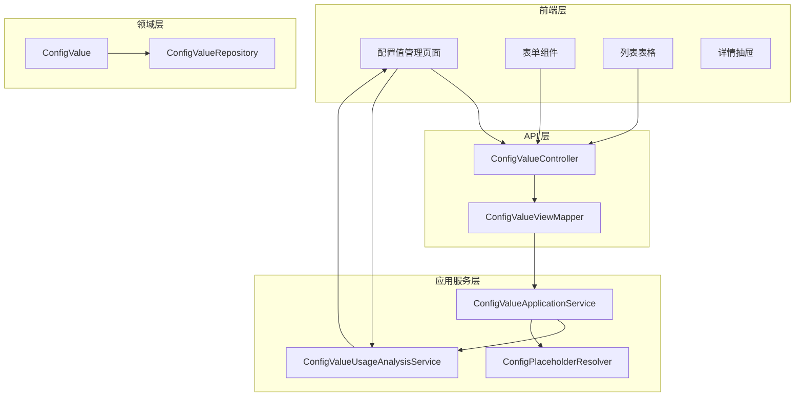
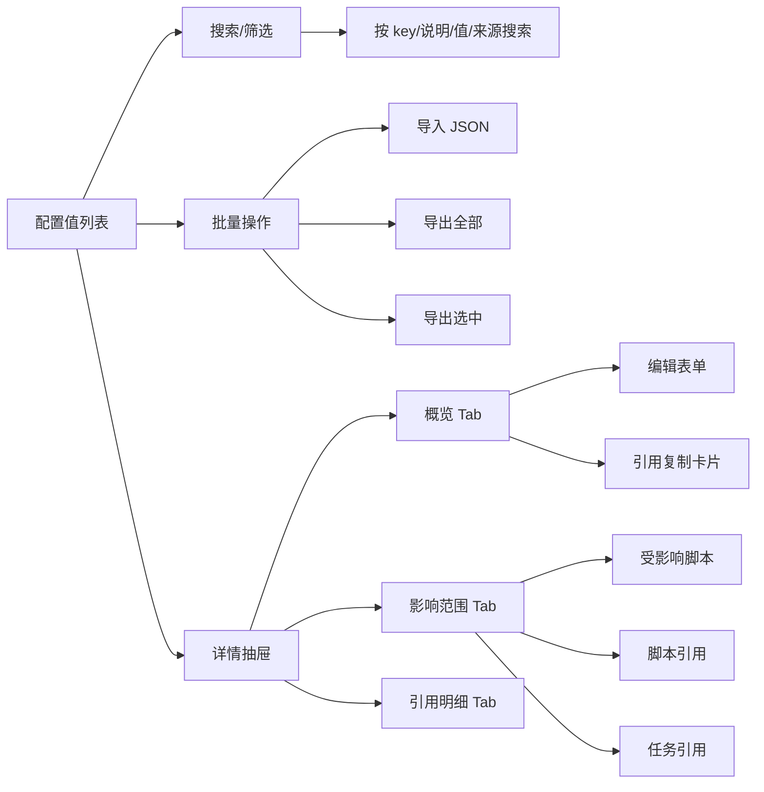

配置值（ConfigValue）是平台级全局字符串配置机制，支持通过 `${config.xxx}` 占位符语法在脚本、插件、调度任务和 AI 模型配置中复用同一份配置数据。该系统提供完整的生命周期管理、引用追踪、安全隔离和批量导入导出能力。

Sources: [ConfigValue.java](actiondock-core/src/main/java/org/team4u/actiondock/domain/model/ConfigValue.java#L1-L150)

## 核心概念

### 配置值数据模型

配置值包含以下核心属性，这些属性决定了配置值的来源、可编辑性和展示行为。

| 属性 | 类型 | 说明 |
|------|------|------|
| `key` | String | 配置键名，支持字母开头，后续可包含字母、数字、点、下划线和中划线 |
| `value` | String | 配置值内容，支持 `${config.xxx}` 嵌套引用 |
| `description` | String | 配置值用途说明 |
| `secret` | boolean | 是否作为敏感信息管理，会在 UI 中脱敏显示 |
| `managed` | boolean | 是否为托管配置值（来源于仓库模板） |
| `overridden` | boolean | 是否已被本地覆盖修改 |
| `publishMode` | String | 发布模式：INLINE（内联值）、PLACEHOLDER（占位符） |

Sources: [ConfigValue.java](actiondock-core/src/main/java/org/team4u/actiondock/domain/model/ConfigValue.java#L14-L29)
Sources: [types.ts](actiondock-admin-ui/src/types.ts#L650-L680)

### 本地配置值 vs 托管配置值

系统区分两类配置值来源：

**本地配置值**由用户在管理界面直接创建，来源为空，具有完整的增删改权限。

**托管配置值**由仓库脚本模板声明，分为三种状态：
- **原始状态**（managed=true, overridden=false）：仅来源于仓库模板，未被本地修改，需通过"复制为本地覆盖值"操作后才能编辑
- **本地覆盖状态**（managed=true, overridden=true）：已复制为本地覆盖值，可直接编辑
- **恢复仓库默认值**：将本地覆盖值恢复为仓库模板声明的原始值

Sources: [ConfigValueApplicationService.java](actiondock-core/src/main/java/org/team4u/actiondock/application/ConfigValueApplicationService.java#L90-L120)

## 功能架构

### 系统组件关系



Sources: [ConfigValueController.java](actiondock-app-spring/src/main/java/org/team4u/actiondock/web/ConfigValueController.java#L1-L115)
Sources: [ConfigValueUsageAnalysisService.java](actiondock-app-support/src/main/java/org/team4u/actiondock/configvalue/ConfigValueUsageAnalysisService.java#L1-L200)

## 占位符解析机制

### 引用语法

配置值支持在值内嵌套引用其他配置值，引用格式为 `${config.key}`。该机制在运行时自动解析，支持多层嵌套和循环引用检测。

支持的引用场景：
- **字符串值**：`https://${config.host}/api/v1`
- **Bearer 认证**：`Bearer ${config.api_key}`
- **Groovy 脚本**：`config["openai.api_key"]`
- **Python 脚本**：`config.get("openai_api_key")`
- **插件调用参数**：`plugins.invoke("plugin-id", "action", [token: "${config.api_key}"])`

Sources: [ConfigValueManagementPage.tsx](actiondock-admin-ui/src/pages/ConfigValueManagementPage.tsx#L98-L116)
Sources: [ConfigPlaceholderResolver.java](actiondock-core/src/main/java/org/team4u/actiondock/application/ConfigPlaceholderResolver.java#L26-L60)

### 循环引用检测

解析器使用深度优先搜索检测循环引用，检测到循环时会抛出明确错误。

```java
if (!stack.add(key)) {
    List<String> cycle = new ArrayList<>(stack);
    cycle.add(key);
    throw new IllegalArgumentException("配置值引用存在循环: " + String.join(" -> ", cycle));
}
```

Sources: [ConfigPlaceholderResolver.java](actiondock-core/src/main/java/org/team4u/actiondock/application/ConfigPlaceholderResolver.java#L84-L91)

## 引用分析

### 影响范围追踪

配置值使用分析服务追踪其在系统中的所有引用点，包括直接引用和级联影响。

| 引用类型 | 说明 |
|----------|------|
| 受影响脚本 | 直接或间接使用该配置值的脚本 |
| 直接脚本引用 | 脚本源码中直接引用该 key |
| 定时任务引用 | 调度任务的输入参数中引用该 key |
| 插件配置引用 | 插件运行时配置中引用该 key |
| 配置值依赖 | 其他配置值的值中引用该 key（级联分析） |
| 仓库模板声明 | 仓库脚本模板中声明该配置值 |
| 模型引用 | AI 模型配置（如 apiKeyConfigKey）引用该 key |

Sources: [ConfigValueDetailView.java](actiondock-app-spring/src/main/java/org/team4u/actiondock/web/ConfigValueDetailView.java#L28-L70)
Sources: [ConfigValueUsageAnalysisService.java](actiondock-app-support/src/main/java/org/team4u/actiondock/configvalue/ConfigValueUsageAnalysisService.java#L95-L130)

### 影响摘要生成

前端提供影响摘要生成函数，将分析结果转换为可读统计信息。

```typescript
export function buildImpactSummary(detail: ConfigValueDetail): string[] {
  const usage = detail.usage;
  return [
    `受影响脚本 ${detail.impactedScripts.length} 个`,
    `直接脚本引用 ${usage.scriptReferences.length} 个`,
    `定时任务引用 ${usage.scheduleReferences.length} 个`,
    `插件配置引用 ${usage.pluginConfigReferences.length} 个`,
    `配置值依赖 ${usage.configReferences.length} 个`,
    `模板声明 ${usage.templateDeclarations.length} 个`,
    `模型引用 ${usage.modelReferences.length} 个`
  ];
}
```

Sources: [configValueInsights.ts](actiondock-admin-ui/src/configValueInsights.ts#L1-L26)

## REST API

### 端点列表

| 方法 | 路径 | 说明 |
|------|------|------|
| GET | `/api/config-values` | 查询所有配置值 |
| GET | `/api/config-values/{key}` | 查询配置值详情（含引用分析） |
| POST | `/api/config-values` | 创建配置值 |
| PUT | `/api/config-values/{key}` | 更新配置值 |
| DELETE | `/api/config-values/{key}` | 删除配置值 |
| POST | `/api/config-values/{key}/copy-local-override` | 复制为本地覆盖值 |
| POST | `/api/config-values/{key}/restore-repository-default` | 恢复仓库默认值 |

Sources: [ConfigValueController.java](actiondock-app-spring/src/main/java/org/team4u/actiondock/web/ConfigValueController.java#L20-L60)

### 列表响应示例

```json
{
  "success": true,
  "data": [
    {
      "key": "openai.api_key",
      "value": null,
      "valueMasked": "********",
      "hasValue": true,
      "description": "OpenAI API 密钥",
      "secret": true,
      "managed": true,
      "overridden": false,
      "publishMode": "INLINE"
    }
  ]
}
```

Sources: [ConfigValueView.java](actiondock-app-spring/src/main/java/org/team4u/actiondock/web/ConfigValueView.java#L1-L30)

### 详情响应结构

配置值详情响应包含完整的引用分析结果：

```json
{
  "key": "openai.api_key",
  "value": "sk-xxx",
  "usage": {
    "scriptReferences": [...],
    "scheduleReferences": [...],
    "pluginConfigReferences": [...],
    "configReferences": [...],
    "templateDeclarations": [...],
    "modelReferences": [...]
  },
  "impactedScripts": [
    {
      "scriptId": "gpt-summarizer",
      "scriptName": "GPT 摘要生成",
      "reasons": ["脚本源码直接引用", "定时任务 NightlyJob 通过配置 api.base_url 间接受影响"]
    }
  ],
  "origin": {
    "repositoryId": "actiondock-scripts",
    "repositoryName": "官方脚本库",
    "toolId": "gpt-summarizer",
    "toolName": "GPT 摘要生成",
    "version": "1.2.0"
  },
  "availableActions": {
    "canCopyAsLocalOverride": true,
    "canRestoreRepositoryDefault": false
  }
}
```

Sources: [ConfigValueDetailView.java](actiondock-app-spring/src/main/java/org/team4u/actiondock/web/ConfigValueDetailView.java#L1-L86)

## 导入导出

### 导出格式

配置值导出为 JSON 文件，包含版本号、导出时间和配置值数组。Secret 值默认不导出实际内容。

```typescript
interface ConfigValueExportBundleV1 {
  version: 1;
  exportedAt: string;
  configValues: Array<{
    key: string;
    value?: string;  // secret 值在导出时为 undefined
    description?: string;
    secret?: boolean;
    // ... 其他元数据
  }>;
}
```

Sources: [scriptTransfer.ts](actiondock-admin-ui/src/scriptTransfer.ts#L32-L40)

### 导入分析

导入前系统分析并区分新增和覆盖项：

```typescript
export function analyzeConfigValueImport(
  importedConfigValues: ConfigValue[],
  currentConfigValues: ConfigValue[]
): ConfigValueImportAnalysis {
  const currentKeys = new Set(currentConfigValues.map((item) => item.key));
  const createKeys: string[] = [];
  const overwriteKeys: string[] = [];

  for (const item of importedConfigValues) {
    if (currentKeys.has(item.key)) {
      overwriteKeys.push(item.key);
    } else {
      createKeys.push(item.key);
    }
  }

  return { configValues: importedConfigValues, createKeys, overwriteKeys };
}
```

Sources: [scriptTransfer.ts](actiondock-admin-ui/src/scriptTransfer.ts#L500-L520)

## 前端组件

### 页面结构



Sources: [ConfigValueManagementPage.tsx](actiondock-admin-ui/src/pages/ConfigValueManagementPage.tsx#L1-L200)

### 状态显示规则

| 状态组合 | 显示效果 |
|----------|----------|
| secret=true | 值显示为 `********`，标签显示 "SECRET" |
| publishMode=PLACEHOLDER | 值显示为占位符提示，标签显示 "PLACEHOLDER" |
| managed=true, overridden=false | 标签显示 "MANAGED"，表单只读 |
| managed=true, overridden=true | 标签显示 "MANAGED" 和 "OVERRIDDEN" |
| managed=false | 标签显示 "LOCAL" |

Sources: [configValueInsights.ts](actiondock-admin-ui/src/configValueInsights.ts#L7-L10)
Sources: [ConfigValueManagementPage.tsx](actiondock-admin-ui/src/pages/ConfigValueManagementPage.tsx#L118-L133)

## 使用场景

### 场景一：API 密钥管理

将敏感凭据声明为 Secret 配置值，在脚本中通过 `${config.openai_api_key}` 引用：

```groovy
def apiKey = config["openai_api_key"]
def response = http.post("https://api.openai.com/v1/chat/completions", 
    [headers: [Authorization: "Bearer ${apiKey}"]])
```

优势：密钥不在脚本源码中明文存储，UI 中脱敏显示，可批量修改无需改动脚本。

### 场景二：环境配置隔离

通过仓库模板声明不同环境的配置值，在部署时覆盖：

```yaml
# 测试环境
openai.api_key: sk-test-xxx

# 生产环境（覆盖）
openai.api_key: sk-prod-xxx
```

优势：通过覆盖而非 fork 脚本实现环境隔离，模板更新时可选择性同步。

### 场景三：服务地址集中管理

多个脚本依赖同一服务地址时，使用配置值统一管理：

```
service.api_base_url: https://api.example.com
service.webhook_secret: ${config.service.webhook_secret}
```

优势：地址变更时只需修改一处，影响范围清晰可见。

## 相关文档

- [共享状态管理](15-gong-xiang-zhuang-tai-guan-li)：运行时跨脚本共享状态
- [仓库分发机制](20-cang-ku-fen-fa-ji-zhi)：托管配置值的来源管理
- [脚本依赖与调用](6-jiao-ben-yi-lai-yu-diao-yong)：配置值在脚本中的引用方式