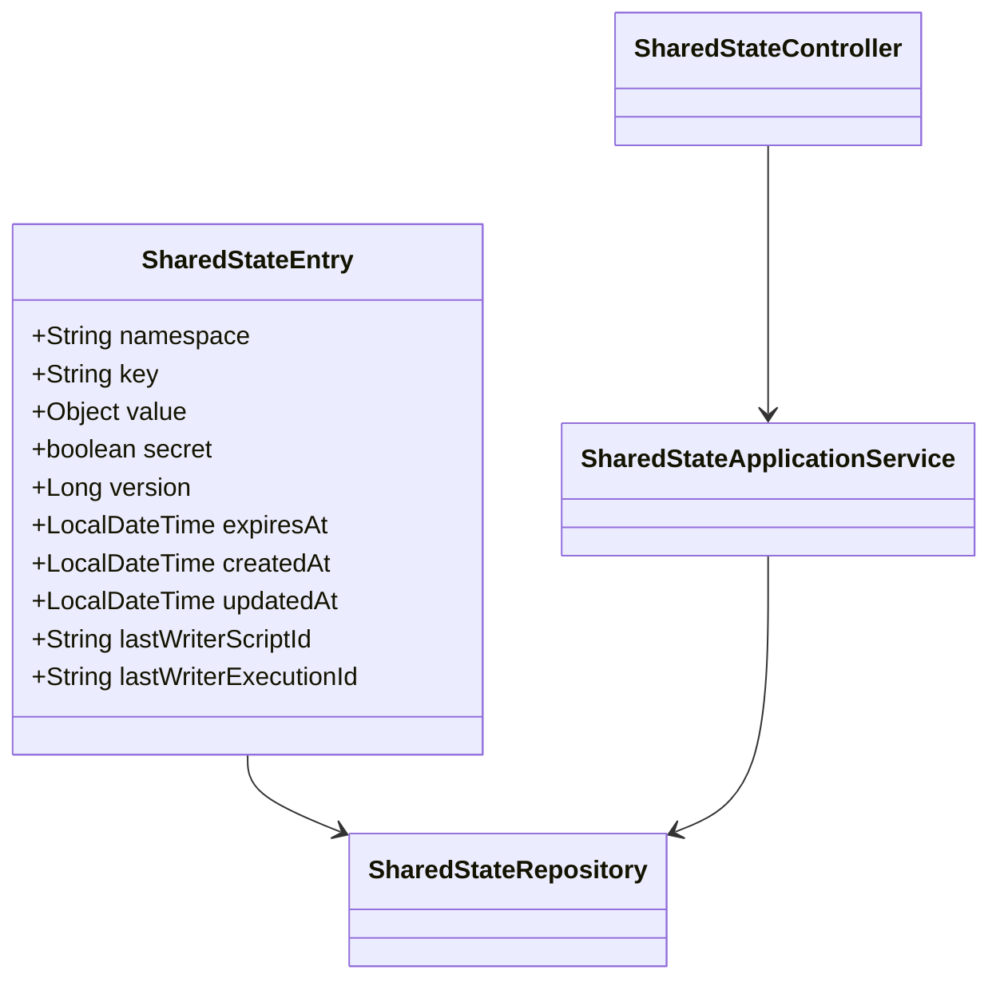
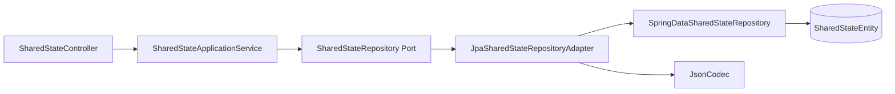

共享状态管理是 ActionDock 平台提供的跨脚本键值存储服务，允许多个脚本在运行时共享数据、缓存计算结果、实现分布式锁等高级协作模式。该系统采用命名空间隔离、版本控制、过期机制和乐观锁等设计，确保状态管理的安全性和一致性。

## 核心概念

共享状态管理的核心是 **SharedStateEntry** 实体，每个条目由命名空间（namespace）、键名（key）和值（value）三部分组成，其中命名空间和键名的组合唯一标识一个状态条目。这种设计借鉴了 Kubernetes ConfigMap 的组织方式，便于按业务域对状态进行分组管理。



域模型定义了八个核心属性：`namespace` 和 `key` 构成复合主键；`value` 存储任意 JSON 序列化的对象；`secret` 标记敏感数据，会在日志和 UI 中自动脱敏；`version` 实现乐观锁的版本号；`expiresAt` 支持 TTL 自动过期；`createdAt` 和 `updatedAt` 记录生命周期时间戳；`lastWriterScriptId` 和 `lastWriterExecutionId` 追踪最后一次写入的来源脚本和执行记录，便于审计和问题排查。

Sources: [SharedStateEntry.java](actiondock-core/src/main/java/org/team4u/actiondock/domain/model/SharedStateEntry.java#L1-L130)

## 架构层次

系统采用经典的分层架构，从上到下依次为控制器层、应用服务层、仓储端口层和持久化适配器层。这种设计实现了业务逻辑与技术实现的解耦，使得核心业务规则可以在不同存储后端间复用。



**控制器层**（SharedStateController）负责处理 HTTP 请求，将 RESTful API 映射为服务层操作。**应用服务层**（SharedStateApplicationService）封装所有业务逻辑，包括命名空间规范化、过期检查、版本管理等。**仓储端口**（SharedStateRepository）定义持久化操作的抽象接口，遵循依赖倒置原则。**适配器层**（JpaSharedStateRepositoryAdapter）将端口实现为具体的 JPA 操作，Spring Data JPA 仓储（SpringDataSharedStateRepository）处理底层数据库交互。

Sources: [SharedStateController.java](actiondock-app-spring/src/main/java/org/team4u/actiondock/web/SharedStateController.java#L1-L129)
Sources: [SharedStateApplicationService.java](actiondock-core/src/main/java/org/team4u/actiondock/application/SharedStateApplicationService.java#L1-L250)
Sources: [JpaSharedStateRepositoryAdapter.java](actiondock-storage-jpa/src/main/java/org/team4u/actiondock/storage/jpa/adapter/JpaSharedStateRepositoryAdapter.java#L1-L117)

## 核心操作

### 读取与写入

应用服务提供 `get`、`put`、`delete` 三个基础操作。`get` 方法接受命名空间和键名，返回条目的深拷贝以防止外部意外修改；自动过滤已过期的条目。`put` 方法支持创建和更新两种语义，当条目不存在时创建新条目并设置版本为 1，存在时递增版本号。`delete` 方法根据命名空间和键名删除条目。

```java
public SharedStateEntry get(String namespace, String key) {
    String normalizedNamespace = normalizeNamespace(namespace);
    String normalizedKey = normalizeKey(key);
    return activeEntry(repository.findByNamespaceAndKey(normalizedNamespace, normalizedKey), LocalDateTime.now())
            .map(SharedStateEntry::copy)
            .orElse(null);
}
```

命名空间和键名采用统一规范验证，只允许包含字母、数字、下划线、冒号、点、短横线等字符，防止注入风险。所有读写操作都会对输入进行规范化处理。

Sources: [SharedStateApplicationService.java](actiondock-core/src/main/java/org/team4u/actiondock/application/SharedStateApplicationService.java#L36-L50)

### 乐观锁（CAS）

Compare-And-Swap（CAS）操作是共享状态系统的核心能力，支持并发安全的原子更新。该操作接受一个期望版本号，只有当条目当前版本与期望版本匹配时才执行更新，成功返回 `true`，否则返回 `false` 并附带当前值。

```java
public CompareAndSetResult compareAndSet(String namespace,
                                         String key,
                                         Long expectedVersion,
                                         Object value,
                                         boolean secret,
                                         LocalDateTime expiresAt,
                                         String writerScriptId,
                                         String writerExecutionId) {
    SharedStateEntry current = findActiveEntry(normalizedNamespace, normalizedKey, now);
    
    if (current == null) {
        if (expectedVersion != null) {
            return new CompareAndSetResult(false, null, null);
        }
        // 创建新条目
        ...
    }
    
    return updateExistingEntry(..., current, expectedVersion, ...);
}
```

底层通过 JPA 的条件更新查询实现乐观锁：

```java
@Query("""
    update SharedStateEntity e
       set e.valueJson = :valueJson,
           e.secret = :secret,
           e.versionValue = :nextVersion,
           ...
     where e.namespace = :namespace
       and e.entryKey = :entryKey
       and e.versionValue = :expectedVersion
    """)
int compareAndSet(...);
```

如果版本不匹配，数据库更新影响行数为 0，应用服务捕获此结果并返回失败状态，同时附带最新条目供调用方决策。

Sources: [SpringDataSharedStateRepository.java](actiondock-storage-jpa/src/main/java/org/team4u/actiondock/storage/jpa/repo/SpringDataSharedStateRepository.java#L25-L40)

### 列表与命名空间

`list` 方法返回指定命名空间下所有未过期的条目，按键名升序排列。`listNamespaces` 方法返回所有包含未过期条目的命名空间集合，去重并排序。这两个操作支持 UI 的命名空间浏览器功能，让用户方便地浏览和管理状态数据。

```java
public List<SharedStateEntry> list(String namespace) {
    return repository.findByNamespace(normalizedNamespace).stream()
            .filter(item -> !item.isExpiredAt(now))
            .sorted(Comparator.comparing(SharedStateEntry::getKey))
            .map(SharedStateEntry::copy)
            .toList();
}
```

Sources: [SharedStateApplicationService.java](actiondock-core/src/main/java/org/team4u/actiondock/application/SharedStateApplicationService.java#L117-L128)

## REST API

共享状态控制器暴露以下 RESTful 端点，所有接口前缀为 `/api/shared-state`：

| 方法 | 路径 | 说明 |
|------|------|------|
| GET | `/namespaces` | 列出所有命名空间 |
| GET | `/` | 列出指定命名空间下的所有条目 |
| GET | `/detail` | 获取单个条目的详细信息 |
| POST | `/` | 创建或更新条目 |
| PUT | `/` | 更新条目（与 POST 语义相同） |
| POST | `/cas` | CAS 原子更新 |
| DELETE | `/` | 删除指定条目 |
| POST | `/purge-expired` | 清理过期条目 |

CAS 请求体扩展了基础请求，增加 `expectedVersion` 字段指定期望的版本号：

```json
{
  "namespace": "cache",
  "key": "user:1001:profile",
  "value": {"name": "Alice", "email": "alice@example.com"},
  "secret": false,
  "expiresAt": "2025-12-31T23:59:59",
  "expectedVersion": 5
}
```

响应包含更新是否成功、新值和当前值的详情：

```json
{
  "code": 200,
  "data": {
    "updated": true,
    "entry": { ... },
    "current": null
  }
}
```

Sources: [SharedStateController.java](actiondock-app-spring/src/main/java/org/team4u/actiondock/web/SharedStateController.java#L50-L80)
Sources: [SharedStateCompareAndSetRequest.java](actiondock-app-spring/src/main/java/org/team4u/actiondock/web/SharedStateCompareAndSetRequest.java#L1-L19)

## 自动清理机制

共享状态系统内置过期数据自动清理功能，由 `SharedStateCleanupScheduler` 调度器实现。该调度器在应用启动后（`ApplicationReadyEvent`）按固定间隔执行清理任务，默认间隔从配置属性读取。

```java
@EventListener(ApplicationReadyEvent.class)
public void onApplicationReady() {
    Duration interval = Duration.ofSeconds(purgeIntervalSeconds);
    scheduledFuture = taskScheduler.scheduleAtFixedRate(
        this::purge, 
        Instant.now().plus(interval), 
        interval
    );
}
```

清理逻辑调用 `purgeExpired` 方法，支持按命名空间清理或全局清理：

```java
private void purge() {
    try {
        long count = sharedStateService.purgeExpired(null);
        if (count > 0) {
            log.info("已清理 {} 条过期共享状态", count);
        }
    } catch (IllegalStateException exception) {
        // 共享状态服务未启用，取消定时任务
        cancel();
    } catch (Exception exception) {
        log.error("共享状态过期清理失败", exception);
    }
}
```

底层通过 JPA 批量删除查询清理已过期条目，数据库索引 `idx_shared_state_expires_at` 确保查询性能。

Sources: [SharedStateCleanupScheduler.java](actiondock-app-spring/src/main/java/org/team4u/actiondock/schedule/SharedStateCleanupScheduler.java#L1-L67)

## 持久化设计

实体层采用 JPA 注解映射，表名 `shared_state_entry`。复合主键通过 `namespace + "\0" + key` 拼接为字符串 ID，确保唯一性同时简化查询。三个数据库索引分别优化命名空间查询、过期时间查询和组合查询场景。

```java
@Entity
@Table(
    name = "shared_state_entry",
    indexes = {
        @Index(name = "idx_shared_state_namespace", columnList = "state_namespace"),
        @Index(name = "idx_shared_state_expires_at", columnList = "expires_at"),
        @Index(name = "idx_shared_state_namespace_expires", columnList = "state_namespace, expires_at")
    }
)
public class SharedStateEntity {
    @Id
    private String id;
    
    @Lob
    @Column(name = "value_json")
    private String valueJson;
}
```

值字段使用 `@Lob` 注解存储 JSON 序列化后的字符串，适配器层通过 `JsonCodec` 将对象与 JSON 字符串双向转换，支持任意可序列化对象的存储。

Sources: [SharedStateEntity.java](actiondock-storage-jpa/src/main/java/org/team4u/actiondock/storage/jpa/entity/SharedStateEntity.java#L1-L136)

## 使用场景

共享状态管理适用于多种脚本协作场景：**跨脚本数据共享**允许一个脚本的计算结果被其他脚本直接复用；**分布式锁**借助 CAS 机制实现简单的互斥访问控制；**缓存层**通过 TTL 过期实现自动失效的缓存服务；**限流计数器**追踪 API 调用次数或配额使用量；**状态机同步**在事件驱动架构中维护跨脚本的业务状态。

例如，一个数据采集脚本可以将原始数据缓存到共享状态，一个分析脚本随后读取并处理，两者通过约定的命名空间和键名解耦协作。

## 与配置值管理的区别

共享状态与[配置值管理](14-pei-zhi-zhi-guan-li)虽同为键值存储，但定位不同：配置值是静态的配置数据，由管理员手动管理，来源可以是仓库默认值或本地覆盖，通常用于 API Key、连接字符串等不频繁变更的配置；共享状态是动态的运行时数据，可由脚本程序写入，支持过期失效和版本控制，适合频繁变更的临时数据。两者在设计哲学上分别对应「静态配置」和「动态状态」的需求。

---

## 相关文档

- [配置值管理](14-pei-zhi-zhi-guan-li) — 静态配置数据的键值存储
- [脚本依赖与调用](6-jiao-ben-yi-lai-yu-diao-yong) — 脚本间协作的调用机制
- [脚本执行与调试](5-jiao-ben-zhi-xing-yu-diao-shi) — 脚本运行时的上下文管理
- [REST API 参考](19-rest-api-can-kao) — 共享状态 API 完整文档