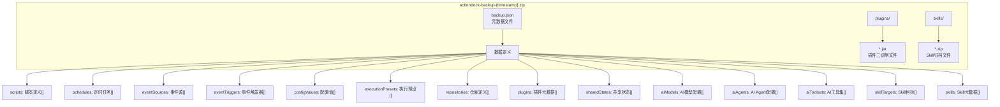
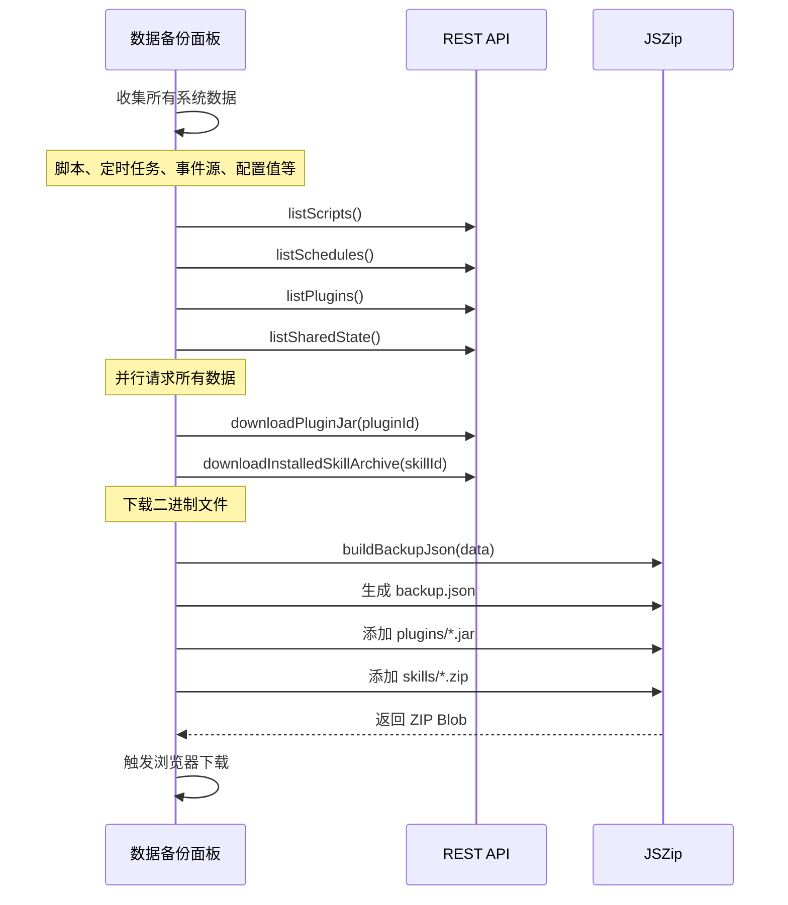
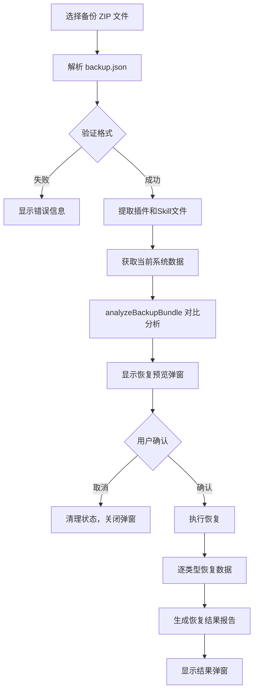
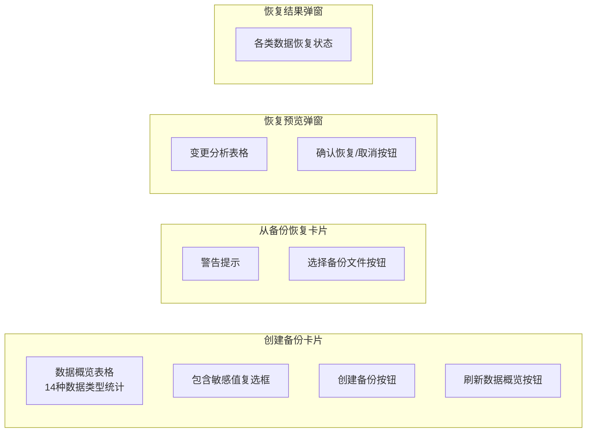

数据备份与恢复是 Script-Flow 平台的核心治理功能之一，提供系统级数据的完整导出与导入能力。通过备份功能，用户可以将脚本、定时任务、事件源、插件、配置值、共享状态、AI 模型配置、Skill 等所有系统数据进行打包导出；恢复功能则支持将备份文件导入到目标环境，并智能处理数据冲突（新建或覆盖）。

## 备份包结构设计

### 一句话理解

备份系统将所有系统数据序列化为 JSON 格式，与插件 JAR 文件、Skill 归档文件一起打包成 ZIP 文件，便于传输、存储和版本控制。

### 备份包格式

备份包采用 **ZIP 压缩格式**，包含以下组成部分：



### SystemBackupBundleV1 数据结构

备份元数据文件 `backup.json` 的核心结构定义如下：

```typescript
export interface SystemBackupBundleV1 {
  version: 1;
  type: "actiondock-system-backup";
  exportedAt: string;  // ISO 8601 时间戳
  data: {
    scripts: ScriptDefinition[];
    schedules: ScriptSchedule[];
    eventSources: EventSourceDefinition[];
    eventTriggers: EventTrigger[];
    configValues: ConfigValue[];
    executionPresets: ExecutionPreset[];
    repositories: RepositoryDefinition[];
    plugins: PluginBackupEntry[];
    sharedStates: SharedStateBackupEntry[];
    aiModels: AiModelProfile[];
    aiAgents: AiAgentProfile[];
    aiToolsets: AiToolset[];
    skillTargets: SkillTargetBackupEntry[];
    skills: SkillBackupEntry[];
  };
}
```

**关键设计点**：

- **版本控制**：`version: 1` 支持未来格式演进
- **类型标识**：`type: "actiondock-system-backup"` 防止文件误用
- **时间戳记录**：`exportedAt` 便于追溯备份时间
- **排序存储**：所有数组按 ID 字母顺序排序，保证备份文件确定性

Sources: [systemBackup.ts](actiondock-admin-ui/src/systemBackup.ts#L70-L90)

### 插件与 Skill 打包策略

备份过程中会同时收集插件和 Skill 的二进制文件：

| 资源类型 | 存储位置 | 打包方式 | 说明 |
|---------|---------|---------|------|
| 插件 JAR | `plugins/*.jar` | 按 `fileName` 原名存储 | 使用 `downloadPluginJar` API 获取 |
| Skill 归档 | `skills/*.zip` | 按 `skillId.zip` 命名 | 使用 `downloadInstalledSkillArchive` API 获取 |
| 插件配置 | `plugins[].config` | JSON 内联存储 | 仅当 `configurable: true` 时包含 |

Sources: [DataBackupPanel.tsx](actiondock-admin-ui/src/pages/DataBackupPanel.tsx#L269-L327)

### 共享状态备份条目

共享状态在备份中有特殊处理，支持敏感值脱敏：

```typescript
export interface SharedStateBackupEntry {
  namespace: string;      // 命名空间
  key: string;            // 键名
  secret: boolean;        // 是否为敏感值
  expiresAt?: string | null;  // 过期时间
  valueIncluded: boolean;  // 是否包含值
  value?: unknown;        // 实际值（仅当 valueIncluded 为 true 时）
}
```

**敏感值处理逻辑**：
- 非敏感共享状态：默认包含值
- 敏感共享状态：默认不包含值（`valueIncluded: false`）
- 用户可勾选"包含 Secret 配置值和共享状态的明文值"来包含敏感值

Sources: [systemBackup.ts](actiondock-admin-ui/src/systemBackup.ts#L40-L47)

## 备份操作流程

### 创建备份流程



### 核心实现函数

**构建备份 JSON**：

```typescript
export function buildBackupJson(
  data: {
    scripts: ScriptDefinition[];
    schedules: ScriptSchedule[];
    // ... 其他数据类型
    pluginConfigs: Map<string, Record<string, unknown>>;
    sharedStates: SharedStateBackupEntry[];
    // ...
  },
  options?: { includeSecretValues?: boolean }
): SystemBackupBundleV1
```

**生成文件名**：

```typescript
export function formatBackupFileName(now = new Date()): string {
  const stamp = formatExportStamp(now);
  return `actiondock-backup-${stamp}.zip`;
}
```

Sources: [systemBackup.ts](actiondock-admin-ui/src/systemBackup.ts#L207-L281), [systemBackup.ts](actiondock-admin-ui/src/systemBackup.ts#L482-L485)

## 恢复操作流程

### 恢复预览机制

恢复操作采用**两步确认**机制：首先解析备份文件并与当前系统数据对比，生成变更分析报告；用户确认后再执行实际恢复。



### 冲突处理策略

恢复过程中，系统会对比备份数据与当前系统数据，对每条记录采用以下策略：

| 数据类型 | 冲突判断依据 | 冲突处理 |
|---------|-------------|---------|
| 脚本 | `script.id` | 存在则覆盖，不存在则新建 |
| 定时任务 | `schedule.id` | 存在则覆盖，不存在则新建 |
| 事件源 | `eventSource.id` | 存在则覆盖，不存在则新建 |
| 事件触发器 | `eventTrigger.id` | 存在则覆盖，不存在则新建 |
| 配置值 | `configValue.key` | 存在则覆盖，不存在则新建 |
| 执行预设 | `preset.id` | 存在则覆盖，不存在则新建 |
| 仓库 | `repository.id` | 存在则覆盖，不存在则新建 |
| 插件 | `plugin.pluginId` | 先卸载再安装（强制更新） |
| 共享状态 | `namespace/key` | 无值条目跳过，有值则覆盖或新建 |
| AI 模型 | `model.id` | 存在则更新 ID，不存在则创建 |
| AI Agent | `agent.id` | 存在则更新 ID，不存在则创建 |
| AI 工具集 | `toolset.id` | 存在则覆盖，不存在则新建 |
| Skill 目标 | `target.id` | 存在则覆盖，不存在则新建 |
| Skill | `skill.skillId` | 先删除再安装（强制更新） |

Sources: [DataBackupPanel.tsx](actiondock-admin-ui/src/pages/DataBackupPanel.tsx#L445-L846)

### 恢复分析数据结构

```typescript
export interface BackupAnalysis {
  scripts: { total: number; create: number; overwrite: number };
  schedules: { total: number; create: number; overwrite: number };
  eventSources: { total: number; create: number; overwrite: number };
  eventTriggers: { total: number; create: number; overwrite: number };
  configValues: { total: number; create: number; overwrite: number };
  executionPresets: { total: number; create: number; overwrite: number };
  repositories: { total: number; create: number; overwrite: number };
  plugins: { total: number; create: number; overwrite: number };
  sharedStates: { total: number; create: number; overwrite: number; skipped: number };
  aiModels: { total: number; create: number; overwrite: number };
  aiAgents: { total: number; create: number; overwrite: number };
  aiToolsets: { total: number; create: number; overwrite: number };
  skillTargets: { total: number; create: number; overwrite: number };
  skills: { total: number; create: number; overwrite: number };
}
```

Sources: [systemBackup.ts](actiondock-admin-ui/src/systemBackup.ts#L92-L107)

### 备份解析与验证

```typescript
export function parseBackupJson(text: string): SystemBackupBundleV1 {
  // 1. JSON 解析验证
  // 2. 版本检查（仅支持 version: 1）
  // 3. 类型检查（type: "actiondock-system-backup"）
  // 4. exportedAt 时间戳验证
  // 5. data 对象存在性验证
  // 6. 各数据类型数组解析
  // 7. 共享状态条目严格验证
}
```

**关键验证规则**：
- JSON 格式必须是合法对象
- `version` 必须为 `1`
- `type` 必须为 `"actiondock-system-backup"`
- `exportedAt` 必须是有效的 ISO 8601 字符串
- 共享状态条目若 `valueIncluded: true` 则必须包含 `value` 字段

Sources: [systemBackup.ts](actiondock-admin-ui/src/systemBackup.ts#L283-L359)

## 使用界面说明

### 备份面板布局

路径：**管理台 → 设置 → 数据备份与恢复**



### 操作步骤

**创建备份**：

1. 查看当前数据概览（系统自动加载）
2. （可选）勾选"包含 Secret 配置值和共享状态的明文值"
3. 点击"创建备份"按钮
4. 浏览器自动下载 `actiondock-backup-{timestamp}.zip`

**从备份恢复**：

1. 点击"选择备份文件"按钮
2. 选择 `.zip` 格式的备份文件
3. 系统解析并显示恢复预览
4. 确认预览信息，点击"确认恢复"
5. 查看恢复结果报告

### 恢复结果报告

每种数据类型恢复后会生成详细报告：

```typescript
interface RestoreResult {
  type: string;           // 数据类型名称
  succeeded: number;      // 成功数量
  failed: number;         // 失败数量
  skipped?: number;       // 跳过数量（共享状态特有）
  errors: string[];       // 错误详情列表
}
```

Sources: [DataBackupPanel.tsx](actiondock-admin-ui/src/pages/DataBackupPanel.tsx#L117-L123), [DataBackupPanel.tsx](actiondock-admin-ui/src/pages/DataBackupPanel.tsx#L927-L957)

## 安全注意事项

### 敏感值处理

| 备份选项 | Secret 配置值 | Secret 共享状态 |
|---------|--------------|----------------|
| 默认（不包含） | 仅备份键名，值为 `undefined` | 仅备份元数据，值为空 |
| 包含敏感值 | 备份明文值 | 备份明文值 |

**建议**：
- 测试环境备份可包含敏感值
- 生产环境备份建议不包含敏感值，单独管理敏感配置
- 敏感值可使用 [配置值管理](14-pei-zhi-zhi-guan-li) 功能单独导入

### 恢复操作风险

恢复操作具有以下潜在风险：

1. **数据覆盖**：现有数据会被备份数据覆盖
2. **插件卸载**：恢复插件前会先卸载现有版本
3. **Skill 删除**：恢复 Skill 前会先删除现有版本
4. **依赖中断**：恢复可能影响正在运行的脚本

**最佳实践**：
- 恢复前先创建当前系统备份
- 在非生产环境先测试备份文件兼容性
- 确认备份文件来源和完整性

## 文件结构参考

### 核心模块

| 文件路径 | 功能说明 |
|---------|---------|
| `src/systemBackup.ts` | 备份/恢复核心逻辑、数据结构定义 |
| `src/systemBackup.test.ts` | 单元测试（共享状态、解析、分析） |
| `src/pages/DataBackupPanel.tsx` | 备份/恢复 UI 组件 |
| `src/features/settings/api.ts` | 配置值和共享状态 API |
| `src/types.ts` | 类型定义（SharedStateSummary 等） |

### 关键导出函数

```typescript
// 备份构建
export function buildBackupJson(data, options?): SystemBackupBundleV1
export function buildSharedStateBackupEntry(entry, options?): SharedStateBackupEntry
export function buildSkillBackupEntry(skill, fileName): SkillBackupEntry
export function formatBackupFileName(now?): string

// 备份解析
export function parseBackupJson(text): SystemBackupBundleV1

// 恢复分析
export function analyzeBackupBundle(bundle, current): BackupAnalysis
export function buildSharedStateBackupKey(entry): string
export function shouldIncludeSharedStateValue(secret, includeSecretValues): boolean
export function toSharedStateRestorePayload(entry): SharedStateRequest | null
```

Sources: [systemBackup.ts](actiondock-admin-ui/src/systemBackup.ts#L1-L511)

## 下一步

- 了解 [配置值管理](14-pei-zhi-zhi-guan-li) — 备份中包含的全局键值配置
- 了解 [共享状态管理](15-gong-xiang-zhuang-tai-guan-li) — 备份中包含的跨脚本数据存储
- 了解 [访问令牌管理](16-fang-wen-ling-pai-guan-li) — API 认证凭证管理