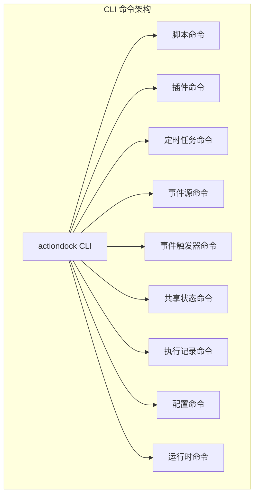

ActionDock CLI (`actiondock`) 是 ActionDock 的命令行客户端，提供脚本管理、插件操作、定时任务、事件源配置、共享状态管理等完整功能。CLI 基于 [oclif](https://github.com/oclif/core) 框架构建，所有命令均支持 `--json` 输出机器可读格式。



## 安装与升级

```bash
# 全局安装
npm install -g actiondock

# 检查版本
actiondock --version

# 升级 CLI
actiondock self-update
actiondock self-update latest        # 升级到最新版本
actiondock self-update --dry-run     # 预览升级命令
```

Sources: [package.json](actiondock-cli/package.json#L1-L12), [self-update.ts](actiondock-cli/src/commands/self-update.ts#L1-L75)

---

## 全局配置

CLI 优先从以下来源读取配置（按优先级递减）：命令行参数 > 环境变量 > 本地配置文件。

### 配置命令

```bash
# 设置服务器地址
actiondock config set server <url>

# 设置访问令牌
actiondock config set token <token>

# 查看当前配置
actiondock config show

# 清除配置
actiondock config clear server
actiondock config clear token
```

### 环境变量

| 环境变量 | 说明 | 默认值 |
|---------|------|--------|
| `ACTIONDOCK_BASE_URL` | 服务器地址 | `http://127.0.0.1:5177` |
| `ACTIONDOCK_TOKEN` | 访问令牌 | 无 |

配置文件路径遵循各平台规范：Windows 下为 `%APPDATA%\actiondock\config.json`，macOS 下为 `~/Library/Application Support/actiondock/config.json`。

Sources: [config.ts](actiondock-cli/src/lib/config.ts#L1-L87)

---

## 脚本命令

脚本命令是 CLI 最核心的功能，支持脚本的完整生命周期管理。

### 脚本列表与查询

```bash
# 列出所有脚本
actiondock script list

# 查看脚本详情
actiondock script get <script-id>

# 查看脚本 Schema
actiondock script schema <script-id>

# 获取脚本的输入/输出 Schema JSON
actiondock script get <script-id> --json
```

Sources: [script/list.ts](actiondock-cli/src/commands/script/list.ts#L1-L45), [script/get.ts](actiondock-cli/src/commands/script/get.ts#L1-L48), [script/schema.ts](actiondock-cli/src/commands/script/schema.ts#L1-L52)

### 脚本创建

```bash
actiondock script create \
  --script-id my-script \
  --name "我的脚本" \
  --type groovy \
  --source-file ./script.groovy \
  --description "脚本描述" \
  --tag production \
  --tag data-processing \
  --input-schema-json '{"type":"object","properties":{"name":{"type":"string"}}}' \
  --output-schema-json '{"type":"object","properties":{"result":{"type":"string"}}}'
```

对于 Python 脚本，可指定依赖：

```bash
actiondock script create \
  --script-id py-script \
  --name "Python 脚本" \
  --type python \
  --source-file ./script.py \
  --python-requirements-file ./requirements.txt
```

Sources: [script/create.ts](actiondock-cli/src/commands/script/create.ts#L1-L111)

### 脚本更新与校验

```bash
# 使用 JSON Merge Patch 更新脚本
actiondock script patch <script-id> \
  --patch-json '{"description":"新描述"}'

# 或使用文件提供 Patch
actiondock script patch <script-id> \
  --patch-file ./patch.json

# 单独更新脚本源码
actiondock script patch <script-id> \
  --source-file ./new-script.groovy

# 单独更新 Schema
actiondock script patch <script-id> \
  --input-schema-file ./input-schema.json

# 校验脚本语法和依赖
actiondock script validate <script-id>
```

Sources: [script/patch.ts](actiondock-cli/src/commands/script/patch.ts#L1-L112), [script/validate.ts](actiondock-cli/src/commands/script/validate.ts#L1-L46)

### 脚本执行

执行是最常用的命令，支持同步和异步两种模式：

```bash
# 同步执行（默认）
actiondock script run <script-id> \
  --name alice \
  --age 30

# 异步执行
actiondock script run <script-id> \
  --mode async \
  --name alice

# 执行草稿版本
actiondock script run <script-id> \
  --draft \
  --name alice

# 使用 JSON 提供复杂输入
actiondock script run <script-id> \
  --input-json '{"name":"alice","tags":["a","b"]}'

# 从文件读取输入
actiondock script run <script-id> \
  --input-file ./input.json

# 输出详细调试信息
actiondock script run <script-id> \
  --response-view debug \
  --json
```

**Schema 驱动的参数展开**：CLI 会自动将脚本的 `inputSchema` 展平为 flag 形式。简单类型（string、number、integer、boolean）自动展开，复杂类型（object、array）需使用 `--input-json` 或 `--input-file`。

```bash
# 假设 Schema 定义了 name(string) 和 items(array)
actiondock script run my-script --name alice        # name 自动展开
actiondock script run my-script --items '[1,2,3]'   # items 自动展开为 JSON 字符串
# 或
actiondock script run my-script --input-json '{"items":[1,2,3]}'
```

Sources: [script/run.ts](actiondock-cli/src/commands/script/run.ts#L1-L85), [schema.ts](actiondock-cli/src/lib/schema.ts#L1-L63), [input.ts](actiondock-cli/src/lib/input.ts#L1-L200)

### 脚本发布与草稿管理

```bash
# 发布脚本（将草稿转为正式版本）
actiondock script publish <script-id>

# 丢弃草稿变更
actiondock script discard-draft <script-id>
```

Sources: [script/publish.ts](actiondock-cli/src/commands/script/publish.ts#L1-L47), [script/discard-draft.ts](actiondock-cli/src/commands/script/discard-draft.ts#L1-L43)

---

## 插件命令

```bash
# 列出已安装插件
actiondock plugin list

# 查看插件详情
actiondock plugin get <plugin-id>

# 查看插件引用
actiondock plugin references <plugin-id>

# 从本地 JAR 安装插件
actiondock plugin install ./my-plugin.jar

# 调用插件动作
actiondock plugin invoke <plugin-id> <action-name> \
  --arg1 value1 \
  --arg2 value2

# 使用 JSON 提供动作参数
actiondock plugin invoke <plugin-id> <action-name> \
  --args-json '{"arg1":"value1"}' \
  --script-input-json '{"context":"test"}'

# 获取插件配置
actiondock plugin config get <plugin-id>
```

Sources: [plugin/list.ts](actiondock-cli/src/commands/plugin/list.ts#L1-L43), [plugin/install.ts](actiondock-cli/src/commands/plugin/install.ts#L1-L46), [plugin/invoke.ts](actiondock-cli/src/commands/plugin/invoke.ts#L1-L89)

---

## 定时任务命令

```bash
# 列出所有定时任务
actiondock schedule list

# 列出指定脚本的定时任务
actiondock schedule list --script-id <script-id>

# 创建定时任务
actiondock schedule create \
  --script-id my-script \
  --schedule-name "每日处理" \
  --schedule-cron "0 0 * * *" \
  --schedule-enabled

# 创建时指定输入参数
actiondock schedule create \
  --script-id my-script \
  --schedule-name "带参数的任务" \
  --schedule-cron "0 */6 * * *" \
  --input-json '{"batchSize":100}'

# 查看定时任务详情
actiondock schedule get <schedule-id>

# 更新定时任务
actiondock schedule update <schedule-id> \
  --schedule-cron "0 0,12 * * *" \
  --schedule-disabled

# 启用/禁用定时任务
actiondock schedule enable <schedule-id>
actiondock schedule disable <schedule-id>

# 删除定时任务
actiondock schedule delete <schedule-id>
```

Sources: [schedule/list.ts](actiondock-cli/src/commands/schedule/list.ts#L1-L46), [schedule/create.ts](actiondock-cli/src/commands/schedule/create.ts#L1-L91)

---

## 事件源命令

事件源负责接收外部 webhook 或轮询事件。

```bash
# 列出事件源
actiondock event-source list

# 创建事件源
actiondock event-source create \
  --definition-json '{"key":"github-webhook","transport":{"type":"WEBHOOK"}}' \
  --name "GitHub Webhook" \
  --enabled

# 或从文件定义
actiondock event-source create \
  --definition-file ./event-source.json

# 测试事件标准化处理器
actiondock event-source test-normalization <source-id> \
  --processor-json '{"mode":"JSON_PATH","jsonPath":{"eventType":"$.type"}}' \
  --context-json '{"raw":{"type":"push","repo":"test"}}'

# 查看事件源详情
actiondock event-source get <source-id>

# 更新事件源
actiondock event-source update <source-id> \
  --description "新的描述" \
  --disabled

# 启用/禁用
actiondock event-source enable <source-id>
actiondock event-source disable <source-id>

# 删除事件源
actiondock event-source delete <source-id>

# 模拟事件摄入（测试用）
actiondock event-source ingest <source-id> \
  --payload-json '{"headers":{"content-type":"application/json"},"body":{"action":"push"}}'
```

Sources: [event-source/create.ts](actiondock-cli/src/commands/event-source/create.ts#L1-L89), [event-source/ingest.ts](actiondock-cli/src/commands/event-source/ingest.ts#L1-L57)

---

## 事件触发器命令

事件触发器将事件源与脚本连接，实现事件驱动的自动化。

```bash
# 列出事件触发器
actiondock event-trigger list

# 创建事件触发器
actiondock event-trigger create \
  --definition-json '{"sourceId":"github-webhook","targetScriptId":"ci-trigger"}' \
  --name "GitHub Push 触发 CI" \
  --submit-mode sync

# 测试触发器（仅映射，不执行）
actiondock event-trigger test <trigger-id> \
  --event-json '{"eventType":"push","sourceKey":"github-webhook"}'

# 测试时同时执行目标脚本
actiondock event-trigger test <trigger-id> \
  --event-json '{"eventType":"push"}' \
  --execute

# 查看触发器详情
actiondock event-trigger get <trigger-id>

# 查看触发器最近分发记录
actiondock event-trigger dispatches <trigger-id>

# 更新触发器
actiondock event-trigger update <trigger-id> \
  --target-script-id new-script-id \
  --submit-mode async

# 启用/禁用
actiondock event-trigger enable <trigger-id>
actiondock event-trigger disable <trigger-id>

# 删除触发器
actiondock event-trigger delete <trigger-id>
```

Sources: [event-trigger/create.ts](actiondock-cli/src/commands/event-trigger/create.ts#L1-L99), [event-trigger/test.ts](actiondock-cli/src/commands/event-trigger/test.ts#L1-L61)

---

## 共享状态命令

提供跨脚本的键值存储，支持版本控制的 CAS 操作。

```bash
# 列出命名空间
actiondock state namespaces

# 列出命名空间内的键
actiondock state list <namespace>

# 读取状态
actiondock state get <namespace> <key>

# 写入状态
actiondock state put <namespace> <key> \
  --value-json '{"counter":42}'

# 从文件读取值
actiondock state put <namespace> <key> \
  --value-file ./value.json

# 标记为敏感值
actiondock state put <namespace> <key> \
  --value-json '{"apiKey":"xxx"}' \
  --secret

# 设置过期时间（本地 ISO 格式）
actiondock state put <namespace> <key> \
  --value-json '{"temp":"data"}' \
  --expires-at "2026-04-28T12:00:00"

# CAS 操作（版本控制更新）
actiondock state cas <namespace> <key> \
  --expected-version 5 \
  --value-json '{"counter":6}'

# 删除状态
actiondock state delete <namespace> <key>

# 清理过期状态
actiondock state purge-expired
```

Sources: [state/get.ts](actiondock-cli/src/commands/state/get.ts#L1-L48), [state/put.ts](actiondock-cli/src/commands/state/put.ts#L1-L69), [state/cas.ts](actiondock-cli/src/commands/state/cas.ts#L1-L74)

---

## 执行记录命令

```bash
# 按脚本 ID 查询执行记录
actiondock execution list --script-id <script-id>

# 按定时任务 ID 查询
actiondock execution list --schedule-id <schedule-id>

# 查看单条执行记录详情
actiondock execution get <execution-id>

# 删除执行记录
actiondock execution delete <execution-id>

# 清理执行记录
actiondock execution clear                          # 清理所有
actiondock execution clear --script-id <script-id> # 按脚本清理
```

Sources: [execution/list.ts](actiondock-cli/src/commands/execution/list.ts#L1-L57)

---

## 事件记录命令

```bash
# 列出事件记录
actiondock event-record list

# 按事件源过滤
actiondock event-record list --source-id <source-id>

# 查看事件记录详情
actiondock event-record get <event-record-id>

# 查看事件分发记录
actiondock event-record dispatches <event-record-id>
```

Sources: [event-record/list.ts](actiondock-cli/src/commands/event-record/list.ts#L1-L46)

---

## Capability 命令

Capability 是 AI Agent 可调用的脚本封装。

```bash
# 列出可用 capabilities
actiondock capability list

# 查看 capability 详情
actiondock capability get <capability-id>

# 执行 capability
actiondock capability run <capability-id> \
  --input-json '{"param":"value"}'

# 执行草稿绑定
actiondock capability run <capability-id> \
  --draft \
  --input-json '{"param":"value"}'

# 更新 capability 草稿
actiondock capability patch <capability-id> \
  --source-file ./new-source.py

# 发布 capability
actiondock capability publish <capability-id>

# 丢弃草稿
actiondock capability discard-draft <capability-id>
```

Sources: [capability/list.ts](actiondock-cli/src/commands/capability/list.ts#L1-L43), [capability/run.ts](actiondock-cli/src/commands/capability/run.ts#L1-L81)

---

## 处理器测试命令

用于测试事件处理器的转换逻辑。

```bash
actiondock processor test \
  --processor-json '{"mode":"JSON_PATH","jsonPath":{"eventType":"$.type","actor":"$.actor"}}' \
  --context-json '{"raw":{"type":"push","actor":"alice"}}' \
  --expected-output-schema-json '{"type":"object","properties":{"eventType":{"type":"string"}}}'
```

Sources: [processor/test.ts](actiondock-cli/src/commands/processor/test.ts#L1-L70)

---

## 运行时命令

### 本地服务器

```bash
# 前台启动服务器
actiondock server
actiondock server --port 8080
actiondock server --server-address 0.0.0.0

# 传递自定义参数
actiondock server -- --custom-arg value
```

### 系统服务（macOS/Linux）

```bash
actiondock service install   # 安装为系统服务
actiondock service start     # 启动服务
actiondock service stop      # 停止服务
actiondock service status    # 查看状态
actiondock service restart   # 重启服务
actiondock service uninstall # 卸载服务
```

Windows 平台不支持系统服务管理，建议使用 `actiondock server` 或桌面模式。

Sources: [server.ts](actiondock-cli/src/commands/server.ts#L1-L82), [service.ts](actiondock-cli/src/commands/service.ts#L1-L62)

### 桌面模式

启动包含管理控制台和系统托盘的桌面应用：

```bash
actiondock desktop
actiondock desktop --port 8080
actiondock desktop --server-address 0.0.0.0
```

Sources: [desktop.ts](actiondock-cli/src/commands/desktop.ts#L1-L37)

---

## 全局选项

所有命令支持以下全局选项：

| 选项 | 说明 |
|------|------|
| `--json` | 输出机器可读的 JSON 格式 |
| `--server <url>` | 覆盖服务器地址 |
| `--token <token>` | 覆盖访问令牌 |
| `--help`, `-h` | 显示帮助信息 |

错误处理方面，CLI 使用统一的错误格式：

```json
{
  "error": "错误描述",
  "details": null,
  "exitCode": 2
}
```

Sources: [command.ts](actiondock-cli/src/lib/command.ts#L1-L36)

---

## 命令速查表

| 功能 | 命令 |
|------|------|
| **脚本** | |
| 列表 | `actiondock script list` |
| 创建 | `actiondock script create --script-id <id> --name <name> --source-file <path>` |
| 执行 | `actiondock script run <script-id> [--draft] [--mode sync\|async]` |
| 发布 | `actiondock script publish <script-id>` |
| **插件** | |
| 列表 | `actiondock plugin list` |
| 安装 | `actiondock plugin install <jar-path>` |
| 调用 | `actiondock plugin invoke <plugin-id> <action>` |
| **定时任务** | |
| 列表 | `actiondock schedule list` |
| 创建 | `actiondock schedule create --script-id <id> --schedule-name <name> --schedule-cron <cron>` |
| 启用 | `actiondock schedule enable <schedule-id>` |
| **事件源** | |
| 创建 | `actiondock event-source create --definition-json '<json>'` |
| 测试摄入 | `actiondock event-source ingest <source-id> --payload-json '<json>'` |
| **事件触发器** | |
| 创建 | `actiondock event-trigger create --definition-json '<json>'` |
| 测试 | `actiondock event-trigger test <trigger-id> --event-json '<json>' --execute` |
| **共享状态** | |
| 读取 | `actiondock state get <namespace> <key>` |
| 写入 | `actiondock state put <namespace> <key> --value-json '<json>'` |
| CAS | `actiondock state cas <namespace> <key> --expected-version <n> --value-json '<json>'` |
| **配置** | |
| 设置 | `actiondock config set server <url>` |
| 查看 | `actiondock config show` |
| **运行时** | |
| 服务器 | `actiondock server [--port <port>]` |
| 桌面 | `actiondock desktop` |
| 服务 | `actiondock service [install\|start\|stop\|status\|restart\|uninstall]` |

---

## 相关文档

- [脚本管理](4-jiao-ben-sheng-ming-zhou-qi-guan-li) - 脚本生命周期的详细说明
- [REST API 参考](19-rest-api-can-kao) - API 端点与数据结构
- [触发中心](11-ding-shi-ren-wu-guan-li) - 定时任务与事件触发的概念