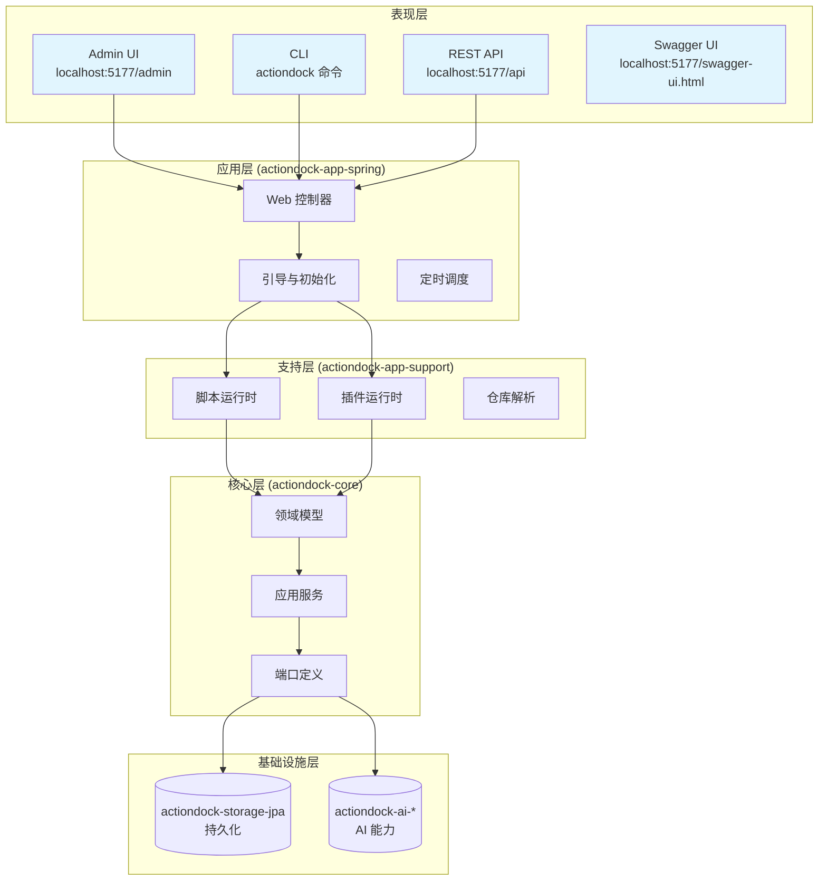
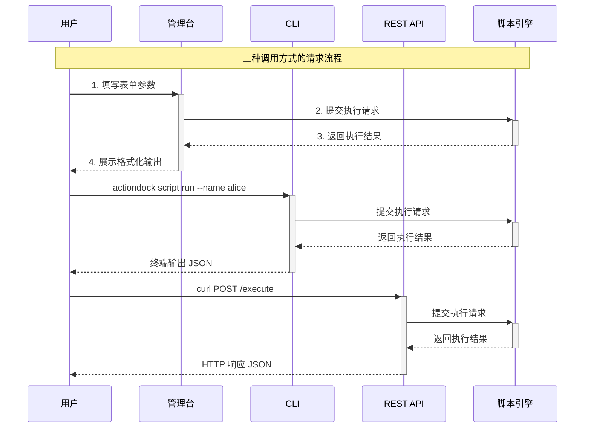

本文档面向刚接触 ActionDock 的开发者，帮助您在最短时间内完成环境安装、服务启动，并运行第一个示例脚本。通过本文档，您将了解 ActionDock 的核心概念、系统架构和三种主流调用方式（管理台、REST API、CLI），为后续深入学习脚本管理和高级功能奠定基础。

> **学习建议**：完成快速开始后，建议继续阅读[项目概述](1-xiang-mu-gai-shu)了解完整的产品定位，或直接进入[脚本生命周期管理](4-jiao-ben-sheng-ming-zhou-qi-guan-li)深入学习核心功能。

---

## ActionDock 简介

ActionDock 解决的核心问题是：**把散落在各处的脚本升级成团队可复用、可分发、可审计、可被 AI 稳定调用的脚本资产**。

### 核心能力概览

传统的脚本管理方式（如脚本目录 + cron）存在缺乏契约、草稿发布流程缺失、团队分发困难等问题。ActionDock 通过统一抽象层提供了完整的解决方案：

| 维度 | 传统方式 | ActionDock |
|------|----------|------------|
| **输入输出契约** | 通常没有 | 内建 `inputSchema` / `outputSchema` |
| **草稿与发布** | 通常没有 | 内建草稿、发布快照、丢弃草稿 |
| **团队分发** | 拷文件 / Git 约定 | 仓库发现、安装、更新 |
| **多入口调用** | 各写各的 | UI、REST、CLI、Agent 共用同一脚本 |
| **AI 接入** | prompt 拼接 | AI Toolset、Agent 原生集成 |
| **共享状态** | 落文件 / Redis 自管 | 内建 namespace + key + CAS 机制 |

Sources: [README.md](README.md#L16-L36)

### 系统架构

ActionDock 采用分层架构设计，核心模块职责清晰：



Sources: [actiondock-core/README.md](actiondock-core/README.md#L1-L10)、[actiondock-app-support/README.md](actiondock-app-support/README.md#L1-L20)

### 技术栈要求

| 组件 | 版本要求 | 用途 |
|------|----------|------|
| JDK | 21+ | 运行 Spring Boot 运行时 |
| Maven | 3.9+ | 本地构建 Java 代码时 |
| Node.js | 18+ | CLI 工具和前端开发 |
| Python | 3.x | 执行 PYTHON 类型脚本（默认命令 `python3`） |
| Docker | 可选 | 容器化部署场景 |

Sources: [docs/quick-start.md](docs/quick-start.md#L25-L31)

---

## 安装与启动

### 方式一：使用 npm 安装（推荐）

ActionDock 提供统一的 npm 包，安装后即可使用：

```bash
npm install -g actiondock
```

安装完成后验证安装：

```bash
actiondock --help
```

您应该看到以下可用命令组：

- **运行时命令**：`desktop`、`server`、`service`
- **脚本命令**：`script list`、`script run`、`script schema`
- **配置命令**：`config set`、`config show`

Sources: [actiondock-cli/README.md](actiondock-cli/README.md#L9-L30)、[actiondock-cli/package.json](actiondock-cli/package.json#L1-L20)

### 方式二：从源码构建

如果您需要自定义或开发 ActionDock：

```bash
# 克隆仓库后进入 CLI 目录
cd actiondock-cli

# 安装依赖并链接
npm ci
npm link
```

构建过程会：
1. 编译 TypeScript CLI 代码到 `dist/`
2. 使用 Maven 构建 Spring Boot jar
3. 复制 jar 到 `runtime/actiondock-app-spring.jar`
4. 生成 jDeploy 安装包

Sources: [actiondock-cli/README.md](actiondock-cli/README.md#L36-L50)

### 启动服务

启动前确保 JDK 21 已正确配置。启动方式有以下三种：

| 模式 | 命令 | 适用场景 |
|------|------|----------|
| **桌面模式** | `actiondock desktop` | 日常使用，自动打开管理台 + 系统托盘 |
| **前台服务** | `actiondock server` | 开发调试，日志实时输出 |
| **系统服务** | `actiondock service install` | 生产环境，后台长期运行 |

```bash
# 桌面模式（推荐首次使用）
actiondock desktop

# 前台模式（查看详细日志）
actiondock server
```

Sources: [actiondock-cli/README.md](actiondock-cli/README.md#L9-L18)

### 验证启动成功

服务启动后，访问以下地址确认正常运行：

| 服务 | 地址 |
|------|------|
| **管理台** | http://localhost:5177/admin/app/scripts |
| **REST API** | http://localhost:5177/api |
| **Swagger UI** | http://localhost:5177/swagger-ui.html |
| **健康检查** | http://localhost:5177/actuator/health |

Sources: [actiondock-app-spring/src/main/resources/application.yml](actiondock-app-spring/src/main/resources/application.yml#L1-L25)

> **注意**：服务默认绑定 `127.0.0.1`，仅允许本机访问。如需远程访问，参考[系统设置](18-cli-ming-ling-can-kao)进行配置。

---

## 第一个脚本：Hello World

ActionDock 启动时会自动初始化一个示例 Groovy 脚本 `hello-groovy`，无需手动创建即可直接运行。这个脚本接收一个 `name` 参数，返回问候消息和大写的名字。

### 示例脚本源码

```groovy
def name = input.name ?: "World"
return [message: "Hello, " + name + "!", upperName: name.toUpperCase()]
```

该脚本的核心特性：
- **输入参数**：`name`（字符串，可选，默认为 "World"）
- **输出结果**：`message`（问候语）、`upperName`（名字的大写形式）
- **脚本类型**：GROOVY
- **作用域**：SAMPLE（示例，系统内置）

Sources: [actiondock-app-spring/src/main/java/org/team4u/actiondock/bootstrap/SampleDataInitializer.java](actiondock-app-spring/src/main/java/org/team4u/actiondock/bootstrap/SampleDataInitializer.java#L1-L80)

### 调用方式一：管理台

管理台提供可视化的脚本执行界面：

1. 打开浏览器访问 **http://localhost:5177/admin/app/scripts**
2. 在脚本库中找到 **hello-groovy**（带有示例标签）
3. 点击脚本名称进入编辑器
4. 切换到「执行」标签页
5. 在输入表单中填写 `name: alice`
6. 选择执行模式：**SYNC**（同步等待）
7. 点击「执行」按钮
8. 在结果区域查看返回的 JSON

Sources: [docs/quick-start.md](docs/quick-start.md#L44-L57)

### 调用方式二：REST API

通过 HTTP 请求直接调用脚本，适合自动化脚本和外部系统集成：

```bash
curl -X POST http://localhost:5177/api/scripts/hello-groovy/published/execute \
  -H 'Content-Type: application/json' \
  -d '{"input": {"name": "alice"}, "mode": "SYNC"}'
```

成功响应示例：

```json
{
  "id": "exec-xxx-xxx",
  "scriptId": "hello-groovy",
  "status": "SUCCESS",
  "output": {
    "message": "Hello, alice!",
    "upperName": "ALICE"
  },
  "createdAt": "2025-01-15T10:30:00Z",
  "finishedAt": "2025-01-15T10:30:01Z"
}
```

Sources: [docs/api-reference.md](docs/api-reference.md#L1-L25)

### 调用方式三：CLI

CLI 提供最便捷的命令行体验，支持 Schema 自动生成 flag：

```bash
# 基础调用
actiondock script run hello-groovy --name alice --json

# 执行草稿版本（开发调试用）
actiondock script run hello-groovy --name alice --draft --json

# 查看脚本 Schema
actiondock script schema hello-groovy
```

CLI 的强大之处在于 **Schema 驱动**：inputSchema 定义后，参数会自动转换为命令行 flag，无需记忆参数顺序。

Sources: [docs/cli-reference.md](docs/cli-reference.md#L1-L72)

### 调用流程对比



---

## 管理台功能导览

管理台左侧导航分为四个功能区域，帮助您快速定位所需功能：

| 区域 | 包含功能 | 适用场景 |
|------|----------|----------|
| **能力** | 脚本库、插件管理、Skills 管理、AI（模型、Agent、Toolset、运行记录） | 日常开发和运维 |
| **资源** | 仓库发现、仓库管理 | 团队协作和脚本分发 |
| **触发** | 触发中心（定时任务、事件源、事件触发、事件记录） | 自动化任务配置 |
| **设置** | 配置值、共享状态、访问令牌、控制台凭证、数据备份 | 系统配置和安全 |

### 核心功能入口

```
能力
├── 脚本库      → 创建、编辑、运行、发布脚本
├── 插件管理    → 安装和启用插件扩展
├── Skills 管理 → 管理 AI 技能包
└── AI          → 配置模型、Agent、Toolset
资源
├── 仓库发现    → 浏览可安装的仓库
└── 仓库管理    → 添加、配置同步仓库
触发
├── 定时任务    → 创建 Cron 调度任务
├── 事件源      → 配置 Webhook 接收
├── 事件触发    → 设置事件到脚本的路由规则
└── 事件记录    → 查看事件处理历史
设置
├── 配置值      → 全局键值配置（支持 ${config.key} 引用）
├── 共享状态    → 跨脚本的命名空间状态存储
├── 访问令牌    → API 认证凭证管理
└── 数据备份    → 系统数据导出和恢复
```

Sources: [docs/quick-start.md](docs/quick-start.md#L66-L77)

---

## 下一步学习路径

完成快速开始后，建议根据您的使用场景选择继续学习的方向：

| 场景 | 推荐文档 |
|------|----------|
| 想深入了解脚本的完整生命周期 | [脚本生命周期管理](4-jiao-ben-sheng-ming-zhou-qi-guan-li) |
| 需要编写自己的脚本 | [脚本编写指南](script-writing-guide.md) |
| 想要复用其他脚本或被依赖 | [脚本依赖与调用](6-jiao-ben-yi-lai-yu-diao-yong) |
| 需要扩展插件实现高级功能 | [插件开发指南](7-cha-jian-kai-fa-zhi-nan) |
| 想配置定时自动化任务 | [定时任务管理](11-ding-shi-ren-wu-guan-li) |
| 需要通过命令行高效工作 | [CLI 命令参考](18-cli-ming-ling-can-kao) |
| 需要集成到外部系统 | [REST API 参考](19-rest-api-can-kao) |

---

## 常见问题

### 服务启动失败

**问题**：执行 `actiondock server` 报错端口已被占用。

**解决**：

```bash
# Windows 查看端口占用
netstat -ano | findstr 5177

# Linux/Mac 查看端口占用
lsof -i :5177

# 结束占用进程或修改端口配置
```

### CLI 命令找不到

**问题**：`actiondock: command not found`

**解决**：

```bash
# 确认安装成功
npm list -g actiondock

# 重新链接
npm uninstall -g actiondock
npm install -g actiondock

# 检查 PATH
npm bin -g
```

### 示例脚本未初始化

**问题**：脚本库中没有 `hello-groovy`

**解决**：检查启动日志，确认 `SampleDataInitializer` 成功执行。如果使用 H2 数据库，可能需要删除 `~/.actiondock/data` 目录后重新启动。

Sources: [actiondock-app-spring/src/main/java/org/team4u/actiondock/bootstrap/SampleDataInitializer.java](actiondock-app-spring/src/main/java/org/team4u/actiondock/bootstrap/SampleDataInitializer.java#L36-L65)

---

> **继续阅读**：[脚本生命周期管理](4-jiao-ben-sheng-ming-zhou-qi-guan-li) 深入了解脚本从创建到发布的完整流程 | [返回目录](user-manual.md)