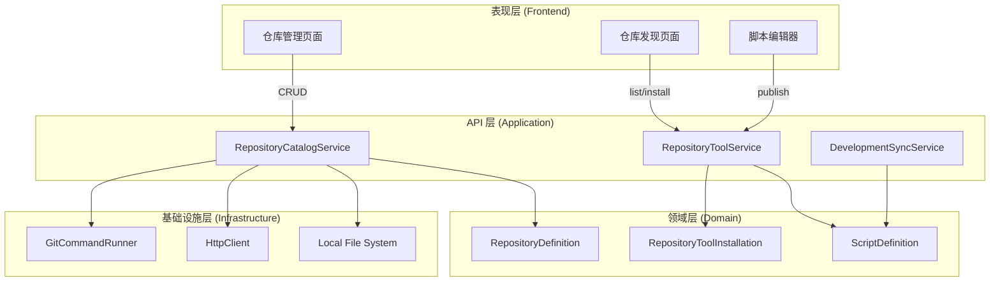
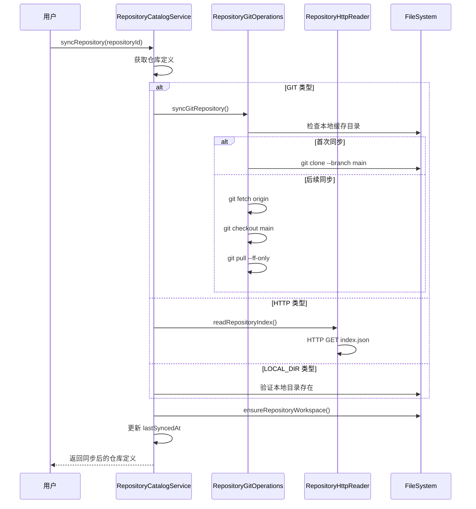
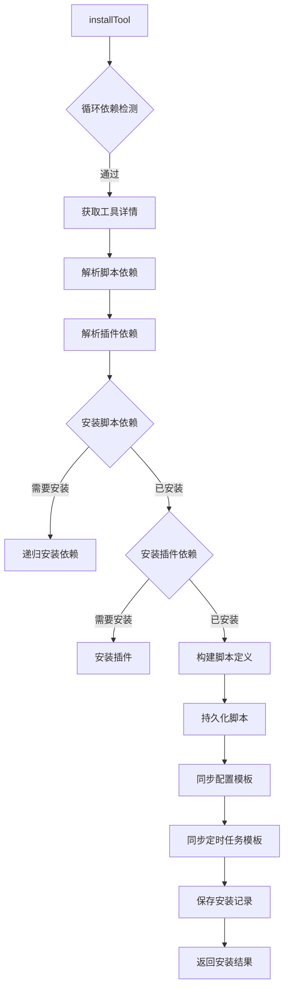
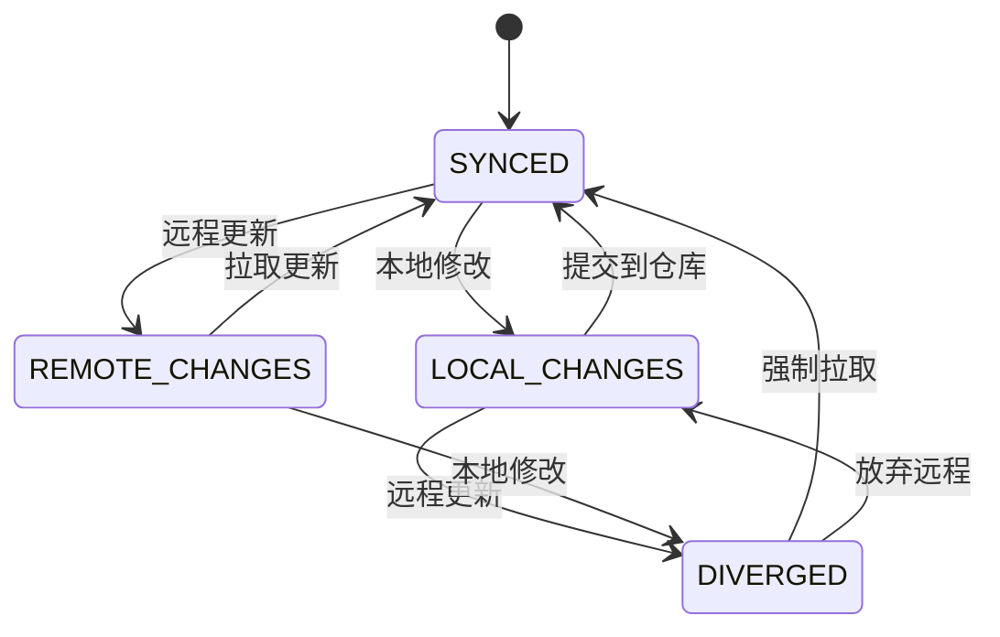

仓库分发系统是 ActionDock 的**集中式资产分发基础设施**，通过统一的仓库抽象层实现脚本、插件、AI 能力包和 Skills 的发现、安装、更新与发布流程。该机制将本地开发环境与外部共享资产连接，支持多源、多类型的资产同步管理。

Sources: [RepositoryCatalogService.java](actiondock-app-support/src/main/java/org/team4u/actiondock/repository/RepositoryCatalogService.java#L1-L100)

## 核心架构

仓库分发系统采用**分层架构**，将关注点分离为仓库定义层、目录服务层和资产操作层。



### 关键服务组件

| 服务类 | 职责 | 源码位置 |
|--------|------|----------|
| `RepositoryCatalogService` | 仓库注册、发现、索引读取 | [RepositoryCatalogService.java](actiondock-app-support/src/main/java/org/team4u/actiondock/repository/RepositoryCatalogService.java#L1) |
| `RepositoryToolService` | 工具安装、更新、卸载 | [RepositoryToolService.java](actiondock-app-support/src/main/java/org/team4u/actiondock/repository/RepositoryToolService.java#L1-L50) |
| `DevelopmentSyncService` | 开发同步状态管理 | [DevelopmentSyncService.java](actiondock-app-support/src/main/java/org/team4u/actiondock/repository/DevelopmentSyncService.java#L1-L50) |
| `ToolRepositoryPublisher` | 工具发布到仓库 | [ToolRepositoryPublisher.java](actiondock-app-support/src/main/java/org/team4u/actiondock/repository/ToolRepositoryPublisher.java#L1-L60) |
| `RepositoryGitOperations` | Git 仓库操作封装 | [RepositoryGitOperations.java](actiondock-app-support/src/main/java/org/team4u/actiondock/repository/RepositoryGitOperations.java#L1-L30) |

Sources: [RepositoryCatalogService.java](actiondock-app-support/src/main/java/org/team4u/actiondock/repository/RepositoryCatalogService.java#L50-L80)

## 仓库数据模型

仓库定义是系统的核心实体，包含配置仓库所需的所有元数据。

```java
public class RepositoryDefinition {
    private String id;                    // 唯一标识
    private String name;                 // 显示名称
    private String type;                 // GIT | HTTP | LOCAL_DIR
    private String url;                  // Git URL / HTTP URL / 本地路径
    private String branch;                // Git 分支
    private boolean enabled = true;       // 是否启用
    private String trustLevel;           // TRUSTED | UNTRUSTED
    private String usage;                // DISTRIBUTION | DEVELOPMENT
    private LocalDateTime lastSyncedAt;   // 上次同步时间
}
```

Sources: [RepositoryDefinition.java](actiondock-core/src/main/java/org/team4u/actiondock/domain/model/RepositoryDefinition.java#L1-L50)

### 仓库类型对比

| 类型 | 类型常量 | 数据源 | 发布支持 | 适用场景 |
|------|----------|--------|----------|----------|
| Git 仓库 | `GIT` | 远程 Git 仓库 | ✅ 完整支持 | 团队协作、版本化管理 |
| HTTP 仓库 | `HTTP` | HTTP 端点 JSON 索引 | ❌ 只读分发 | 公共仓库镜像、CDN 分发 |
| 本地目录 | `LOCAL_DIR` | 本地文件系统 | ✅ 完整支持 | 个人工具库、离线环境 |

Sources: [RepositoryCatalogTypes.java](actiondock-app-support/src/main/java/org/team4u/actiondock/repository/RepositoryCatalogTypes.java#L50-L65)

### 仓库用途模式

| 用途 | 用途常量 | 安装后脚本作用域 | 可编辑性 | 同步方式 |
|------|----------|------------------|----------|----------|
| 分发模式 | `DISTRIBUTION` | `REPOSITORY` | ❌ 只读 | 一键更新 |
| 开发模式 | `DEVELOPMENT` | `DEVELOPMENT` | ✅ 可编辑 | 双向同步 |

Sources: [RepositoryCatalogTypes.java](actiondock-app-support/src/main/java/org/team4u/actiondock/repository/RepositoryCatalogTypes.java#L65-L75)

## 仓库索引结构

仓库通过标准化的索引文件组织资产，索引文件名统一为 `actiondock.repository.json`。

```text
repo-root/
├── actiondock.repository.json    # 仓库索引（自动维护）
├── tools/                       # 脚本工具目录
│   ├── my-script/
│   │   ├── tool.json           # 工具描述文件
│   │   ├── source.groovy       # Groovy 源码
│   │   └── requirements.txt    # Python 依赖（可选）
│   └── another-tool/
├── plugins/                     # 插件目录
│   └── plugin.json
├── packages/                    # AI 能力包目录
│   └── capability-package/
└── skills/                      # Skills 目录
    └── my-skill/
```

Sources: [RepositoryCatalogTypes.java](actiondock-app-support/src/main/java/org/team4u/actiondock/repository/RepositoryCatalogTypes.java#L25-L45)

### 工具描述文件结构

```json
{
  "schemaVersion": "1.0",
  "toolId": "my-script",
  "displayName": "我的脚本",
  "version": "1.0.0",
  "type": "GROOVY",
  "packaging": "TOOL",
  "description": "脚本描述",
  "releaseNotes": "发布说明",
  "sourcePath": "source.groovy",
  "inputSchemaPath": "input.schema.json",
  "outputSchemaPath": "output.schema.json",
  "scriptDependencies": [],
  "pluginDependencies": [],
  "configTemplatePath": "config.template.json",
  "scheduleTemplatePath": "schedules.template.json"
}
```

Sources: [ToolRepositoryPublisher.java](actiondock-app-support/src/main/java/org/team4u/actiondock/repository/ToolRepositoryPublisher.java#L150-L180)

## 同步与安装流程

### 仓库同步流程

仓库同步是将远程仓库内容同步到本地缓存目录的过程，不同类型的仓库采用不同的同步策略。



Sources: [RepositoryGitOperations.java](actiondock-app-support/src/main/java/org/team4u/actiondock/repository/RepositoryGitOperations.java#L20-L50)

### 工具安装流程

工具安装涉及依赖解析、脚本持久化和配置模板同步。



Sources: [RepositoryToolService.java](actiondock-app-support/src/main/java/org/team4u/actiondock/repository/RepositoryToolService.java#L40-L100)

#### 安装选项

| 选项 | 说明 | 默认值 |
|------|------|--------|
| `installSchedules` | 同时安装关联的定时任务模板 | `false` |
| `installScriptDependencies` | 自动安装脚本依赖 | `false` |
| `installPluginDependencies` | 自动安装插件依赖 | `false` |
| `forcePluginUpgrade` | 强制升级插件版本 | `false` |

Sources: [RepositoryCatalogTypes.java](actiondock-app-support/src/main/java/org/team4u/actiondock/repository/RepositoryCatalogTypes.java#L90-L95)

## 开发同步机制

DEVELOPMENT 模式提供双向同步能力，支持在 ActionDock 中编辑脚本并与 Git 仓库保持同步。

### 同步状态机



Sources: [DevelopmentSyncService.java](actiondock-app-support/src/main/java/org/team4u/actiondock/repository/DevelopmentSyncService.java#L35-L50)

### 状态判断逻辑

```java
static DevelopmentSyncState resolveDevelopmentSyncState(
        ScriptDefinition script, 
        String localDigest, 
        ToolSourceState remoteState) {
    boolean localChanged = isLocalChanged(script, localDigest);
    boolean remoteChanged = isRemoteChanged(script, remoteState);
    
    if (localChanged && remoteChanged) {
        return DevelopmentSyncState.DIVERGED;  // 分叉
    }
    if (localChanged) {
        return DevelopmentSyncState.LOCAL_CHANGES;  // 本地有变更
    }
    if (remoteChanged) {
        return DevelopmentSyncState.REMOTE_CHANGES;  // 远程有变更
    }
    return DevelopmentSyncState.SYNCED;  // 已同步
}
```

Sources: [DevelopmentSyncService.java](actiondock-app-support/src/main/java/org/team4u/actiondock/repository/DevelopmentSyncService.java#L38-L50)

### 同步状态标签含义

| 状态 | 含义 | 建议操作 |
|------|------|----------|
| `SYNCED` | 本地与远程完全一致 | 无需操作 |
| `LOCAL_CHANGES` | 本地有未提交的修改 | 发布到仓库 |
| `REMOTE_CHANGES` | 远程有新版本可用 | 执行 `development-pull` |
| `DIVERGED` | 存在分叉冲突 | 使用 `force=true` 强制拉取或放弃本地修改 |

Sources: [DevelopmentSyncService.java](actiondock-app-support/src/main/java/org/team4u/actiondock/repository/DevelopmentSyncService.java#L70-L85)

## 发布流程

将本地脚本发布到仓库涉及版本检测、文件写入和索引更新。

### 发布约束检查

发布前系统执行多层检查：

1. **脚本状态检查**：脚本必须处于 `PUBLISHED` 状态
2. **版本冲突检测**：目标版本不能已存在
3. **开发冲突检查**：DEVELOPMENT 模式下远程有更新时阻止发布
4. **打包约束验证**：验证脚本类型的打包限制

Sources: [ToolRepositoryPublisher.java](actiondock-app-support/src/main/java/org/team4u/actiondock/repository/ToolRepositoryPublisher.java#L55-L80)

### 发布文件生成

发布时系统生成完整的工具包结构：

```java
private void writeToolFiles(Path toolDir, ...) {
    // 1. 写入源码文件
    Files.writeString(toolDir.resolve(sourceFileName), source);
    
    // 2. 写入依赖文件（Python 场景）
    if (pythonRequirements != null) {
        Files.writeString(toolDir.resolve("requirements.txt"), requirements);
    }
    
    // 3. 写入工具描述文件
    writeToolDescriptorFile(toolDir, ...);
    
    // 4. 写入 Schema 文件
    writeJson(toolDir.resolve("input.schema.json"), inputSchema);
    writeJson(toolDir.resolve("output.schema.json"), outputSchema);
    
    // 5. 写入模板文件（可选）
    if (!configTemplates.isEmpty()) {
        writeJson(toolDir.resolve("config.template.json"), configTemplates);
    }
}
```

Sources: [ToolRepositoryPublisher.java](actiondock-app-support/src/main/java/org/team4u/actiondock/repository/ToolRepositoryPublisher.java#L130-L165)

### Git 提交与推送

```java
void commitAndPush(Path root, RepositoryDefinition repository, 
                   String toolId, String version, String releaseNotes) {
    // 添加所有变更
    runGit(root, List.of("git", "add", "."));
    
    // 提交变更
    runGit(root, List.of(
        "git", "commit", "-m", "publish(" + toolId + "): " + version,
        "-m", releaseNotes
    ), true);  // 允许空提交
    
    // 推送到远程
    runGit(root, List.of("git", "push", "origin", branch));
}
```

Sources: [RepositoryGitOperations.java](actiondock-app-support/src/main/java/org/team4u/actiondock/repository/RepositoryGitOperations.java#L35-L50)

## REST API 接口

### 仓库管理接口

| 方法 | 路径 | 说明 |
|------|------|------|
| `GET` | `/api/repositories` | 获取所有仓库列表 |
| `POST` | `/api/repositories` | 创建新仓库 |
| `GET` | `/api/repositories/{id}` | 获取仓库详情 |
| `PUT` | `/api/repositories/{id}` | 更新仓库配置 |
| `DELETE` | `/api/repositories/{id}` | 删除仓库 |
| `POST` | `/api/repositories/{id}/sync` | 同步仓库 |

Sources: [api.ts](actiondock-admin-ui/src/features/resources/api.ts#L15-L35)

### 工具操作接口

| 方法 | 路径 | 说明 |
|------|------|------|
| `GET` | `/api/repositories/tools` | 获取所有仓库的工具列表 |
| `GET` | `/api/repositories/{id}/tools` | 获取指定仓库的工具列表 |
| `GET` | `/api/repositories/{id}/tools/{toolId}` | 获取工具详情 |
| `POST` | `/api/resource-lifecycle/operations` | 安装/更新工具 |
| `DELETE` | `/api/installed-tools/{scriptId}` | 卸载已安装工具 |

Sources: [api.ts](actiondock-admin-ui/src/features/resources/api.ts#L45-L95)

### 开发同步接口

| 方法 | 路径 | 说明 |
|------|------|------|
| `GET` | `/api/scripts/{id}/development-status` | 获取开发脚本同步状态 |
| `POST` | `/api/scripts/{id}/development-pull` | 拉取远程更新 |
| `POST` | `/api/resource-lifecycle/operations` | 创建开发脚本 |

Sources: [api.ts](actiondock-admin-ui/src/features/resources/api.ts#L95-L120)

## 前端集成

### 仓库发现页面

仓库发现页面聚合所有已配置仓库中的可用资产，支持分类浏览和快速安装。

```typescript
// 加载所有资产列表
const tools = await listRepositoryTools();
const plugins = await listRepositoryPlugins();
const skills = await listRepositorySkills();
const packages = await listCapabilityPackages();
```

Sources: [RepositoryDiscoveryPage.tsx](actiondock-admin-ui/src/pages/RepositoryDiscoveryPage.tsx#L40-L60)

### 仓库管理页面

仓库管理页面提供仓库的 CRUD 操作和同步触发。

```typescript
// 同步仓库
const syncRepository = async (id: string) => {
    setSyncingId(id);
    try {
        await syncRepository(id);
        messageApi.success("同步成功");
    } catch (error) {
        messageApi.error("同步失败: " + getErrorMessage(error));
    } finally {
        setSyncingId(null);
    }
};
```

Sources: [RepositoryManagementPage.tsx](actiondock-admin-ui/src/pages/RepositoryManagementPage.tsx#L60-L80)

### 发布到仓库

```typescript
// 预览发布配置
const preview = await previewPublishConfig({
    scriptId: script.id,
    scheduleIds: selectedSchedules
});

// 执行发布
const result = await publishRepositoryTool(repositoryId, {
    scriptId: script.id,
    toolId: toolId,
    version: "1.0.0",
    displayName: script.name,
    releaseNotes: releaseNotes
});
```

Sources: [useScriptPublishToRepo.ts](actiondock-admin-ui/src/scriptEditor/useScriptPublishToRepo.ts)

## 最佳实践

### 仓库配置建议

| 场景 | 推荐配置 | 说明 |
|------|----------|------|
| 团队分发 | `GIT` + `DISTRIBUTION` | 版本化管理、只读分发 |
| 个人开发 | `GIT` + `DEVELOPMENT` | 双向同步、本地可编辑 |
| 公共资源 | `HTTP` + `TRUSTED` | 只读分发、提高信任级别 |
| 离线环境 | `LOCAL_DIR` + `DISTRIBUTION` | 本地存储、无法更新 |

### 安全注意事项

1. **信任级别管理**：对外部仓库建议先用 `UNTRUSTED`，审查后再提升
2. **敏感信息处理**：发布时选择 `PLACEHOLDER` 模式避免密钥泄露
3. **版本冲突预防**：发布前确认版本号避免覆盖已有版本

### 依赖管理

安装时启用 `installScriptDependencies` 和 `installPluginDependencies` 可以避免依赖缺失问题，但需注意版本兼容性。

Sources: [RepositoryToolService.java](actiondock-app-support/src/main/java/org/team4u/actiondock/repository/RepositoryToolService.java#L75-L100)

---

## 相关文档

- [脚本生命周期管理](4-jiao-ben-sheng-ming-zhou-qi-guan-li) - 了解脚本的发布状态与快照机制
- [插件生命周期管理](8-cha-jian-sheng-ming-zhou-qi-guan-li) - 了解插件的分发与安装
- [触发中心概览](11-ding-shi-ren-wu-guan-li) - 了解定时任务的配置模板同步
- [REST API 参考](19-rest-api-can-kao) - 完整的 API 接口文档