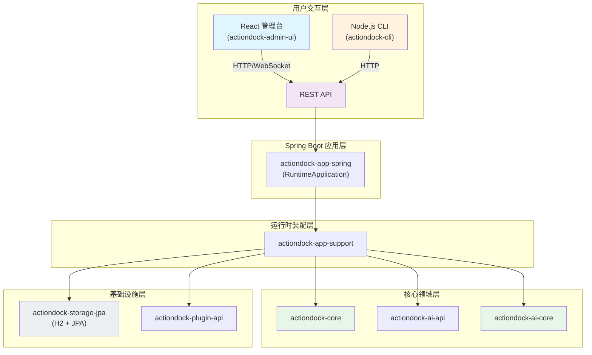
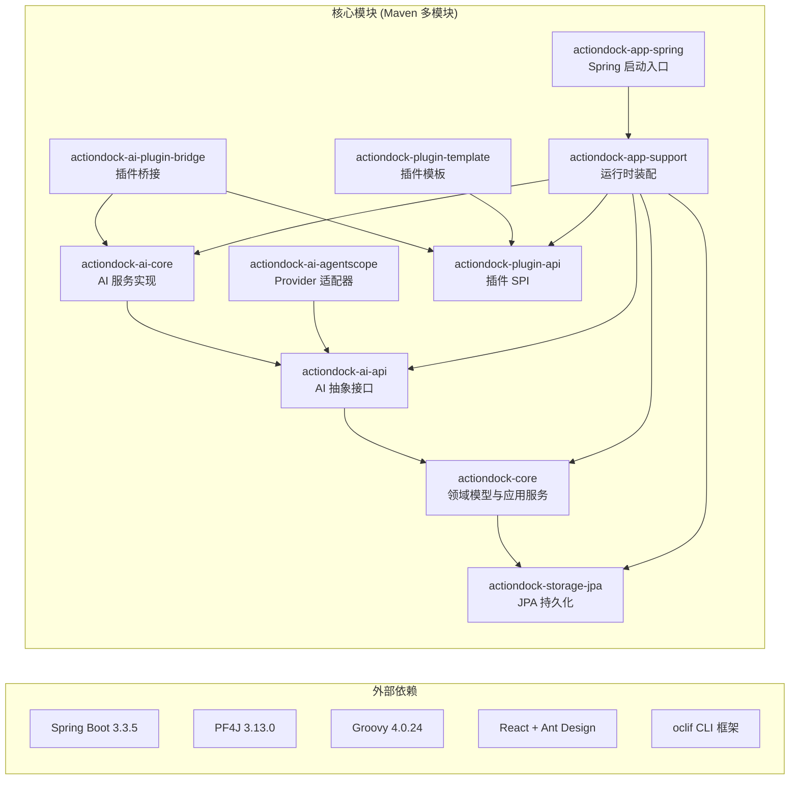
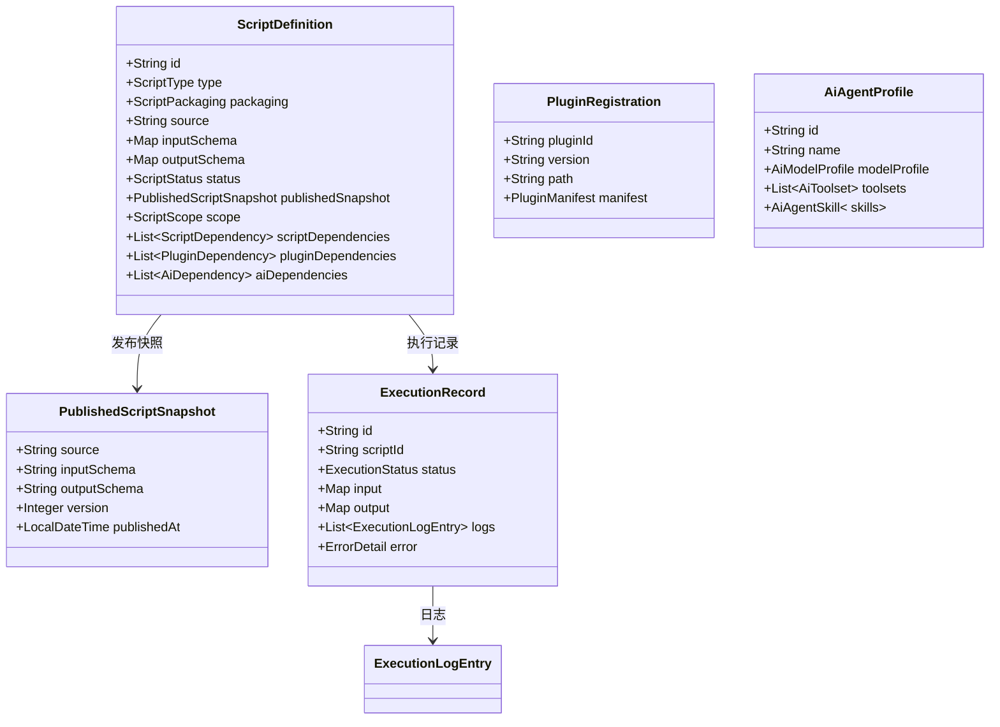
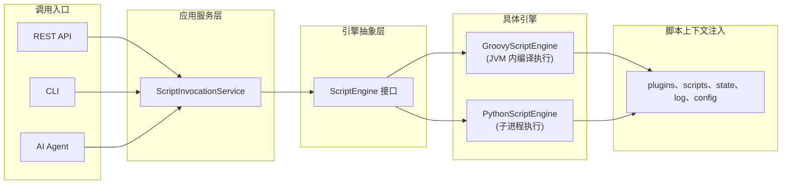
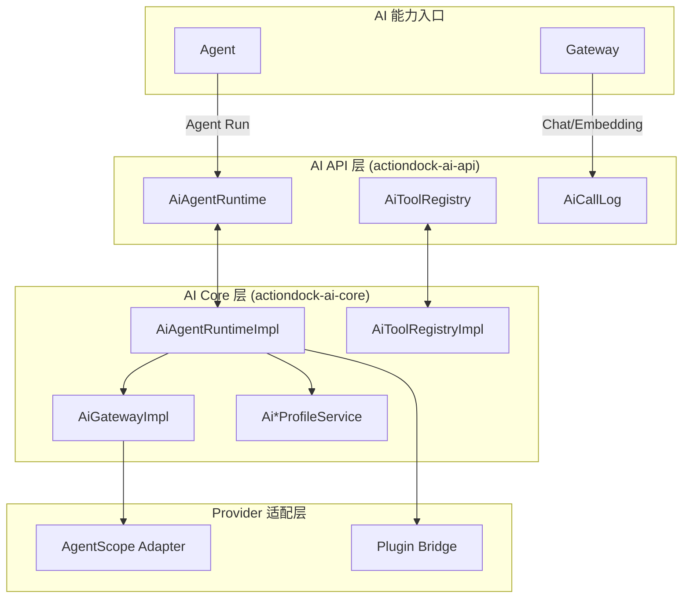
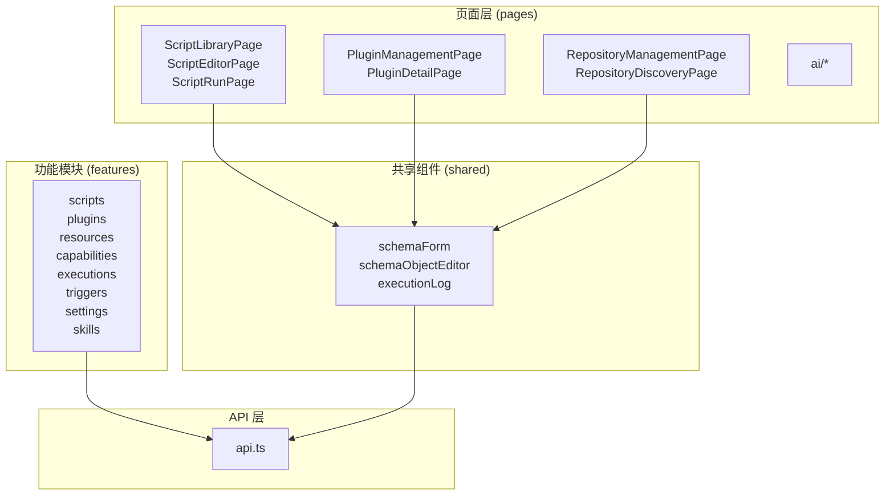
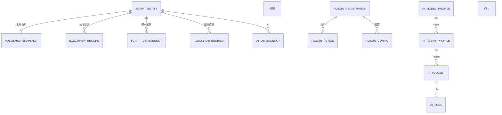
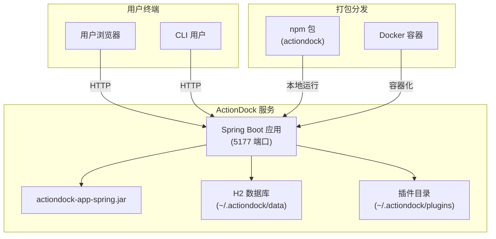

ActionDock 采用**分层模块化架构**，将脚本执行、AI 能力、插件扩展和 Web 界面解耦为独立模块，通过清晰的接口定义实现模块间松耦合协作。项目基于 **Spring Boot 3.3.5** 和 **Java 21** 构建，前端使用 **React + TypeScript + Vite** 技术栈，CLI 采用 **Node.js + oclif** 框架。

Sources: [pom.xml](pom.xml#L1-L52) | [CLAUDE.md](CLAUDE.md#L1-L8)

---

## 系统架构总览



Sources: [actiondock-app-spring/src/main/java/org/team4u/actiondock/RuntimeApplication.java](actiondock-app-spring/src/main/java/org/team4u/actiondock/RuntimeApplication.java#L1-L59)

---

## 模块依赖关系



Sources: [pom.xml](pom.xml#L24-L38)

---

## 模块职责矩阵

| 模块 | 编程语言 | 职责范围 | 关键组件 |
|------|---------|---------|---------|
| **actiondock-core** | Java | 核心领域模型与应用服务，不依赖具体实现 | `ScriptApplicationService`、`ExecutionApplicationService`、领域实体、仓储接口 |
| **actiondock-ai-api** | Java | AI 领域抽象接口定义 | `AiGateway`、`AiAgentRuntime`、`AiToolRegistry` |
| **actiondock-ai-core** | Java | AI 服务实现与编排逻辑 | `AiModelProfileService`、`AiAgentRuntimeImpl`、`AiToolRegistryImpl` |
| **actiondock-ai-agentscope** | Java | AgentScope Provider 适配器 | `AgentScopeAiProviderClient`、`AgentScopeBuiltinAiTools` |
| **actiondock-ai-plugin-bridge** | Java | AI 与插件系统的桥接 | `ActionDockAiSystemPlugin` |
| **actiondock-plugin-api** | Java | PF4J 插件 SPI 定义 | `ActionDockPlugin`、`PluginManifest` |
| **actiondock-plugin-template** | Java | 插件开发模板 | 最小可运行插件示例 |
| **actiondock-storage-jpa** | Java | JPA 持久化适配层 | `SpringData*Repository`、Entity 映射 |
| **actiondock-app-support** | Java | 运行时装配与脚本引擎 | `GroovyScriptEngine`、`PythonScriptEngine`、`PluginRuntimeService` |
| **actiondock-app-spring** | Java | Spring Boot 入口与 Web 层 | `RuntimeApplication`、REST Controller |
| **actiondock-admin-ui** | TypeScript/React | 管理控制台前端 | React 页面组件、Monaco Editor |
| **actiondock-cli** | TypeScript/Node.js | CLI 命令行工具 | oclif 命令、服务管理 |

Sources: [actiondock-core/README.md](actiondock-core/README.md#L1-L84) | [actiondock-ai-api/README.md](actiondock-ai-api/README.md#L1-L40) | [actiondock-admin-ui/README.md](actiondock-admin-ui/README.md#L1-L67)

---

## 核心领域模型



Sources: [actiondock-core/src/main/java/org/team4u/actiondock/domain/model/ScriptDefinition.java](actiondock-core/src/main/java/org/team4u/actiondock/domain/model/ScriptDefinition.java#L1-L200)

---

## 脚本执行架构

脚本引擎采用**端口与适配器模式**，通过 `ScriptEngine` 接口抽象不同脚本语言的执行能力：



Sources: [actiondock-core/src/main/java/org/team4u/actiondock/domain/port/ScriptEngine.java](actiondock-core/src/main/java/org/team4u/actiondock/domain/port/ScriptEngine.java#L1-L41) | [actiondock-app-support/README.md](actiondock-app-support/README.md#L1-L294)

---

## 插件系统架构

基于 **PF4J (Plugin Framework for Java)** 实现动态插件加载：

```mermaid
graph TB
    subgraph "主应用 (Host)"
        PLUGIN_RT["PluginRuntimeService"]
        ENG["ScriptEngine"]
    end
    
    subgraph "插件 API 层 (actiondock-plugin-api)"
        PLUGIN_IF["ActionDockPlugin 接口"]
        MANIFEST["PluginManifest"]
    end
    
    subgraph "插件 (Plugins)"
        PLUGIN_A["Plugin A<br/>(JAR)"]
        PLUGIN_B["Plugin B<br/>(JAR)"]
    end
    
    subgraph "脚本调用"
        GR["Groovy 脚本"]
        PY["Python 脚本"]
    end
    
    PLUGIN_RT -->|加载/管理| PLUGIN_A
    PLUGIN_RT -->|加载/管理| PLUGIN_B
    PLUGIN_A -->|实现| PLUGIN_IF
    PLUGIN_B -->|实现| PLUGIN_IF
    PLUGIN_A -->|读取| MANIFEST
    PLUGIN_B -->|读取| MANIFEST
    ENG -->|plugins.invoke()| PLUGIN_RT
    GR -->|plugins.invoke()| ENG
    PY -->|plugins.invoke()| ENG
```

Sources: [actiondock-plugin-api/README.md](actiondock-plugin-api/README.md#L1-L46) | [actiondock-plugin-template/README.md](actiondock-plugin-template/README.md#L1-200)

---

## AI 能力架构



Sources: [actiondock-ai-core/README.md](actiondock-ai-core/README.md#L1-L33) | [actiondock-ai-api/README.md](actiondock-ai-api/README.md#L1-L40)

---

## 前端模块结构



Sources: [actiondock-admin-ui/src](actiondock-admin-ui/src#L1-200)

---

## 数据持久化



Sources: [actiondock-storage-jpa/README.md](actiondock-storage-jpa/README.md#L1-L40)

---

## 部署架构



Sources: [docker-compose.yml](docker-compose.yml#L1-L15) | [actiondock-app-spring/README.md](actiondock-app-spring/README.md#L1-L66)

---

## 技术栈汇总

| 层级 | 技术选型 | 版本 |
|------|---------|------|
| **后端框架** | Spring Boot | 3.3.5 |
| **编程语言** | Java | 21 |
| **脚本引擎** | Groovy / Python | 4.0.24 / 3.x |
| **插件系统** | PF4J | 3.13.0 |
| **持久化** | Spring Data JPA + H2 | - |
| **前端框架** | React | 18 |
| **UI 组件库** | Ant Design | 5 |
| **构建工具** | Vite | - |
| **CLI 框架** | oclif | - |
| **脚本语言** | TypeScript | - |

Sources: [pom.xml](pom.xml#L40-L45)

---

## 下一步阅读

- [项目概述](1-xiang-mu-gai-shu)：了解 ActionDock 解决的问题域
- [快速开始](2-kuai-su-kai-shi)：5 分钟上手体验
- [脚本生命周期管理](4-jiao-ben-sheng-ming-zhou-qi-guan-li)：深入了解脚本的草稿、发布流程
- [插件开发指南](7-cha-jian-kai-fa-zhi-nan)：学习如何开发自定义插件