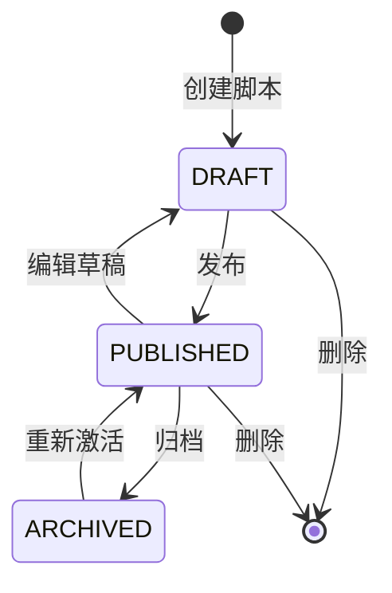
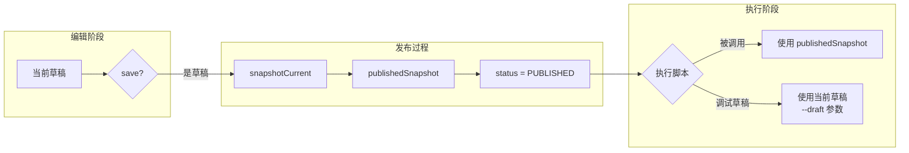
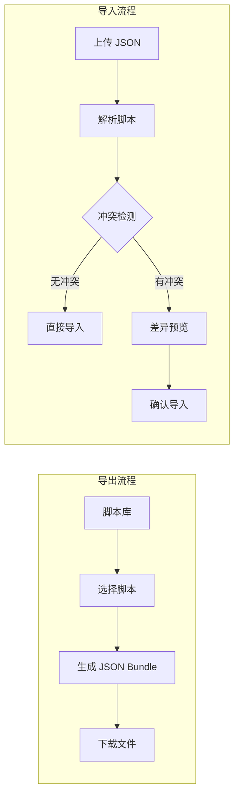
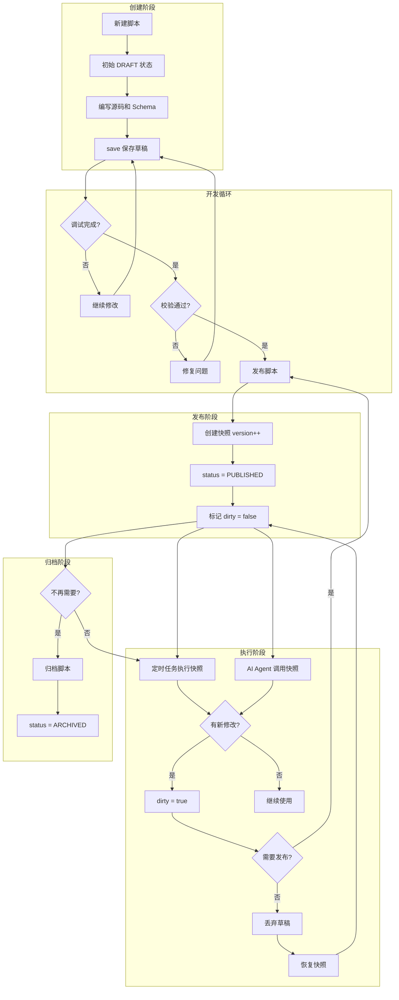

脚本是 ActionDock 的核心资产单位。与普通代码文件不同，脚本带有输入/输出 Schema 定义、发布快照、依赖声明等元数据，通过完整的生命周期状态机管理其从创建到归档的全过程。

## 生命周期状态机

脚本状态由 `ScriptStatus` 枚举定义，包含三种核心状态。



| 状态 | 说明 | 可编辑 | 可执行 | 典型场景 |
|------|------|--------|--------|----------|
| **DRAFT** | 草稿状态，脚本正在开发中 | ✓ | ✗ | 编写新脚本、迭代修改 |
| **PUBLISHED** | 已发布状态，内容已冻结 | ✗ | ✓ | 生产环境使用、定时任务执行 |
| **ARCHIVED** | 归档状态，不再维护 | ✗ | ✗ | 历史脚本保留、废弃脚本 |

在 `ScriptDefinition.java` 中，状态转换由以下方法控制：

```java
// 草稿 → 已发布
public ScriptDefinition publish() {
    if (status == ScriptStatus.ARCHIVED) {
        throw new IllegalStateException("已归档脚本不能发布: " + id);
    }
    this.publishedSnapshot = snapshotCurrent();
    this.status = ScriptStatus.PUBLISHED;
    this.version = version + 1;  // 版本号自动递增
    sourceMetadata.setDirty(false);
    return this;
}

// 已发布 → 草稿（编辑后）
// 通过 save() 方法中的 normalizePublicationState() 自动维护

// 丢弃草稿，恢复快照
ScriptDefinition revertToPublished() {
    PublishedScriptSnapshot snapshot = getStoredSnapshot();
    snapshot.applyTo(this);
    this.status = ScriptStatus.PUBLISHED;
    sourceMetadata.setDirty(false);
    return this;
}
```

Sources: [ScriptDefinition.java](actiondock-core/src/main/java/org/team4u/actiondock/domain/model/ScriptDefinition.java#L445-L470)

## 发布快照机制

发布快照（`PublishedScriptSnapshot`）是脚本生命周期管理的核心设计。它确保已发布版本不可变，同时允许草稿与发布版本共存。



快照包含脚本的核心内容：

```java
public PublishedScriptSnapshot snapshotCurrent() {
    return new PublishedScriptSnapshot()
            .setName(name)
            .setType(type)
            .setPackaging(packaging)
            .setSource(source)
            .setPythonRequirements(pythonRequirements)
            .setInputSchema(inputSchema)
            .setOutputSchema(outputSchema)
            .setScriptDependencies(scriptDependencies)
            .setAiDependencies(aiDependencies);
}
```

Sources: [ScriptDefinition.java](actiondock-core/src/main/java/org/team4u/actiondock/domain/model/ScriptDefinition.java#L325-L336)

快照数据模型定义如下：

| 快照字段 | 说明 |
|----------|------|
| `name` | 脚本名称 |
| `type` | 脚本类型 (GROOVY/PYTHON) |
| `packaging` | 打包类型 (TOOL/FLOW) |
| `source` | 脚本源码 |
| `pythonRequirements` | Python 依赖声明 |
| `inputSchema` | 输入参数模式 |
| `outputSchema` | 输出结果模式 |
| `scriptDependencies` | 脚本依赖列表 |
| `aiDependencies` | AI 能力依赖列表 |

Sources: [PublishedScriptSnapshot.java](actiondock-core/src/main/java/org/team4u/actiondock/domain/model/PublishedScriptSnapshot.java#L18-L27)

## 脚本作用域

脚本作用域（`ScriptScope`）定义了脚本的来源和生命周期管理方式。

```java
public enum ScriptScope {
    PERSONAL,    // 个人创建和维护
    REPOSITORY,  // 从仓库安装，只读
    FORK,        // Fork 自仓库脚本
    DEVELOPMENT, // 开发同步脚本
    SAMPLE       // 示例脚本
}
```

Sources: [ScriptScope.java](actiondock-core/src/main/java/org/team4u/actiondock/domain/model/ScriptScope.java#L1-L14)

| 作用域 | 可编辑 | 可发布 | 生命周期特点 |
|--------|--------|--------|--------------|
| **PERSONAL** | ✓ | ✓ | 完全由用户管理 |
| **REPOSITORY** | ✗ | ✗ | 仓库托管，只读，需 Fork 后编辑 |
| **FORK** | ✓ | ✓ | 独立于源仓库 |
| **DEVELOPMENT** | ✓ | ✓ | 与本地开发目录同步 |
| **SAMPLE** | ✓ | ✓ | 系统示例 |

仓库脚本的只读保护机制：

```java
private static void ensureEditable(ScriptDefinition definition) {
    if (!definition.isEditable()) {
        throw new IllegalArgumentException("仓库工具为只读，请先 Fork");
    }
}
```

Sources: [ScriptApplicationService.java](actiondock-core/src/main/java/org/team4u/actiondock/application/ScriptApplicationService.java#L223-L227)

## 生命周期操作

### 创建脚本

新建脚本时自动初始化为草稿状态：

```java
public ScriptDefinition save(ScriptDefinition definition) {
    LocalDateTime now = LocalDateTime.now();
    ScriptDefinition existing = definition.getId() == null ? null 
        : scriptRepository.findById(definition.getId()).orElse(null);
    
    if (existing == null) {
        definition.setCreatedAt(now);
        if (definition.getVersion() == null) {
            definition.setVersion(1);  // 初始版本为 1
        }
        if (definition.getStatus() == null) {
            definition.setStatus(ScriptStatus.DRAFT);  // 默认草稿状态
        }
        // ...
    }
    definition.normalizePublicationState();
    definition.setUpdatedAt(now);
    return scriptRepository.save(definition);
}
```

Sources: [ScriptApplicationService.java](actiondock-core/src/main/java/org/team4u/actiondock/application/ScriptApplicationService.java#L50-L75)

### 发布脚本

发布过程包括快照创建、版本递增和脏标记清除：

```java
public ScriptDefinition publish(String id) {
    ScriptDefinition definition = get(id);
    definition.publish();  // 创建快照，设置状态为 PUBLISHED
    definition.setUpdatedAt(LocalDateTime.now());
    return scriptRepository.save(definition);
}
```

Sources: [ScriptApplicationService.java](actiondock-core/src/main/java/org/team4u/actiondock/application/ScriptApplicationService.java#L155-L160)

### 丢弃草稿

恢复至上一次发布状态：

```java
public ScriptDefinition discardDraft(String id) {
    ScriptDefinition published = getPublished(id);
    published.setUpdatedAt(LocalDateTime.now());
    return scriptRepository.save(published);
}
```

Sources: [ScriptApplicationService.java](actiondock-core/src/main/java/org/team4u/actiondock/application/ScriptApplicationService.java#L171-L175)

### 删除脚本

删除脚本及其关联的定时调度配置：

```java
public void delete(String id) {
    ensureEditable(get(id));
    scriptScheduleRepository.deleteByScriptId(id);  // 先删除调度
    scriptRepository.deleteById(id);                // 再删除脚本
}
```

Sources: [ScriptApplicationService.java](actiondock-core/src/main/java/org/team4u/actiondock/application/ScriptApplicationService.java#L127-L131)

### Fork 仓库脚本

将只读仓库脚本转换为可编辑的个人脚本：

```java
public ScriptDefinition createFork(String id, String targetId, String targetName) {
    ScriptDefinition source = get(id);
    if (source.getScope() != ScriptScope.REPOSITORY) {
        throw new IllegalArgumentException("仅支持从仓库工具创建 Fork");
    }
    // ...
    ScriptDefinition fork = sourceSnapshot == null ? source.fullCopy() 
        : source.toPublishedDefinition();
    fork.setId(normalizedId)
            .setName(targetName)
            .setStatus(ScriptStatus.DRAFT)
            .setScope(ScriptScope.FORK)
            .setEditable(true);
    return save(fork);
}
```

Sources: [ScriptApplicationService.java](actiondock-core/src/main/java/org/team4u/actiondock/application/ScriptApplicationService.java#L177-L203)

## 草稿变更检测

系统通过 `hasUnpublishedChanges` 标志和快照比较实现草稿变更检测：

```java
public boolean getHasUnpublishedChanges() {
    PublishedScriptSnapshot snapshot = getStoredSnapshot();
    return snapshot != null && !snapshot.equals(snapshotCurrent());
}
```

Sources: [ScriptDefinition.java](actiondock-core/src/main/java/org/team4u/actiondock/domain/model/ScriptDefinition.java#L345-L348)

在 UI 层面显示草稿状态标签：

```typescript
const hasUnpublishedChanges = Boolean(
    currentScript?.status === "PUBLISHED" && currentScript.hasUnpublishedChanges
);
// 渲染：有草稿 标签
{record.hasUnpublishedChanges ? <Tag color="gold">有草稿</Tag> : null}
```

Sources: [ScriptLibraryPage.tsx](actiondock-admin-ui/src/features/capabilities/pages/ScriptLibraryPage.tsx#L591)

## 脚本依赖管理

脚本可以声明三类依赖，这些依赖在发布快照中被一起保存：

| 依赖类型 | 说明 | 生命周期特点 |
|----------|------|--------------|
| **脚本依赖** | 引用其他已发布脚本 | 执行时解析，支持版本范围 |
| **插件依赖** | 声明所需插件及 Action | 运行时注入 |
| **AI 依赖** | 声明所需 AI 能力 | 影响 AI Agent 工具集生成 |

```java
private List<ScriptDependency> scriptDependencies = new ArrayList<>();
private List<PluginDependency> pluginDependencies = new ArrayList<>();
private List<AiDependency> aiDependencies = new ArrayList<>();
```

Sources: [ScriptDefinition.java](actiondock-core/src/main/java/org/team4u/actiondock/domain/model/ScriptDefinition.java#L38-L40)

## CLI 操作接口

通过命令行可以对脚本执行生命周期操作：

```bash
# 创建脚本（默认草稿状态）
actiondock script:create \
    --script-id my-script \
    --name "我的脚本" \
    --type groovy \
    --source-file script.groovy

# 发布脚本
actiondock script:publish my-script

# 丢弃草稿
actiondock script:discard-draft my-script

# 校验脚本语法
actiondock script:validate my-script

# 列出所有脚本
actiondock script:list
```

Sources: [publish.ts](actiondock-cli/src/commands/script/publish.ts#L1-L46)
Sources: [discard-draft.ts](actiondock-cli/src/commands/script/discard-draft.ts#L1-L46)
Sources: [create.ts](actiondock-cli/src/commands/script/create.ts#L1-L110)

## 导入导出与迁移

系统支持脚本的 JSON 格式导出和导入，用于备份和迁移：



导入时自动处理 ID 冲突：

```typescript
const analysis = analyzeScriptImport(importedScripts, editableScripts);
// analysis.createIds - 新建脚本
// analysis.overwriteIds - 覆盖已有脚本
```

Sources: [ScriptLibraryPage.tsx](actiondock-admin-ui/src/features/capabilities/pages/ScriptLibraryPage.tsx#L259-L308)

## 定时任务与生命周期

脚本被定时任务引用时，定时任务始终执行已发布版本（`publishedSnapshot`），确保执行行为可预测：

```java
public ScriptDefinition toPublishedDefinition() {
    PublishedScriptSnapshot snapshot = resolveEffectiveSnapshot();
    if (snapshot == null) {
        throw new IllegalStateException("脚本尚未发布: " + id);
    }
    ScriptDefinition definition = new ScriptDefinition()
            .setStatus(ScriptStatus.PUBLISHED)
            .setVersion(version)
            .setPublishedSnapshot(snapshot);
    snapshot.applyTo(definition);
    return copyMetadataTo(definition);
}
```

Sources: [ScriptDefinition.java](actiondock-core/src/main/java/org/team4u/actiondock/domain/model/ScriptDefinition.java#L380-L392)

## 完整生命周期流程图



## 下一步

- [脚本执行与调试](5-jiao-ben-zhi-xing-yu-diao-shi) - 了解如何运行和调试脚本
- [脚本依赖与调用](6-jiao-ben-yi-lai-yu-diao-yong) - 深入了解脚本间的调用关系
- [定时任务管理](11-ding-shi-ren-wu-guan-li) - 了解脚本与定时任务的集成