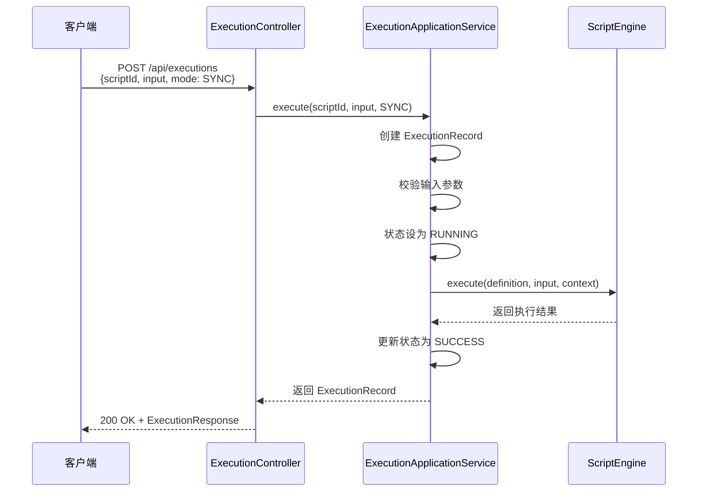
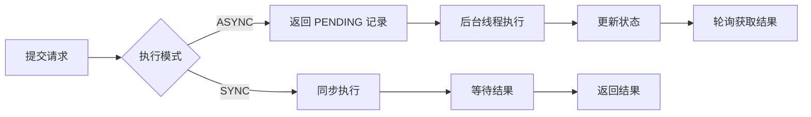
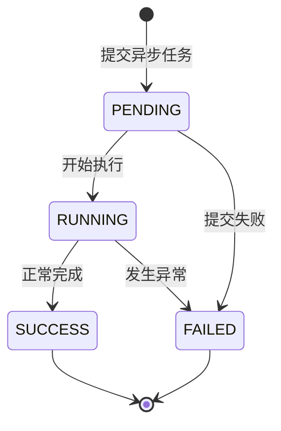
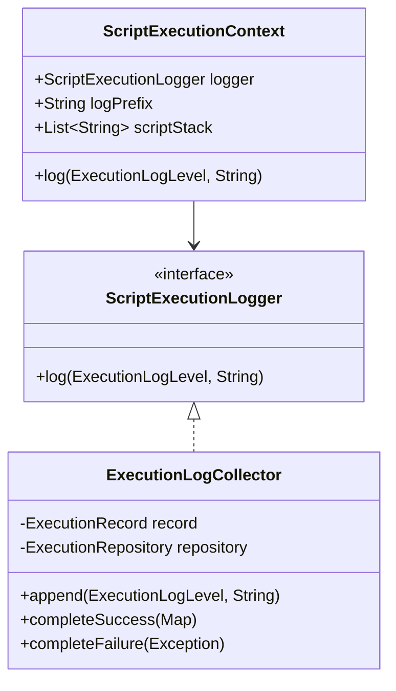
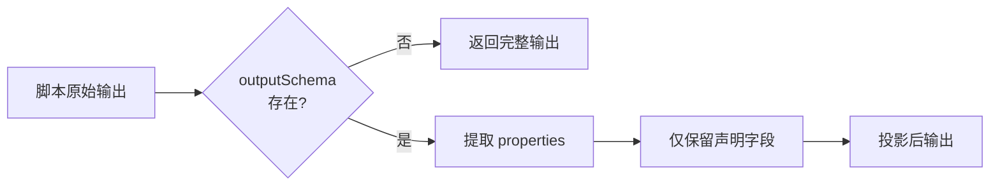

脚本执行与调试是 ActionDock 核心功能模块，涵盖从执行提交到结果返回的完整生命周期管理。本文档详细介绍执行模式、触发来源、状态流转、调试手段以及 CLI 和 REST API 的使用方法。

## 执行架构概述

脚本执行采用分层架构设计，核心组件包括执行应用服务、脚本引擎端口、执行记录模型和日志收集器。

```mermaid
flowchart TB
    subgraph Client["客户端层"]
        CLI[CLI Command<br/>script:run]
        REST[REST API<br/>POST /api/scripts/{id}/execute]
    end
    
    subgraph Application["应用服务层"]
        EAS[ExecutionApplicationService<br/>执行应用服务]
        SAS[ScriptApplicationService<br/>脚本应用服务]
        EL[ExecutionLogCollector<br/>日志收集器]
    end
    
    subgraph Domain["领域模型层"]
        ER[ExecutionRecord<br/>执行记录]
        SC[ScriptExecutionContext<br/>执行上下文]
        SE[ScriptEngine<br/>脚本引擎接口]
    end
    
    subgraph Infrastructure["基础设施层"]
        Repo[ExecutionRepository<br/>执行仓储]
        Engine[GroovyEngine / PythonEngine<br/>脚本引擎实现]
    end
    
    Client --> EAS
    CLI -->|executeScript| EAS
    REST -->|executePublished| EAS
    EAS --> SAS
    EAS --> EL
    EAS --> ER
    EAS --> SC
    SC --> SE
    SE --> Engine
    EL --> Repo
    ER --> Repo

```

执行流程的核心特征如下：**同步模式**下，客户端阻塞等待脚本执行完成并接收完整结果；**异步模式**下，客户端立即收到执行记录 ID，可通过轮询查询执行状态。

Sources: [ExecutionApplicationService.java](actiondock-core/src/main/java/org/team4u/actiondock/application/ExecutionApplicationService.java#L1-L50)
Sources: [ScriptEngine.java](actiondock-core/src/main/java/org/team4u/actiondock/domain/port/ScriptEngine.java#L1-L41)

## 执行模式与提交方式

### 同步执行（SYNC）

同步模式是默认的执行模式，适用于短时任务和需要立即获取结果的场景。执行流程如下：客户端提交执行请求后阻塞，直到脚本执行完成并返回结果。



同步执行的核心代码位于 `ExecutionApplicationService.execute()` 方法，当 `submitMode` 为 `SYNC` 时，直接调用 `run()` 方法执行脚本并返回结果。

Sources: [ExecutionApplicationService.java](actiondock-core/src/main/java/org/team4u/actiondock/application/ExecutionApplicationService.java#L130-L160)

### 异步执行（ASYNC）

异步模式适用于长时间运行的任务或需要并发处理的场景。提交后立即返回 `PENDING` 状态的执行记录，脚本在后台线程池中执行。



异步执行的关键实现：当 `submitMode` 为 `ASYNC` 时，先将记录状态设为 `PENDING` 并保存到仓储，然后通过 `executor.execute()` 将实际执行任务提交到线程池。

Sources: [ExecutionApplicationService.java](actiondock-core/src/main/java/org/team4u/actiondock/application/ExecutionApplicationService.java#L138-L144)

## 执行状态生命周期

执行记录（`ExecutionRecord`）贯穿脚本执行的完整生命周期，状态枚举定义如下：

| 状态 | 含义 | 可删除性 |
|------|------|----------|
| `PENDING` | 等待执行，任务已提交但尚未开始 | 不可删除 |
| `RUNNING` | 正在执行，脚本运行中 | 不可删除 |
| `SUCCESS` | 执行成功，脚本正常完成 | 可删除 |
| `FAILED` | 执行失败，发生错误 | 可删除 |



状态转换的线程安全性通过 `ExecutionLogCollector` 内部持有的 `monitor` 对象保证，所有状态更新和日志追加操作都在同步块内执行。

Sources: [ExecutionStatus.java](actiondock-core/src/main/java/org/team4u/actiondock/domain/model/ExecutionStatus.java#L1-L18)
Sources: [ExecutionLogCollector.java](actiondock-core/src/main/java/org/team4u/actiondock/application/ExecutionLogCollector.java#L20-L35)

## 触发来源

`ExecutionTriggerSource` 枚举定义脚本执行的不同触发方式：

| 来源 | 枚举值 | 典型场景 |
|------|--------|----------|
| 手动触发 | `MANUAL` | 用户通过 CLI、API 或 UI 手动执行 |
| 定时调度 | `SCHEDULED` | 通过 Cron 表达式配置的定时任务触发 |
| AI 工具调用 | `AI_TOOL` | AI Agent 通过 Toolset 调用脚本 |
| 事件驱动 | `EVENT` | 事件触发器匹配并执行脚本 |

触发来源在执行记录中持久化，支持后续的执行统计和审计追溯。定时调度场景下会同时记录关联的 `scheduleId`，便于追踪调度与执行的对应关系。

Sources: [ExecutionTriggerSource.java](actiondock-core/src/main/java/org/team4u/actiondock/domain/model/ExecutionTriggerSource.java#L1-L14)
Sources: [ExecutionSubmissionMetadata.java](actiondock-core/src/main/java/org/team4u/actiondock/domain/model/ExecutionSubmissionMetadata.java#L1-L92)

## 执行记录数据结构

`ExecutionRecord` 是执行过程的核心数据模型，包含执行的完整轨迹信息：

```java
public class ExecutionRecord {
    private String id;                          // 执行记录唯一ID
    private String scriptId;                    // 关联脚本ID
    private ExecutionStatus status;             // 当前状态
    private SubmitMode submitMode;              // 提交模式
    private ExecutionTriggerSource triggerSource; // 触发来源
    
    // 关联上下文
    private String scheduleId;                   // 调度ID（定时触发时）
    private String agentRunId;                  // AI运行ID
    private String agentStepId;                // AI步骤ID
    private String eventSourceId;              // 事件源ID
    private String eventTriggerId;              // 事件触发器ID
    private String eventRecordId;              // 事件记录ID
    private String eventDispatchId;            // 事件分发ID
    
    // 输入输出
    private Map<String, Object> input;         // 输入参数
    private Map<String, Object> output;        // 输出结果
    private List<ExecutionLogEntry> logs;      // 执行日志
    
    // 错误信息
    private String errorMessage;                // 错误摘要
    private ErrorDetail errorDetail;           // 错误详情
    
    // 时间戳
    private LocalDateTime createdAt;           // 创建时间
    private LocalDateTime startedAt;           // 开始时间
    private LocalDateTime finishedAt;          // 结束时间
}
```

执行记录支持不可变的输入输出视图访问（`getInput()`、`getOutput()`），确保数据在执行过程中不会被意外修改。

Sources: [ExecutionRecord.java](actiondock-core/src/main/java/org/team4u/actiondock/domain/model/ExecutionRecord.java#L1-L200)

## 执行日志系统

### 日志级别

执行日志采用四级日志体系，与标准日志框架对齐：

| 级别 | 枚举值 | 使用场景 |
|------|--------|----------|
| 调试 | `DEBUG` | 详细的执行步骤信息 |
| 信息 | `INFO` | 常规执行状态信息 |
| 警告 | `WARN` | 潜在问题但不影响执行 |
| 错误 | `ERROR` | 执行过程中的异常信息 |



脚本内通过执行上下文记录日志，日志自动携带脚本调用栈前缀，便于区分嵌套脚本的日志来源。

Sources: [ExecutionLogLevel.java](actiondock-core/src/main/java/org/team4u/actiondock/domain/model/ExecutionLogLevel.java#L1-L14)
Sources: [ScriptExecutionContext.java](actiondock-core/src/main/java/org/team4u/actiondock/domain/model/ScriptExecutionContext.java#L70-L90)

### 日志收集机制

`ExecutionLogCollector` 采用线程安全的设计，在脚本执行过程中实时收集日志：

```java
void append(ExecutionLogLevel level, String message) {
    synchronized (monitor) {
        record.addLog(new ExecutionLogEntry()
                .setLevel(level)
                .setMessage(message)
                .setCreatedAt(LocalDateTime.now()));
        executionRepository.save(record);
    }
}
```

每条日志追加后立即持久化到仓储，确保即使发生崩溃也能保留已记录的日志。日志收集器在脚本执行完成后负责将记录状态更新为 `SUCCESS` 或 `FAILED`。

Sources: [ExecutionLogCollector.java](actiondock-core/src/main/java/org/team4u/actiondock/application/ExecutionLogCollector.java#L26-L42)

## 错误处理机制

### 结构化错误信息

执行失败时，系统捕获异常并构建结构化的错误详情：

```java
ExecutionRecord completeFailure(Exception exception) {
    if (exception instanceof StructuredExecutionException structuredException) {
        return completeFailure(
                structuredException.getMessage(),
                structuredException.getDetail()
        );
    }
    return completeFailure(
            ErrorDetailSupport.summarize(exception),    // 摘要
            ErrorDetailSupport.describe(exception)      // 完整详情
    );
}
```

`ErrorDetail` 包含异常类型全限定名和完整堆栈跟踪，便于定位问题根因。

Sources: [ExecutionLogCollector.java](actiondock-core/src/main/java/org/team4u/actiondock/application/ExecutionLogCollector.java#L44-L60)
Sources: [ErrorDetailSupport.java](actiondock-core/src/main/java/org/team4u/actiondock/application/ErrorDetailSupport.java#L1-L60)

### 错误摘要与详情分离

```java
public class ErrorDetail {
    private String type;           // 异常类全限定名
    private String stackTrace;     // 完整堆栈跟踪
    private Map<String, Object> details;  // 附加上下文
}
```

API 响应中，`errorMessage` 字段包含人类可读的错误摘要，适合日志和监控告警；`errorDetail` 字段包含完整的技术信息，适合调试和问题排查。

Sources: [ErrorDetail.java](actiondock-core/src/main/java/org/team4u/actiondock/domain/model/ErrorDetail.java#L1-L43)

## 调试模式与响应视图

执行 API 支持两种响应视图模式：

| 视图模式 | 枚举值 | 响应内容 |
|----------|--------|----------|
| 结果模式 | `RESULT` | 仅包含投影后的输出 |
| 调试模式 | `DEBUG` | 包含原始输入、原始输出和完整日志 |

调试模式特别适用于开发测试阶段，可查看脚本收到的原始输入参数和未经投影的完整输出结果。

```java
ExecutionResponse.DebugPayload debugPayload = responseView == ExecutionResponseView.DEBUG
    ? new ExecutionResponse.DebugPayload(copy(record.getInput()), rawOutput)
    : null;
```

Sources: [ExecutionResponseView.java](actiondock-app-spring/src/main/java/org/team4u/actiondock/web/ExecutionResponseView.java#L1-L12)
Sources: [ExecutionResponseMapper.java](actiondock-app-spring/src/main/java/org/team4u/actiondock/web/ExecutionResponseMapper.java#L30-L45)

## 输入规范化与校验

### 参数归一化

`ExecutionInputNormalizer` 递归处理输入参数，确保数据类型一致性：

- 将 `CharSequence`（非 `String`）类型统一转换为 `String`
- 递归处理嵌套的 `Map` 和 `List` 结构
- 键名强制转换为 `String`

这解决了 Groovy 脚本运行时 `GString` 类型与 JSON Schema 严格校验之间的兼容性问题。

Sources: [ExecutionInputNormalizer.java](actiondock-core/src/main/java/org/team4u/actiondock/application/ExecutionInputNormalizer.java#L1-L47)

### Schema 校验

`ScriptSchemaSupport.validateInput()` 在执行前校验输入参数：

- 必填字段检查
- 类型匹配验证
- 格式约束验证（如日期、邮箱格式）

校验失败时抛出 `InvalidExecutionInputException`，阻止脚本执行并返回字段级错误详情。

## CLI 命令行接口

### 执行脚本

```bash
actiondock script run <scriptId> [OPTIONS]
```

**核心参数：**

| 参数 | 描述 |
|------|------|
| `<scriptId>` | 要执行的脚本 ID |

**可用选项：**

| 选项 | 说明 | 默认值 |
|------|------|--------|
| `--draft` | 执行草稿版本而非已发布版本 | `false` |
| `--mode <mode>` | 执行模式：`sync` 或 `async` | `sync` |
| `--response-view <view>` | 响应视图：`result` 或 `debug` | `result` |
| `--input-json <json>` | JSON 格式的输入参数 | - |
| `--input-file <path>` | 包含输入参数的 JSON 文件路径 | - |
| `--server <url>` | 覆盖服务器 URL | - |
| `--token <token>` | 覆盖认证令牌 | - |

**执行示例：**

```bash
# 同步执行已发布脚本
actiondock script run my-script --name "Alice" --count 5

# 异步执行并获取执行ID
actiondock script run my-script --mode async --input-json '{"items": [1,2,3]}'

# 调试模式执行，查看完整日志
actiondock script run my-script --response-view debug --json
```

Sources: [run.ts](actiondock-cli/src/commands/script/run.ts#L1-L85)

### 查询执行记录

```bash
# 查看单个执行记录
actiondock execution get <executionId>

# 列出脚本的所有执行记录
actiondock execution list --script-id <scriptId>

# 列出调度触发的所有执行记录
actiondock execution list --schedule-id <scheduleId>
```

Sources: [execution/get.ts](actiondock-cli/src/commands/execution/get.ts#L1-L47)
Sources: [execution/list.ts](actiondock-cli/src/commands/execution/list.ts#L1-L57)

### 管理执行记录

```bash
# 删除单个执行记录
actiondock execution delete <executionId>

# 清空脚本的所有执行记录
actiondock execution clear --script-id <scriptId>

# 清空所有执行记录
actiondock execution clear
```

**删除约束：** 仅允许删除已完成（`SUCCESS` 或 `FAILED`）的执行记录，运行中（`PENDING` 或 `RUNNING`）的记录无法删除。

Sources: [execution/delete.ts](actiondock-cli/src/commands/execution/delete.ts)
Sources: [execution/clear.ts](actiondock-cli/src/commands/execution/clear.ts)

## REST API 参考

### 执行已发布脚本

```
POST /api/scripts/{scriptId}/published/execute
```

**请求体：**

```json
{
  "input": { "name": "Alice", "count": 5 },
  "mode": "SYNC",
  "responseView": "RESULT"
}
```

**响应示例（成功）：**

```json
{
  "status": 200,
  "msg": "已受理",
  "data": {
    "id": "550e8400-e29b-41d4-a716-446655440000",
    "scriptId": "my-script",
    "status": "SUCCESS",
    "submitMode": "SYNC",
    "triggerSource": "MANUAL",
    "output": { "result": "Hello, Alice! You have 5 items." },
    "createdAt": "2024-01-15T10:30:00",
    "startedAt": "2024-01-15T10:30:00",
    "finishedAt": "2024-01-15T10:30:01"
  }
}
```

Sources: [ScriptController.java](actiondock-app-spring/src/main/java/org/team4u/actiondock/web/ScriptController.java#L200-L210)

### 查询执行记录

```
GET /api/executions/{executionId}
```

返回指定执行记录的完整信息，包括输入、输出、日志和错误详情。

Sources: [ExecutionController.java](actiondock-app-spring/src/main/java/org/team4u/actiondock/web/ExecutionController.java#L50-L60)

### 列出执行记录

```
GET /api/executions?scriptId={scriptId}
GET /api/executions?scheduleId={scheduleId}
```

支持按脚本 ID 或调度 ID 筛选执行记录列表。

Sources: [ExecutionController.java](actiondock-app-spring/src/main/java/org/team4u/actiondock/web/ExecutionController.java#L65-L80)

## 执行输出投影

`ExecutionOutputProjector` 根据脚本定义的 `outputSchema` 对执行结果进行投影过滤：



如果脚本定义了 `outputSchema`，则仅返回其中 `properties` 声明的字段，实现输出字段的显式控制和隐藏内部实现细节。

Sources: [ExecutionOutputProjector.java](actiondock-core/src/main/java/org/team4u/actiondock/application/ExecutionOutputProjector.java#L1-L59)

## 最佳实践

### 选择合适的执行模式

- **同步模式**：适用于执行时间较短（< 30秒）、需要立即获取结果的场景
- **异步模式**：适用于执行时间长、需要并发处理或允许延迟感知的场景

### 调试脚本执行

1. **使用调试视图**：执行时添加 `--response-view debug` 参数，查看原始输入输出
2. **启用日志输出**：在脚本中使用日志 API 记录关键执行步骤
3. **检查执行记录**：使用 `execution get` 命令查看完整执行轨迹

### 错误排查清单

当脚本执行失败时，按以下顺序检查：

1. 查看 `errorMessage` 获取错误摘要
2. 查看 `errorDetail.stackTrace` 定位异常类型和位置
3. 检查 `input` 参数是否符合 schema 要求
4. 查看 `logs` 中的执行日志了解详细执行流程

---

**相关文档：**

- [脚本生命周期管理](4-jiao-ben-sheng-ming-zhou-qi-guan-li) - 了解脚本的草稿、发布和版本管理
- [脚本依赖与调用](6-jiao-ben-yi-lai-yu-diao-yong) - 了解脚本间的调用关系和依赖管理
- [定时任务管理](11-ding-shi-ren-wu-guan-li) - 了解如何配置定时触发脚本执行
- [CLI 命令参考](18-cli-ming-ling-can-kao) - CLI 完整命令文档