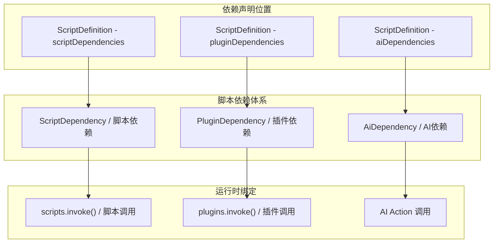
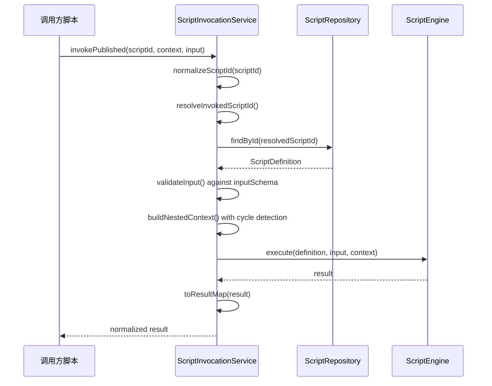

脚本依赖与调用是 ActionDock 中实现脚本模块化编排的核心机制。通过声明式依赖管理，脚本可以透明调用其他已发布脚本，实现能力复用和职责分离。

## 依赖类型概述

ActionDock 支持三种依赖类型，分别针对不同的集成场景。`ScriptDependency` 用于声明对其他脚本的依赖，`PluginDependency` 用于声明对系统插件的依赖，而 `AiDependency` 则用于声明对 AI 能力的需求。这些依赖信息在脚本发布时被快照固化，确保执行环境的一致性。



## 脚本依赖

### 依赖模型

脚本依赖由四个字段组成：`scriptId` 是被依赖脚本的标识符，`repositoryId` 和 `toolId` 指定依赖的仓库来源，`versionRange` 可选地声明版本约束。版本范围采用语义化版本格式，如 `>= 1.0.0`。

```java
// actiondock-core/src/main/java/org/team4u/actiondock/domain/model/ScriptDependency.java
public class ScriptDependency {
    private String scriptId;       // 被依赖脚本的 ID
    private String repositoryId;   // 仓库标识
    private String toolId;         // 仓库中的工具 ID
    private String versionRange;   // 版本约束，如 ">= 1.0.0"
}
```

Sources: [ScriptDependency.java](actiondock-core/src/main/java/org/team4u/actiondock/domain/model/ScriptDependency.java#L1-L79)

依赖声明存储在 `ScriptDefinition` 的 `scriptDependencies` 列表中，与脚本源码、输入输出模式共同构成完整的脚本资产定义。

```java
// actiondock-core/src/main/java/org/team4u/actiondock/domain/model/ScriptDefinition.java
public class ScriptDefinition {
    private List<ScriptDependency> scriptDependencies = new ArrayList<>();
    
    public List<ScriptDependency> getScriptDependencies() {
        return SchemaValueCopier.copyList(scriptDependencies, ScriptDependency::copy);
    }
}
```

Sources: [ScriptDefinition.java](actiondock-core/src/main/java/org/team4u/actiondock/domain/model/ScriptDefinition.java#L260-L265)

### 依赖提取

前端提供基于正则表达式的依赖自动提取功能。当用户编写 `scripts.invoke("target-script", [...])` 调用时，系统能够自动解析源码并生成对应的依赖声明。

```typescript
// actiondock-admin-ui/src/scriptDependencies.ts
const SCRIPT_INVOKE_PATTERN = /scripts\s*\.\s*invoke\s*\(\s*(["'`])([^"'`]+)\1/g;

export function extractScriptDependenciesFromSource(source: string): DetectedScriptDependency[] {
  if (!source.trim()) {
    return [];
  }

  const scriptIds = new Set<string>();
  let match: RegExpExecArray | null;

  while ((match = SCRIPT_INVOKE_PATTERN.exec(source)) !== null) {
    const scriptId = match[2].trim();
    if (scriptId) {
      scriptIds.add(scriptId);
    }
  }

  return [...scriptIds].map((scriptId) => ({ scriptId }));
}
```

Sources: [scriptDependencies.ts](actiondock-admin-ui/src/scriptDependencies.ts#L1-L27)

### 动态依赖检测

当脚本 ID 是变量而非字符串字面量时，系统会标记为动态依赖。这对于条件调用不同脚本的场景至关重要。

```typescript
export function hasDynamicScriptDependencies(source: string): boolean {
  if (!source.trim()) {
    return false;
  }
  const totalInvocations = [...source.matchAll(SCRIPT_INVOKE_ANY_PATTERN)].length;
  const literalInvocations = [...source.matchAll(SCRIPT_INVOKE_PATTERN)].length;
  return totalInvocations !== literalInvocations;
}
```

Sources: [scriptDependencies.ts](actiondock-admin-ui/src/scriptDependencies.ts#L31-L41)

### 自动仓库匹配

当脚本引用来自多个仓库的工具时，`autoMatchScriptDependency` 函数会根据用户偏好和可用性自动选择最优的仓库源。

```typescript
export function autoMatchScriptDependency(
  scriptId: string,
  repositories: Pick<RepositoryDefinition, "id">[],
  repositoryTools: Pick<RepositoryToolDescriptor, "repositoryId" | "toolId" | "version">[],
  preferredRepositoryId?: string
): ScriptDependency | undefined {
  const normalizedScriptId = scriptId.trim();
  if (!normalizedScriptId) {
    return undefined;
  }

  const repositoryIds = getPreferredRepositoryIds(repositories, preferredRepositoryId);
  for (const repositoryId of repositoryIds) {
    const matched = repositoryTools.find(
      (item) => item.repositoryId === repositoryId && item.toolId === normalizedScriptId
    );
    if (!matched) {
      continue;
    }
    return {
      scriptId: normalizedScriptId,
      repositoryId,
      toolId: matched.toolId,
      versionRange: matched.version ? `>= ${matched.version}` : undefined
    };
  }
  return undefined;
}
```

Sources: [scriptDependencies.ts](actiondock-admin-ui/src/scriptDependencies.ts#L62-L90)

## 插件依赖

### 依赖模型

插件依赖声明脚本所需的系统插件及其 Actions。`requiredActions` 字段精确列出调用时需要的动作名称，便于运行时权限校验。

```java
// actiondock-core/src/main/java/org/team4u/actiondock/domain/model/PluginDependency.java
public class PluginDependency {
    private String pluginId;           // 插件标识
    private String versionRange;        // 版本约束
    private List<String> requiredActions; // 所需 Actions 列表
}
```

Sources: [PluginDependency.java](actiondock-core/src/main/java/org/team4u/actiondock/domain/model/PluginDependency.java#L1-L50)

### 依赖提取

前端自动从 `plugins.invoke("plugin-id", "action-name", [...])` 调用中提取插件依赖。内置的 `actiondock-ai` 插件被排除在依赖分析之外，因为它是系统级内置能力。

```typescript
// actiondock-admin-ui/src/pluginDependencies.ts
const PLUGIN_INVOKE_PATTERN = /plugins\s*\.\s*invoke\s*\(\s*(["'`])([^"'`]+)\1\s*,\s*(["'`])([^"'`]+)\3/g;

export function extractPluginDependenciesFromSource(source: string, plugins: PluginView[]): PluginDependency[] {
  // ... 解析插件调用模式
  
  return [...actionsByPlugin.entries()].map(([pluginId, actions]) => {
    const version = versions.get(pluginId);
    return {
      pluginId,
      versionRange: version ? `>= ${version}` : undefined,
      requiredActions: [...actions]
    };
  });
}
```

Sources: [pluginDependencies.ts](actiondock-admin-ui/src/pluginDependencies.ts#L1-L40)

### 依赖解析策略

`resolveEffectivePluginDependencies` 函数采用三级回退策略：首先使用仓库工具描述符中的插件依赖，其次使用脚本自身的依赖声明，最后才从源码中提取。

```typescript
export function resolveEffectivePluginDependencies(
  script: ScriptDefinition,
  descriptor: RepositoryToolDescriptor | undefined,
  plugins: PluginView[]
): PluginDependency[] {
  if (descriptor?.pluginDependencies.length) {
    return descriptor.pluginDependencies;
  }

  if (script.pluginDependencies?.length) {
    return script.pluginDependencies;
  }

  return extractPluginDependenciesFromSource(script.source, plugins);
}
```

Sources: [pluginDependencies.ts](actiondock-admin-ui/src/pluginDependencies.ts#L43-L53)

## 脚本调用机制

### 调用服务架构

`ScriptInvocationService` 是脚本互调的核心服务，提供同步调用已发布脚本的能力。它处理脚本 ID 解析、输入校验、循环调用检测等关键逻辑。



Sources: [ScriptInvocationService.java](actiondock-core/src/main/java/org/team4u/actiondock/application/ScriptInvocationService.java#L1-L195)

### 循环调用检测

系统通过维护调用栈来检测循环调用。当检测到目标脚本 ID 已存在于调用栈中时，立即抛出异常并展示完整的调用链路。

```java
private static List<String> nextStack(ScriptDefinition callerDefinition,
                               ScriptExecutionContext parentContext,
                               String calleeScriptId) {
    List<String> stack = new ArrayList<>(parentContext == null ? List.of() : parentContext.getScriptStack());
    String callerScriptId = callerDefinition == null ? null : callerDefinition.getId();
    if (stack.isEmpty() && callerScriptId != null && !callerScriptId.isBlank()) {
        stack.add(callerScriptId);
    }
    if (stack.contains(calleeScriptId)) {
        List<String> cycle = new ArrayList<>(stack);
        cycle.add(calleeScriptId);
        throw new IllegalStateException("检测到脚本循环调用: " + String.join(" -> ", cycle));
    }
    stack.add(calleeScriptId);
    return List.copyOf(stack);
}
```

Sources: [ScriptInvocationService.java](actiondock-core/src/main/java/org/team4u/actiondock/application/ScriptInvocationService.java#L155-L175)

### 依赖驱动的脚本 ID 解析

调用目标脚本时，系统会优先使用声明的依赖信息来解析脚本 ID。这确保了跨仓库调用时的正确路由。

```java
private String resolveInvokedScriptId(String scriptId, ScriptDefinition callerDefinition) {
    if (callerDefinition == null) {
        return scriptId;
    }
    return callerDefinition.getScriptDependencies().stream()
            .filter(dependency -> scriptId.equals(dependency.getScriptId()))
            .findFirst()
            .map(dependency -> scriptRepository.findInstalledByRepositorySource(
                    dependency.getRepositoryId(),
                    dependency.getToolId()
            ).map(ScriptDefinition::getId).orElseGet(() -> defaultInstalledScriptId(
                    dependency.getRepositoryId(),
                    dependency.getToolId()
            )))
            .orElse(scriptId);
}
```

Sources: [ScriptInvocationService.java](actiondock-core/src/main/java/org/team4u/actiondock/application/ScriptInvocationService.java#L117-L132)

## 调用代码生成

### 脚本调用片段

前端提供语言感知的调用代码生成功能，自动适配 Groovy 和 Python 的语法差异。

```typescript
// actiondock-admin-ui/src/scriptInvocationSnippets.ts
export function buildScriptInvokeSnippet(
  language: ScriptType,
  scriptId: string,
  args: Record<string, unknown>
): string {
  if (isEmptyObject(args)) {
    return `scripts.invoke(${JSON.stringify(scriptId)})`;
  }
  return `scripts.invoke(${JSON.stringify(scriptId)}, ${formatValue(args, language)})`;
}
```

Sources: [scriptInvocationSnippets.ts](actiondock-admin-ui/src/scriptInvocationSnippets.ts#L50-L60)

### 插件调用片段

```typescript
export function buildPluginInvokeSnippet(
  language: ScriptType,
  pluginId: string,
  action: string,
  args: Record<string, unknown>
): string {
  if (isEmptyObject(args)) {
    return `plugins.invoke(${JSON.stringify(pluginId)}, ${JSON.stringify(action)})`;
  }
  return `plugins.invoke(${JSON.stringify(pluginId)}, ${JSON.stringify(action)}, ${formatValue(args, language)})`;
}
```

Sources: [scriptInvocationSnippets.ts](actiondock-admin-ui/src/scriptInvocationSnippets.ts#L65-L75)

### 多语言语法差异

| 特性 | Groovy | Python |
|------|--------|--------|
| 空值 | `null` | `None` |
| 布尔值 | `true` / `false` | `True` / `False` |
| 列表 | `[item1, item2]` | `[item1, item2]` |
| 映射 | `[key: value]` | `{"key": value}` |
| 字符串 | `JSON.stringify()` | `JSON.stringify()` |

Sources: [scriptInvocationSnippets.ts](actiondock-admin-ui/src/scriptInvocationSnippets.ts#L1-82)

## 调用示例

### Groovy 调用脚本

```groovy
// 简单调用
def result = scripts.invoke("user-greeter")

// 带参数调用
def result = scripts.invoke("user-greeter", [
    name: "Alice",
    age: 30,
    options: [
        verbose: true,
        tags: ["greeting", "formal"]
    ]
])
```

### Python 调用脚本

```python
# 简单调用
result = scripts.invoke("user-greeter")

# 带参数调用
result = scripts.invoke("user-greeter", {
    "name": "Alice",
    "age": 30,
    "options": {
        "verbose": True,
        "tags": ["greeting", "formal"]
    }
})
```

### 跨语言调用

Groovy 脚本可以调用 Python 脚本，Python 脚本也可以调用 Groovy 脚本。路由由平台在运行时自动处理，调用方无需关心目标脚本的实现语言。

```groovy
// Groovy 调用 Python 脚本
def pythonResult = scripts.invoke("data-processor", [input: "raw-data"])
```

```python
# Python 调用 Groovy 脚本
groovy_result = scripts.invoke("java-processor", {"input": "data"})
```

## 执行上下文

执行上下文 (`ScriptExecutionContext`) 在调用链中传递，包含执行 ID、提交模式、配置信息、日志记录器以及调用栈。

```mermaid
graph LR
    subgraph "嵌套执行上下文"
        P["Parent Context<br/>executionId: exec-001<br/>scriptStack: []"]
        C["Child Context<br/>executionId: exec-001<br/>scriptStack: [parent]"]
        G["Grandchild Context<br/>executionId: exec-001<br/>scriptStack: [parent, child]"]
    end
    
    P -->|scripts.invoke("child")| C
    C -->|scripts.invoke("grandchild")| G
```

## 最佳实践

### 依赖声明完整性

在脚本编辑器中显式声明所有依赖，而非依赖自动提取。显式声明可以在发布前进行版本约束验证，避免运行时意外行为。

### 版本范围管理

使用宽松的版本约束（如 `>= 1.0.0`）以获得 bug 修复和向后兼容更新，同时避免使用过于宽松的约束（如 `>= 0`）导致不兼容变更影响。

### 避免深层调用链

保持调用层级在合理范围内（建议不超过 5 层），过深的调用链会增加调试难度和性能开销。考虑将频繁协作的脚本合并或重构为单一脚本。

### 循环调用预防

设计脚本依赖关系时注意避免循环依赖。A → B → C → A 的循环会导致运行时错误。通过依赖分析工具在设计阶段识别潜在循环。

---

> [返回目录](user-manual.md) | 上一步：[脚本执行与调试](5-jiao-ben-zhi-xing-yu-diao-shi) | 下一步：[插件开发指南](7-cha-jian-kai-fa-zhi-nan)