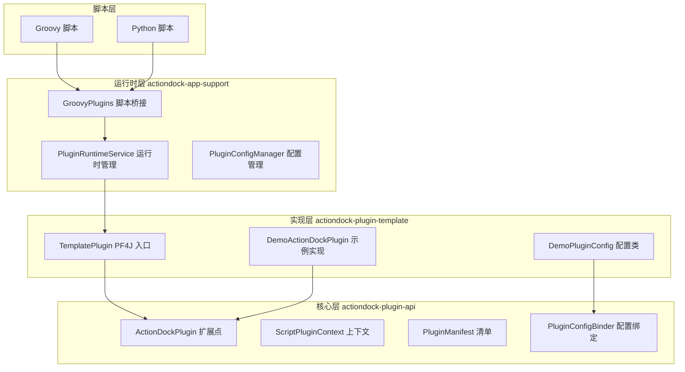
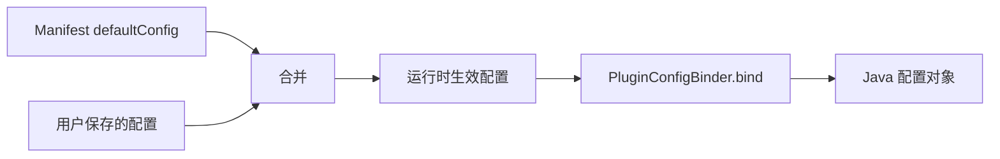

本指南面向希望扩展 ActionDock 平台能力的中级开发者，介绍如何开发自定义插件。ActionDock 插件基于 [PF4J](https://pf4j.org/)（Plugin Framework for Java）构建，通过实现 `ActionDockPlugin` 接口并声明插件清单（Manifest），可以将自定义功能以插件形式集成到 Groovy 和 Python 脚本中。

## 插件系统架构

ActionDock 采用分层架构设计插件系统。核心层（`actiondock-plugin-api`）定义插件与平台之间的契约接口；实现层（插件模板 `actiondock-plugin-template`）提供基于该契约的开发模板；运行时层（`actiondock-app-support`）基于 PF4J 管理插件的加载、配置和调用。



Sources: [actiondock-plugin-api/src/main/java/org/team4u/actiondock/plugin/api/ActionDockPlugin.java](actiondock-plugin-api/src/main/java/org/team4u/actiondock/plugin/api/ActionDockPlugin.java#L1-L39)
Sources: [actiondock-app-support/src/main/java/org/team4u/actiondock/plugin/PluginRuntimeService.java](actiondock-app-support/src/main/java/org/team4u/actiondock/plugin/PluginRuntimeService.java#L52-L125)

## 核心接口详解

### ActionDockPlugin 扩展点

所有插件必须实现 `ActionDockPlugin` 接口，该接口继承 PF4J 的 `ExtensionPoint`。核心方法包括：

| 方法 | 必须性 | 说明 |
|------|--------|------|
| `id()` | 必须 | 返回插件唯一标识，需与 Manifest 中的 `pluginId` 一致 |
| `invoke()` | 必须 | 核心方法，根据 action 名称执行对应逻辑并返回结果 |
| `validateConfig()` | 可选 | 用户保存配置时调用，用于校验配置合法性 |

```java
public interface ActionDockPlugin extends ExtensionPoint {
    String id();
    
    default void validateConfig(Map<String, Object> config) {}
    
    Object invoke(String action, ScriptPluginContext context, Map<String, Object> args);
}
```

Sources: [actiondock-plugin-api/src/main/java/org/team4u/actiondock/plugin/api/ActionDockPlugin.java](actiondock-plugin-api/src/main/java/org/team4u/actiondock/plugin/api/ActionDockPlugin.java#L1-L39)

### ScriptPluginContext 执行上下文

调用 `invoke()` 时传入的上下文对象，包含脚本信息和插件配置：

| 字段 | 类型 | 说明 |
|------|------|------|
| `scriptId` | String | 当前执行的脚本 ID |
| `scriptName` | String | 脚本名称 |
| `executionId` | String | 本次执行的唯一 ID |
| `submitMode` | String | 提交模式（SYNC/ASYNC） |
| `scriptInput` | Map | 脚本输入参数 |
| `pluginConfig` | Map | 合并后的插件配置 |

Sources: [actiondock-plugin-api/src/main/java/org/team4u/actiondock/plugin/api/ScriptPluginContext.java](actiondock-plugin-api/src/main/java/org/team4u/actiondock/plugin/api/ScriptPluginContext.java#L1-L83)

### PluginManifest 清单

插件清单（Manifest）以 JSON 文件形式存储在 classpath 的 `META-INF/actiondock/plugins/{pluginId}.json`，描述插件的元信息、配置模式和动作列表：

| 字段 | 说明 |
|------|------|
| `pluginId` | 插件唯一标识 |
| `name` | 显示名称 |
| `description` | 插件描述，支持 Markdown |
| `version` | 版本号 |
| `configSchema` | JSON Schema 格式的配置定义 |
| `defaultConfig` | 默认配置值 |
| `actions` | 插件支持的动作列表 |

Sources: [actiondock-plugin-api/src/main/java/org/team4u/actiondock/plugin/api/PluginManifest.java](actiondock-plugin-api/src/main/java/org/team4u/actiondock/plugin/api/PluginManifest.java#L1-L87)

## 插件开发流程

### 第一步：创建插件项目

以 `actiondock-plugin-template` 为模板创建新项目，修改 Maven 坐标：

```xml
<groupId>com.yourcompany</groupId>
<artifactId>your-plugin</artifactId>
<version>1.0.0</version>
```

确保依赖 `actiondock-plugin-api`，并将 `pf4j` 设为 `provided` 作用域：

```xml
<dependency>
    <groupId>org.team4u</groupId>
    <artifactId>actiondock-plugin-api</artifactId>
    <version>${project.version}</version>
</dependency>
<dependency>
    <groupId>org.pf4j</groupId>
    <artifactId>pf4j</artifactId>
    <version>${pf4j.version}</version>
    <scope>provided</scope>
</dependency>
```

Sources: [actiondock-plugin-template/pom.xml](actiondock-plugin-template/pom.xml#L1-L60)

### 第二步：实现 PF4J Plugin 入口类

创建继承 `org.pf4j.Plugin` 的入口类：

```java
package com.yourcompany.plugin;

import org.pf4j.Plugin;
import org.pf4j.PluginWrapper;

public class MyPlugin extends Plugin {
    public MyPlugin(PluginWrapper wrapper) {
        super(wrapper);
    }
}
```

Sources: [actiondock-plugin-template/src/main/java/org/team4u/actiondock/plugin/template/TemplatePlugin.java](actiondock-plugin-template/src/main/java/org/team4u/actiondock/plugin/template/TemplatePlugin.java#L1-L16)

### 第三步：实现 ActionDockPlugin 扩展点

使用 `@Extension` 注解标记实现类，实现核心逻辑：

```java
package com.yourcompany.plugin;

import org.pf4j.Extension;
import org.team4u.actiondock.plugin.api.ActionDockPlugin;
import org.team4u.actiondock.plugin.api.ScriptPluginContext;
import org.team4u.actiondock.plugin.api.PluginConfigBinder;
import java.util.Map;

@Extension
public class MyActionDockPlugin implements ActionDockPlugin {

    @Override
    public String id() {
        return "my-plugin";  // 必须与 manifest 文件中的 pluginId 一致
    }

    @Override
    public void validateConfig(Map<String, Object> config) {
        // 校验配置合法性，失败时抛出异常
        MyConfig cfg = PluginConfigBinder.bind(config, MyConfig.class);
        if (cfg.getApiUrl() == null || cfg.getApiUrl().isBlank()) {
            throw new IllegalArgumentException("apiUrl 不能为空");
        }
    }

    @Override
    public Object invoke(String action, ScriptPluginContext context, Map<String, Object> args) {
        return switch (action) {
            case "hello" -> Map.of("greeting", "Hello, " + args.get("name"));
            default -> throw new IllegalArgumentException("Unsupported action: " + action);
        };
    }
}
```

Sources: [actiondock-plugin-template/src/main/java/org/team4u/actiondock/plugin/template/DemoActionDockPlugin.java](actiondock-plugin-template/src/main/java/org/team4u/actiondock/plugin/template/DemoActionDockPlugin.java#L1-L64)

### 第四步：编写 Manifest 文件

在 `src/main/resources/META-INF/actiondock/plugins/` 下创建 `{pluginId}.json`：

```json
{
  "pluginId": "my-plugin",
  "name": "My Plugin",
  "description": "## My Plugin\n\nA custom **ActionDock** plugin.",
  "version": "1.0.0",
  "configSchema": {
    "type": "object",
    "properties": {
      "greeting": {
        "type": "string",
        "title": "问候语"
      }
    }
  },
  "defaultConfig": {
    "greeting": "Hello"
  },
  "actions": [
    {
      "action": "hello",
      "title": "打招呼",
      "description": "返回一句问候语。",
      "inputSchema": {
        "type": "object",
        "properties": {
          "name": {
            "type": "string",
            "title": "姓名"
          }
        }
      },
      "outputSchema": {
        "type": "object",
        "properties": {
          "greeting": {
            "type": "string",
            "title": "问候语"
          }
        }
      },
      "exampleArgs": {
        "name": "World"
      }
    }
  ]
}
```

Sources: [actiondock-plugin-template/src/main/resources/META-INF/actiondock/plugins/actiondock-demo-plugin.json](actiondock-plugin-template/src/main/resources/META-INF/actiondock/plugins/actiondock-demo-plugin.json#L1-L55)

### 第五步：配置 Maven 构建

在 `pom.xml` 中配置 PF4J 注解处理器和 JAR manifest：

```xml
<build>
    <plugins>
        <!-- PF4J 注解处理器，自动生成 extensions.idx -->
        <plugin>
            <artifactId>maven-compiler-plugin</artifactId>
            <configuration>
                <annotationProcessors>
                    <annotationProcessor>org.pf4j.processor.ExtensionAnnotationProcessor</annotationProcessor>
                </annotationProcessors>
            </configuration>
            <dependencies>
                <dependency>
                    <groupId>org.pf4j</groupId>
                    <artifactId>pf4j</artifactId>
                    <version>${pf4j.version}</version>
                </dependency>
            </dependencies>
        </plugin>

        <!-- JAR manifest 声明插件元数据 -->
        <plugin>
            <artifactId>maven-jar-plugin</artifactId>
            <configuration>
                <archive>
                    <manifestEntries>
                        <Plugin-Id>my-plugin</Plugin-Id>
                        <Plugin-Class>com.yourcompany.plugin.MyPlugin</Plugin-Class>
                        <Plugin-Version>${project.version}</Plugin-Version>
                        <Plugin-Provider>yourcompany</Plugin-Provider>
                    </manifestEntries>
                </archive>
            </configuration>
        </plugin>
    </plugins>
</build>
```

关键 JAR Manifest 配置项说明：

| 配置项 | 说明 |
|--------|------|
| `Plugin-Id` | 插件唯一标识，必须与 Manifest JSON 中的 `pluginId` 一致 |
| `Plugin-Class` | PF4J Plugin 入口类的全限定名 |
| `Plugin-Version` | 插件版本号 |
| `Plugin-Provider` | 插件提供者标识 |

Sources: [actiondock-plugin-template/pom.xml](actiondock-plugin-template/pom.xml#L27-L58)

## 配置管理机制

### 配置生命周期

ActionDock 的插件配置遵循三级合并机制：

1. **默认配置（defaultConfig）**：Manifest 文件中声明的默认值
2. **用户配置**：通过 REST API 或管理界面保存的配置，覆盖默认值
3. **生效配置（effectiveConfig）**：运行时合并 `defaultConfig` + 用户配置



Sources: [actiondock-plugin-api/src/main/java/org/team4u/actiondock/plugin/api/PluginConfigBinder.java](actiondock-plugin-api/src/main/java/org/team4u/actiondock/plugin/api/PluginConfigBinder.java#L1-L63)

### 类型化配置绑定

定义 Java 配置类并通过 `PluginConfigBinder` 进行类型转换：

```java
public class MyConfig {
    private String apiUrl;
    private int timeout;
    private boolean enabled;

    public String getApiUrl() { return apiUrl; }
    public void setApiUrl(String apiUrl) { this.apiUrl = apiUrl; }
    public int getTimeout() { return timeout; }
    public void setTimeout(int timeout) { this.timeout = timeout; }
    public boolean isEnabled() { return enabled; }
    public void setEnabled(boolean enabled) { this.enabled = enabled; }
}

// 在 invoke 中使用
MyConfig config = context.getPluginConfig(MyConfig.class);
```

注意：`PluginConfigBinder` 仅负责 JSON 反序列化，不处理默认值合并。默认值语义由平台在调用 `validateConfig` 前统一完成合并。

Sources: [actiondock-plugin-template/src/main/java/org/team4u/actiondock/plugin/template/DemoPluginConfig.java](actiondock-plugin-template/src/main/java/org/team4u/actiondock/plugin/template/DemoPluginConfig.java#L1-L19)

## 脚本中调用插件

ActionDock 在 Groovy 和 Python 脚本中统一注入 `plugins` 变量，调用语法完全一致：

**Groovy 脚本：**
```groovy
def result = plugins.invoke("my-plugin", "hello", [
    name: "ActionDock"
])
return [greeting: result.greeting]
```

**Python 脚本：**
```python
result = plugins.invoke("my-plugin", "hello", {
    "name": "ActionDock"
})
return {"greeting": result["greeting"]}
```

方法签名：
```groovy
// 无额外参数
plugins.invoke(String pluginId, String action)

// 带额外参数
plugins.invoke(String pluginId, String action, Map<String, Object> args)
```

Sources: [actiondock-app-support/src/main/java/org/team4u/actiondock/plugin/GroovyPlugins.java](actiondock-app-support/src/main/java/org/team4u/actiondock/plugin/GroovyPlugins.java#L1-L67)

## 插件生命周期管理

通过 REST API 管理插件的完整生命周期：

| 操作 | 方法 | 端点 | 说明 |
|------|------|------|------|
| 列出所有插件 | GET | `/api/plugins` | 返回所有已安装插件列表 |
| 查看插件详情 | GET | `/api/plugins/{pluginId}` | 返回单个插件的详细信息 |
| 安装插件 | POST | `/api/plugins/install` | 上传 JAR 并安装 |
| 升级插件 | POST | `/api/plugins/{pluginId}/upgrade` | 上传新版 JAR 替换旧版 |
| 启动插件 | POST | `/api/plugins/{pluginId}/start` | 启动已安装的插件 |
| 停止插件 | POST | `/api/plugins/{pluginId}/stop` | 停止运行中的插件 |
| 卸载插件 | DELETE | `/api/plugins/{pluginId}` | 停止并删除插件 |
| 获取配置 | GET | `/api/plugins/{pluginId}/config` | 获取插件当前配置 |
| 保存配置 | PUT | `/api/plugins/{pluginId}/config` | 保存插件配置 |
| 调试调用 | POST | `/api/plugins/{pluginId}/actions/{action}/invoke` | 通过 API 直接调用插件动作 |

### 生命周期状态流转

```
安装(install) → 已停止(STOPPED)
    ↓
启动(start) → 运行中(STARTED) ←→ 停止(stop)
    ↓                              ↓
升级(upgrade) → 保留配置 → 已停止   卸载(uninstall) → 彻底删除
```

Sources: [actiondock-app-support/src/main/java/org/team4u/actiondock/plugin/PluginRuntimeService.java](actiondock-app-support/src/main/java/org/team4u/actiondock/plugin/PluginRuntimeService.java#L390-L435)

## 构建与安装

```bash
# 构建插件 JAR
mvn clean package

# 通过 REST API 安装到 ActionDock
curl -X POST http://localhost:5177/api/plugins/install \
  -F "file=@target/my-plugin-1.0.0.jar"

# 通过 actiondock CLI 安装
actiondock plugin install ./target/my-plugin-1.0.0.jar --json
```

## 常见问题排查

### 插件 JAR 安装后无法启动

检查以下配置是否正确：
- `pom.xml` 中 `Plugin-Id` 与 Manifest JSON 中的 `pluginId` 是否一致
- `Plugin-Class` 是否指向正确的 PF4J Plugin 子类
- `maven-compiler-plugin` 是否配置了 `ExtensionAnnotationProcessor`
- 构建产物中 `META-INF/extensions.idx` 文件是否存在且包含扩展类全名

### 配置绑定失败

- 确保配置类有无参构造函数
- 确保字段有标准的 getter/setter
- JSON 字段名与 Java 字段名需匹配（支持驼峰/下划线自动转换）

### 插件依赖冲突

PF4J 使用独立的 PluginClassLoader，插件的依赖不会与主应用冲突。但注意不要将 `pf4j` 的 scope 设为 `compile`，应使用 `provided`。

## 进阶阅读

- [插件生命周期管理](8-cha-jian-sheng-ming-zhou-qi-guan-li) - 深入了解插件的运行时管理和状态监控
- [脚本依赖与调用](6-jiao-ben-yi-lai-yu-diao-yong) - 了解脚本如何声明插件依赖
- [仓库分发机制](20-cang-ku-fen-fa-ji-zhi) - 了解如何将插件发布到仓库供他人使用