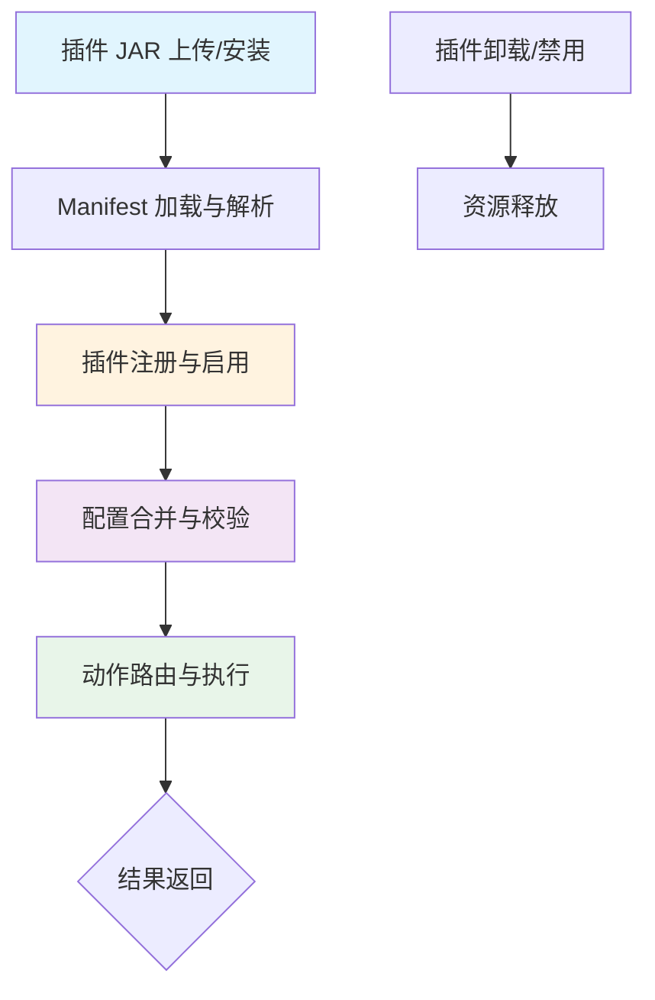
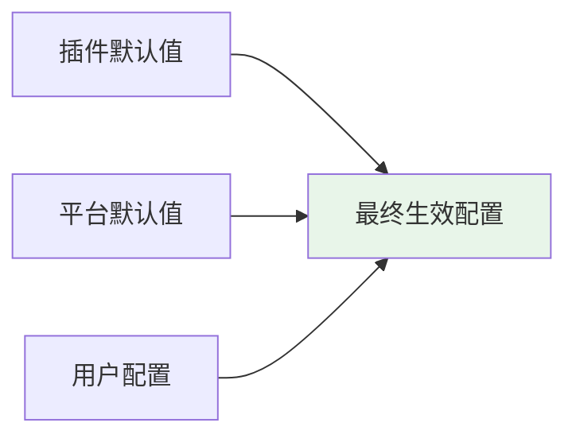

插件生命周期管理是 ActionDock 平台扩展机制的核心部分，涵盖插件从发现、注册、配置到调用的完整流程。本章节深入解析插件生命周期的各个阶段，帮助开发者理解插件系统的内部运作原理，并掌握插件开发的最佳实践。

## 架构概述

ActionDock 的插件系统构建于 **PF4J（Plugin Framework for Java）** 之上，提供了标准化、可扩展的插件加载与调用机制。平台通过声明式清单（Manifest）定义插件元数据，采用类型安全的配置绑定机制，并在脚本执行层实现了插件调用与脚本调用的一致性体验。

插件系统的核心组件包括：

- **插件接口层**（`actiondock-plugin-api`）：定义 `ActionDockPlugin` 接口、清单加载器、配置绑定器等核心抽象
- **插件模板**（`actiondock-plugin-template`）：提供插件开发的起步模板和示例实现
- **插件桥接层**（`actiondock-ai-plugin-bridge`）：将 AI 能力封装为系统级插件的参考实现

Sources: [ActionDockPlugin.java](actiondock-plugin-api/src/main/java/org/team4u/actiondock/plugin/api/ActionDockPlugin.java#L1-L39)

## 生命周期阶段

插件从加载到销毁经历五个核心阶段，每个阶段都有明确的职责边界和行为约定。



### 阶段一：清单加载

清单文件约定位于 `META-INF/actiondock/plugins/<pluginId>.json`，包含插件的标识信息、配置模式、默认配置和动作列表。清单加载器 `PluginManifestLoader` 负责从 classpath 资源中读取并解析清单文件，自动处理 JSON 反序列化。

清单加载支持两种路径模式：按插件 ID 自动拼接路径，或通过显式资源路径加载。当清单资源不存在或无法读取时，加载器会抛出 `IllegalArgumentException` 并附带明确的错误信息。

Sources: [PluginManifestLoader.java](actiondock-plugin-api/src/main/java/org/team4u/actiondock/plugin/api/PluginManifestLoader.java#L1-L77)

### 阶段二：注册与存储

插件注册信息 `PluginRegistration` 是持久化到存储层的核心领域模型，记录插件的完整元数据、配置模式、可用动作以及启用状态。注册信息包含两个关键来源标识：`repositoryId`（仓库标识）和 `repositoryPluginId`（仓库中的插件标识），用于区分仓库安装和手动上传的插件。

`PluginRegistryRepository` 接口定义了插件注册信息的持久化操作，包括保存、查询、删除等方法。平台启动时会通过 `findEnabled()` 方法获取所有已启用的插件进行加载。

Sources: [PluginRegistration.java](actiondock-core/src/main/java/org/team4u/actiondock/domain/model/PluginRegistration.java#L1-L197)
Sources: [PluginRegistryRepository.java](actiondock-core/src/main/java/org/team4u/actiondock/domain/port/PluginRegistryRepository.java#L1-L58)

### 阶段三：配置合并与校验

配置管理是插件生命周期中的关键环节，涉及三层配置合并：



`PluginConfigBinder` 负责将配置 Map 绑定到指定的 Java 类型，通过 Jackson 进行类型转换。绑定过程中若发生类型不匹配错误，系统会精确定位错误路径（如 `nested.retries`），便于开发者快速定位问题。

Sources: [PluginConfigBinder.java](actiondock-plugin-api/src/main/java/org/team4u/actiondock/plugin/api/PluginConfigBinder.java#L1-L63)

### 阶段四：动作路由与执行

`ScriptPluginContext` 是插件调用时的执行上下文，携带脚本信息、插件配置和执行追踪标识。上下文对象在调用 `invoke` 方法前由平台构建，插件可从上下文获取脚本 ID、执行 ID 等运行时信息。

动作路由基于动作名称字符串进行分发，每个动作对应插件内部的具体业务逻辑实现。调用方只需指定动作名称和参数，无需了解插件的内部实现细节。

Sources: [ScriptPluginContext.java](actiondock-plugin-api/src/main/java/org/team4u/actiondock/plugin/api/ScriptPluginContext.java#L1-L83)

## 清单文件格式

清单文件是插件的声明式描述，采用 JSON 格式存储在 classpath 资源中。完整的清单结构包含以下核心字段：

| 字段 | 类型 | 必填 | 说明 |
|------|------|------|------|
| `pluginId` | String | 是 | 插件唯一标识，全局唯一 |
| `name` | String | 是 | 人类可读的插件名称 |
| `description` | String | 否 | 插件功能描述 |
| `version` | String | 是 | 插件版本号 |
| `configSchema` | Object | 否 | 配置项的 JSON Schema 定义 |
| `defaultConfig` | Object | 否 | 插件默认配置值 |
| `actions` | Array | 是 | 插件提供的动作列表 |

每个动作 `action` 的结构如下：

| 字段 | 类型 | 必填 | 说明 |
|------|------|------|------|
| `action` | String | 是 | 动作标识符 |
| `title` | String | 是 | 动作显示名称 |
| `description` | String | 否 | 动作功能描述 |
| `inputSchema` | Object | 是 | 输入参数的 JSON Schema |
| `outputSchema` | Object | 否 | 输出结果的 JSON Schema |
| `exampleArgs` | Object | 否 | 示例调用参数 |

Sources: [PluginManifest.java](actiondock-plugin-api/src/main/java/org/team4u/actiondock/plugin/api/PluginManifest.java#L1-L87)
Sources: [PluginActionManifest.java](actiondock-plugin-api/src/main/java/org/team4u/actiondock/plugin/api/PluginActionManifest.java#L1-L74)

### 清单文件示例

```json
{
  "pluginId": "actiondock-demo-plugin",
  "name": "ActionDock Demo Plugin",
  "description": "Template plugin exposing sample actions to Groovy scripts.",
  "version": "0.2.0",
  "configSchema": {
    "type": "object",
    "properties": {
      "prefix": {
        "type": "string",
        "title": "Prefix"
      }
    }
  },
  "defaultConfig": {
    "prefix": "demo"
  },
  "actions": [
    {
      "action": "echo",
      "title": "Echo message",
      "description": "Return a message prefixed by plugin configuration.",
      "inputSchema": {
        "type": "object",
        "properties": {
          "message": {
            "type": "string",
            "title": "Message"
          }
        }
      },
      "outputSchema": {
        "type": "object",
        "properties": {
          "message": {
            "type": "string",
            "title": "Message"
          }
        }
      },
      "exampleArgs": {
        "message": "hello"
      }
    }
  ]
}
```

Sources: [actiondock-demo-plugin.json](actiondock-plugin-template/src/main/resources/META-INF/actiondock/plugins/actiondock-demo-plugin.json#L1-L55)

## 插件开发模板

开发新插件时，可基于 `actiondock-plugin-template` 模块创建。模板提供了完整的项目结构和示例代码，开发者只需关注业务逻辑实现。

### 插件主类

每个 PF4J 插件需要一个继承 `Plugin` 的主类，作为插件的加载入口点。主类负责初始化插件所需的资源和依赖。

```java
public class TemplatePlugin extends Plugin {
    public TemplatePlugin(PluginWrapper wrapper) {
        super(wrapper);
    }
}
```

Sources: [TemplatePlugin.java](actiondock-plugin-template/src/main/java/org/team4u/actiondock/plugin/template/TemplatePlugin.java#L1-L16)

### 插件实现类

插件的业务逻辑实现在标注 `@Extension` 注解的类中，该类实现 `ActionDockPlugin` 接口。以下是示例插件的完整实现：

```java
@Extension
public class DemoActionDockPlugin implements ActionDockPlugin {
    
    @Override
    public String id() {
        return "actiondock-demo-plugin";
    }

    @Override
    public void validateConfig(Map<String, Object> config) {
        PluginConfigBinder.bind(config, DemoPluginConfig.class);
    }

    @Override
    public Object invoke(String action, ScriptPluginContext context, Map<String, Object> args) {
        if ("echo".equals(action)) {
            DemoPluginConfig config = context.getPluginConfig(DemoPluginConfig.class);
            String message = String.valueOf(args.getOrDefault("message", ""));
            
            Map<String, Object> result = new LinkedHashMap<>();
            result.put("message", config.getPrefix() + ":" + message);
            result.put("scriptId", context.getScriptId());
            result.put("executionId", context.getExecutionId());
            return result;
        }
        throw new IllegalArgumentException("Unsupported action: " + action);
    }
}
```

Sources: [DemoActionDockPlugin.java](actiondock-plugin-template/src/main/java/org/team4u/actiondock/plugin/template/DemoActionDockPlugin.java#L1-L64)

### 配置类

配置类采用标准的 JavaBean 风格定义，字段对应清单中的配置项：

```java
public class DemoPluginConfig {
    private String prefix;

    public String getPrefix() {
        return prefix;
    }

    public void setPrefix(String prefix) {
        this.prefix = prefix;
    }
}
```

Sources: [DemoPluginConfig.java](actiondock-plugin-template/src/main/java/org/team4u/actiondock/plugin/template/DemoPluginConfig.java#L1-L19)

## 系统插件示例

`actiondock-ai-plugin-bridge` 模块展示了如何将平台内部服务封装为插件。`ActionDockAiSystemPlugin` 实现了 `ActionDockPlugin` 接口，将 AI 网关和 Agent 运行时能力暴露给脚本层。

该插件支持四种 AI 动作：

| 动作 | 说明 |
|------|------|
| `chat` | 通用对话请求 |
| `structured` | 结构化输出请求 |
| `embed` | 向量化嵌入请求 |
| `agentRun` | Agent 任务执行 |

```java
public class ActionDockAiSystemPlugin implements ActionDockPlugin {
    public static final String PLUGIN_ID = "actiondock-ai";

    @Override
    public Object invoke(String action, ScriptPluginContext context, Map<String, Object> args) {
        return switch (action) {
            case "chat" -> aiGateway.chat(toChatRequest(values), toCallContext(context));
            case "structured" -> aiGateway.structured(toStructuredRequest(values), toCallContext(context));
            case "embed" -> aiGateway.embed(toEmbeddingRequest(values), toCallContext(context));
            case "agentRun" -> aiAgentRuntime.run(toAgentRunRequest(values), toAgentRunContext(context));
            default -> throw new IllegalArgumentException("Unsupported AI action: " + action);
        };
    }
}
```

Sources: [ActionDockAiSystemPlugin.java](actiondock-ai-plugin-bridge/src/main/java/org/team4u/actiondock/ai/plugin/ActionDockAiSystemPlugin.java#L1-L123)

## 配置绑定与校验

`PluginConfigBinder` 提供了类型安全的配置绑定能力，将 Map 结构反序列化为强类型配置对象。绑定过程会忽略未知字段，但会报告类型转换错误的具体路径。

| 场景 | 行为 |
|------|------|
| 正常绑定 | 将 Map 字段映射到配置对象的同名属性 |
| 空配置 | 使用 Java 类型默认值（如 `null`、基本类型零值） |
| 未知字段 | 自动忽略，不影响绑定结果 |
| 类型错误 | 抛出异常，包含错误路径和原始消息 |

Sources: [PluginConfigBinderTest.java](actiondock-plugin-api/src/test/java/org/team4u/actiondock/plugin/api/PluginConfigBinderTest.java#L1-L106)

## 在脚本中调用插件

插件调用与脚本调用具有完全一致的体验，脚本层无需关心底层是编译型插件还是解释型脚本。

**Groovy 脚本调用：**

```groovy
def result = plugins.invoke("actiondock-demo-plugin", "echo", [message: "hello"])
// result = [message: "demo:hello", scriptId: "...", executionId: "..."]
```

**Python 脚本调用：**

```python
result = plugins.invoke("actiondock-demo-plugin", "echo", {"message": "hello"})
```

调用时只需指定插件 ID、动作名称和参数映射，平台会自动处理配置合并、校验和路由分发。

## 下一步

完成插件生命周期管理的学习后，建议继续以下章节：

- [插件开发指南](7-cha-jian-kai-fa-zhi-nan)：深入了解插件开发的具体步骤和最佳实践
- [脚本依赖与调用](6-jiao-ben-yi-lai-yu-diao-yong)：学习如何在脚本中使用插件能力
- [仓库分发机制](20-cang-ku-fen-fa-ji-zhi)：了解插件的发布和分发流程