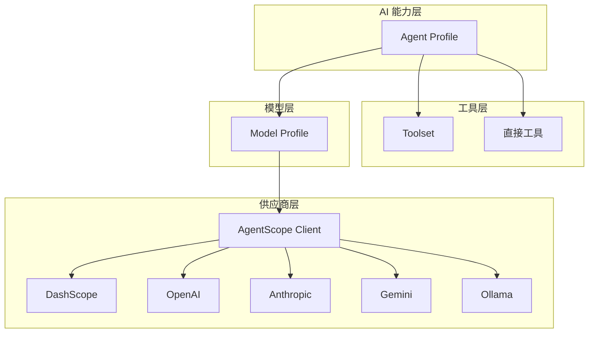

AI 模型配置是 ActionDock 平台管理 AI 能力的基础层，通过统一的模型 Profile 抽象，将不同 AI 供应商的接入细节与上层业务逻辑解耦。该配置层支持多种模型供应商、能力声明和运行参数定制，为 Agent 和工具调用提供标准化的 AI 能力接口。

Sources: [AiModelProfile.java](actiondock-ai-api/src/main/java/org/team4u/actiondock/ai/api/AiModelProfile.java#L1-L51)

## 架构概述

ActionDock 的 AI 配置体系由三层架构组成：模型配置层（Model Profile）、Agent 配置层（Agent Profile）和工具集层（Toolset）。模型配置作为底层基础设施，定义与 AI 供应商的连接方式和能力边界；Agent 配置引用模型配置并组合工具集；Toolset 则管理 Agent 可调用的工具集合。



模型配置通过 AgentScope Client 实现对不同供应商的统一适配，所有实际的 HTTP 调用和响应解析都在供应商适配层完成。

Sources: [AgentScopeAiProviderClient.java](actiondock-ai-agentscope/src/main/java/org/team4u/actiondock/ai/agentscope/AgentScopeAiProviderClient.java#L250-L278)

## 模型配置字段

### 基础配置

| 字段 | 类型 | 说明 | 必填 |
|------|------|------|------|
| ID | String | 模型配置唯一标识，用于被 Agent 引用 | 是 |
| 名称 | String | 人类可读名称，便于识别 | 是 |
| 模型供应商 | Enum | AI 供应商类型 | 是 |
| 模型名 | String | 供应商指定的模型标识符 | 是 |
| 启用 | Boolean | 是否启用该配置 | 否（默认启用） |

Sources: [AiModelProfileListPage.tsx](actiondock-admin-ui/src/pages/ai/AiModelProfileListPage.tsx#L40-L60)

### 连接配置

| 字段 | 类型 | 说明 | 适用场景 |
|------|------|------|----------|
| Base URL | String | 自托管或兼容端点地址 | OpenAI Compatible、Ollama 等本地部署场景 |
| API Key 配置键 | String | 引用配置值中存储的密钥键名 | 所有需要认证的供应商 |

API Key 采用引用机制而非明文存储，通过配置值系统统一管理敏感信息。这种设计确保密钥内容不会出现在模型配置中，便于密钥轮换和安全审计。

Sources: [AiProfileDetailPage.tsx](actiondock-admin-ui/src/pages/ai/AiProfileDetailPage.tsx#L165-L175)

## 支持的模型供应商

系统支持六种主流 AI 供应商，通过枚举类型 `AiModelProvider` 声明：

| 供应商 | 枚举值 | Chat 支持 | Structured Output | Embedding | 认证方式 |
|--------|--------|-----------|-------------------|-----------|----------|
| 阿里云 DashScope | `DASHSCOPE` | ✅ | ✅ | ✅ | API Key |
| OpenAI 官方 | `OPENAI` | ✅ | ✅ | ✅ | API Key |
| OpenAI 兼容端点 | `OPENAI_COMPATIBLE` | ✅ | ✅ | ✅ | API Key |
| Anthropic | `ANTHROPIC` | ✅ | ✅ | ❌ | API Key |
| Google Gemini | `GEMINI` | ✅ | ✅ | ❌ | API Key |
| Ollama 本地 | `OLLAMA` | ✅ | ✅ | ✅ | 无（本地连接） |

Sources: [AiModelProvider.java](actiondock-ai-api/src/main/java/org/team4u/actiondock/ai/api/AiModelProvider.java#L1-L11)

不同供应商在 AgentScope Client 中通过对应的模型类适配：

```java
case DASHSCOPE -> configureAndBuild(DashScopeChatModel.builder().modelName(modelName).stream(streaming), apiKey, baseUrl).build();
case OPENAI, OPENAI_COMPATIBLE -> configureAndBuild(OpenAIChatModel.builder().modelName(modelName).stream(streaming), apiKey, baseUrl).build();
case ANTHROPIC -> configureAndBuild(AnthropicChatModel.builder().modelName(modelName).stream(streaming), apiKey, baseUrl).build();
case GEMINI -> configureAndBuild(GeminiChatModel.builder().modelName(modelName).streamEnabled(streaming), apiKey, null).build();
case OLLAMA -> configureAndBuild(OllamaChatModel.builder().modelName(modelName), null, baseUrl).build();
```

Sources: [AgentScopeAiProviderClient.java](actiondock-ai-agentscope/src/main/java/org/team4u/actiondock/ai/agentscope/AgentScopeAiProviderClient.java#L257-L263)

## 能力声明

每个模型配置通过 `capabilities` 字段声明其支持的能力类型，使用 Set 集合确保无重复：

| 能力 | 枚举值 | 说明 | 典型用途 |
|------|--------|------|----------|
| 对话 | `CHAT` | 标准文本对话生成 | Agent 推理、直接聊天交互 |
| 结构化输出 | `STRUCTURED_OUTPUT` | 返回符合 Schema 的结构化数据 | 工具参数解析、数据提取 |
| 向量嵌入 | `EMBEDDING` | 文本向量化 | 语义搜索、RAG 场景 |
| Agent 运行 | `AGENT_RUN` | 支持 Agent 自主循环调用工具 | 复杂任务自动化 |

Gateway 层在调用模型前会校验请求的能力是否在配置的能力范围内：

```java
if (!profile.getCapabilities().contains(capability)) {
    throw new IllegalArgumentException("AI 模型 Profile 不支持能力 " + capability + ": " + id);
}
```

Sources: [AiGatewayImpl.java](actiondock-ai-core/src/main/java/org/team4u/actiondock/ai/core/AiGatewayImpl.java#L106-L108)

## 默认参数配置

通过 `defaultOptions` JSON 字段可定制模型的生成参数，影响所有使用该配置的调用：

| 参数 | 类型 | 说明 | 适用场景 |
|------|------|------|----------|
| temperature | Double | 采样温度，控制随机性 | 需要创意输出时调高 |
| maxTokens | Integer | 最大生成 Token 数 | 限制响应长度 |
| maxCompletionTokens | Integer | 最大完成 Token 数（Anthropic 风格） | 精确控制输出长度 |
| topP | Double | Nucleus 采样阈值 | 与 temperature 二选一 |
| topK | Integer | Top-K 采样 | 限制候选词范围 |
| frequencyPenalty | Double | 频率惩罚 | 减少重复 |
| presencePenalty | Double | 存在惩罚 | 鼓励引入新话题 |
| thinkingBudget | Integer | 思考预算（Claude 风格） | 控制推理深度 |
| reasoningEffort | String | 推理努力程度 | o1 系列模型 |
| seed | Long | 随机种子 | 结果可复现 |
| timeoutSeconds | Integer | 超时时间（秒） | 防止长时间等待 |
| dimensions | Integer | Embedding 维度 | 向量模型输出维度 |

Sources: [AgentScopeAiProviderClient.java](actiondock-ai-agentscope/src/main/java/org/team4u/actiondock/ai/agentscope/AgentScopeAiProviderClient.java#L320-L340)

## 限制配置

通过 `limits` JSON 字段可设置运行时限制，防止异常调用消耗过多资源：

| 参数 | 类型 | 说明 |
|------|------|------|
| maxInputCharacters | Integer | 最大输入字符数 |
| maxOutputTokens | Integer | 最大输出 Token 数 |

这些限制在 AiGateway 层生效，超限时直接拒绝请求并返回错误。

## 管理操作

### 创建模型配置

1. 访问 **管理台 → 能力 → AI → 模型管理**
2. 点击 **新建** 按钮
3. 填写配置字段（ID、名称必填）
4. 选择模型供应商并填写模型名
5. 配置 API Key 引用（如需要）
6. 声明支持的能力
7. 定制默认参数和限制（可选）
8. 点击 **保存**

Sources: [AiModelController.java](actiondock-app-spring/src/main/java/org/team4u/actiondock/web/ai/AiModelController.java#L30-L35)

### 测试模型配置

配置保存后，可使用内置测试功能验证连通性：

1. 在模型配置详情页切换到 **测试** 标签
2. 输入测试 Prompt（默认提示已填充）
3. 点击 **运行测试**
4. 查看返回结果和 Token 消耗

测试请求通过 `/api/ai/models/{id}/test` 端点发送，使用管理员测试上下文：

```java
@PostMapping("/{id}/test")
public ApiResponse<AiChatResponse> testModel(@PathVariable String id, @RequestBody AiChatRequest request) {
    AiChatRequest testRequest = new AiChatRequest(id, request == null ? List.of() : request.messages(), request == null ? null : request.options());
    return ApiResponse.success(aiGateway.chat(testRequest, AiCallContext.adminTest()));
}
```

Sources: [AiModelController.java](actiondock-app-spring/src/main/java/org/team4u/actiondock/web/ai/AiModelController.java#L58-L63)

### 删除模型配置

删除前系统会检查是否有 Agent 引用该模型配置。若存在引用，删除操作将被拒绝：

```java
agentProfileRepository.findAll().stream()
    .filter(agent -> id != null && id.equals(agent.getModelProfileId()))
    .findFirst()
    .ifPresent(agent -> {
        throw new IllegalArgumentException("模型 Profile 已被 Agent 引用，不能删除: " + agent.getId());
    });
```

Sources: [AiModelProfileService.java](actiondock-ai-core/src/main/java/org/team4u/actiondock/ai/core/AiModelProfileService.java#L52-L58)

## 与 Agent 的关系

模型配置与 Agent 是一对多关系：一个模型配置可被多个 Agent 引用，而每个 Agent 必须关联一个模型配置。Agent 配置通过 `modelProfileId` 字段引用模型：

```typescript
interface AiAgentProfile {
  modelProfileId: string;  // 关联的模型配置 ID
  // ... 其他字段
}
```

Sources: [AiAgentProfile.java](actiondock-ai-api/src/main/java/org/team4u/actiondock/ai/api/AiAgentProfile.java#L10-L12)

在前端界面中，创建 Agent 时会看到已配置模型的列表，包括模型名、启用状态等信息：

```typescript
const modelOptions = models.map((item) => ({
  value: item.id,
  label: `${item.id} (${item.modelName})${item.enabled ? "" : " - 禁用"}`,
  disabled: !item.enabled
}));
```

Sources: [AiProfileDetailPage.tsx](actiondock-admin-ui/src/pages/ai/AiProfileDetailPage.tsx#L370-L375)

## 最佳实践

### 生产环境配置建议

- **启用验证**：创建配置后立即使用测试功能验证连通性
- **密钥管理**：使用配置值系统存储 API Key，便于密钥轮换而不影响配置
- **能力精简**：只声明实际需要的能力，减少误用风险
- **超时设置**：根据业务场景设置合理的超时时间，避免长时间阻塞

### 多供应商策略

- 为不同供应商创建独立配置，通过 Agent 引用灵活切换
- 保持模型名与供应商文档一致（如 `gpt-4o`、`qwen-max`）
- 本地部署场景（如 Ollama）使用 Base URL 而非 API Key

### 资源控制

- 设置 `maxInputCharacters` 防止异常大输入
- 设置 `maxOutputTokens` 避免过量输出
- 生产环境适当降低 `temperature`，提高输出稳定性

---

## 相关文档

- [Agent 与 Toolset](10-agent-yu-toolset) — 了解 Agent 如何使用模型配置
- [配置值管理](14-pei-zhi-zhi-guan-li) — 管理 API Key 等敏感配置
- [REST API 参考](19-rest-api-can-kao) — API 端点详细说明