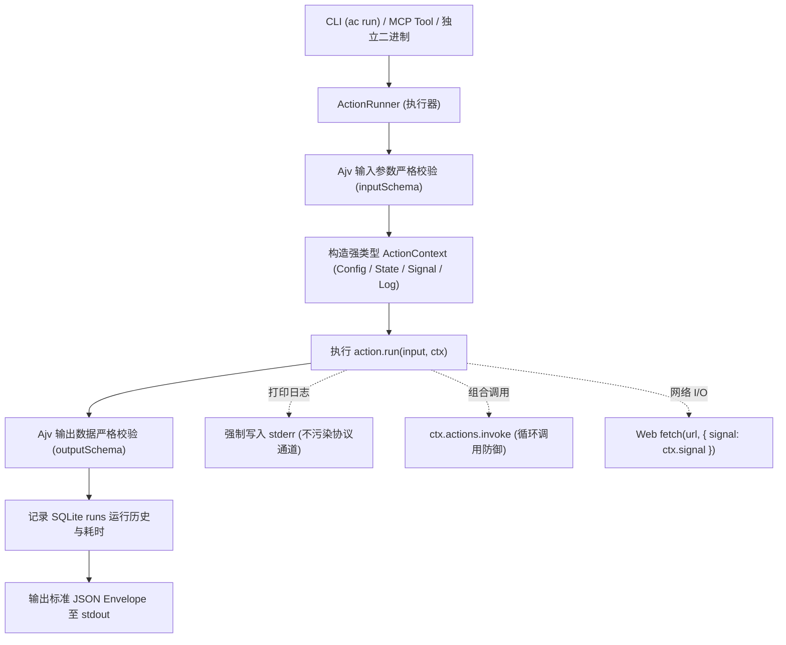

# Action 编写与开发指南

# 背景

在为 AI Agent 构建工具（Tools / Actions）时，开发者通常面临以下挑战：

- **类型松散与 Schema 缺失**：传统的脚本或函数缺乏标准化的输入/输出契约，Agent 容易传错参数类型或遗漏必填字段，导致运行时崩溃。
- **环境碎片与依赖地狱**：不同工具依赖不同的 Python 虚拟环境、Node 模块或系统工具，分发给其他机器或沙箱时经常因环境不一致而失效。
- **日志污染输出通道**：工具内部的 `print()` 或 `console.log()` 会混入标准输出，破坏 Agent 依赖的 JSON / JSON-RPC 解析，造成通信协议中断。
- **长耗时操作无法取消**：当 Agent 决定中止任务或用户在终端按下 `Ctrl+C` 时，后台子进程或网络请求无法响应式中断，浪费计算资源。

ActionDock 2.0 确立了一套标准化的 Action 编写规范：**基于 TypeScript 原生类型、严格的 JSON Schema 双向校验、标准 Web API 与 npm 生态复用、通道绝对隔离以及跨协议协作式取消**。

---

# 设计与架构

## 核心模型

每个 Action 是一个由 `@actiondock/sdk` 的 `defineAction` 函数声明的自包含模块：



## 核心接口契约

```ts
export interface ActionDefinition<TInput = any, TOutput = any> {
  id: string;                                    // 全局唯一 Action 标识符（如 github.list-prs）
  description: string;                           // 面向 LLM 与开发者的功能描述
  inputSchema: Record<string, any>;              // 标准 JSON Schema (输入校验与 Tool 发现)
  outputSchema: Record<string, any>;             // 标准 JSON Schema (输出校验与契约约束)
  run(input: TInput, ctx: ActionContext): Promise<TOutput>; // 核心执行函数
}
```

---

# 编写 Action 规范指南

## 创建 Action 模板

### 方式 A：通过 CLI 快速创建（推荐）
```bash
ac action create github.list-prs --desc "获取 GitHub 仓库的 Pull Requests 清单"
```
系统会自动在 `actions/` 目录下生成 `list-prs.ts` 并包含完整的类型与 Schema 脚手架。

### 方式 B：手动创建 TypeScript 文件
在项目 `actions/` 目录下新建 `.ts` 文件（如 `actions/list-prs.ts`），声明并默认导出 `defineAction`：

```ts
import { defineAction } from "@actiondock/sdk";

// 声明 TypeScript 泛型接口
export interface ListPrsInput {
  repo: string;
  state?: "open" | "closed" | "all";
  limit?: number;
}

export interface PullRequestItem {
  id: number;
  number: number;
  title: string;
  author: string;
  url: string;
}

export interface ListPrsOutput {
  items: PullRequestItem[];
  total: number;
  fetchedAt: string;
}

// 声明 Action 定义
export default defineAction<ListPrsInput, ListPrsOutput>({
  id: "github.list-prs",
  description: "获取指定 GitHub 仓库的 Pull Request 列表",

  // 入参 JSON Schema（Ajv 校验 + LLM 工具理解）
  inputSchema: {
    type: "object",
    properties: {
      repo: {
        type: "string",
        description: "仓库全名，格式为 owner/repo（例如 facebook/react）",
      },
      state: {
        type: "string",
        enum: ["open", "closed", "all"],
        default: "open",
        description: "筛选 PR 状态",
      },
      limit: {
        type: "number",
        default: 10,
        description: "最大返回数量",
      },
    },
    required: ["repo"],
  },

  // 出参 JSON Schema（保证调用方契约可靠）
  outputSchema: {
    type: "object",
    properties: {
      items: {
        type: "array",
        items: {
          type: "object",
          properties: {
            id: { type: "number" },
            number: { type: "number" },
            title: { type: "string" },
            author: { type: "string" },
            url: { type: "string" },
          },
          required: ["id", "number", "title", "author", "url"],
        },
      },
      total: { type: "number" },
      fetchedAt: { type: "string" },
    },
    required: ["items", "total", "fetchedAt"],
  },

  // 核心业务执行函数
  async run(input, ctx) {
    const token = ctx.config.get<string>("GITHUB_TOKEN");
    const state = input.state || "open";
    const limit = input.limit || 10;

    ctx.log.info(`正在抓取 ${input.repo} 的 ${state} PR（上限 ${limit} 条）`);

    const headers: Record<string, string> = {
      "User-Agent": "ActionDock-Agent",
      Accept: "application/vnd.github.v3+json",
    };
    if (token) {
      headers.Authorization = `Bearer ${token}`;
    }

    // 标准 Web fetch API，直通 ctx.signal
    const url = `https://api.github.com/repos/${input.repo}/pulls?state=${state}&per_page=${limit}`;
    const response = await fetch(url, {
      headers,
      signal: ctx.signal,
    });

    if (!response.ok) {
      throw new Error(`GitHub API 响应失败: HTTP ${response.status} ${response.statusText}`);
    }

    const rawList = (await response.json()) as any[];
    const items: PullRequestItem[] = rawList.map((pr) => ({
      id: pr.id,
      number: pr.number,
      title: pr.title,
      author: pr.user?.login || "unknown",
      url: pr.html_url,
    }));

    // 记录最新查询时间状态
    await ctx.state.set(`last_query_${input.repo}`, new Date().toISOString(), 86400);

    return {
      items,
      total: items.length,
      fetchedAt: new Date().toISOString(),
    };
  },
});
```

---

## 命名与目录规范

- **文件位置**：所有 Action 源码放置于项目的 `actions/` 目录下。支持扁平存放（如 `actions/list-prs.ts`）或子目录模块化存放（如 `actions/github/list-prs.ts`）。
- **Action ID 命名**：推荐采用 `包名.动作名` 或 `业务域.动宾结构`（如 `github.list-prs`、`k8s.apply-deployment`、`db.query-table`）。
- **默认导出**：每个 Action 文件必须使用 `export default defineAction(...)` 进行唯一默认导出。

---

## 标准 Web API 与 npm 依赖管理

### 原生使用标准 Web API
ActionDock 运行在现代化引擎之上，推荐优先使用标准 Web API：
- 网络通信：原生 `fetch(url, options)`。
- 取消中断：原生 `AbortController` / `AbortSignal`。
- 文件读写：原生 `Bun.file()` / `Bun.write()`。
- 子进程管理：原生 `Bun.spawn()`。

### 引入 npm 生态依赖
Action 可以自由引用海量 npm 生态包（如 `dayjs`、`lodash-es`、`@aws-sdk/client-s3`、`zod` 等）：

```ts
import dayjs from "dayjs";
import { defineAction } from "@actiondock/sdk";

export default defineAction({
  id: "utils.format-time",
  description: "格式化时间戳",
  // ...
  async run(input, ctx) {
    return {
      formatted: dayjs().format("YYYY-MM-DD HH:mm:ss"),
    };
  },
});
```

> [!NOTE]
> **依赖的双阶段处理**：
> - **开发态（`ac run`） **：ActionDock 会自动检测缺失的 npm 依赖，在后台**自动探测包管理器（支持 `bun` / `pnpm` / `yarn` / `npm` 自动降级适配）补齐依赖**并继续执行，安装日志输出至 `stderr`，确保 `stdout` 纯净。同时完全兼容开发者手动使用常规 `npm install`。
> - **构建态（`ac build`） **：Bun 编译器会自动对所有第三方 npm 依赖进行 Tree-shaking 并**全量内联打包进单文件二进制**。分发后的独立可执行文件完全无需安装 `node_modules`。

---

## 跨 Action 组合调用 (Composite Actions)

ActionDock 原生支持将多个细粒度的原子 Action 编排组合为复合 Action。

通过普通 TypeScript `import` 引入子 Action，并通过 `ctx.actions.invoke(childAction, input)` 执行调用：

```ts
import { defineAction } from "@actiondock/sdk";
import getPrAction from "./get-pr";
import commentPrAction from "./comment-pr";

export default defineAction({
  id: "github.review-pr",
  description: "获取 PR 详情，执行代码分析并在 PR 下发表评审意见",

  inputSchema: {
    type: "object",
    properties: {
      repo: { type: "string" },
      prNumber: { type: "number" },
    },
    required: ["repo", "prNumber"],
  },

  outputSchema: {
    type: "object",
    properties: {
      prNumber: { type: "number" },
      verdict: { type: "string" },
      commentId: { type: "number" },
    },
    required: ["prNumber", "verdict", "commentId"],
  },

  async run(input, ctx) {
    // 组合调用子 Action: 获取 PR 详情
    ctx.log.info(`[Step 1] 获取 PR #${input.prNumber} 详情`);
    const pr = await ctx.actions.invoke(getPrAction, {
      repo: input.repo,
      prNumber: input.prNumber,
    });

    // 业务分析逻辑
    const verdict = pr.title.startsWith("feat")
      ? "特性 PR：评审通过，请补充相关单元测试。"
      : "常规 PR：评审通过。";

    // 组合调用子 Action: 发表评论
    ctx.log.info(`[Step 2] 发表评审结论`);
    const commentRes = await ctx.actions.invoke(commentPrAction, {
      repo: input.repo,
      prNumber: input.prNumber,
      body: verdict,
    });

    return {
      prNumber: input.prNumber,
      verdict,
      commentId: commentRes.id,
    };
  },
});
```

### 组合调用核心保障机制

- **上下文透明继承**：子 Action 自动共享当前的 Config、State 与 Storage 存储上下文。
- **全链路取消穿透**：父 Action 的 `ctx.signal` 自动向下传递给子 Action，父级取消时子级立即同步中断。
- **调用链追踪（Runs Cascade）**：在 SQLite 的 `runs` 记录表中，子 Action 的 Run 记录会自动设置 `parent_run_id` 关联父级。
- **循环依赖与死递归防御（Cycle Detection）**：底层调用栈会自动追踪执行链。一旦检测到 `A -> B -> A` 的循环调用，立即终止并抛出 `ACTION_CYCLE_DETECTED` 错误。

---

## 响应式取消与超时处理 (`ctx.signal`)

ActionDock 为每个 Action 注入了标准的 Web API `AbortSignal`（`ctx.signal`）。

### 最佳实践规则

- **网络请求透传**：始终将 `ctx.signal` 传给 `fetch(url, { signal: ctx.signal })`。
- **批处理循环检查**：在耗时较长的数据处理循环中，调用 `ctx.signal.throwIfAborted()` 主动检测并退出：
   ```ts
   for (const item of largeDataset) {
     ctx.signal.throwIfAborted(); // 若外部已中断或超时，立即抛出 AbortError
     await processItem(item);
   }
   ```
- **资源释放监听**：监听 `abort` 事件清理临时文件或连接：
   ```ts
   ctx.signal.addEventListener("abort", () => {
     ctx.log.warn("任务收到终止信号，正在清理临时资源...");
   });
   ```

---

## Action 编写设计底线

> [!IMPORTANT]
> **开发 Action 时必须严格遵守的 4 条底线**：
> - **严禁直接向 `stdout` 输出非 JSON 数据**：绝对不要在 Action 代码中使用 `console.log()`；所有调试与业务日志一律使用 `ctx.log.info()` / `ctx.log.debug()`（强制写入 `stderr`）。
> - **必须声明严格的 `inputSchema` 与 `outputSchema`**：明确定义字段类型、描述与必填项（`required`），严禁使用 `{}` 空 Schema。
> - **保持幂等性设计（Idempotence）**：Action 可能被 AI Agent 重试调用，建议在业务上利用 `ctx.state` 检查幂等键或状态游标。
> - **零隐式状态假定**：不要在模块全局变量中保存持久状态；跨执行保留的数据必须使用 `ctx.state`。

---

# 文档导航

- [ActionContext 核心能力详解](action-context.md)：深入学习 `ctx.config`、`ctx.state`、`ctx.actions`、`ctx.log` 与 `ctx.signal`。
- [测试与验证指南](testing-guide.md)：使用 `createTestRuntime` 编写内存单元测试与契约测试。
- [Playbook SOP 编写指南](playbook-guide.md)：为 Agent 编排包含业务操作规程的 Markdown Playbook。
