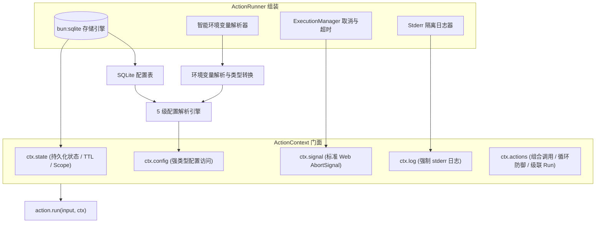
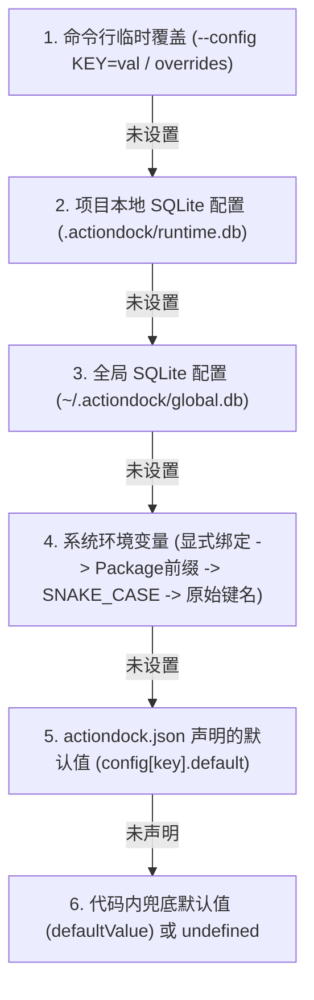

# ActionContext 核心能力详解

# 背景

在开发 AI Agent 工具时，如果直接在函数内部随意读取环境变量、使用内存全局变量存储状态或打印日志，会导致一系列不可控的系统隐患：

- **配置混乱与密钥泄露**：环境变量命名不统一（驼峰 vs 蛇形），多环境或多包冲突，难以统一覆盖与管理。
- **状态丢失与无法跨调用保留**：单进程工具执行完毕后内存清空，导致批处理断点、同步游标或调用计数无法持久化。
- **调用黑盒与死循环风险**：工具之间相互调用缺乏统一治理，容易形成 `A -> B -> A` 的死递归，且无法回溯调用关系。
- **日志污染通信协议**：控制台输出混杂在标准输出流中，导致上游 LLM 或 Agent 宿主解析返回结果时崩溃。
- **缺乏协作式中断机制**：超时或取消发生时，底层耗时网络请求与 I/O 无法响应式中止。

ActionDock 2.0 在 `run(input, ctx)` 中为每个 Action 注入了强类型的 `ActionContext` 上下文，系统化提供了 `ctx.config`、`ctx.state`、`ctx.actions`、`ctx.log` 与 `ctx.signal` 五大核心领域能力。

---

# 架构全景



---

# 核心能力详解

## 运行时配置管理 (`ctx.config`)

`ctx.config` 提供了读取运行时环境配置与敏感密钥（API Token、服务端地址、超时限制等）的标准接口。

### 级配置回退优先级

当调用 `ctx.config.get(key, defaultValue)` 时，ActionDock 按照以下 5 级优先级严格解析配置值：



### 环境变量探测与自动类型转换

ActionDock 内置了智能环境变量解析引擎，按以下顺序匹配环境变量：

- **显式 Env 绑定**：若在 `actiondock.json` 中声明了 `env`（例如 `"env": ["GITHUB_TOKEN", "GH_TOKEN"]`），优先检查对应变量。
- **Package 命名空间前缀**：自动检查 `ACTIONDOCK_<PACKAGE>_<KEY>`（例如 `ACTIONDOCK_TEAM_GITHUB_TOOLS_TOKEN`），防止多包环境变量命名冲突。
- **SNAKE_CASE 自动匹配**：驼峰命名与短横线键名自动转换为蛇形大写（如 `apiToken` 或 `api-token` $\rightarrow$ `API_TOKEN`）。
- **原始键名匹配**：直接探测同名键名。
- **智能类型转换**：
   - `boolean`：`"true"`、`"1"`、`"yes"`、`"on"` $\rightarrow$ `true`；`"false"`、`"0"`、`"no"`、`"off"` $\rightarrow$ `false`。
   - `number`：`"5000"` $\rightarrow$ `5000`。
   - `object` / `array`：标准 JSON 字符串自动解析为对应 JS 对象或数组。

### 配置声明与 API 使用示例

在 `actiondock.json` 中声明项目配置契约：
```json
{
  "id": "team.github-tools",
  "config": {
    "apiToken": {
      "description": "GitHub 个人访问令牌",
      "type": "string",
      "env": ["GITHUB_TOKEN", "GH_TOKEN"],
      "secret": true
    },
    "timeoutMs": {
      "description": "请求超时时间（毫秒）",
      "type": "number",
      "default": 5000,
      "env": "GITHUB_TIMEOUT_MS"
    },
    "enableDebug": {
      "description": "是否输出详细调试信息",
      "type": "boolean",
      "default": false
    }
  }
}
```

在 Action 源码中读取配置：
```ts
// 读取字符串配置（支持泛型推导）
const token = ctx.config.get<string>("apiToken");

// 读取配置并提供代码级兜底默认值
const apiBase = ctx.config.get("apiBaseUrl", "https://api.github.com");

// 读取布尔值与数值（环境变量注入时自动转换类型）
const timeoutMs = ctx.config.get<number>("timeoutMs", 5000);
const debugMode = ctx.config.get<boolean>("enableDebug", false);
```

---

## 持久化共享状态 (`ctx.state`)

`ctx.state` 是一个基于 `bun:sqlite` 的持久化 Key-Value 存储，用于跨 Action 执行保留业务数据。

### 典型应用场景
- **断点续传与 Checkpoint**：记录长耗时批量同步任务的进度游标。
- **分页与时间游标** (Cursor)：增量拉取日志、事件流或审计记录时的最新时间戳或 ID。
- **调用计数与滑动窗口**：统计调用频次或实现业务级软限流。
- **中间结果缓存**：缓存计算成本较高的临时数据。

### API 规范与操作示例

```ts
// 读取状态（支持泛型反序列化）
const lastCursor = await ctx.state.get<string>("last_synced_id");

// 写入状态（支持任意可 JSON 序列化的对象）
await ctx.state.set("last_synced_id", "evt_987654");
await ctx.state.set("checkpoint", {
  processed: 120,
  total: 500,
  updatedAt: new Date().toISOString(),
});

// 写入带有生存时间（TTL，秒）的状态（到期自动惰性清理）
await ctx.state.set("session_token", "jwt_token_xyz", 3600); // 1 小时后自动过期
await ctx.state.set("temp_cache", { status: "cached" }, 60);  // 60 秒后自动过期

// 删除指定状态
await ctx.state.delete("checkpoint");

// 列出匹配前缀的所有 Key（自动过滤并清理已过期的 Key）
const allSyncKeys = await ctx.state.keys("sync_");

// 命名空间隔离 (Scoped State Store)
const orderStore = ctx.state.scope("orders");
await orderStore.set("ord_1001", { amount: 99.5, status: "PAID" }, 86400);
const order = await orderStore.get("ord_1001");
```

---

## 跨 Action 组合调用 (`ctx.actions`)

ActionDock 支持将细粒度原子 Action 组合为高级复合 Action（Composite Action）。

通过普通 TypeScript `import` 导入其他 Action 定义，并使用 `ctx.actions.invoke(action, input)` 执行调用：

```ts
import { defineAction } from "@actiondock/sdk";
import getPrAction from "./get-pr";
import commentPrAction from "./comment-pr";

export default defineAction({
  id: "github.review-and-comment",
  description: "获取 PR 详情，执行评审并发帖",

  inputSchema: {
    type: "object",
    properties: {
      repo: { type: "string" },
      prNumber: { type: "number" },
    },
    required: ["repo", "prNumber"],
  },

  outputSchema: {
    type: "object",
    properties: {
      verdict: { type: "string" },
      commentId: { type: "number" },
    },
    required: ["verdict", "commentId"],
  },

  async run(input, ctx) {
    // 组合调用 getPrAction
    ctx.log.info(`[Step 1] 查询 PR #${input.prNumber}`);
    const pr = await ctx.actions.invoke(getPrAction, {
      repo: input.repo,
      prNumber: input.prNumber,
    });

    const verdict = pr.title.startsWith("fix")
      ? "修复类 PR：已通过自动化检查。"
      : "常规 PR：评审完成。";

    // 组合调用 commentPrAction
    ctx.log.info("[Step 2] 发表评审意见");
    const comment = await ctx.actions.invoke(commentPrAction, {
      repo: input.repo,
      prNumber: input.prNumber,
      body: verdict,
    });

    return {
      verdict,
      commentId: comment.id,
    };
  },
});
```

### 组合调用的四大核心保障

- **环境与存储透明共享**：子 Action 自动共享当前的 Config、State 与 Storage 数据库连接。
- **执行链路级联**：在 SQLite `runs` 记录表中，子 Action 会通过 `parent_run_id` 自动关联至父 Action，支持完整调用树追溯。
- **循环依赖死循环防御**：底层执行栈实时维护调用路径。一旦检测到 `A -> B -> A` 的循环依赖，立即中止并抛出 `ACTION_CYCLE_DETECTED` 错误。
- **取消信号层层穿透**：父 Action 触发取消（超时或中断）时，子 Action 会同步收到 `ctx.signal` 中断通知。

---

## 结构化日志隔离输出 (`ctx.log`)

`ctx.log` 提供了标准的结构化日志输出接口。

### 为什么强制输出至 `stderr`？
AI Agent 和自动化系统依赖 `stdout` 解析 Action 执行输出的标准 JSON Envelope。如果将 `console.log()` 输出混杂在 `stdout` 中，会导致 JSON 解析器直接崩溃。

`ctx.log` 会自动将所有日志格式化为 `[HH:MM:SS] [LEVEL] [action-id] 消息内容` 并**强制写入 stderr**，彻底实现日志与数据流的物理隔离。

### API 使用规范

```ts
// 调试诊断信息 (DEBUG)
ctx.log.debug("内部变量详情", { payload: rawData });

// 常规业务信息 (INFO)
ctx.log.info(`成功连接外部服务: ${endpoint}`);

// 警告信息 (WARN)
ctx.log.warn("接口调用耗时接近阈值 (2800ms)");

// 异常错误信息 (ERROR)
try {
  // ...
} catch (err: any) {
  ctx.log.error("处理数据发生异常", err);
}
```

---

## 响应式取消与超时信号 (`ctx.signal`)

`ctx.signal` 是一个标准的 Web API `AbortSignal` 对象，为 Action 提供了感知外部中断、超时以及客户端取消的响应式能力。

### 大触发源
- **CLI 命令行超时**：执行时传入 `--timeout 30s`，超时自动触发 abort。
- **终端交互中断**：用户在终端按下 `Ctrl+C`（`SIGINT`），信号立即广播给 Action。
- **MCP 客户端取消**：Claude Code、Cursor 等发送 `notifications/cancelled` 或 `tasks/cancel` 时直通 Action。
- **远程任务取消**：通过 `ac runs cancel <runId>` 调用服务端取消端点。

### API 使用示例

```ts
import { defineAction } from "@actiondock/sdk";

export default defineAction({
  id: "data.batch-process",
  description: "批量处理海量数据",

  inputSchema: {
    type: "object",
    properties: {
      items: { type: "array", items: { type: "string" } },
    },
    required: ["items"],
  },

  outputSchema: {
    type: "object",
    properties: {
      processedCount: { type: "number" },
    },
    required: ["processedCount"],
  },

  async run(input, ctx) {
    let processedCount = 0;

    for (const item of input.items) {
      // 循环内主动检查取消状态，一旦被取消立即抛出 AbortError 退出
      ctx.signal.throwIfAborted();

      // 将 signal 传给原生 fetch（超时或取消时立即断开底层 TCP 连接）
      await fetch(`https://api.example.com/sync?item=${encodeURIComponent(item)}`, {
        signal: ctx.signal,
      });

      processedCount++;
    }

    return { processedCount };
  },
});
```

---

# 核心能力使用原则

| 场景 | 推荐使用的能力 | 避免的反模式 |
| :--- | :--- | :--- |
| **API 密钥 / 服务端 URL** | `ctx.config.get(...)` | 直接读取 `process.env.API_KEY`（无法享受 5 级回退与 CLI 覆盖） |
| **同步游标 / 断点进度** | `ctx.state.set(...)` | 使用模块级全局变量 `let cursor = 0`（进程退出即丢失） |
| **调用其他 Action** | `ctx.actions.invoke(Action, input)` | 直接调用 `Action.run(input, ctx)`（丢失 Schema 校验、Run 追踪与循环防御） |
| **打印业务 / 调试日志** | `ctx.log.info(...)` | 使用 `console.log(...)`（污染 stdout 导致 Agent JSON 解析崩溃） |
| **网络请求与长耗时循环** | 传递 `ctx.signal` 与 `throwIfAborted()` | 忽略信号（导致任务被取消后仍持续占用后台资源） |

---

# 文档导航

- [Action 编写指南](action-authoring.md)：从零编写标准 Action 模块。
- [存储与状态管理机制](storage-and-state.md)：深入 SQLite 数据模型、路径解析与 TTL 机制。
- [测试与验证指南](testing-guide.md)：使用 `createTestRuntime` 内存测试 Config 与 State。
