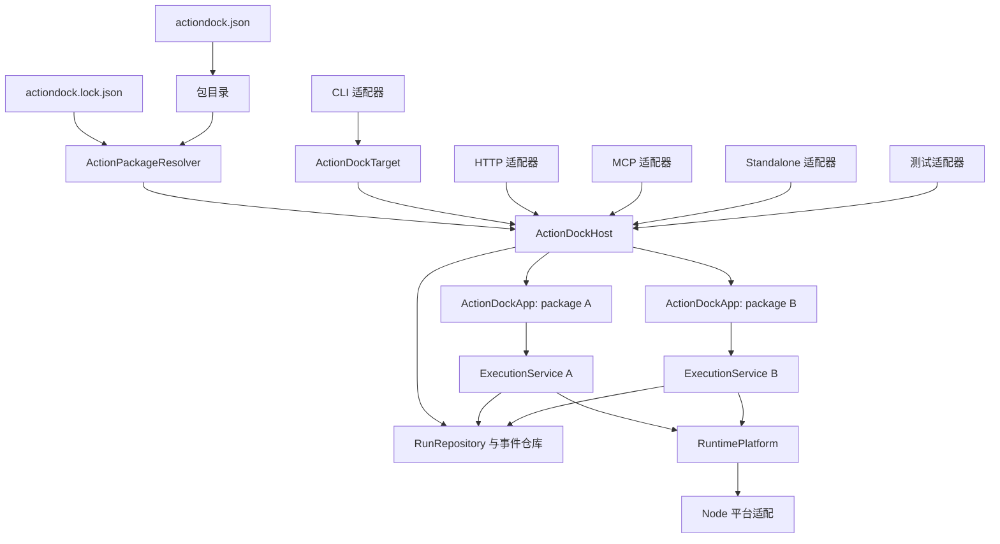
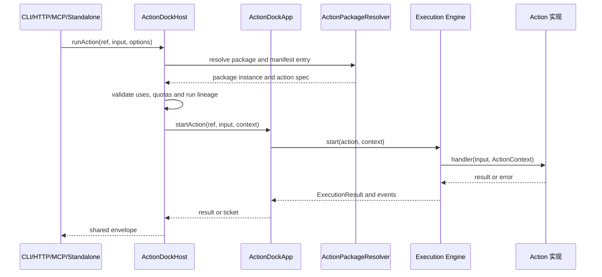

## 背景与目标

ActionDock 2.0 已经具备 Action 执行、持久化运行记录、跨包依赖、HTTP、MCP、Skill 导出和独立二进制等能力，但这些能力分散在多个入口和多个运行时实现中。继续在现有边界上叠加功能，会让相同语义在不同入口中继续分叉。ActionDock 2.0 仍处于开发阶段，本次直接重构 2.0 目标态，不升级为 3.0，也不为开发中的旧结构设计迁移流程或兼容层。

当前实现中最直接的问题包括：

- Standalone 在 `packages/core/src/runtime/standalone.ts:33` 自己解析命令、创建存储、创建 `DefaultExecutionService` 并实现 `list`、`describe`、`run`、`config`、`state` 等业务路径；`packages/runtime-cli/src/commands/action.ts:38` 又维护一套本地、远程和 Standalone 执行分支。相同 Action 在不同入口可能得到不同的初始化、错误和资源关闭行为。
- 完整的执行契约实际已经由 `packages/core/src/execution/types.ts:61` 定义，包含同步执行、异步启动、运行查询、取消、事件订阅和优雅关闭。任何只保留 `runAction` 的新门面都会丢失长任务和运维能力。
- `packages/core/src/runtime/process.ts`、`packages/core/src/runtime/module-loader.ts`、`packages/core/src/storage/driver.ts`、`packages/core/src/server/server.ts`、`packages/core/src/runtime/events.ts` 和 `packages/sdk/src/test-runtime.ts` 都存在全局默认实现或全局测试提供器。`packages/runtime-node/src/index.ts` 和 `packages/runtime-bun/src/index.ts` 通过 Setter 修改这些全局变量，导致并行测试、同进程多运行时和嵌入式调用相互污染。
- `packages/core/src/server/runtime-registry.ts:1`、`packages/core/src/server/routes/actions.ts:1` 和 `packages/mcp/src/adapter.ts:1` 分别维护项目发现、加载、存储、执行服务和运行管理，Transport 层实际上重复实现了 Engine 的职责。
- `packages/core/src/project/loader.ts` 会按目录发现并动态加载 Action；`packages/core/src/project/manifest.ts` 同时维护 Manifest 与源码定义的同步关系。Action 的标识、描述、Schema、标签、注解和 `uses` 在多个位置重复声明，必须通过 `action sync` 修复漂移。
- `packages/builder/src/planner.ts:518` 以后既读取 Manifest，又通过 TypeScript 源码做静态扫描；`packages/builder/src/planner.ts:614` 以后还要自行计算 `uses` 闭包。构建器因此承担了一个不完整的模块打包器，同时把 TypeScript 作为生产依赖。
- `scripts/build.ts`、`scripts/pack-smoke-test.ts`、`.github/workflows/ci.yml` 和 `.github/workflows/publish.yml` 把九个包和 Bun 命令硬编码在流程中。包边界变化时，构建、打包、发布和验证必须同步修改。
- `examples/github-tools/actions/review-pr.ts:2` 使用没有扩展名的相对导入，在原生 Node 执行时触发 `ERR_MODULE_NOT_FOUND`。如果 2.0 采用 Node 原生 TypeScript，必须把这类限制变成校验规则，而不是依赖运行时偶然成功。

本次设计的目标是：

- 让一个 `ActionDockApp` 成为一个 Action Package 的唯一运行单元，所有入口共享同一执行语义。
- 让 `ActionDockHost` 负责多包发现、依赖解析、跨包调用、运行生命周期和配额，而不是让 CLI、HTTP 或 MCP 各自拼装这些能力。
- 用 `actiondock.json` 作为 ActionDock 元数据的唯一事实源，取消 Manifest 与源码元数据、Playbook frontmatter 之间的同步机制。
- 通过显式 `RuntimePlatform` 注入存储、进程、模块和时钟实现，消除全局运行时 Setter；开发、测试、构建和生产运行统一使用 Node，并删除 Bun 依赖。
- 完整支持可复现的第三方 Action Package 依赖。禁止的是未声明、不可复现的来源，不是跨包调用本身。
- 保留声明式构建规划和跨包依赖闭包；删除 TypeScript AST 模块图扫描，不在 ActionDock 内重新实现通用打包器。
- 让 CLI、HTTP、MCP、远程客户端、测试和 Standalone 只负责适配输入输出，不再复制业务执行逻辑。

本次不以包数量为验收目标。目标状态保留 `sdk`、`core`、`runtime-node`、`testing`、`builder`、`mcp` 和 `cli`，删除职责重复的 `runtime-cli` 和不再需要的 `runtime-bun`。`runtime-node` 仍保留，是为了把 Node 原生依赖隔离在平台边界内；Builder 保留，是因为包级选择、跨包传递依赖、源码 Skill 导出和 Node 目录型构建仍然是独立职责。

建议分支：`refactor/actiondock-2-node-runtime`

以上名称只是建议，不代表该分支已经存在。

## 现状与约束

### 运行环境

ActionDock 2.0 的开发、测试、构建和生产运行统一使用 Node.js，Bun 不再是运行、构建或发布依赖。Action 源码允许使用 Node 原生 TypeScript，但必须限制为可擦除语法，并要求用户项目使用 Node.js `>=24.12.0` 和 TypeScript `>=5.8`。该版本选择是为了让类型擦除、NodeNext 模块解析和带扩展名的 TypeScript 导入成为明确的运行时契约。

仓库当前仍大量使用 `bun:test`、`Bun.spawn` 和 Bun 脚本，这是需要删除的现状依赖。重构后的仓库默认脚本切换到 Node.js 与 npm 工作流，测试使用 `node:test`，生产代码、构建脚本和发布流水线不再调用 `Bun.*` 或 `bun` 命令。

### 当前外部契约

现有 `ExecutionService` 是必须保留的行为基线：

```ts
interface ExecutionService {
  execute(
    ref: ActionRef | string,
    input: JsonValue,
    options?: ExecuteOptions,
  ): Promise<ExecutionResult>;

  start(
    ref: ActionRef | string,
    input: JsonValue,
    options?: ExecuteOptions,
  ): Promise<ExecutionTicket>;

  get(runId: string): Promise<RunRecord | undefined>;
  cancel(runId: string, reason?: string): Promise<CancelResult>;
  events(
    runId: string,
    options?: { after?: number; signal?: AbortSignal },
  ): AsyncIterable<ExecutionEvent>;
  close(options?: { graceMs?: number }): Promise<void>;
}
```

2.0 目标态不改变执行结果信封的基本形状。成功结果仍返回 `ok`、`runId` 和 `data`，失败结果仍返回 `ok`、`runId` 和结构化 `RuntimeError`。新增的包、实例、代次和父子运行信息写入已有运行记录与事件字段，不通过另一个入口定义一套新的结果格式。

### 约束与取舍

- Action 是宿主进程内执行的 TypeScript 或 JavaScript 代码，安装第三方包等同于授予其宿主进程权限。Manifest 和 `uses` 解决可发现性、可复现性和依赖边界，不提供进程级安全沙箱。
- `uses` 表示同一 Host 内的包间调用，不隐式发起网络请求或远程服务调用。需要远程调用时，使用 CLI 的远程 Target 或明确的 HTTP 客户端 Action。
- 独立交付默认输出 Node.js 可运行的目录或压缩包，可以包含多个 Package；每个 Package 的 Manifest、配置和状态空间仍然独立。目标环境必须安装满足版本约束的 Node.js。单次独立进程不提供跨进程异步任务语义；收到异步请求时必须返回专用错误。
- 源码型 Skill 导出以 Manifest 声明的文件为边界，不承诺模块级 AST 裁剪。2.0 不承诺单文件可执行程序或跨平台交叉编译；Node SEA 只有在验证模块加载、原生模块、资产、代码签名和目标平台构建后，才可以作为后续能力另行设计。
- 开发中的旧结构直接随本次重构更新，不提供 `ad migrate`、旧格式兼容读取或长期兼容 Shim。示例、测试和文档必须与目标结构在同一变更中更新。

### 版本边界

本设计的产品、Manifest 和文档版本继续称为 2.0。由于 2.0 尚处于开发阶段，仓库内旧结构不形成兼容基线，直接更新到目标结构。已经推送到 npm 的历史版本保持不可变；目标实现发布前使用 `beta` 等预发布分发标签验证，正式验收后再以新的 2.0.x 标签更新 `latest`，不能覆盖已有版本号。

## 整体架构

### 目标调用关系



`ExecutionService A` 与 `ExecutionService B` 是按 App 隔离的实例，但由同一套执行内核实现创建。图中的 `RunRepository`、事件仓库和平台对象属于 Host 生命周期，不是进程级全局变量。

### ActionDockApp

`ActionDockApp` 表示一个已打开的 Action Package。它持有该包的 Manifest、按需加载器、配置读取器、状态存储和 `ExecutionService`，并使用 Host 注入的运行记录仓库与事件接收器。单包使用时，工厂为 App 创建只服务于该包的同类运行服务。这样配置和状态仍按包隔离，运行 ID、父子关系和事件序号则在一个 Host 内拥有唯一事实源。

目标接口如下，具体类型以 `@actiondock/core` 的公开类型为准：

```ts
interface ActionDockApp {
  info(): Promise<PackageInfo>;
  listActions(options?: ListActionsOptions): Promise<ActionSummary[]>;
  describeAction(id: string): Promise<ActionSpec>;
  listPlaybooks(): Promise<PlaybookSummary[]>;
  describePlaybook(id: string): Promise<PlaybookSpec>;

  runAction(
    id: string,
    input: JsonValue,
    options?: ExecuteOptions,
  ): Promise<ExecutionResult>;
  startAction(
    id: string,
    input: JsonValue,
    options?: ExecuteOptions,
  ): Promise<ExecutionTicket>;
  getRun(runId: string): Promise<RunRecord | undefined>;
  cancelRun(runId: string, reason?: string): Promise<CancelResult>;
  events(
    runId: string,
    options?: { after?: number; signal?: AbortSignal },
  ): AsyncIterable<ExecutionEvent>;

  getConfig(key: string): Promise<unknown>;
  setConfig(key: string, value: JsonValue): Promise<void>;
  getState<T = JsonValue>(key: string, options?: StateOptions): Promise<T | undefined>;
  setState<T = JsonValue>(key: string, value: T, options?: StateOptions): Promise<void>;
  deleteState(key: string, options?: StateOptions): Promise<boolean>;
  close(options?: { graceMs?: number }): Promise<void>;
}
```

App 的 `runAction` 和 `startAction` 只接受本包短 ID。Action 内部需要调用其他包时，通过 Host 注入的 `ActionInvoker` 使用完全限定 ID，不能让 App 自行扫描或打开另一个包。`runAction`、`startAction`、`getRun`、`cancelRun`、`events` 和 `close` 必须直接复用执行内核的完整能力。`listActions`、`describeAction` 和 `listPlaybooks` 只读取静态 Manifest；它们不会为了展示列表而导入全部 Action 模块。

### ActionDockHost

`ActionDockHost` 是一个或多个 `ActionDockApp` 的宿主。它负责：

- 从当前项目 Manifest、锁文件和显式开发覆盖解析已声明的包，建立包 ID 到包实例的索引；不遍历并暴露 `node_modules` 中所有可见包。
- 校验包 ID 冲突、锁文件完整性、Manifest 摘要和运行时兼容性。
- 按完全限定引用路由到目标 App，并在调用前验证调用者的 `uses` 声明。
- 管理根运行、父子运行、跨包事件关联、全局并发配额、调用深度和子任务数量。
- 持有 Host 级 `RunRepository` 和事件序列，为全局唯一的 `runId` 建立包、Action 与父子关系索引。
- 为 HTTP、MCP 和远程 CLI Target 提供统一的多包查询与运行入口。
- 在关闭时拒绝新任务，向所有活跃 App 传播取消并等待其收尾。

Host 不把不同 Package 合并为一个配置或状态空间，也不把外部包的 Action 注册到调用者的本地 Action 表中。每个 App 保留自己的 `packageId`、`packageInstanceId`、`generationId` 和存储命名空间。

### ActionDockTarget

CLI 先解析调用目标，再调用统一 Target 契约。Target 可以是当前工作区、本地已安装包、显式开发链接、远程 Profile 或显式服务器地址。Target 始终表示一个可能包含多个 Package 的 Host，不用返回值联合类型表达单包和多包差异。

```ts
interface ActionDockTarget {
  info(): Promise<TargetInfo>;
  listPackages(): Promise<PackageInfo[]>;
  listActions(options?: ListActionsOptions): Promise<ActionSummary[]>;
  describeAction(ref: ActionRef | string): Promise<ActionSpec>;
  listPlaybooks(options?: ListPlaybooksOptions): Promise<PlaybookSummary[]>;
  describePlaybook(ref: PlaybookRef | string): Promise<PlaybookSpec>;
  runAction(
    ref: ActionRef | string,
    input: JsonValue,
    options?: ExecuteOptions,
  ): Promise<ExecutionResult>;
  startAction(
    ref: ActionRef | string,
    input: JsonValue,
    options?: ExecuteOptions,
  ): Promise<ExecutionTicket>;
  listRuns(options?: ListRunsOptions): Promise<RunRecord[]>;
  getRun(runId: string): Promise<RunRecord | undefined>;
  cancelRun(runId: string, reason?: string): Promise<CancelResult>;
  events(runId: string, options?: EventOptions): AsyncIterable<ExecutionEvent>;

  getConfig(packageId: string, key: string): Promise<unknown>;
  setConfig(packageId: string, key: string, value: JsonValue): Promise<void>;
  getState<T = JsonValue>(
    packageId: string,
    key: string,
    options?: StateOptions,
  ): Promise<T | undefined>;
  setState<T = JsonValue>(
    packageId: string,
    key: string,
    value: T,
    options?: StateOptions,
  ): Promise<void>;
  deleteState(packageId: string, key: string, options?: StateOptions): Promise<boolean>;
  close(): Promise<void>;
}
```

`TargetInfo` 包含 Target 身份、Package 清单和服务端声明的能力集合。远程端没有启用管理能力时，配置或状态方法返回 `TARGET_CAPABILITY_UNAVAILABLE`，而不是由 CLI 猜测或绕过远程 Target 访问本地数据。本地 Target 内部调用 Host，远程 Target 只负责编码协议、鉴权、超时和连接关闭。CLI 命令不再判断某个目标是否应该创建存储或执行服务。

### 统一执行流



CLI、HTTP、MCP 和独立入口都不能绕过 Host 的依赖检查和 App 的执行内核。单包单元测试可以直接构造 App，但此时不存在跨包解析能力；集成测试必须通过 Host。适配器可以改变命令行参数、HTTP 状态码或 MCP 结果包装，但不能改变 Action 的输入校验、取消、事件、状态和错误码语义。

## 包边界与职责

### 目标包边界

| 包 | 负责 | 不负责 |
| --- | --- | --- |
| `@actiondock/sdk` | `defineAction`、Action 上下文和公共数据契约 | 存储实现、模块加载、CLI、测试运行时、全局注册 |
| `@actiondock/core` | Manifest 模型、包解析契约、`ActionDockApp`、`ActionDockHost`、执行内核、存储接口、Schema 校验和错误模型 | Node 具体 API、命令解析、HTTP/MCP 协议、构建产物编译 |
| `@actiondock/runtime-node` | Node SQLite、`node:child_process`、原生模块加载、Node HTTP 服务器和 Node 平台组合器 | 业务执行、包发现和 CLI 命令 |
| `@actiondock/testing` | `MemoryStorage`、`FakeClock`、Mock Process、测试平台和测试断言辅助 | 生产默认实现、全局测试 Provider |
| `@actiondock/builder` | 声明式 `SelectionPlanner`、Node 目录型构建和 Skill 导出 | TypeScript AST 模块扫描、单文件编译、运行时执行、命令注册 |
| `@actiondock/mcp` | 将 `ActionDockTarget` 映射为 MCP Tool、Task、Resource 和取消处理 | 项目发现、Storage、Action Loader、ExecutionService 初始化 |
| `@actiondock/cli` | `ad` 命令、Profile、开发链接、HTTP 客户端和服务器适配、构建与导出命令、渲染 | 重新实现 Action 执行语义 |

`@actiondock/runtime-cli` 和 `@actiondock/runtime-bun` 在目标态删除。`runtime-cli` 的命令解析、渲染和错误格式化按职责移动到 `@actiondock/cli`；独立入口只保留自己的轻量参数解析器，并调用 App。Bun SQLite、进程、HTTP、类型声明和全局初始化入口不再发布。

Core 中原有的服务器路由、Profile、Doctor 和持久化注册表实现也不再作为执行内核的公共能力：包解析和跨包运行所需的 `ActionPackageResolver` 留在 Core，Profile、链接注册表、HTTP 路由和 Doctor 命令移动到 CLI；构建和导出继续由 Builder 负责。

### 依赖方向

```mermaid
flowchart BT
  Core[@actiondock/core] --> Sdk[@actiondock/sdk]
  Runtime[@actiondock/runtime-node] --> Core
  Testing[@actiondock/testing] --> Core
  Testing --> Sdk
  Builder[@actiondock/builder] --> Core
  Mcp[@actiondock/mcp] --> Core
  Cli[@actiondock/cli] --> Core
  Cli --> Runtime
  Cli --> Builder
  Cli --> Mcp
```

箭头表示源码依赖方向。

依赖规则如下：

- `core` 不反向依赖 `cli`、`mcp`、`builder` 或任何平台包。
- 平台包只实现 `RuntimePlatform`，不能通过导入内部模块修改 Core 全局状态。
- `testing` 通过显式测试平台构造 App 或 Host，不提供隐式 Provider。
- `mcp` 只依赖 Core 的公开 Target 契约和 MCP SDK。
- `cli` 可以组合所有适配器，但命令实现必须通过 Target、App 或 Host 进入业务路径。
- 所有包的公开入口使用显式导出列表，禁止通过 `export * from "./everything"` 把内部实现固化为公共 API。

SDK 的生产依赖保持为零。`@actiondock/sdk` 只保留 `defineAction`、`ActionContext`、`ActionInvoker`、`Config`、`StateStore`、`Logger`、`ProcessAPI`、执行结果和 Schema 类型；`execCli`、`createTestRuntime`、`MemoryConfig`、`MemoryStateStore`、`MemoryLogger` 以及测试 Provider 全部移动到 `@actiondock/testing`。`spawnDetached` 作为 `ProcessAPI` 契约保留，具体实现由平台包提供。Playbook 改为纯 Markdown 后，运行时和 Builder 不再依赖 `yaml`。

### 公共入口

Core 只公开高层构造和稳定契约：

```ts
import {
  createActionDockApp,
  createActionDockHost,
  openProject,
} from "@actiondock/core";

import { createNodePlatform } from "@actiondock/runtime-node";
```

Storage 驱动、注册表实现、Project Loader 内部类型、模板和 Setter 不属于公共入口。平台包可以公开驱动类型，供测试或高级集成使用，但 Core 不再提供可变全局工厂。

Standalone 的轻量参数解析器和适配器从 `@actiondock/cli/standalone` 暴露；该入口不引入 Commander。Builder 生成的入口可以只嵌入一个 App，也可以嵌入 Host 以支持多个 Package，但两者都必须调用相同的执行内核。

## Manifest v2

### 唯一事实源

目标项目只保留 `actiondock.json` 作为 ActionDock 元数据来源。`package.json` 是 npm 元数据的唯一来源，负责 npm 包名称、版本、描述、Node 版本约束、JavaScript 入口和依赖版本范围；包管理器锁文件负责 npm 依赖的精确解析。`actiondock.json` 不重复这些字段，只负责逻辑包 ID、Action、Playbook、配置、导出边界和逻辑包 ID 到 npm 包名的映射。

当前开发结构使用的 `actiondock.manifest.json`、`actionsDir`、`playbooksDir`、Playbook YAML frontmatter、Action 源码元数据和 `action sync` 在目标态删除。目标态只读取合并后的 `actiondock.json`，不在新旧文件之间做同步，也不提供自动转换；仓库示例和测试数据直接更新为新格式。

### Manifest 结构

下面的示例展示完整方向，字段的最终 JSON Schema 由 `@actiondock/core` 发布并版本化：

```json
{
  "$schema": "https://actiondock.dev/schema/v2.json",
  "schemaVersion": 2,
  "id": "team4u.github-tools",
  "config": {
    "GITHUB_TOKEN": {
      "description": "GitHub token",
      "type": "string",
      "secret": true,
      "allowInvocationOverride": false,
      "env": ["GITHUB_TOKEN"]
    }
  },
  "actions": {
    "get-pr": {
      "entry": "./actions/get-pr.ts",
      "description": "Get a pull request",
      "inputSchema": {
        "type": "object",
        "properties": {
          "repo": { "type": "string" },
          "pullNumber": { "type": "integer", "minimum": 1 }
        },
        "required": ["repo", "pullNumber"],
        "additionalProperties": false
      },
      "outputSchema": {
        "type": "object",
        "properties": { "title": { "type": "string" } },
        "required": ["title"],
        "additionalProperties": false
      },
      "tags": ["github", "pull-request"],
      "annotations": { "readOnly": true },
      "uses": []
    }
  },
  "playbooks": {
    "review-pr": {
      "entry": "./playbooks/review-pr.md",
      "description": "Review pull request workflow",
      "actions": ["get-pr", "someone.github-actions/check-diff"]
    }
  },
  "dependencies": {
    "someone.github-actions": "@someone/actiondock-github-actions"
  },
  "files": ["actions", "lib", "playbooks"],
  "assets": ["assets/review-template.md"]
}
```

对应的 `package.json` 负责 npm 维度的信息：

```json
{
  "name": "@team4u/actiondock-github-tools",
  "version": "1.0.0",
  "description": "GitHub tools for AI agents",
  "type": "module",
  "engines": {
    "node": ">=24.12.0"
  },
  "dependencies": {
    "@actiondock/sdk": "^2.0.0",
    "@someone/actiondock-github-actions": "^1.4.0"
  }
}
```

字段约束如下：

- `id` 是包的逻辑唯一标识，必须匹配 `^[a-z0-9][a-z0-9.-]*$` 且不能包含 `/`；同一 Host 中不得出现两个不同包实例声明同一个逻辑 ID，开发覆盖也不能静默覆盖已安装版本。
- `actions` 和 `playbooks` 使用包内小写短 ID，必须匹配 `^[a-z0-9][a-z0-9._-]*$` 且不能包含 `/`。跨包引用使用 `<package-id>/<action-id>` 完全限定标识，并且只按唯一的 `/` 分隔一次。
- `entry` 必须是以包根为基准的相对路径，不能包含 `..`、绝对路径或符号链接逃逸。加载器在打开文件前再次执行路径包含校验。
- `inputSchema`、`outputSchema`、标签、注解和 `uses` 只出现在 Manifest。Action 源文件只提供实现和 TypeScript 泛型约束。
- `files` 是导出边界，目录按包根递归复制；未被声明的源码、测试、密钥和本地配置不会自动进入 Skill。
- `dependencies` 只声明外部 Action Package 的逻辑 ID 到 npm 包名的映射。允许的版本范围来自 `package.json`，精确版本和完整性摘要分别由包管理器锁文件与 `actiondock.lock.json` 保存。
- `package.json.engines.node` 描述必要的 Node 版本约束，`package.json.type` 和 `exports` 描述模块格式与发布入口。Host 在导入 Action 前校验这些约束。
- `config.<key>.allowInvocationOverride` 默认为 `false`。只有显式允许的键才能被单次调用覆盖；网络调用还必须具有对应执行权限。秘密配置不能仅凭请求参数覆盖。

### Action 实现

Action 文件只写实现。官方模板从 Manifest Schema 单向生成类型，避免再手写一份输入输出结构：

```ts
import { defineAction } from "@actiondock/sdk";
import type {
  ActionInput,
  ActionOutput,
} from "../.actiondock/generated/actions.js";

export default defineAction<
  ActionInput<"get-pr">,
  ActionOutput<"get-pr">
>(async (input, ctx) => {
  const token = ctx.config.get<string>("GITHUB_TOKEN");
  ctx.log.info("loading pull request", { repo: input.repo, pullNumber: input.pullNumber });
  return { title: "..." };
});
```

`defineAction` 只负责类型约束和 Handler 标准化，不接受 `id`、`description`、Schema、标签、注解或 `uses`。运行时使用 Manifest 的 Action ID 和契约，模块默认导出必须是可执行 Handler。

### 类型生成

Manifest 的 JSON Schema 是运行时契约的唯一事实源。`ad generate types` 根据它生成 `.actiondock/generated/actions.d.ts`，文件头记录 Manifest 摘要；生成过程只从 Manifest 到类型，不读取生成文件反向修改 Manifest。`ad new action` 在同一项目修改事务中增加 Manifest 条目并刷新类型，`ad validate` 只读比较摘要并在类型过期时失败，不在校验过程中写文件。

生成类型只供 TypeScript 编译和编辑器使用，不进入运行时元数据。开发者可以不用生成类型并显式把输入声明为 `unknown`，但不能另行声明会被框架当作 Schema 的 `Input` 或 `Output` 元数据。这样即使类型文件缺失或过期，运行时仍只按 Manifest 校验，不会出现两个互相竞争的行为来源。

### Playbook

Playbook 文件是没有 frontmatter 的 Markdown。其元数据、入口和 Action 依赖全部来自 Manifest；正文负责描述给 Agent 或用户阅读的操作规程。`actions` 中可以写短 ID，也可以写跨包完全限定 ID。`ad playbook validate` 使用 Host 的包索引检查这些引用，并报告缺失包、缺失 Action 和未声明依赖。

## Action 加载与跨包依赖

### 包解析来源

`ActionPackageResolver` 按以下规则建立包索引：

- 当前工作区根目录的 `actiondock.json`。
- `actiondock.json.dependencies` 显式声明且由包管理器安装的 Action Package。
- 包管理器锁文件和 `actiondock.lock.json` 共同指定的精确实例、来源和完整性摘要。
- 仅在开发命令显式启用时使用 `ad link` 的本地覆盖。链接信息属于开发状态，不写入可移植产物，也不能替代发布依赖。

运行期间不根据 `uses` 自动从网络下载包。缺少安装包时，解析器返回可诊断错误并提示安装入口，例如 `ad add @someone/actiondock-github-actions`；它不会静默使用全局目录或旧版本。

使用共享 Action 的标准流程是先安装并锁定包，再在调用者 Manifest 声明直接依赖，最后使用完全限定 ID 调用：

```bash
ad add @someone/actiondock-github-actions
ad validate
ad run someone.github-actions/get-pr --input '{"repo":"team4u/action-dock","pullNumber":42}'
```

`ad add <npm-package>` 获取并校验依赖包的 `actiondock.json`，确认 npm 包名、逻辑包 ID 和版本范围后，再调用项目选定的包管理器安装依赖。安装脚本默认禁用；只有用户显式传入 `--allow-install-scripts` 时才允许执行，并在确认信息和运行记录中显示即将执行第三方代码。Action Package 必须发布可直接加载的 JavaScript，不能把安装脚本当作必要编译步骤。

跨多个文件和 `node_modules` 的变更无法由一次文件重命名保证原子性。`ad add` 和 `ad remove` 必须获取项目级修改锁，并在 `.actiondock/transactions/<id>/` 写入操作日志和 `package.json`、包管理器锁文件、`actiondock.json`、`actiondock.lock.json` 的快照。各文件在临时路径校验后逐个替换，全部完成才写提交标记；失败或进程异常退出后，下一次 ActionDock 命令先依据日志恢复快照或完成提交。包管理器留下但未被 Manifest 与 ActionDock 锁文件共同引用的目录不得进入 Host 索引。

`ad remove` 在修改前检查反向 `uses` 和 Playbook 引用；仍有调用者时返回依赖冲突，不提供静默级联删除。同一 Host 对一个逻辑包 ID 只允许一个解析版本。直接或传递版本范围无法收敛时返回 `ACTION_PACKAGE_VERSION_CONFLICT`，不能依赖 `node_modules` 的嵌套结构随机选择一个实例。

Action 内部级联调用使用相同的完全限定 ID：

```ts
const result = await ctx.actions.invoke("someone.github-actions/get-pr", input);
```

因此，共享 Action 可以由其他人发布和维护；调用者不需要把对方的源码复制到自己的 `actions` 目录，只需要通过 npm 包和锁文件固定来源。

第三方包的安装名称和路由名称分离：

- npm 包名，例如 `@someone/actiondock-github-actions`，由 npm 负责安装和版本解析。
- `actiondock.json` 中的包 ID，例如 `someone.github-actions`，由 ActionDock 负责路由。
- `actiondock.lock.json` 将包 ID、npm 包名、解析版本、来源和摘要绑定起来。

发布的 Action Package 必须携带 `actiondock.json`、编译后的 JavaScript 入口和所需运行时依赖。依赖包不能只发布未编译 TypeScript 并要求调用者安装额外转译器。发布构建在临时目录生成 npm 包：用 `tsc` 把源码入口输出为 JavaScript，并单向重写临时 Manifest 的 `entry` 指向发布目录；源项目的 Manifest 不被修改。`npm pack` 烟雾测试必须从压缩包读取并验证重写后的每个入口。

### 锁文件

`actiondock.lock.json` 记录每个外部包的可复现解析结果：

```json
{
  "lockfileVersion": 1,
  "packages": {
    "someone.github-actions": {
      "package": "@someone/actiondock-github-actions",
      "resolved": "1.4.2",
      "source": "npm",
      "integrity": "sha512-...",
      "manifestDigest": "sha256-..."
    }
  }
}
```

包管理器锁文件负责 npm tarball 的精确来源和完整性，`actiondock.lock.json` 负责逻辑包 ID 到 npm 包实例及 Manifest 摘要的绑定。安装、构建和导出同时校验二者；Manifest 摘要变化、解析版本分歧或任一锁文件未更新时，命令失败并要求重新解析，运行时不会接受不一致的包。

### 引用和声明检查

通过 `ctx.actions.invoke` 路由的 Action 只能调用：

- 当前包 Manifest 的 `uses` 中声明的本地或跨包 Action。
- 由 Host 注入的、经过策略校验的内置系统 Action。

调用完全限定示例：

```ts
await ctx.actions.invoke(
  "someone.github-actions/get-pr",
  { repo: input.repo, pullNumber: input.pullNumber },
);
```

调用规则如下：

- 本包调用使用短 ID 或本包的完全限定 ID；跨包调用必须使用完全限定 ID。
- `uses` 只接受精确 Action ID，不支持包级通配符；需要新增能力时必须显式修改调用者 Manifest 和锁文件。
- Host 在调用前检查调用者 Action 的 `uses`。未声明时返回 `UNDECLARED_ACTION_DEPENDENCY`。
- 包 ID 不存在时返回 `PACKAGE_NOT_FOUND`；目标 Action 不存在时返回 `ACTION_NOT_FOUND`；入口导入失败时返回 `ACTION_LOAD_FAILED`；同一 Host 出现逻辑 ID 冲突时返回 `PACKAGE_ID_CONFLICT`。
- 调用者只声明直接 `uses`；构建和导出规划器递归展开目标 Action 自己声明的直接依赖，形成传递闭包。目标包自身的 Manifest 仍然保留，不把多个包扁平合并。
- 解析失败必须保留包 ID、Action ID、入口路径、根因和可执行修复提示。不得把所有失败折叠成“Action not found”。

### 子运行语义

跨包调用创建子运行，但不创建新的根任务：

- 子运行继承取消信号、根运行 ID、调用链追踪信息和 Host 的配额。
- `parentRunId` 指向直接调用者；`rootRunId` 在整个调用树中保持不变。
- 子运行事件进入同一个 Host 事件仓库，事件携带包 ID、Action ID、父子关系、运行内序号和 Host 级单调递增事件 ID，调用者可以按根运行聚合进度和日志。
- 目标 App 使用自己的配置解析和状态存储。调用者的临时配置不会自动覆盖目标包的秘密配置；需要传值时必须通过 Action 输入显式传递。
- 深度、活跃子运行数和单个根运行的累计子运行数由 Host 统一限制。检测到循环调用或超过配额时返回 `ACTION_CALL_CYCLE` 或 `ACTION_SUBRUN_LIMIT`，并取消当前调用树中尚未完成的子运行。
- 目标包关闭、加载失败或取消时，父运行得到结构化错误，不能被包装成成功的空结果。

### 懒加载与静态发现

`list`、`info`、`describe` 和构建规划只读取 Manifest，不导入 Action 入口。首次执行某个 Action 时，加载器才解析并缓存该入口；缓存键包含包实例和代次，开发链接重新解析后不会复用旧模块。

Action 模块不应在导入阶段执行网络请求、写状态或启动进程。`ad validate` 默认不导入 Action，只校验 Manifest、路径、Node 语法约束和依赖闭包；需要实际加载和执行的检查属于 `ad test`。框架无法可靠判断任意模块的导入副作用，因此不能把“无副作用”写成已由校验器保证的安全属性。

## 统一执行内核

### App 与执行服务的关系

`ActionDockApp` 内部组合唯一的 `ExecutionService` 实例。CLI、HTTP、MCP 和 Standalone 不直接创建 `DefaultExecutionService`，也不直接操作 `ActionRunner`。App 负责把 Manifest 契约、包上下文和 Host 调用器传给执行服务。

伪代码如下：

```ts
const app = await createActionDockApp({
  manifest,
  packageRoot,
  platform,
  configStore,
  stateStore,
  runRepository,
  eventSink,
  actionResolver,
});

const result = await app.runAction("get-pr", input, {
  signal,
  timeoutMs,
  config: invocationConfig,
});
```

`execute` 通过 `start` 等待终态结果；`start` 只有在初始运行记录与首个事件在同一事务中持久化后才返回票据，避免调用者拿到无法查询的 `runId`。后续状态与事件由同一个 Host 级运行仓库持续保存。`get`、`cancel`、`events` 和 `close` 的行为保持 `ExecutionService` 契约，不由不同适配器另行解释。

### 契约校验

App 打开时按 Manifest 摘要编译并缓存输入输出 Schema，但不导入 Action 模块。运行开始后先创建可查询的运行记录，再校验输入；失败时记录 `INPUT_VALIDATION_FAILED` 并且不加载或调用 Handler。校验器默认不执行类型转换、删除额外字段或写入默认值，传给 Handler 的值与调用者提交的 JSON 保持一致。

Handler 返回后、状态进入成功前校验输出。输出不符合契约时记录 `OUTPUT_VALIDATION_FAILED`，原始无效输出不写入持久化记录，也不通过 HTTP 或 MCP 返回。错误详情只包含稳定的 Schema 路径、关键字和安全消息，不回显可能包含秘密的完整输入或输出。所有入口共用这两个校验点和错误码。

### 运行生命周期

运行记录至少包含以下信息：

- `id`、`rootRunId`、`parentRunId`。
- `packageId`、`packageInstanceId`、`generationId`、`actionId`。
- 输入摘要或受策略限制的输入内容、开始时间、结束时间和状态。
- 成功数据或结构化错误；敏感配置值不得写入记录。

状态只能沿合法路径变化：等待调度、运行中、成功、失败、超时、取消或中断。终态记录不可再次进入运行中。Host 启动时把同一数据目录中遗留的等待调度或运行中记录一次性转为中断，并写入 `HOST_RESTARTED` 事件；它不会假装恢复已经丢失的内存调用栈。`cancel` 对已经终态的运行返回 `already_terminal`，对未知 ID 返回 `not_found`；跨 Host 或非所有者取消返回 `not_owner`。

事件通过 `AsyncIterable` 订阅，支持 `after` 事件 ID 和 `AbortSignal`。每个事件同时具有运行内 `sequence` 和 Host 级持久化 `eventId`；`eventId` 表示提交顺序，不宣称等于并行任务的真实发生顺序。订阅根运行会返回整棵调用树的事件，订阅子运行只返回该子树；断线重连使用最后确认的 `eventId` 续传。长任务的消费者不需要轮询运行表；HTTP、MCP 和 CLI 适配器可以将事件映射为 SSE、MCP Task 更新或终端进度。

### 配置和状态

配置定义来自 Manifest。对于明确允许单次覆盖的键，解析优先级固定为调用临时覆盖、项目持久化配置、显式环境变量、默认值；其他键忽略调用覆盖并记录拒绝原因。Profile 或远程服务的凭据由 Target 在建立连接时处理，不注入到无关 Package。`ActionContext.config` 只读；`setConfig` 仅供本地 CLI 或具有管理权限的宿主操作使用。`secret: true` 的值在框架控制的 `info`、错误详情和事件中默认脱敏。

持久化状态以逻辑 `packageId` 和 Action 命名空间隔离；`packageInstanceId`、`generationId` 只用于运行记录、事件关联和模块缓存，不作为持久化键的一部分，避免包目录移动或重新安装后丢失状态。Host 已禁止同一逻辑 ID 的多实例同时注册；若未来需要并存实例，必须引入显式实例别名并单独迁移状态。`ctx.state.scope` 只能创建更深的子命名空间，不能访问其他包的根空间。包级 StateStore 和 Host 级 RunRepository 可以共享一个 SQLite 连接池，但必须保持不同的逻辑 Schema 和事务入口；Host 关闭时先停止新任务，再等待状态与运行记录写入完成并关闭连接。

### 取消、超时和进程

所有子 Action 和外部进程继承根运行的 `AbortSignal`。平台进程执行器必须在超时时先发送温和终止信号，再按平台策略强制终止，并把输出上限、退出码、信号和取消原因写入 `ProcessResult`。Action 代码需要主动检查 `ctx.signal.aborted`；宿主不会把无法响应取消的同步 CPU 代码伪装成可取消。

### 资源和关闭

Host 和 App 都提供活跃运行上限。达到上限时新任务返回结构化资源错误，不在内存中无限排队。`close` 的顺序为拒绝新任务、向活跃运行传播取消、等待宽限期、关闭事件源和存储；宽限期结束后，对仍未收尾的外部进程按平台策略强制终止。若宿主内同步代码无法中断，`close` 拒绝完成且不释放仍被使用的资源；已写入的终态记录必须保留。

## 平台依赖注入

### RuntimePlatform

Core 只依赖抽象平台接口：

```ts
interface RuntimePlatform {
  readonly name: "node" | "test";
  readonly clock: Clock;
  readonly files: FileSystem;
  readonly modules: ModuleLoader;
  readonly process: ProcessAPI;
  readonly storage: StorageFactory;
  readonly http?: HttpServerFactory;
}
```

`FileSystem` 提供受根目录约束的文本读取、目录枚举、真实路径和文件状态查询，供 Manifest、锁文件和包入口解析使用；导出所需的写入、复制和原子替换也通过同一抽象完成。`StorageFactory`、`ModuleLoader`、`ProcessAPI`、`FileSystem` 和 `Clock` 都作为构造参数传入 App 或 Host。Core 不再直接调用 Node 文件系统，也不再提供 `setSqliteDriverFactory`、`setProcessExecutor`、`setModuleLoader`、`setHttpServerFactory`、默认事件接收器或测试 Runtime Provider。

### Node 平台

`@actiondock/runtime-node` 提供：

- 基于 `node:sqlite` 的 SQLite 驱动。
- 基于 `node:child_process` 的进程执行器，不再依赖 `execa`。
- 基于 `node:fs` 和 `node:path` 的 `FileSystem`，负责包目录、Manifest 和锁文件访问。
- 基于原生 ESM `import()` 的模块加载器，不再依赖 `tsx` 转译器。
- 基于 `node:http` 的 HTTP 服务实现。
- `createNodePlatform()`，返回完整平台对象。

初始化只创建对象，不修改 Core 的全局变量：

```ts
const platform = createNodePlatform({ dataDir });
const app = await createActionDockApp({ manifest, platform });
```

### 仓库工具链

根 `package.json` 把 `engines` 改为 Node.js `>=24.12.0`，使用 npm workspaces 和根 `package-lock.json` 管理仓库依赖，删除 `engines.bun`、`bun.lock`、`bunfig.toml`、Bun 环境类型和各包脚本中的 `bun` 命令。用户项目仍可选择兼容的包管理器，但 ActionDock 仓库的构建与发布只验证 npm 事实源，避免同时维护两套锁文件和安装语义。

框架包使用 TypeScript 项目引用和 `tsc` 生成 JavaScript 与声明文件，不再依赖 `bun build` 把每个包重新打包。包间引用保留为正常的 npm 依赖，`exports` 只指向各包自己的 `dist`；构建脚本从 workspace 元数据计算包清单和拓扑，不能再硬编码包数量。TypeScript 只作为仓库和 Action 项目的开发依赖，Builder 生产依赖中不再包含 TypeScript AST。

测试迁移到 `node:test` 和 `node:assert/strict`。测试入口由 Node 脚本发现 `.test.ts` 文件并交给当前 Node 进程执行，避免依赖不同 Shell 的通配符展开。打包烟雾测试使用 `npm pack` 在临时目录安装各包，再用原生 Node 导入公开入口并运行 CLI。CI 和发布流水线只安装 Node 与 npm；任何默认任务在未安装 Bun 的环境中都必须可执行。

### 测试平台

`@actiondock/testing` 提供显式 `createTestPlatform()`，将 `MemoryStorage`、内存文件系统、`FakeClock`、Mock Process 和测试事件接收器组装给 App 或 Host。测试之间通过实例隔离，不依赖进程级 Provider；同一测试进程可以同时创建 Node 或内存平台。

## CLI、HTTP、MCP 与 Standalone 适配

### CLI

CLI 只负责解析参数、解析 Target、调用 Target、渲染结果和设置进程退出码。命令集合保持单一入口：

- `ad init`
- `ad add <package>`、`ad remove <package>`
- `ad info [patterns...]`、`ad info --tree`
- `ad list`
- `ad describe <action>`
- `ad run <action>`
- `ad playbook list`、`ad playbook show <playbook>`、`ad playbook validate [playbook]`
- `ad test`
- `ad validate`
- `ad generate types`
- `ad config ...`
- `ad state ...`
- `ad link`、`ad unlink`
- `ad profile ...`
- `ad serve`
- `ad mcp`
- `ad build`
- `ad export skill`
- `ad runs ...`
- `ad doctor`
- `ad new action`、`ad new playbook`

`ad info` 负责能力搜索和包树浏览，`ad list` 与 `ad describe` 面向 Action；Playbook 保留独立的只读发现和校验入口。删除 `ad action list`、`ad action show`、`ad action run` 和 `ad action sync`，避免同一业务存在两套命令。目标态不识别旧格式，也不保留隐藏兼容分支。

Profile、开发链接、持久化注册表和远程端点属于 CLI 工具链。它们生成的是 Target 或包解析输入，不进入 Core 执行内核。`ad link` 只能作为明确的本地覆盖，并在 `ad validate`、构建和发布输出中显示其不可移植性。

### 输出通道隔离

框架产生的结果只写标准输出，结构化日志、进度和诊断只写标准错误。这个约定无法约束任意第三方代码直接调用 `console.log` 或 `process.stdout.write`；在同一进程中临时替换全局输出方法还会使并行运行互相污染，因此不作为解决方案。

`ad mcp` 的 STDIO 模式、`ad run --json` 和独立入口的机器模式使用一个只负责协议的监督进程。监督进程独占标准输入与标准输出，通过 Node IPC 调用承载 App 和 Host 的子进程；子进程的标准输出与标准错误都由监督进程捕获并转发到诊断通道，只有经过 Schema 校验的结果信封或 MCP 报文能够进入监督进程的标准输出。监督进程退出时关闭 IPC、取消活跃运行并终止子进程；子进程异常退出时，调用返回 `HOST_PROCESS_EXITED`，持久化中的活跃记录按中断语义收尾。

该子进程仍以同一操作系统用户运行，只解决协议通道纯净性和故障边界，不是安全沙箱。直接把 App 嵌入第三方进程的库调用方自行拥有输出通道，ActionDock 不能对其全局标准输出作保证。

### HTTP

HTTP Server 由 CLI 或独立宿主创建，路由层只做鉴权、输入解析、HTTP 状态映射和流式输出：

```text
GET  /packages                                                -> target.listPackages()
GET  /actions                                                 -> target.listActions()
GET  /playbooks                                               -> target.listPlaybooks()
POST /actions/:actionId/run                                  -> target.runAction()
POST /actions/:actionId/start                                -> target.startAction()
POST /packages/:packageId/actions/:actionId/run               -> target.runAction()
POST /packages/:packageId/actions/:actionId/start             -> target.startAction()
GET  /packages/:packageId/playbooks/:playbookId               -> target.describePlaybook()
GET  /runs                                                    -> target.listRuns()
GET  /runs/:runId                                             -> target.getRun()
POST /runs/:runId/cancel                                      -> target.cancelRun()
GET  /runs/:runId/events                                      -> target.events()
```

只有服务器启动时显式选定默认 Package，才启用 `/actions/:actionId` 短路由；多包服务器的跨包引用使用 `/packages/:packageId/actions/:actionId`，避免把包含斜杠的 `<package-id>/<action-id>` 塞进单段路径参数。包 ID、Action ID 和 Playbook ID 仍需经过路径编码与字符校验。

配置与状态管理接口默认不通过网络暴露。显式启用时必须使用独立的管理路由和管理权限，秘密配置的读取接口只返回是否已设置，不能返回原值。路由不得自行发现项目、创建 Storage、加载入口或维护另一张运行表。远程协议携带 `rootRunId`、`parentRunId` 和错误码，客户端可以继续使用与本地相同的取消和事件语义。服务器关闭时调用 Host 的 `close`，不能只停止监听端口而遗留活跃任务。

### MCP

`@actiondock/mcp` 接受已经构造好的 Target；网络模式可以使用本地 Host Target，STDIO 模式使用上述 IPC Target：

```ts
const server = createMcpServer({ target });
```

MCP 包只负责将 Action Summary 转换为 Tool 定义，将输入输出 Schema 转换为 MCP Schema，将 Playbook 映射为只读 Prompt 或 Resource，将运行票据转换为 Task，并将 `tasks/cancel` 传给 Host。它不执行项目发现、Storage 创建、Action Loader、配置解析或 ExecutionService 初始化，也不默认暴露配置和状态管理能力。

多包暴露时，Tool 名称必须由包 ID 和 Action ID 经过稳定编码生成；显示描述保留原始完全限定 ID，避免仅凭短名称无法追踪调用来源。MCP 取消请求沿同一个 `AbortSignal` 进入执行内核。

### Standalone

Standalone 入口由 Builder 生成，使用 `@actiondock/runtime-node` 的平台实现创建嵌入式 App 或 Host。这里的 Standalone 表示不依赖全局 ActionDock CLI，不表示内嵌 Node 运行时。默认输出是包含启动入口、`package.json`、锁文件和业务文件的 Node.js 目录或压缩包：

```ts
import { createEmbeddedHost } from "@actiondock/core";
import { runStandalone } from "@actiondock/cli/standalone";
import { createNodePlatform } from "@actiondock/runtime-node";

const host = await createEmbeddedHost({
  packages: embeddedPackages,
  platform: createNodePlatform(),
});

await runStandalone(host, process.argv.slice(2));
```

Standalone 参数解析器可以与 CLI 不同，但 `list`、`describe`、`run`、`config`、`state`、`version` 和 `help` 最终都调用 App 或 Host。它不引入 Commander，也不创建第二个执行服务。

独立输出默认拒绝 `--async`，返回 `STANDALONE_ASYNC_UNSUPPORTED`。用户需要异步启动、运行查询或跨进程取消时，必须使用 `ad serve` 或远程 Target；不能让单次进程把未持久化的后台任务当作成功。

## 构建与 Skill 导出

### SelectionPlanner

`@actiondock/builder` 保留声明式 `SelectionPlanner`，删除 TypeScript AST 依赖扫描、路径别名推断和自建模块图。规划器只读取 Manifest、锁文件和显式构建参数：

- 选中的 Action 或 Playbook。
- 当前包的 `uses` 直接依赖。
- 依赖包 Manifest 中继续声明的传递依赖。
- `files`、`assets` 和导出模式。

规划结果是带包边界的选择集，不是把多个包合并成一个 Manifest。发现循环依赖、包 ID 冲突、锁文件摘要不一致或未声明的依赖时，构建在执行编译前失败。

### 源码型 Skill

`ad export skill` 等价于 `ad export skill --mode source`。流程为读取 Manifest、校验锁文件、复制声明的文件和资产、生成裁剪后的 `actiondock.json`、生成 `SKILL.md` 并生成对应 `package.json`。导出的 Manifest 只保留被选中的 Action、Playbook 和依赖声明；外部包默认保留为 npm 依赖。

本地 `link`、`file:` 和未发布的路径依赖默认标记为不可移植并拒绝导出。`--vendor-deps` 可以把已锁定的外部 Action Package 复制到导出目录，同时保留每个包自己的 Manifest 和状态命名空间。源码型 Skill 不承诺把 `lib` 中未使用的模块做 AST 级裁剪。

`ad export skill --mode node` 复用后文的 Node 目录型构建，并在 Skill 内生成调用该入口的 `SKILL.md`。两种模式都要求消费端具有兼容的 Node.js；区别是源码模式保留便于审阅和继续开发的项目结构，Node 模式不依赖全局 ActionDock CLI。原有 `--standalone` 单文件语义删除，传入该选项时返回替代命令提示而不是调用 Bun。

### Node 目录型构建

Builder 由 SelectionPlanner 生成包选择集和启动入口，再生成 Node.js 交付目录：

```text
Manifest 与锁文件
       ↓
SelectionPlanner
       ↓
启动入口与包目录
       ↓
依赖与资产完整性校验
       ↓
Node.js 可运行交付物
```

构建结果包含 Node 启动入口、裁剪后的 Manifest、包管理器锁文件、选中的包、业务文件和生产依赖声明。ActionDock 自身包和第三方 Action Package 使用已发布的 JavaScript 入口；当前项目中满足 Node 类型擦除约束的 `.ts` Action 可以原样保留。

默认目录不复制当前机器的 `node_modules`。目标机器安装满足 `actiondock.json` 约束的 Node.js 后，先执行 `npm ci --omit=dev`，再运行生成入口。`ad build --vendor-deps` 可以复制已经锁定的生产依赖，使目标机器不再执行安装；如果依赖树包含原生扩展，该模式必须记录构建操作系统、架构和 Node ABI，并拒绝在不匹配的目标上启动。两种模式都不需要 Bun、`tsx` 或全局 ActionDock CLI。

生成入口可以装载多个 Package，但每个包的 Manifest、配置定义、状态工厂和 Action 路由保持独立。该入口必须调用同一个 App 或 Host，不能在 Builder 中复制执行逻辑。

`ad build` 输出目录，`ad build --archive` 在相同目录内容上生成压缩包。2.0 删除原有 `--target`、`--bytecode` 和单文件输出语义；如果请求这些参数，CLI 返回 `UNSUPPORTED_BUILD_MODE`，不能静默生成另一种产物。Node SEA 当前要求先把依赖打成单个脚本，再把准备数据注入特定平台的 Node 可执行文件，且注入脚本的默认 `require()` 只能加载内置模块；它不适合作为本次重构的既定后端。该限制以 [Node.js Single Executable Applications 文档](https://nodejs.org/docs/latest-v24.x/api/single-executable-applications.html) 为依据。

### 构建输出与校验

构建输出必须记录：选择的包和 Action、锁文件摘要、Node.js 版本约束、是否内置依赖、内置依赖模式下的操作系统、架构与 Node ABI，以及生成时间。导出前执行 Manifest 校验、入口存在性校验、依赖完整性校验和路径边界校验；构建结果中不包含未声明的密钥、测试目录或开发链接。

## Node 原生 TypeScript 规则

ActionDock 2.0 允许 Node 原生加载 `.ts`，但把运行时限制写成 `ad validate` 的强制错误：

- 相对导入必须带明确扩展名，例如 `./get-pr.js` 或按项目源文件实际运行方式使用 `./get-pr.ts`；禁止依赖 Node 自动补全。
- 禁止 `.tsx`，除非项目显式选择并提供另一套经过验证的编译器入口。
- 禁止 `enum`、参数属性、装饰器和运行时 `namespace` 等不可擦除语法。
- 禁止依赖 `tsconfig` 的 `paths` 别名；包间导入使用发布包的 ESM 入口。
- `import type` 只用于类型，运行时导入必须保留真实模块依赖。
- `node_modules` 中的第三方依赖必须提供 JavaScript 入口和有效的 `exports`，不能要求调用者用 `tsx` 加载未编译 TypeScript。
- Manifest 入口必须位于包根目录内，动态导入路径不能逃逸包根或绕过包解析器。
- `module`、`moduleResolution` 使用 NodeNext 规则；模板启用 `erasableSyntaxOnly`、`verbatimModuleSyntax`、`rewriteRelativeImportExtensions` 和严格类型检查。

当前示例中的无扩展名导入必须在新项目模板中修正，或改为执行编译后的 JavaScript 入口。`tsx` 和 `execa` 不再是 ActionDock 默认生产运行时依赖；用户项目和仓库默认运行路径都不要求 Bun。

## 安全边界

### 包和入口安全

- Manifest、锁文件和包元数据来自用户明确安装或显式链接的来源；运行时不根据 Action 输入安装代码。
- 解析器拒绝包 ID 冲突、路径穿越、绝对入口、符号链接逃逸和锁文件摘要不一致。
- `uses` 是 Host 路由的强制声明检查。未声明的跨包调用不会因为目标包已经安装或全局可见而通过 `ctx.actions.invoke` 放行，但它不是 JavaScript 权限沙箱；任意业务代码仍可能直接访问网络、文件系统或导入可见模块。
- 包安装默认禁用生命周期脚本。允许安装脚本和首次执行 Action 都属于执行第三方代码的信任决定，必须由用户显式触发并可追踪。
- 开发链接显示来源路径、覆盖的版本和不可移植状态；发布和导出必须明确拒绝或使用 `--vendor-deps` 固化。

### 凭据、日志和状态

- 框架生成的 `info`、`describe`、运行事件、错误详情和导出 Manifest 不返回 `secret` 原值，并对已知秘密执行结构化脱敏。Action 与第三方依赖和宿主进程拥有相同权限，仍可能自行读取、变换或输出秘密；脱敏机制不能被描述为阻止恶意代码外传。
- Action 输入、输出和进程环境遵循宿主的日志和大小限制；超过上限返回结构化错误，不截断后伪装成功。
- 每个包使用独立状态命名空间。跨包调用只能通过输入输出传递数据，不能借用对方的 Storage 句柄。
- HTTP 和基于网络的 MCP 默认只监听回环地址。绑定非回环地址时若未配置鉴权，服务器拒绝启动；执行、查询和管理能力使用不同权限范围，并在进入 Host 前完成鉴权、来源限制和请求大小限制。本地 STDIO MCP 沿用父进程边界的信任模型。服务器端错误只返回稳定错误码和经过筛选的详情。

### 执行权限

Action 代码、直接模块导入和 `ctx.process` 都在宿主权限下运行。需要运行不可信第三方代码时，部署边界必须是独立进程、容器或远程服务；本次设计不把 JavaScript 模块加载器、Manifest、锁文件或 `uses` 描述为安全沙箱。平台接口可以由宿主进一步包装成权限受限的 `ProcessAPI`，但它不能限制业务代码直接使用 Node API，除非宿主同时采用进程级隔离与操作系统权限策略。

## 数据、版本与恢复

### 开发数据处理

2.0 尚处于开发阶段，本次不提供项目文件或数据库迁移。仓库内示例、测试夹具和本地开发数据可以直接按目标 Schema 重新生成；实现与发布脚本不得携带旧 Manifest 解析器、双写逻辑或 `ad migrate` 命令。开发者如需保留本地状态，应在切换前自行备份，目标态不会尝试解释旧 Schema。

目标态使用合并后的 `actiondock.json` 和新的运行记录格式。若数据目录中发现不支持的 Schema，启动检查必须在打开写事务前拒绝并保留原数据库，不能自动清空或部分升级。

### 新目标态存储

运行记录和状态数据库使用明确的存储 Schema 版本。目标态内部字段变更在同一版本线内通过 SQLite 事务完成；事务失败时整体回滚，已写入的终态记录必须保留。状态键按逻辑 `packageId` 隔离，包目录移动不会改变命名空间。

### 发布和恢复

- 所有公开包以同一 Git 标签发布，包间依赖版本必须与目标标签一致；预发布标签使用 `beta`、`alpha` 或 `rc`，不能覆盖 `latest`。
- 发布前执行 `npm test`、`npm run typecheck`、`npm run test:pack`，并增加 Node 原生加载、跨包安装和 Node 目录型构建烟雾测试。整个流程不能调用 Bun。
- 发布流水线按依赖拓扑顺序发布 `sdk`、`core`、`runtime-node` 和测试包，再发布 `builder`、`mcp` 和 `cli`。任一包验证失败时停止后续发布，不发布混合版本。
- 发布后发现运行错误时，先停止进一步放量或撤回预发布分发标签，再回退 CLI/Host 到上一稳定标签。已发布的包不删除；通过新的修复标签恢复 `latest` 或对应预发布标签。
- 如果问题来自 Manifest 或锁文件，恢复项目备份并重新运行 `ad validate`；如果问题来自执行内核，保留失败运行记录和事件，使用修复版本重试，不直接修改历史结果。

## 测试与验收

测试集中验证统一语义和真实失败路径。下表中的案例是设计要求，不代表当前已经全部实现。

| 场景 | 前置条件与操作 | 可观察结果 |
| --- | --- | --- |
| 单包同步执行 | 使用 Node 平台运行带输入 Schema 的 Action | CLI、HTTP、MCP 和 Standalone 得到相同 `ExecutionResult` 形状、错误码和状态 |
| 异步生命周期 | 通过长期 Host 调用 `startAction`，订阅事件并查询运行 | 先返回票据，事件序号连续，`getRun` 与终态一致，`close` 等待活跃任务收尾 |
| 取消和超时 | 在 Action 和外部进程中触发取消或超时 | `AbortSignal` 传递到子 Action 和进程，最终状态分别为 `cancelled` 或 `timed_out`，无孤儿进程 |
| 声明的跨包调用 | 安装并锁定 `someone.github-actions`，在 `uses` 中声明并调用 FQID | 目标包按自己的配置和状态空间执行，父子运行 ID 和事件链路可关联 |
| 未声明跨包调用 | 目标包已安装但删除调用者的 `uses` | 返回 `UNDECLARED_ACTION_DEPENDENCY`，目标 Action 不执行 |
| 解析失败分类 | 分别制造缺包、缺 Action、入口导入异常和包 ID 冲突 | 分别得到 `PACKAGE_NOT_FOUND`、`ACTION_NOT_FOUND`、`ACTION_LOAD_FAILED` 和 `PACKAGE_ID_CONFLICT` |
| 传递依赖闭包 | A 使用 B，B 使用 C，规划 A 的构建 | 选择集包含 B、C；三个包的 Manifest 和状态边界不被扁平合并 |
| 懒加载 | 在未执行 Action 时让入口模块包含可观测导入副作用 | `list`、`describe` 和 `info` 不触发入口导入；首次运行才加载目标模块 |
| Manifest 校验 | 修改入口、Schema、包 ID、锁摘要或声明非法语法 | `ad validate` 在执行前失败，指出文件、字段和修复建议 |
| Node TypeScript | 使用无扩展名导入、`enum`、路径别名和未编译第三方 TS | 校验拒绝这些项目；带明确扩展名的可擦除语法项目可由 Node 原生加载 |
| 配置和状态隔离 | 父包调用子包并分别读写同名状态键 | 两个包的值互不覆盖；秘密配置不会出现在事件和运行记录 |
| 多实例并行 | 同一进程创建两个不同平台和数据目录的 Host 并并行运行 | 无全局 Setter 污染，事件、Storage、模块缓存和进程执行器彼此隔离 |
| HTTP 适配 | 通过 HTTP 发起运行、查询、事件订阅和取消 | 路由不创建第二个执行服务，协议状态映射不改变 Core 错误码和运行状态 |
| MCP 适配 | 将同一 Host 暴露为 Tool 和 Task | Tool 输入输出 Schema 与 Manifest 一致，`tasks/cancel` 传播到根运行 |
| 独立入口限制 | 在 Node 目录型产物中传入 `--async` | 返回 `STANDALONE_ASYNC_UNSUPPORTED`，不遗留后台任务或虚假票据 |
| 源码型 Skill 导出 | 选择 Action、Playbook 和外部包，包含本地 link 依赖 | 只复制 Manifest 声明的文件；不可移植 link 被拒绝或在 `--vendor-deps` 下被固化 |
| 安全边界 | 尝试入口穿越、锁摘要篡改、重复包 ID 和超大进程输出 | 请求在加载或执行前失败，错误可诊断且不会扩大文件、凭据或进程访问范围 |
| 不支持的数据 | 用目标态打开旧 Schema 数据库 | 在写事务前返回不支持错误，数据库内容保持不变 |
| 新存储恢复 | 模拟目标态数据库 Schema 变更失败 | SQLite 事务完整回滚，原有文件和终态运行记录保持不变 |
| Node 构建 | 在没有 Bun 的干净环境运行 `ad build` 和生成的启动入口 | 构建成功；目录或压缩包只要求目标 Node.js，不解析已删除的 Bun 包 |
| 打包烟雾 | 在干净目录安装所有发布包并用原生 Node 导入，再运行跨包 Action | 包入口、依赖版本、CLI 可执行文件和运行记录均可用；不依赖工作区源码路径 |

实现验收至少包括：

- `npm run typecheck` 通过，覆盖所有目标包的公开类型。
- `npm test` 通过，覆盖执行内核、Host、Manifest、平台注入、跨包依赖、MCP 和 Builder。
- `npm run test:pack` 在干净临时目录中验证打包边界；脚本不再硬编码已删除的 `runtime-cli`，并按目标包清单生成测试矩阵。
- Node 原生集成测试直接运行带扩展名导入的 TypeScript Action，验证用户项目不需要 `tsx`。
- Node 和内存测试平台运行同一组执行契约测试，结果通过共享断言比较。

## 实施边界

实现按职责推进，每个阶段都以可运行的共享契约为结束条件：

- 先在 Core 中落地 `RuntimePlatform`、`ActionDockApp`、`ActionDockHost` 和完整执行生命周期，并把现有 CLI、测试和 Standalone 接到同一 App。
- 再落地 Manifest v2、锁文件和静态校验，不提供迁移命令，删除同步机制和全量动态发现。
- 将 Node 具体实现改为显式平台包，移除全局 Setter、`tsx` 和 `execa` 的生产路径；删除 `runtime-cli` 和 `runtime-bun`，把命令能力归还 CLI。
- 重写 Builder 为声明式 SelectionPlanner、Skill 导出和 Node 目录型构建，保留跨包传递依赖闭包，删除 AST 模块扫描和 Bun 编译器。
- 让 HTTP、MCP、远程 Target 和 Standalone 完成薄适配，补齐取消、事件、鉴权和关闭路径。
- 完成包版本、Node 构建脚本、CI、打包烟雾和发布工作流的目标包清单调整，使用统一 Git 标签发布，不实现项目迁移逻辑。

任何阶段都不能引入第二个执行内核、第二份 Manifest 事实源或新的全局运行时状态。若某个适配器无法调用 App 或 Host 的现有契约，应先扩展共享契约，再实现适配器，而不是在适配器内复制逻辑。
