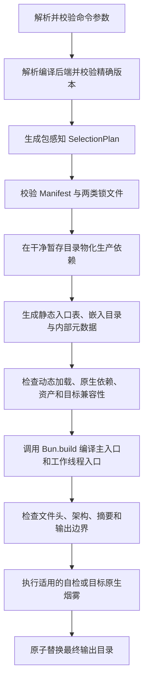

## 背景

ActionDock 2.0 的默认开发、测试、运行和目录型构建已经统一到 Node.js `>=24.12.0`。当前 `ad build` 只生成 Node.js 目录，`packages/cli/src/commands/build.ts` 会拒绝 `--target` 与 `--bytecode`；`ad export skill` 只支持 `source` 和 `node`，`packages/cli/src/commands/export.ts` 会拒绝二进制相关参数。`packages/builder/src/build.ts` 也只生成 Node.js 入口、依赖声明和目录元数据。

这一默认路径解决了开发环境强依赖 Bun、多个运行时各自复制执行语义、全局 Setter 污染以及发布链路包集合不一致等问题，但“默认不依赖 Bun”不等于“不能把 Bun 用作受控的可选编译器”。Bun 的单文件编译能力能够把 JavaScript、TypeScript、npm 依赖、声明资产和 Bun 运行时编入一个目标平台可执行文件，并支持跨平台目标。对于 Agent Skill、本地工具和无需预装 Node.js 的分发场景，这项能力仍有明确价值。

本设计为 ActionDock 2.0 增加显式选择的 Bun 二进制导出能力，同时保持 Node.js 为唯一默认工具链。Bun 只存在于请求二进制构建的编译路径以及生成后的二进制内部，不进入 Core、CLI、普通 Builder、普通 Action 项目或 Node.js 目录产物的默认运行依赖。

本设计是 [ActionDock 2.0 重构设计文档](<./20260909 ActionDock 2.0 重构设计文档.md>) 的专项补充。主设计中关于“删除默认 Bun 依赖”“Node.js 目录仍是默认产物”的结论继续有效；关于“删除 `@actiondock/runtime-bun`”“Builder 不支持单文件编译”“`--target` 与 `--bytecode` 永久不支持”的局部结论由本文替代。其他 Core、Host、App、Manifest、锁文件、跨包调用、错误信封、数据目录和安全边界不变。

ActionDock 2.0 仍处于开发阶段。本次直接修改 2.0 目标契约，不设计旧二进制参数迁移、`--standalone` 别名、旧包兼容读取或双轨兼容层，也不升级为 3.0。

本次目标包括：

- 保持 `ad build` 默认生成 Node.js 目录，未请求二进制时不安装、不解析也不执行 Bun。
- 使用 Bun 的受控版本生成无需目标机器安装 Node.js、Bun 或 npm 依赖的单文件可执行程序。
- 复用 Manifest、`SelectionPlanner`、`ActionDockHost`、`ActionDockApp` 和统一执行契约，不建立第二套 Action 发现、调用、状态或错误语义。
- 完整支持已安装并锁定的第三方 Action 包。跨包 `uses`、Playbook 委托和直接依赖的公开 Action 都能进入二进制选择集。
- 通过显式运行时注入恢复 `@actiondock/runtime-bun`，但不恢复旧实现中的全局 Setter、目录猜测、运行时联网安装或重复执行内核。
- 记录编译器、运行时、锁文件、Manifest、资产、原生依赖、安装脚本和验证结果，使二进制来源可审计。
- 在构建失败、兼容性检查失败或适用的烟雾验证失败时保留原有输出，不发布部分生成的目录。

本次不承诺：

- 不把 Bun 变成 Action 作者可依赖的默认 API。Action 源码仍以 Node.js 契约为基线，不应导入 `bun:*` 或直接调用 `Bun.*`。
- 不把 Manifest、`uses`、打包或二进制描述为第三方代码安全沙箱。
- 不支持二进制在运行时执行 `ad add`、`ad remove`、`ad link` 或从网络发现新 Action。
- 不通过 TypeScript AST 猜测模块依赖，也不恢复 ActionDock 自建模块打包器。
- 初版不承诺 Bun 输出的位级可复现性，也不把 `--bytecode` 或压缩描述为源码保护。
- 初版不把多个相互独立的根项目通过 `--bundle` 合并成一个二进制。一个根项目及其完整跨包依赖闭包不受此限制。

建议分支：`feature/bun-binary-export`

以上名称只是建议，不代表该分支已经存在。

## 核心边界

### 默认运行时与二进制运行时

ActionDock 的“默认运行时”与“二进制内嵌运行时”必须明确区分：

| 场景 | 执行环境 | Bun 是否参与 |
| --- | --- | --- |
| Action 开发、校验和测试 | Node.js `>=24.12.0` | 不参与 |
| `ad run`、`ad serve`、`ad mcp` | Node.js `>=24.12.0` | 不参与 |
| 默认 `ad build` 与 `--format node` | Node.js `>=24.12.0` | 不参与 |
| `ad export skill --mode source` | Node.js `>=24.12.0` | 不参与 |
| `ad export skill --mode node` | Node.js `>=24.12.0` | 不参与 |
| `--format binary --compiler bun` 的构建进程 | Node.js 调度可选 Bun 编译器 | 只在编译阶段参与 |
| 生成的单文件程序 | 文件内嵌的 Bun 运行时 | 运行时实际是 Bun，不是 Node.js |

生成的二进制兼容 ActionDock 的公共运行契约和受支持的 Node API，不代表其底层运行时变成了 Node.js。错误报告、构建元数据和用户文档必须明确写为 Bun 内嵌运行时，不能使用“Node.js 单文件程序”或“原生 Node.js 二进制”等表述。

### 能力集合不变量

二进制的能力集合在构建时确定，并满足以下不变量：

- 每个 Action、Playbook 和包都有稳定的完全限定标识符。
- 每个包保留自己的 Manifest、配置定义和状态命名空间，不能把多个包扁平合并为一个伪包。
- 根调用可见性、Playbook 精确委托和级联调用的 `uses` 校验与普通 Host 相同。
- 构建只接受 Manifest、包管理器锁文件和 `actiondock.lock.json` 一致的包实例。
- 运行时不会访问 npm 注册表、全局链接目录或构建机器的 `node_modules`。
- 未进入构建选择集的 Action 即使属于同一个 npm 包，也不能在运行时被动态发现。

用户要直接使用其他人共享的 Action 时，先通过 `ad add` 把其 npm Action 包安装为当前项目的直接依赖并完成锁定。直接根调用不要求任意本地 Action 声明 `uses`；只有本地或第三方 Action 通过 `ctx.actions.invoke` 继续调用另一个 Action 时，调用者自己的 Manifest 才必须声明精确 `uses`。二进制构建会把这些直接能力及其传递调用闭包一起纳入，而不是禁止跨包使用。

## 整体设计

### 组件关系

```mermaid
flowchart TD
  Cli[ad 命令] --> Builder[@actiondock/builder]
  Builder --> Planner[SelectionPlanner]
  Planner --> Manifest[actiondock.json]
  Planner --> Locks[包管理器锁文件与 actiondock.lock.json]
  Builder -. 仅二进制模式动态加载 .-> Compiler[@actiondock/compiler-bun]
  Compiler --> Bun[固定版本 Bun 编译器]
  Builder --> Stage[干净构建暂存目录]
  Stage --> Entry[静态包与 Action 入口表]
  Stage --> Assets[Manifest 与声明资产]
  Stage --> Runtime[@actiondock/runtime-bun]
  Entry --> Bun
  Assets --> Bun
  Runtime --> Bun
  Bun --> Binary[目标平台单文件程序]
  Binary --> Core[同一 @actiondock/core]
  Binary --> Host[同一 ActionDockHost 与 App]
```

`@actiondock/builder` 负责与编译器无关的选择、依赖物化、入口生成、元数据、验证和原子发布。`@actiondock/compiler-bun` 只负责定位受控 Bun、校验版本、映射目标、调用 `Bun.build()` 并规范化编译诊断。`@actiondock/runtime-bun` 只实现 Core 定义的 `RuntimePlatform`，供生成的二进制内嵌使用。

CLI 不维护全局编译器注册表。请求二进制时，CLI 从目标项目的模块解析上下文动态解析 `@actiondock/compiler-bun`，创建编译器实例，再显式传给 Builder。库调用者也必须显式传入编译器实例。这样并行构建、多版本嵌入和测试不会互相修改进程全局状态。

### 包职责与依赖方向

| 包 | 本次职责 | 依赖约束 |
| --- | --- | --- |
| `@actiondock/core` | 扩展 `RuntimePlatform.name` 以允许 `bun`，继续提供 App、Host、Target、Manifest、锁文件和执行契约 | 不依赖 Bun、Builder、CLI 或任何具体运行时 |
| `@actiondock/builder` | 定义编译器中立契约，生成包感知选择集、静态入口、嵌入目录、元数据和最终输出 | 默认依赖中不包含 `bun`、`@actiondock/compiler-bun` 或 `@actiondock/runtime-bun` |
| `@actiondock/compiler-bun` | 提供 `BunCompiler`，携带经过验证的 Bun 工具链版本并执行编译 | 只在用户显式安装二进制编译后端时出现 |
| `@actiondock/runtime-bun` | 提供 `BunSqliteDriver`、`BunProcessExecutor`、`BunHttpServer`、嵌入文件系统和 `createBunPlatform()` | 依赖 Core 与 SDK，只在 Bun 中运行并被编入二进制 |
| `@actiondock/runtime-node` | 继续负责所有默认运行路径和 Node.js 目录产物 | 不依赖 Bun 相关包 |
| `@actiondock/cli` | 解析二进制选项、按需加载编译器并渲染结构化结果 | 默认依赖中不包含 Bun 编译器或 Bun 运行时 |

`@actiondock/runtime-bun` 是新的显式注入实现，不复用已删除旧包中的全局 Setter。它不能修改 Core 默认驱动，不能自动探测并替换 Node.js 平台，也不能拥有自己的 Action 路由、运行记录或错误信封。

### 可选编译器安装

普通用户安装 `@actiondock/cli` 或 `@actiondock/builder` 时不应下载 Bun 平台二进制。需要导出单文件程序的项目显式安装同一 2.0 发布线的编译后端：

```bash
npm install --save-dev @actiondock/compiler-bun@2.0.x
```

`@actiondock/compiler-bun` 固定依赖经过 ActionDock 完整兼容性矩阵验证的 `bun@1.4.2`，并依赖同版本 `@actiondock/runtime-bun`。安装这一个可选后端即可取得主机构建编译器和二进制内嵌驱动。该包不使用宽泛 Bun 版本范围，也不回退调用 `PATH` 中任意版本的 Bun。`1.4.2` 是本文创建时的首个目标版本，仍须通过本文测试矩阵才能随 ActionDock 发布；若验证失败，应先修正固定版本和本文结论，不能静默换用其他版本。

Bun 在交叉编译时可能下载目标平台运行时。ActionDock 不把这一行为交给 `Bun.build()` 隐式决定：`@actiondock/compiler-bun` 随包发布受支持目标的版本、下载来源、大小和 SHA-256 清单。主机目标直接使用包内固定 Bun；交叉目标先从内容寻址缓存读取，缺失时只下载清单指定的目标运行时并核对摘要，再通过 `compile.executablePath` 显式交给 Bun。离线环境缺少缓存时返回可诊断错误，不回退下载其他版本。下载结果、来源和摘要进入构建元数据，目标机器运行二进制时不会发生任何下载。

未安装编译后端时，Node.js 路径继续正常工作；只有显式请求 `--compiler bun` 才返回 `BUN_COMPILER_NOT_INSTALLED`，并给出与当前 ActionDock 版本匹配的安装命令。编译器版本或其携带的 Bun 版本不匹配时在创建暂存目录前失败，不能静默使用全局 Bun。

这一依赖隔离接受一个明确代价：二进制构建者需要额外安装体积较大的编译后端，但所有普通 Action 开发者、CLI 消费者和 Node.js 部署者不承担该下载与供应链范围。

## 命令契约

### 构建命令

默认命令保持不变：

```bash
ad build
ad build --format node
```

两者都生成 Node.js 目录，不加载 Bun 编译后端。二进制通过显式格式触发：

```bash
ad build --format binary --compiler bun --target linux-x64
ad build --format binary --compiler bun --target darwin-arm64
ad build --format binary --compiler bun --target windows-x64
```

二进制相关参数语义如下：

| 参数 | 语义 |
| --- | --- |
| `--format <format>` | 产物格式为 `node` 或 `binary`，默认 `node` |
| `--compiler bun` | 二进制编译后端；初版只有 `bun`，仅对 `binary` 有效 |
| `--target <target>` | 目标系统、架构和必要时的 C 库；未传时解析为构建主机的精确目标 |
| `-o, --out <directory>` | 输出目录；二进制文件、元数据、摘要和声明文件都写入该目录 |
| `--minify` | 显式启用 Bun 压缩，默认关闭 |
| `--bytecode` | 显式启用 Bun 字节码，默认关闭，不提供源码保密保证 |
| `--archive` | 在同一已验证目录内容上生成压缩包 |
| `--allow-install-scripts` | 允许在隔离暂存目录执行经过确认的依赖安装脚本，并记录实际包与阶段 |
| `--require-reproducible` | 初版二进制模式直接返回不支持错误；Node.js 目录模式沿用原有语义 |

`--format binary` 初版必须同时指定 `--compiler bun`；`--compiler` 或 `--target` 与 `--format node` 同时出现时返回参数错误，不能忽略。二进制天然包含生产依赖，因此 `--vendor-deps` 在二进制模式没有独立语义并返回参数错误。`--standalone` 不恢复为别名，避免开发中的旧参数继续固化。

`--actions`、`--playbooks`、`--package` 和 `--archive` 继续可用。输出目录默认是 `dist/<package-slug>-<target>/`，Windows 可执行文件自动使用 `.exe` 后缀。`--out` 始终表示目录，不根据后缀猜测文件或目录，从而能够原子发布二进制及其审计文件。

### Skill 导出命令

Skill 新增 `binary` 模式：

```bash
ad export skill --mode binary --compiler bun --target linux-x64
ad export skill -P someone.tools --mode binary --compiler bun --target windows-x64
```

`source` 和 `node` 模式完全不变。`binary` 模式复用同一个二进制构建入口，再生成面向 Agent 的 `SKILL.md`、可阅读 Playbook 和调用说明，不能在 Exporter 内复制一套编译逻辑。

批量选择 `--workspace` 或 `--all` 时，每个根包在独立暂存目录生成自己的二进制 Skill，失败项不能污染其他根包的输出。`--bundle` 初版仍只支持源码模式；它不能把多个独立根项目静默合并为一个二进制。单个根项目依赖的任意数量第三方 Action 包仍会作为同一 Host 的依赖闭包编入。

### 二进制运行命令

生成程序只包含独立运行所需的轻量命令，不包含开发工具链。它可以提供与 Node.js 独立入口相同的 `list`、`describe`、`run`、`config`、`state`、`runs`、`serve`、`mcp`、`build-info` 和 `self-check` 行为，并全部进入同一个 Target、Host 和 App。

二进制不提供 `init`、`add`、`remove`、`link`、`unlink`、`pack`、`build`、`test` 或 `export`。调用任何修改能力集合的命令都返回 `BINARY_IMMUTABLE_CAPABILITY_SET`，不能尝试在当前目录安装包。

一次性 `run` 进程沿用独立入口限制，不在进程退出后遗留异步运行。长期异步执行由 `serve` 或 MCP 长连接承载，并服从 Host 的取消、事件、关闭和数据目录所有权语义。

## 构建流程

### 端到端控制流



所有中间文件都位于最终输出目录同一文件系统内的随机暂存目录。构建开始时不删除已有输出。只有编译、静态检查和当前环境要求的自检全部通过后，Builder 才原子替换目标目录；替换失败时恢复旧目录。失败的暂存内容默认清理，诊断模式可以保留其路径，但不得把它报告为成功产物。

Builder 通过一个显式的编译器中立契约调用后端：

```ts
interface BinaryCompiler {
  readonly name: "bun";
  readonly providerVersion: string;
  inspect(): Promise<CompilerIdentity>;
  compile(request: BinaryCompileRequest): Promise<BinaryCompileResult>;
}
```

`BinaryCompileRequest` 只接收经过 Builder 校验的绝对入口、目标、输出路径、资产根、工作线程入口和受限编译选项。编译器不能重新发现 Action、修改选择集、读取全局链接或决定安装脚本策略。`BunCompiler` 使用参数数组启动其随包携带的 Bun，不经过 Shell；实际编译由一个固定驱动调用 `Bun.build()`，以便显式关闭配置自动加载并获取结构化日志。

### 包感知选择集

二进制复用主设计中的声明式 `SelectionPlanner`，但结果必须是包感知的完整闭包。每个规划项至少保留逻辑包 ID、npm 包名、精确版本、Manifest 摘要、包根、Action 入口、直接 `uses`、配置定义和资产边界。

未传 `--actions` 或 `--playbooks` 时，默认构建当前根包的完整公开能力：

- 当前包的全部 Action 与可见 Playbook。
- 当前项目直接依赖包中允许根调用的全部 Action 与可见 Playbook。
- 上述 Action 的传递 `uses` 闭包。
- 上述 Playbook 精确声明的 Action 及其传递 `uses` 闭包。

传入选择参数时，只把显式选择项当作公开根，再递归加入其运行必需闭包。用户可以直接选择已经安装为直接依赖的第三方 Action，例如：

```bash
ad build \
  --format binary \
  --compiler bun \
  --target linux-x64 \
  --actions someone.github-actions/check-diff
```

传递包不会因为进入内部闭包而自动公开全部 Action。构建后的 `list`、`describe` 和根调用继续服从主设计的可见性规则；`ctx.actions.invoke` 继续检查当前调用者自己的精确 `uses`。这样既支持共享 Action，又避免一个间接依赖无意扩大二进制的公开工具面。

规划阶段禁止使用全局 `ad link`、未锁定目录和运行时网络发现补齐缺失包。本地开发包要进入可分发二进制，必须先形成可物化且带摘要的工作区输入，或发布并由 `ad add` 锁定。`file:`、失效软链接、Manifest 与锁文件不一致、同一逻辑包无法收敛到唯一版本时都在编译前失败。

### 静态 Action 入口表

Builder 根据选择集生成字面量导入表，不扫描 TypeScript AST，也不把 Action 模块元数据重新当作事实源。设计级结构如下：

```ts
const embeddedPackages = [
  {
    id: "team4u.github-tools",
    manifest: githubToolsManifest,
    actions: {
      "check-diff": () => import("./packages/team4u-github-tools/actions/check-diff.js"),
    },
  },
  {
    id: "someone.shared-tools",
    manifest: sharedToolsManifest,
    actions: {
      "lookup": () => import("./packages/someone-shared-tools/actions/lookup.js"),
    },
  },
];
```

这些导入说明由 Builder 生成并且每个模块说明都是编译期字面量，因此 Bun 能把代码纳入单文件，同时保留首次调用时再求值的懒加载语义。`list` 和 `describe` 只读取嵌入 Manifest，不因枚举能力执行 Action 模块副作用。

业务代码中的普通静态导入和字面量动态导入由 Bun 解析。基于运行时字符串拼接的 `import()`、间接 `require()`、从当前工作目录加载代码以及运行时插件发现不属于二进制契约。编译器能够识别时返回 `BINARY_DYNAMIC_IMPORT_UNSUPPORTED`；无法静态证明的路径必须由 `self-check` 和目标测试覆盖。Manifest 的 `files` 只保证文件被作为声明资产嵌入，不会把任意字符串导入转换成模块注册表。

### 依赖物化与安装脚本

Builder 不直接打包开发目录中碰巧存在的 `node_modules`。它根据包管理器锁文件、`actiondock.lock.json`、选择集和编译后端要求，在干净暂存目录物化精确生产依赖，并逐项核对版本与完整性。

安装默认禁用生命周期脚本。依赖只有在显式允许、构建者确认具体包名与脚本阶段并且脚本输出仍满足目标兼容性时才能执行。实际执行的包、版本、阶段、目标和输出摘要写入元数据。脚本读取的秘密不能写入二进制；Builder 不把调用进程的完整环境透传给安装或编译子进程。

二进制模式总是内嵌依赖，不存在部署端再次运行 `npm install` 的步骤。包管理器、npm 注册表和构建缓存只属于构建环境，不能成为目标机器运行前提。

## Bun 运行时适配

### 显式平台注入

Core 的平台标识扩展为：

```ts
interface RuntimePlatform {
  readonly name: "node" | "bun" | "test";
  readonly clock: Clock;
  readonly files: FileSystem;
  readonly modules: ModuleLoader;
  readonly process: ProcessAPI;
  readonly storage: StorageFactory;
}
```

生成入口显式创建 Bun 平台：

```ts
const platform = createBunPlatform({
  dataDir,
  embeddedRoot,
  actionRegistry: embeddedPackages,
});

const host = await createActionDockHost({
  packages: embeddedPackages,
  platform,
});
```

App、Host、Target、执行结果、事件、取消、状态命名空间和错误码全部来自 Core。`@actiondock/runtime-bun` 不实现第二套 Loader、Catalog 或 ExecutionService，也不在导入时修改默认平台。

### 存储与工作线程

`BunSqliteDriver` 使用 Bun 的 SQLite 能力，但同步数据库操作必须放在专用 Worker 中，主线程只通过带请求 ID 的消息接口异步访问。事务在同一个 Worker 内完整开始、执行和提交，不能跨消息悬挂；线程退出时所有未决请求以 `STORAGE_WORKER_EXITED` 失败，驱动拒绝新请求，Host 进入与 Node.js 平台相同的关闭和遗留运行恢复流程。

Bun 单文件编译当前要求 Worker 文件显式列为编译入口。因此 `@actiondock/runtime-bun` 提供稳定的存储 Worker 入口，Builder 把主入口与该 Worker 一起传给 `Bun.build()`。不使用 `eval` 字符串 Worker，也不依赖构建机绝对路径。未来新增任何 Worker 都必须进入同一声明清单和测试矩阵，不能只在本机目录运行成功。

数据库、WAL 文件、运行记录、配置值和状态始终写入外部数据目录，不嵌入可执行文件。Bun 与 Node.js 平台使用同一目标 Schema 和数据目录锁；同一数据目录不能被两个运行时同时打开。跨运行时恢复必须先正常关闭原进程并完成备份。

### 文件、Manifest 与资产

Builder 在暂存目录生成一个确定的只读嵌入树，其中包含：

- 每个包裁剪后的 `actiondock.json`。
- 选择集对应的 `actiondock.lock.json` 信息与 Manifest 摘要。
- 被选 Playbook。
- Manifest `assets` 与 `files` 明确声明的普通文件。
- 运行时自检需要的非秘密构建信息。

嵌入树按逻辑包 ID 隔离。`BunFileSystem` 把包内逻辑路径映射到该只读根，把状态、配置和运行记录写入外部数据目录；业务代码不能通过相对路径穿越到其他包资产。资产路径在物化前执行真实路径、符号链接、大小、类型和摘要检查。

Bun 的目录嵌入会跳过符号链接和空目录，因此 Builder 先把允许的普通文件复制到规范化目录，再把该目录交给 `compile.assets`。空目录不属于运行时契约，符号链接必须解析为包根内的普通文件后复制；指向包根外的链接直接拒绝。编译后自检逐项读取并核对嵌入资产摘要，避免编译器静默遗漏。

配置定义可以嵌入，配置值和秘密不能嵌入。运行时值仍来自命令行覆盖、外部数据目录和宿主环境，并沿用 Core 的来源优先级与脱敏规则。

### 进程与网络

`BunProcessExecutor` 使用 `Bun.spawn` 实现与 `ProcessAPI` 相同的参数数组、标准流排空、输出上限、超时、取消和进程树收尾语义。它不能恢复已经从公共契约删除的无所有者后台进程能力。

`BunHttpServer` 使用 `Bun.serve` 适配 Core 的 HTTP 传输契约，默认只监听回环地址。非回环监听、鉴权、请求体上限、错误脱敏和优雅关闭规则与 Node.js 路径相同。MCP 与 HTTP 仍是协议适配器，不创建自己的执行内核。

Action 调用的 `git`、`docker`、`curl`、浏览器驱动或其他外部程序不会被 Bun 编入二进制。它们仍必须存在于目标系统的 `PATH` 或由 Action 使用明确路径调用。Skill 说明和构建报告应列出作者显式声明的外部前提；ActionDock 无法通过模块打包自动推断所有运行时命令。

## 目标与兼容性

### 支持目标

ActionDock 对外使用稳定的目标名称，再由 `@actiondock/compiler-bun` 集中映射到 Bun 目标，避免 CLI、Builder 和流水线各自维护列表：

| ActionDock 目标 | Bun 目标 | 系统与架构 |
| --- | --- | --- |
| `host` | 构建时解析 | 当前主机的精确系统、架构和 C 库 |
| `linux-x64` | `bun-linux-x64` | Linux x64，glibc |
| `linux-arm64` | `bun-linux-arm64` | Linux arm64，glibc |
| `linux-x64-musl` | `bun-linux-x64-musl` | Linux x64，musl |
| `linux-arm64-musl` | `bun-linux-arm64-musl` | Linux arm64，musl |
| `darwin-x64` | `bun-darwin-x64` | macOS x64 |
| `darwin-arm64` | `bun-darwin-arm64` | macOS arm64 |
| `windows-x64` | `bun-windows-x64` | Windows x64 |
| `windows-arm64` | `bun-windows-arm64` | Windows arm64 |

该列表以 Bun 官方 [单文件可执行程序文档](https://bun.com/docs/bundler/executables)和 ActionDock 自身验证矩阵共同为准。Bun 声明支持但 ActionDock 尚未完成原生烟雾验证的目标不能进入公开支持列表。`baseline` 与 `modern` 不作为 ActionDock 独立目标暴露，因为当前 Bun 文档说明它们在 x64 上解析为同一运行时；未来行为变化只修改编译器包中的单一映射。

### Node API 兼容性

ActionDock Action 仍按 Node.js 契约开发。Bun 对 Node API 的实现是二进制后端的兼容层，不构成“所有 Node.js 包必然可运行”的保证。选择集至少经过以下检查：

- Bun 编译器能够解析全部静态模块入口。
- 框架的 App、Host、状态、进程、HTTP 和 MCP 契约测试在 Bun 运行时通过。
- 每个 Action 模块能在不执行业务处理函数的情况下导入并与 Manifest 对齐。
- 依赖没有要求运行时读取未嵌入的 JavaScript 文件、包元数据或插件目录。
- 使用的 Node 内置 API 位于 ActionDock 已验证兼容集合，或由目标原生烟雾测试证明可用。

不为 Bun 放宽 Node.js TypeScript 规则。一个只能在 Bun 中解析、却无法在默认 Node.js 环境开发和测试的 Action 包，不属于 ActionDock 2.0 可分发包。

### 原生扩展

Bun 可以把直接加载的 Node-API `.node` 文件嵌入可执行程序，但原生扩展同时受系统、架构、C 库、Node-API 版本和依赖加载方式约束。Builder 需要扫描已物化依赖中的原生文件与所属包，记录实际选择结果，并采用以下规则：

- 目标与构建主机相同时，可以使用锁定依赖提供的匹配预编译文件，并以目标原生 `self-check` 验证加载。
- 交叉编译只接受已经为目标系统、架构和 C 库提供的预编译文件，不能把构建主机上由 `node-gyp` 生成的文件当作目标文件。
- 通过 `@mapbox/node-pre-gyp` 等间接运行时查找 `.node` 文件的依赖，只有在生成入口能够直接、确定地引用最终原生文件时才允许编入。
- 无法确定 Node-API 兼容级别、需要在目标机器执行安装脚本、缺少目标预编译文件或依赖运行时下载时，构建以 `BINARY_NATIVE_DEPENDENCY_UNSUPPORTED` 失败。
- 成功编译不替代目标原生加载验证。官方发布和标记为已验证的二进制必须在真实目标环境运行 `self-check`。

纯 JavaScript 依赖可以使用 Bun 交叉编译；原生依赖不能因为 Bun 支持目标名称就推断为可交叉分发。

## 运行时安全与确定性

### 配置自动加载

Bun 编译程序默认可能从运行目录读取 `.env` 和 `bunfig.toml`。这会绕过 ActionDock 配置来源、秘密脱敏和构建确定性，因此 `BunCompiler` 必须显式设置：

```ts
compile: {
  autoloadDotenv: false,
  autoloadBunfig: false,
  autoloadTsconfig: false,
  autoloadPackageJson: false,
}
```

运行时配置只从 ActionDock 明确支持的入口读取。Builder 不暴露允许重新开启这些 Bun 自动加载行为的通用透传参数。

### 编译环境

编译进程使用隔离暂存目录和最小环境变量集合。构建者的令牌、云凭据、私有配置、调试注入和完整 `NODE_OPTIONS` 不得默认透传。代理、私有注册表和证书等确实用于依赖物化的值只进入对应子进程，不作为 `define`、资源文件或运行时默认值写入二进制。

Builder 不执行用户提供的 Bun 插件、宏或 `bunfig.toml`。所有编译选项由 `@actiondock/compiler-bun` 根据受支持契约生成，原始 Bun 参数不能通过未校验字符串直接追加。

### Bun 环境变量限制

Bun 单文件程序会读取 `BUN_OPTIONS`，设置 `BUN_BE_BUN=1` 还可能使程序绕过嵌入入口并表现为 Bun CLI。ActionDock 无法在入口代码执行前完全消除这一上游行为，因此必须明确接受以下限制：

- 生成的程序不得设置 setuid、setgid 或额外系统能力，也不应以高于调用者的权限执行。
- systemd、容器、任务平台和其他托管启动配置必须清除 `BUN_OPTIONS` 与 `BUN_BE_BUN`，不能接收不可信请求直接控制的完整环境。
- 入口启动后若发现非空 `BUN_OPTIONS`，默认返回诊断错误；这只能发现入口已执行的场景，不能替代部署环境清理 `BUN_BE_BUN`。
- `artifact.json` 和 Skill 说明必须记录这一运行前提，安全文档不能把二进制描述为不受 Bun 环境变量影响。

如果未来 Bun 提供编译期关闭这些行为的能力，ActionDock 可以在经过测试后收紧实现；在此之前不能用应用层检查声称已经完全防护。

### 第三方代码权限

第三方 Action 进入二进制后仍与宿主进程拥有相同的文件、网络、环境和进程权限。锁定、摘要与静态能力表解决来源、完整性和可发现性，不提供隔离。运行不可信共享 Action 时，仍应使用容器、独立低权限账户或远程服务作为安全边界。

`--minify` 和 `--bytecode` 只影响体积、解析和启动路径。Bun 官方文档明确说明字节码不提供源码混淆保证；ActionDock 的帮助、元数据和文档不得使用“加密”“防反编译”或类似承诺。

### 签名与发布后摘要

Builder 默认输出未签名二进制。macOS 代码签名、公证和 Windows 签名需要目标平台凭据，属于分发流水线的后处理。签名会改变文件摘要，因此流程必须先完成构建与自检，再签名，最后重新计算分发摘要并验证签名。构建元数据同时保留未签名输入来源和最终分发摘要，不能拿签名前摘要校验签后文件。

## 输出与元数据

### 构建目录

一个二进制构建目录包含：

```text
dist/<package-slug>-<target>/
├── <package-slug>[.exe]
├── artifact.json
├── checksums.sha256
└── THIRD_PARTY_NOTICES.md
```

可执行文件能够脱离该目录单独启动；其运行所需的 Core、Bun 平台、Action 代码、npm 模块、Manifest、Playbook 和声明资产都已内嵌。`artifact.json`、摘要和第三方声明用于审计与分发，不是运行依赖。法律或组织策略要求随程序分发声明文件时，调用方仍应保留完整目录或归档。

二进制内部还包含一份不带最终文件摘要的只读构建信息，供 `build-info --json` 返回。最终 SHA-256 只能在编译和签名结束后计算，不能把它再写回同一个文件而声称摘要不变。

### 元数据内容

`artifact.json` 至少记录：

- `schemaVersion`、`format: "binary"`、ActionDock 版本、根包 ID 与版本。
- 编译后端包版本、Bun 精确版本、Bun 可执行文件输入摘要和目标映射。
- 实际内嵌运行时为 `bun`，以及 `@actiondock/runtime-bun`、Core 与 SDK 的版本和摘要。
- 公开根 Action、内部依赖 Action、Playbook 和全部包实例的逻辑 ID、npm 名称与精确版本。
- 每个包的规范化 Manifest 摘要、包管理器锁文件摘要与 `actiondock.lock.json` 摘要。
- 声明资产的逻辑路径、大小和摘要，不记录秘密配置值。
- 原生依赖的包、版本、目标、C 库、Node-API 信息与实际文件摘要。
- 被允许并实际执行的安装脚本、阶段和输出摘要。
- `minify`、`bytecode`、配置自动加载关闭状态和外部命令前提。
- 静态检查、主机自检、目标原生烟雾和签名验证的状态，未执行项必须明确写为 `not-run`，不能写成通过。
- 最终二进制文件名、大小和分发 SHA-256。

实际编译时间可以出现在外部运行报告和 `artifact.json` 中，但不进入二进制内部构建信息。日志中的绝对暂存路径、用户名、主目录和环境秘密必须在写入元数据前删除或规范化。

### 可复现性

锁定全部输入仍然有价值，但不等于 Bun 二进制已经位级可复现。初版元数据固定写入 `reproducible: false` 和原因 `bun-compile-not-bit-reproducible`。`--require-reproducible` 与二进制模式组合时在编译前返回 `BINARY_REPRODUCIBILITY_UNSUPPORTED`。

Builder 仍规范化输入遍历顺序、JSON 键序、文件权限、资产路径和归档时间，并在提供 `SOURCE_DATE_EPOCH` 时传递稳定时间来源。这为未来验证可复现性保留条件，但在跨机器、跨签名或未证明 Bun 输出一致前不能改变元数据结论。

## 二进制 Skill

`ad export skill --mode binary` 生成的目录面向 Agent 消费，而不是只返回裸可执行文件：

```text
<package-slug>-skill/
├── SKILL.md
├── actiondock.json
├── playbooks/
├── bin/
│   └── <package-slug>[.exe]
├── artifact.json
├── checksums.sha256
└── THIRD_PARTY_NOTICES.md
```

`SKILL.md` 根据目标平台生成正确的相对调用方式，并使用完全限定 Action ID 避免跨包短 ID 冲突。Playbook 保留可阅读副本供 Agent 遵循，运行时使用的是二进制内嵌且摘要一致的副本。外部 `actiondock.json` 只用于审阅与工具发现，二进制不信任或动态加载用户在导出后修改的该文件。

导出完成前必须核对外部 Manifest、Playbook、`SKILL.md` 中声明的 Action 与二进制 `build-info` 一致。任一摘要或命令路径不一致时，整个 Skill 输出失败。归档基于已经验证的目录生成，并再次计算归档摘要。

目标机器不需要 Node.js、Bun、npm 或 ActionDock CLI，但仍需要满足操作系统、CPU、C 库、外部命令、文件权限和配置注入前提。一个 Skill 目录只包含一个明确目标；需要多个目标时分别导出并分别验证，不能把多个二进制命名为同一路径后让 Agent 猜测。

## 失败行为

编译和导出错误属于构建边界错误，不创建 Action `runId`。CLI 以稳定错误码、简短安全消息和经过筛选的详情返回；Bun 原始日志只进入诊断通道并执行路径与秘密脱敏。

| 错误码 | 触发条件 |
| --- | --- |
| `BUN_COMPILER_NOT_INSTALLED` | 请求 Bun 二进制但目标项目无法解析匹配的可选编译后端 |
| `BUN_VERSION_UNSUPPORTED` | 编译后端或实际 Bun 版本不在当前 ActionDock 精确支持集合 |
| `BUN_TARGET_RUNTIME_UNAVAILABLE` | 交叉目标运行时既不在受控缓存中，也无法从固定来源取得 |
| `BUN_TARGET_RUNTIME_INTEGRITY_FAILED` | 下载或缓存的目标运行时与编译器包内摘要不一致 |
| `BINARY_TARGET_UNSUPPORTED` | 目标名称、系统、架构或 C 库未进入支持矩阵 |
| `BINARY_DEPENDENCY_NOT_LOCKED` | 第三方包、普通 npm 依赖或内部运行时缺少一致锁定结果 |
| `BINARY_DYNAMIC_IMPORT_UNSUPPORTED` | 发现无法封闭到单文件的运行时模块加载方式 |
| `BINARY_NATIVE_DEPENDENCY_UNSUPPORTED` | 原生扩展无法证明与目标兼容或需要目标端安装 |
| `BINARY_REPRODUCIBILITY_UNSUPPORTED` | 二进制模式请求强制位级可复现 |
| `BINARY_COMPILE_FAILED` | `Bun.build()` 返回错误或编译器进程异常退出 |
| `BINARY_OUTPUT_INVALID` | 编译器报告成功但文件头、架构、资产或摘要校验失败 |
| `BINARY_SMOKE_TEST_FAILED` | 可执行的主机或目标原生自检失败 |
| `BINARY_IMMUTABLE_CAPABILITY_SET` | 生成程序收到安装、链接、删除或其他能力变更命令 |

错误映射不能只按 Bun 文本包含关系猜测。`@actiondock/compiler-bun` 优先读取结构化构建日志和进程状态；无法稳定分类的错误统一为 `BINARY_COMPILE_FAILED`，并保留受控诊断标识供日志关联。

## 验证、发布与恢复

### 构建验证层级

每次构建都执行与目标无关的静态验证：

- 校验编译器身份、输出文件头、系统、架构和 Windows 后缀。
- 核对二进制、外部元数据、Manifest、锁文件和资产摘要。
- 确认最终目录不包含源码暂存路径、开发链接、秘密文件或未声明模块。
- 运行内部 `build-info` 协议解析检查。

当目标等于构建主机时，Builder 在随机临时数据目录执行二进制 `self-check`。该命令初始化平台和 Host、导入全部选择 Action、验证 Manifest 契约、打开并关闭存储 Worker、读取全部嵌入资产，但不执行业务 Action。失败时不替换最终输出。

交叉编译时，构建主机不能把“无法执行”写成“烟雾通过”。本地命令完成静态验证后可以生成标记为 `targetSmoke: not-run` 的输出；只有目标原生流水线运行 `self-check` 和安全测试 Action 后，才可把该目标标记为已验证或用于正式分发。要求目标烟雾的发布任务在没有对应执行环境时必须失败。

### 发布流程

ActionDock 公共包继续由 Git 标签推送唯一触发，版本继续使用 2.0.x。新增包与全部现有包使用同一个正式或预发布版本，内部依赖不能混用稳定版和预发布版。

发布拓扑加入 `@actiondock/runtime-bun` 与 `@actiondock/compiler-bun`。流水线先发布 SDK 与 Core，再发布 Node.js、Bun 和测试平台包，再发布 Builder、编译器、MCP 与 CLI。实际顺序由 workspace 依赖图计算，不在脚本中硬编码包名或包数量。

Node.js 基础验证和 Bun 专项验证分开：

- Node.js 作业在不安装可选编译后端的干净消费项目中执行类型检查、测试、Node.js 目录构建和打包烟雾，证明默认路径没有 Bun 依赖。
- Bun 作业安装 `@actiondock/compiler-bun`，验证精确 Bun 版本、框架契约、主机二进制和资产、Worker、跨包依赖。
- 目标矩阵在对应系统和架构运行已编译程序。无法获得真实目标执行环境的目标不进入已验证发布集合。
- npm 包在移动 `latest`、`beta` 或 `alpha` 前完成全部包安装烟雾；预发布版本不能覆盖 `latest`。

编译器包升级 Bun 时必须发布新的 ActionDock 版本并重新跑完整矩阵。已有版本继续固定原 Bun 输入，不能通过分发标签或宽版本范围让同一 ActionDock 版本在不同时间下载不同编译器。

### 恢复

二进制能力是显式分支，出现 Bun 后端故障时不影响默认 Node.js 构建。项目可以停止发布二进制并改用同版本 `--format node` 或 `--mode node`。切换运行时前先优雅关闭二进制、确认数据目录锁已释放并备份数据；Node.js 与 Bun 平台使用同一 Core Schema，兼容性测试通过后可以由同一 ActionDock 版本打开同一数据目录，但不能并发打开。

已经发布的 npm 版本不删除也不覆盖。包级问题通过新的 2.0.x 修复版本和分发标签恢复；标签推广中途失败时恢复各包原有指针。已经分发的项目二进制不可远程修改，调用方必须用上一份已验证二进制或 Node.js 目录替换，并保留失败版本的摘要与运行记录供诊断。

签名后的文件恢复以最终分发摘要为准。只要二进制曾经启动并写入数据，就不能只替换程序后假设数据一定可恢复；必须检查同版本 Schema、遗留运行和数据库完整性。发现不支持 Schema 时保持数据库只读并恢复备份，不在本设计中增加迁移逻辑。

## 测试与验收

下列案例是目标设计要求，不代表当前实现已经通过。

| 场景 | 前置条件与操作 | 可观察结果 |
| --- | --- | --- |
| 默认路径无 Bun | 在未安装 `@actiondock/compiler-bun` 和 Bun 的干净环境执行开发、测试、`ad run`、默认 `ad build` 和两种现有 Skill 导出 | 所有 Node.js 路径成功，不解析 Bun 包或执行 Bun 命令 |
| 编译器缺失 | 在同一环境请求 `--format binary --compiler bun` | 返回 `BUN_COMPILER_NOT_INSTALLED` 和匹配版本安装提示，最终输出不变化 |
| 编译器版本固定 | 修改编译器包或其 Bun 版本后构建 | 在暂存前返回 `BUN_VERSION_UNSUPPORTED`，不回退使用 `PATH` 中其他版本 |
| 主机二进制 | 构建纯 JavaScript 依赖的 `host` 目标并运行 `self-check`、`list` 与安全测试 Action | 目标机器无需 Node.js、Bun、npm 或全局 CLI，结果信封与 Node.js 路径一致 |
| 第三方根调用 | 通过 `ad add` 安装并锁定共享 Action 包，未在本地 Action 的 `uses` 中声明它，执行默认二进制构建后根调用其完全限定 ID | 共享 Action 被编入并可根调用，不要求无关本地 Action 声明 `uses` |
| 跨包级联调用 | A 的 Manifest 声明调用 B，B 声明调用 C，构建只选择 A | 选择集包含 A、B、C 的精确 Action；运行保留包状态隔离、父子运行和 `uses` 检查 |
| 未声明级联调用 | 目标包已被其他路径编入，但调用者删除对应 `uses` | 运行返回 `UNDECLARED_ACTION_DEPENDENCY`，不能因模块已经在二进制内而放行 |
| 传递包可见性 | C 只作为 B 的传递依赖进入二进制，再从根调用查询 C 的其他 Action | 其他 Action 不在列表中且根调用被拒绝，静态打包不扩大公开能力 |
| Playbook 委托 | 可见 Playbook 精确引用第三方 Action | 对应 Action 可被 Agent 按规程根调用，同包未声明 Action 仍不可见 |
| Manifest 单一事实源 | 修改 Action 模块内自带元数据但不修改 Manifest，再构建和查询 | 二进制能力和 Schema 仍来自 Manifest，不建立源码元数据同步路径 |
| 懒加载 | Action 模块含可观察导入副作用，分别运行 `list` 与首次 `run` | `list` 不执行副作用，首次调用才加载对应静态入口 |
| 动态模块加载 | Action 使用运行时字符串拼接导入未嵌入 JavaScript | 构建或 `self-check` 返回 `BINARY_DYNAMIC_IMPORT_UNSUPPORTED`，不在目标机器读当前目录补齐 |
| 资产嵌入 | 声明嵌套资产、空目录、包内符号链接和越界符号链接 | 普通文件摘要一致，空目录不形成契约，包内链接被物化，越界链接在编译前拒绝 |
| 配置隔离 | 构建目录与运行目录分别放置 `.env` 和 `bunfig.toml`，并通过 ActionDock 配置入口传值 | Bun 文件不被自动加载，只有 ActionDock 明确配置来源生效，秘密不进入元数据 |
| 存储非阻塞 | 二进制批量写入状态和运行事件，同时执行事件循环延迟探针 | SQLite 同步操作在显式 Worker 入口执行，主线程仍能处理取消与事件 |
| 存储 Worker 退出 | 强制结束 Bun 存储 Worker 后继续请求，再重启同版本程序 | 未决请求以 `STORAGE_WORKER_EXITED` 失败，新请求被拒绝，新 Host 按 Core 规则处理中断记录 |
| 外部命令 | Action 调用目标系统不存在的 `git` 或 `docker` | 构建不声称已内嵌命令，运行返回标准进程错误并保留干净 JSON 输出 |
| 纯 JavaScript 交叉编译 | 在一个系统构建另一系统目标，并在真实目标运行 `self-check` | 文件头和架构正确，目标自检通过后元数据才能标记为已验证 |
| 原生扩展主机目标 | 依赖提供与主机匹配的 Node-API 文件并被直接引用 | 构建记录原生文件摘要，主机 `self-check` 能加载后才成功发布 |
| 原生扩展交叉目标 | 依赖只提供构建主机原生文件，却请求其他系统、架构或 C 库 | 返回 `BINARY_NATIVE_DEPENDENCY_UNSUPPORTED`，不输出伪可用程序 |
| 安装脚本 | 依赖声明生命周期脚本，分别按默认设置和显式允许构建 | 默认不执行并在依赖无法加载时失败；显式允许只在暂存目录执行并完整记录 |
| 字节码与压缩 | 分别开启 `--bytecode` 与 `--minify`，比较运行结果和元数据 | 行为契约不变，选项被准确记录，帮助文本不声称源码被保护 |
| 不可变能力 | 对生成程序调用安装、链接、删除和构建命令 | 返回 `BINARY_IMMUTABLE_CAPABILITY_SET`，不修改 Manifest 或数据目录中的能力索引 |
| 原子输出 | 在编译、资产核对、自检和目录交换各阶段注入失败 | 已有成功输出保持可用，不出现被报告为成功的半成品目录 |
| 元数据完整性 | 篡改外部 Manifest、Playbook、二进制或 `artifact.json` 后验证 Skill | 摘要检查失败，外部文件不能改变二进制运行能力 |
| Bun 环境变量 | 通过受控服务配置设置 `BUN_OPTIONS`，并检查部署环境中的 `BUN_BE_BUN` 清理 | 入口可执行时拒绝非空 `BUN_OPTIONS`；部署检查明确报告未清理的 `BUN_BE_BUN` 风险 |
| 二进制 Skill | 导出单一目标 Skill，并在没有 Node.js 与 Bun 的目标环境按 `SKILL.md` 调用 | Agent 使用相对二进制路径完成发现和运行，Playbook 与内嵌摘要一致 |
| 位级可复现要求 | 对二进制模式传入 `--require-reproducible` | 编译前返回 `BINARY_REPRODUCIBILITY_UNSUPPORTED`，不伪造可复现结论 |
| Node.js 恢复 | 同版本 Bun 二进制正常关闭后，用 Node.js 目录产物打开备份数据目录 | 数据目录锁、Schema、状态和运行记录兼容，不要求迁移或同时运行两个 Host |
| 发布包边界 | 在干净消费项目只安装 CLI，再单独安装编译器包执行两组烟雾 | 只安装 CLI 时不存在 Bun 依赖；显式安装编译器后才能生成二进制 |

验收命令继续以 Node.js 工具链为基础：

- `npm run typecheck` 覆盖 Core 新平台联合类型、Builder 编译器契约和两个新增包的公开类型。
- `npm test` 覆盖共享执行契约、选择闭包、错误映射和输出原子性。
- `npm run test:pack` 在干净项目验证默认包集合不引入 Bun，并增加显式二进制后端安装烟雾。
- Bun 专项矩阵通过编译器包携带的版本运行，不能用开发者机器上的其他 Bun 替代。
- 每个公开支持目标都有真实目标 `self-check` 记录；缺少记录的目标只能标记为未验证，不能进入正式分发说明。

## 实施边界

实现时先扩展 Core 的显式平台联合类型和共享契约测试，再以新实现加入 `@actiondock/runtime-bun`。旧 Bun 包代码中的全局默认值、全局 Setter、重复 Loader 和独立执行路径不得恢复。

Builder 随后增加编译器中立接口、包感知二进制暂存和静态入口生成；`@actiondock/compiler-bun` 只实现该接口。CLI 最后增加新参数并动态解析后端。源码型 Skill、Node.js Skill 和 Node.js 目录构建必须在每个阶段保持可运行，任何共享逻辑都先进入 Builder 或 Core 的单一事实源。

发布脚本、版本更新脚本、打包烟雾和工作流必须从 workspace 依赖图发现新增包，不再新增硬编码包数组。文档、示例和命令帮助在同一变更中更新到 2.0 目标契约，但不生成迁移指南或保留旧 `--standalone` 路径。

实现完成后，主设计中被本文替代的 Bun 局部结论需要改为引用本文，避免两份有效设计给出相反命令契约。本文自身保持为 Bun 二进制能力的唯一详细设计来源。
