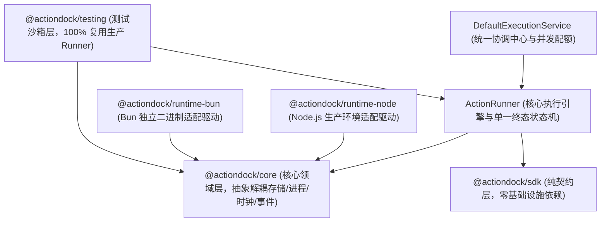
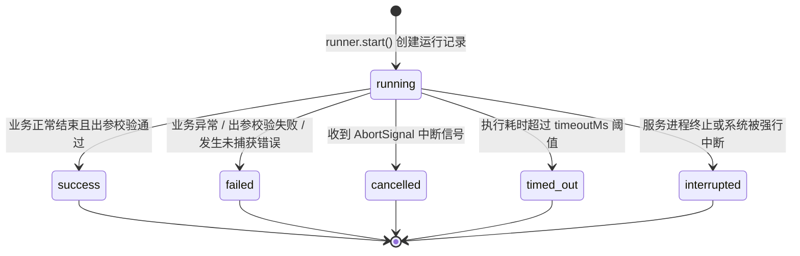

# 底层架构：Runtime 执行引擎与分层架构

ActionDock 2.0 围绕执行的确定性、强类型安全与环境解耦构建，保证任何形式的调用（CLI、MCP、HTTP、测试沙箱或独立二进制）均收敛至一致的核心执行语义。

---

## 架构总览与分层设计原则

ActionDock 采用四层解耦架构设计，从上至下严格单向依赖：

---

## SDK 纯契约层：零基础设施依赖

`@actiondock/sdk` 是面向 Action 编写者的纯契约层，设计遵循以下规范：

- **零外部运行时依赖**：该包的依赖列表完全为空，不引入任何重型运行时库或底层基础设施。
- **纯粹契约与抽象定义**：仅导出类型定义与基础辅助声明函数，包括 `defineAction`、`ActionContext`、`ProcessAPI`、`Logger`、`Config`、`StateStore` 与执行结果结构。
- **杜绝依赖污染**：业务 Action 仅需依赖 `@actiondock/sdk`，保持极小体积与跨环境可移植性，免受底层驱动或工具链升级的影响。

---

## Core 核心领域层：抽象接口解耦体系

`@actiondock/core` 承载 ActionDock 的核心领域逻辑，完全平台无关。该层通过四组抽象接口将领域内核与操作系统底层能力彻底解耦：

- **存储抽象**：定义 `RuntimeStorage` 与 `SqliteDriver` 接口，解耦底层数据库引擎实现，规范参数化查询、结果集映射与事务边界。
- **进程抽象**：定义 `ProcessExecutor` 接口（实现 `ProcessAPI`），解耦系统命令派生、输入输出管道、信号传递与后台守护进程管理。
- **时钟抽象**：定义 `Clock` 接口与默认的 `SystemClock`，解耦系统墙上时间与单调时钟获取，使得时间推进与超时控制在测试环境中完全可控。
- **事件抽象**：定义 `EventSink` 接口与默认的 `InMemoryEventSink`，解耦生命周期事件的发射、有界缓冲（单运行上限 1024 条或 1MB 事件）与异步迭代订阅流。

---

## 生产环境适配层：`@actiondock/runtime-node`

在 Node.js 22+ / 24 LTS 生产环境中，`@actiondock/runtime-node` 将 Core 层的抽象接口绑定至 Node.js 原生及企业级驱动：

- `NodeSqliteDriver` 驱动：基于 Node.js 原生内置模块 `node:sqlite`（`DatabaseSync`）构建。提供严格的同步事务保证，在事务执行期间严格禁止并拦截异步 Promise 返回，杜绝异步穿插导致的数据库连接死锁与状态不一致。
- `ExecaProcessExecutor` 驱动：基于 `execa` 驱动系统外部命令执行。设置 10MB 输出缓冲区上限（`maxBuffer`），当进程输出超过限制时主动终止并返回错误码 `PROCESS_OUTPUT_LIMIT`，防止畸形输出耗尽内存，同时精准处理超时、取消信号与子进程异常。
- `TsxModuleLoader` 加载器：基于 `tsx` 动态加载 TypeScript 源码，兼容 ESM 与 CommonJS 模块规范，无缝支持 `.ts`、`.tsx`、`.mts` 等源码文件加载与目录索引自动解析，免去日常开发态的前置编译环节。
- `NodeHttpServer` 服务端：基于 Node.js 原生 `node:http` 实现，将底层的请求与响应对象转化为标准的 Web Request 与 Response 规范，并通过 Web Streams 实现高效流式数据传输与管道转发。

---

## 独立二进制适配层：`@actiondock/runtime-bun`

专为 `ad build` 生成的单文件零依赖原生二进制产物设计：

- `BunSqliteDriver` 驱动：绑定 Bun 原生内置的高性能 `bun:sqlite`。
- `BunProcessExecutor` 驱动：绑定原生高性能进程派生机制 `Bun.spawn`。
- `BunHttpServer` 驱动：绑定原生原生 Web 标准服务器 `Bun.serve`。
- **独立二进制内部自激活**：在编译生成的独立二进制产物启动时，通过内部自动注入该适配层，无需外部 Node.js 运行时即可独立运行。

---

## 测试沙箱层：`@actiondock/testing` 与生产 Runner 的复用

在自动化测试体系中，传统的 Mock 方案往往脱离真实执行逻辑，容易产生测试通过但生产失败的隐患。ActionDock 坚持**生产 Runner 逻辑 100% 真实复用**的原则：

- **全内存测试驱动**：`createTestRuntime` 提供全套轻量化内存驱动：
  - `MemoryStorage`：纯内存模拟 SQLite 行为，支持配置、状态与运行记录存储。
  - `FakeClock`：支持手动推进毫秒级时间的模拟时钟。
  - `MockProcessExecutor`：支持拦截、断言与预设输出的模拟进程执行器。
  - `TestEventSink`：全量捕获生命周期事件并支持历史追溯。
- **真实复用核心执行器**：沙箱内部直接实例化真实的 `ActionRunner`。所有的入参出参模式严格校验、调用环路死锁检测、单一终态状态机流转与记录落库逻辑在测试中均得到真实执行，确保测试环境与生产环境语义完全一致。

---

## 核心执行引擎：`ActionRunner` 唯一生命周期与状态机

无论请求来自何种入口，所有 Action 调用均收敛至唯一的核心执行引擎：`ActionRunner`。

### 执行生命周期全流程

- **解析 Action 动作定义**：定位并获取目标 Action，合并全局、环境变量与项目级配置。
- **调用环路死锁检测**：维护执行调用栈数组。若检测到 A 动作直接或间接递归调用自身（例如 A -> B -> A），立即阻断并返回错误码 `ACTION_CYCLE_DETECTED`。
- **入参模式严格校验**：基于 Ajv 验证器对输入数据进行校验。若不满足 `inputSchema` 约束，立即返回错误码 `INPUT_VALIDATION_FAILED`。
- **记录初始化并落库**：在存储引擎中创建运行记录，初始状态标记为 `running`。
- **构建运行时上下文**：组装注入 `RuntimeConfig`、`RuntimeStateStore`、`ProcessAPI`、重定向至标准错误的 `Logger`、级联调用器与 `AbortSignal`。
- **取消信号与超时竞态**：初始化 AbortController 与定时器，业务函数与取消/超时 Promise 展开竞态（`Promise.race`）。
- **出参模式严格校验**：Action 执行完成后，对其输出结果进行 `outputSchema` 校验。校验失败则判定任务失败。
- **终态转移与结果持久化**：推动状态机转移至确定的终态，并原子落盘至 SQLite 运行记录表。

### 单一终态状态机规范

- **状态不可逆转移**：运行记录从初始态 `running` 开始，最终只能转移至 `success`、`failed`、`cancelled`、`timed_out`、`interrupted` 五种终态之一。
- **终态不可更改**：任务一旦进入任意终态，其记录立即被完全冻结，严禁发生二次状态修改或重复结算，杜绝状态悬挂与数据竞争。

### 协作式取消机制

- **信号传递**：当客户端断开连接、调用方主动取消或任务超时触发时，引擎触发 `ctx.signal`。
- **下游协作响应**：Action 内部在执行长时间操作（如外部 HTTP 调用、系统子进程执行或大文件读取）时，将 `ctx.signal` 透传至底层操作。底层操作感知到信号后立即中止，释放连接与进程资源，防止孤儿任务在后台空转。

---

## 统一协调中心：`DefaultExecutionService` 与并发配额管控

`DefaultExecutionService` 是面向多任务并发调度的统一协调入口，集中管理活跃执行任务、事件分发与安全配额：

### 三重并发配额防护机制

- **32 根任务并发上限**：限制整个服务实例内同时处于活跃状态的独立根任务数量不超过 32 个。当达到配额上限时，新任务立即被拒绝并返回配额已满错误，防止并发洪峰击垮内存与数据库。
- **16 子任务并发限制**：单个 Action 内部通过 `ctx.actions.invoke` 发起的并行子任务数量上限为 16，防止未受控的并行任务产生放大效应。
- **32 层调用深度限制**：限制 Action 级联调用的最大嵌套深度不超过 32 层，彻底防范深层嵌套调用耗尽系统资源与调用栈溢出。

### 优雅停机保证
当服务接收到关闭信号时，协调服务将按序执行收尾：
- 立即将服务标记为关闭状态，拒绝接收任何新任务提交。
- 向当前所有活跃任务的执行句柄广播取消信号，通知业务协作退出。
- 在设定的宽限期内等待存量任务安全结束并完成数据持久化。
