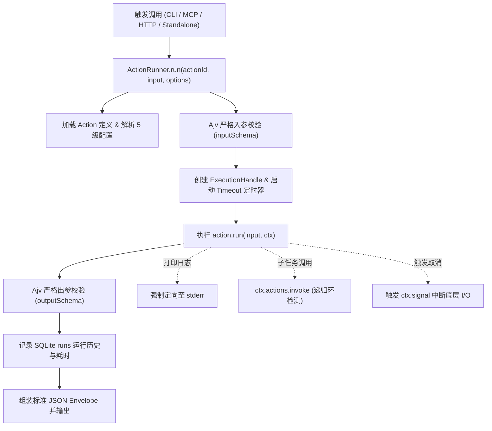

# 底层架构：Runtime 执行引擎

ActionDock 的所有执行请求（无论是通过 `ac run` 本地调用、MCP Tool 调用、HTTP 服务调度还是独立二进制执行）均汇聚至唯一的核心执行引擎：**`ActionRunner`**。

---

## 1. `ActionRunner` 执行生命周期

---

## 2. 核心设计底线

1. **单一事实执行核心**：所有入口必须通过 `ActionRunner` 执行，严禁绕过 Schema 校验与日志隔离层直接执行 Action 函数。
2. **确定性耗时记录**：每次执行均记录毫秒级耗时与状态（`SUCCESS` / `FAILED` / `TIMEOUT` / `CANCELLED`）。
3. **协作式中断保证**：当收到客户端取消信号或发生执行超时时，执行引擎首先触发 `ctx.signal`，然后妥善关闭资源并标记状态为 `CANCELLED`。
