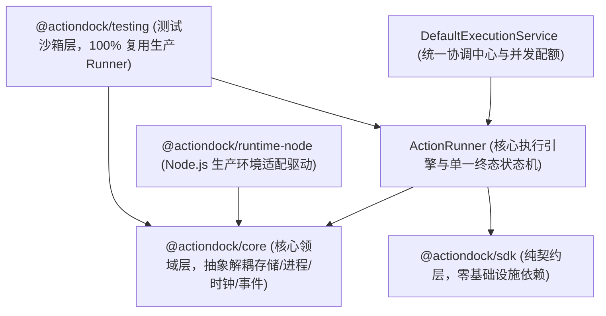
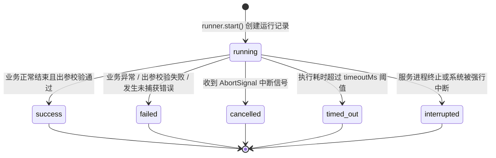

# 底层架构：Runtime 执行引擎与分层架构

ActionDock 2.0 围绕执行的确定性、强类型安全与环境解耦构建，保证任何形式的调用（CLI、MCP、HTTP、测试沙箱或目录型构建运行）均收敛至一致的核心执行语义。

---

## 架构总览与分层设计原则

ActionDock 采用四层解耦架构设计，从上至下严格单向依赖：

---

## SDK 纯契约层：零基础设施依赖

`@actiondock/sdk` 是面向 Action 编写者的纯契约层，设计遵循以下规范：

- **零外部运行时依赖**：该包的依赖列表完全为空，不引入任何重型运行时库或底层基础设施。
- **纯粹契约与抽象定义**：仅导出类型定义与基础辅助声明函数，包括 `defineAction`、`ActionContext`、`ProcessAPI`、`Logger`、`Config`、`StateStore` 与执行结果信封结构。
- **杜绝依赖污染**：业务 Action 仅需依赖 `@actiondock/sdk`，保持极小体积与跨环境可移植性，免受底层驱动或工具链升级的影响。

---

## Core 核心领域层：抽象接口解耦体系

`@actiondock/core` 承载 ActionDock 的核心领域逻辑，完全平台无关。该层通过四组抽象接口将领域内核与操作系统底层能力彻底解耦：

- **存储抽象**：定义 `RuntimeStorage` 与 `SqliteDriver` 接口，解耦底层数据库引擎实现，规范参数化查询、结果集映射与事务边界。
- **进程抽象**：定义 `ProcessExecutor` 接口（实现 `ProcessAPI`），解耦系统命令派生、输入输出管道、信号传递与受管子进程生命周期管理。
- **时钟抽象**：定义 `Clock` 接口与默认的 `SystemClock`，解耦系统墙上时间与单调时钟获取，使得时间推进与超时控制在测试环境中完全可控。
- **事件抽象**：定义 `EventSink` 接口与默认的 `InMemoryEventSink`，解耦生命周期事件的发射、有界缓冲（单运行上限 1024 条或 1MB 事件）与异步迭代订阅流。

---

## 生产环境适配层：`@actiondock/runtime-node`

在 Node.js 生产环境中，`@actiondock/runtime-node` 将 Core 层的抽象接口绑定至 Node.js 企业级驱动：

- **同步存储驱动（默认）：NodeSqliteDriver**
  基于 Node.js 原生内置模块 `node:sqlite`（`DatabaseSync`）构建，满足 Core 层的同步驱动契约。默认开启预写日志模式（`PRAGMA journal_mode = WAL;`）、外键约束检查（`PRAGMA foreign_keys = ON;`）以及忙等待超时（`PRAGMA busy_timeout = 5000;`）。另有独立的异步驱动 WorkerSqliteDriver（基于 `node:worker_threads` 将同步操作卸载至后台线程，对外暴露异步接口），作为独立组件提供，不注入同步存储契约。
- **原生进程执行器：NodeProcessExecutor**
  基于 Node.js 原生 `node:child_process` 实现外部系统命令执行。标准输入输出实施物理管道隔离（`stdio: ["pipe", "pipe", "pipe"]`），设置 10MB 输出缓冲区上限（`maxOutputBytes`），防止畸形输出耗尽系统内存。通过独立进程组与跨平台信号分发（POSIX 负数 PID 与 Windows 进程树）精准管理子进程，杜绝孤儿进程。
- **模块加载器：NodeModuleLoader**
  基于 Node.js 现代模块解析机制加载 Action 源码，原生支持 TypeScript 类型擦除与 ESM 规范，免去日常开发态的前置编译等待。
- **HTTP 服务端：NodeHttpServer**
  基于 Node.js 原生 `node:http` 实现，将底层请求与响应转化为标准的 Web Request 与 Response 规范，并通过 Web Streams 实现流式数据传输与管道转发。

---

## 数据目录排他租约锁与崩溃自愈机制

为了防止多个无协调的 ActionDock 宿主进程并发操作同一数据目录导致数据库损坏，Core 层在数据目录下维护 `.actiondock.data.lock` 排他锁文件：

- **排他锁元数据**：锁文件记录宿主进程 PID、主机名、会话令牌、创建时间与关联受管子进程列表（`childPids`）。
- **活跃进程冲突防护（DATA_DIR_IN_USE）**：当检测到锁文件已存在且持有者进程仍存活时，系统抛出 `DATA_DIR_IN_USE` 错误拒绝并发启动，保障数据单写安全。
- **孤儿进程保护（DATA_DIR_RECOVERY_REQUIRED）**：当旧宿主进程已死亡但关联受管子进程仍在运行时，抛出 `DATA_DIR_RECOVERY_REQUIRED` 错误，阻止脏写并等待子进程回收。
- **崩溃自动恢复**：当旧宿主进程与所有子进程均已死亡（代表进程异常崩溃或断电），当前宿主自动接管排他锁并安全清理残留会话，实现免人工介入的故障自愈。

---

## 测试沙箱层：`@actiondock/testing` 与生产 Runner 的复用

在自动化测试体系中，传统的 Mock 方案往往脱离真实执行逻辑，容易产生测试通过但生产失败的隐患。ActionDock 坚持生产 Runner 逻辑 100% 真实复用的原则：

- **全内存测试驱动**：`createTestRuntime` 提供全套轻量化内存驱动：
  - `MemoryStorage`：纯内存模拟 SQLite 行为，支持配置、状态与运行记录存储。
  - `FakeClock`：支持手动推进毫秒级时间的确定性模拟时钟。
  - `MockProcessExecutor`：支持拦截、断言与预设输出的模拟进程执行器。
  - `TestEventSink`：全量捕获生命周期事件并支持历史追溯。
- **真实复用核心执行器**：沙箱内部直接实例化真实的 `ActionRunner`。所有的入参出参模式严格校验、调用环路死锁检测、单一终态状态机流转与记录落库逻辑在测试中均得到真实执行，确保测试环境与生产环境语义完全一致。

---

## 核心执行引擎：`ActionRunner` 唯一生命周期与状态机

无论请求来自何种入口，所有 Action 调用均收敛至唯一的核心执行引擎：`ActionRunner`。

### 执行生命周期全流程

- **解析 Action 动作定义**：定位并获取目标 Action，合并全局、环境变量与项目级配置。
- **调用环路死锁检测**：维护执行调用栈数组。若检测到 A 动作直接或间接递归调用自身（例如 A -> B -> A），立即阻断并返回错误码 `ACTION_CYCLE_DETECTED`。
- **入参模式严格校验**：基于 Ajv 验证器对输入数据进行校验。若不满足 `inputSchema` 约束，立即返回错误码 `INPUT_VALIDATION_FAILED`。
- **记录初始化并落库**：在存储引擎中创建运行记录，初始状态标记为 `running`。
- **构建运行时上下文**：组装注入 `RuntimeConfig`、`RuntimeStateStore`、`ProcessAPI`、重定向至标准错误的 `Logger`、级联调用器与 `AbortSignal`。
- **取消信号与超时竞态**：初始化 AbortController 与定时器，业务函数与取消/超时 Promise 展开竞态（`Promise.race`）。
- **出参模式严格校验**：Action 执行完成后，对其输出结果进行 `outputSchema` 校验。校验失败则判定任务失败。
- **终态转移与结果持久化**：推动状态机转移至确定的终态，并原子落盘至 SQLite 运行记录表。

### 单一终态状态机规范

- **状态不可逆转移**：运行记录从初始态 `running` 开始，最终只能转移至 `success`、`failed`、`cancelled`、`timed_out`、`interrupted` 五种终态之一。
- **终态不可更改**：任务一旦进入任意终态，其记录立即被完全冻结，严禁发生二次状态修改或重复结算，杜绝状态悬挂与数据竞争。

### 协作式取消机制

- **信号传递**：当客户端断开连接、调用方主动取消或任务超时触发时，引擎触发 `ctx.signal`。
- **下游协作响应**：Action 内部在执行长时间操作（如外部 HTTP 调用、系统子进程执行或大文件读取）时，将 `ctx.signal` 透传至底层操作。底层操作感知到信号后立即中止，释放连接与进程资源，防止孤儿任务在后台空转。

---

## 统一协调中心：`DefaultExecutionService` 与并发配额管控

`DefaultExecutionService` 是面向多任务并发调度的统一协调入口，集中管理活跃执行任务、事件分发与安全配额：

### 三重并发配额防护机制

- **32 根任务并发上限**：限制整个服务实例内同时处于活跃状态的独立根任务数量不超过 32 个。当达到配额上限时，新任务立即被拒绝并返回配额已满错误，防止并发洪峰击垮内存与数据库。
- **16 子任务并发限制**：单个 Action 内部通过 `ctx.actions.invoke` 发起的并行子任务数量上限为 16，防止未受控的并行任务产生放大效应。
- **32 层调用深度限制**：限制 Action 级联调用的最大嵌套深度不超过 32 层，彻底防范深层嵌套调用耗尽系统资源与调用栈溢出。

### 优雅停机保证

当服务接收到关闭信号时，协调服务将按序执行收尾：
- 立即将服务标记为关闭状态，拒绝接收任何新任务提交。
- 向当前所有活跃任务的执行句柄广播取消信号，通知业务协作退出。
- 在设定的宽限期内等待存量任务安全结束并完成数据持久化。

---

## 标准输出与错误通道的物理隔离

在面向智能体与自动化系统构建工具链时，输出通道污染是导致大模型解析崩溃的核心根源之一。ActionDock 在底层严格划分两个通信通道的物理职责边界：

- 标准输出通道（stdout）：专供机器可读的数据交付。在机器模式下，严格仅输出符合格式规范的结构化 JSON 信封，绝不掺杂任何 ANSI 控制字符、换行噪音或调试文本。
- 标准错误通道（stderr）：专供排错与诊断。承载所有业务日志（`ctx.log`）、进度指示器与异常堆栈。
- 子进程物理管道隔离：底层进程执行器在派生外部子进程时，严格配置 `stdio: ["pipe", "pipe", "pipe"]`，切断子进程与宿主标准流之间的直接贯通，外部命令的任何打印均无法直接溢出至宿主标准输出中。
