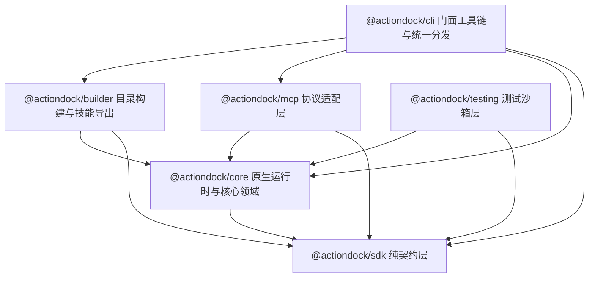
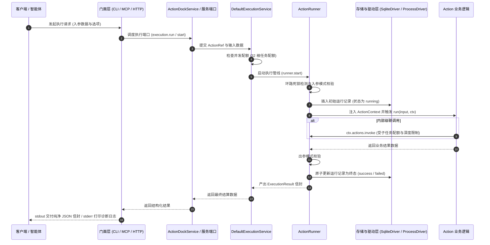
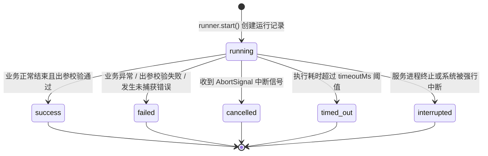

# 底层架构：Runtime 执行引擎与分层架构

ActionDock 3.0 围绕执行的确定性、强类型安全与环境解耦构建，保证任何形式的调用（CLI、MCP、HTTP、测试沙箱或目录型构建运行）均收敛至一致的核心执行语义。

---

## 架构总览与 6 个核心子包体系

ActionDock 采用分层解耦架构设计，整个体系划分为 6 个职责单一的核心子包：



- `@actiondock/sdk`：极简纯契约层，零生产依赖，导出 `defineAction`、`ActionContext`、`ProcessAPI`、`Logger`、`Config` 与 `StateStore`，并提供受管进程辅助工具（`withControl`、`createStreamDecoder` 等）。
- `@actiondock/core`：Node-first 原生运行时与核心领域，包含包图发现、动作目录、调用治理、执行主链、存储驱动（`NodeSqliteDriver`、`WorkerSqliteDriver`）、受管进程驱动（`NodeProcessDriver`）、HTTP 网络服务（`NodeHttpServer`）、标准服务端口体系（`DiscoveryPort`、`ExecutionPort`、`RunsPort`、`ConfigPort`、`StatePort`）与统一服务门面（`createActionDock`、`connectActionDock`）。
- `@actiondock/builder`：构建规划与分发构建包，负责依赖闭包规划、Skill 模板生成与规程渲染、Node.js 目录交付产物构建（`ad build`）、npm 打包（`ad pack`）与 Agent Skill 资产导出。
- `@actiondock/mcp`：MCP 协议适配层，全面对接核心层标准服务端口，将 Action 映射为标准 MCP 工具，支持 STDIO 与 HTTP 通道及取消信号链路。
- `@actiondock/cli`：命令行门面与运行分发器，向用户与智能体暴露统一的 `ad` 命令行工具及标准信封渲染。
- `@actiondock/testing`：确定性测试沙箱框架，收敛 `createTestRuntime` 测试运行时、`FakeClock` 虚拟时钟、`FakeProcessDriver` 确定性进程驱动桩、`MockProcessExecutor` 与 `MemoryStorage`。

---

## 统一执行主链

ActionDock 3.0 内部采用统一的执行主链通道，无论通过 CLI、MCP、HTTP 还是测试沙箱发起调用，均收敛至严格确定的流水线：

```text
Host -> Resolution -> PackageRuntime -> ExecutionService -> ActionRunner -> Action
```

- 宿主容器层（Host）：通过 `ActionDockHost` 或 `ActionDockService` 服务端口接收外部调用请求与入参数据。
- 动作解析层（Resolution）：纯领域函数 `resolveAction` 基于单一事实源完成动作寻址与跨包引用消歧，统一采用斜杠语法（`<package-id>/<action-id>`）。
- 包级装配层（PackageRuntime）：基于包图节点构建隔离的包级执行上下文与依赖环境。
- 执行协调层（ExecutionService）：`DefaultExecutionService` 统筹并发配额、追踪根调用与协同取消信号。
- 执行状态机层（ActionRunner）：驱动单一终态状态机，执行入参出参模式校验、循环依赖拦截与状态持久化。
- 业务执行层（Action）：执行开发者编写的纯粹业务逻辑并产出强类型结果。



---

## 统一服务门面与标准服务端口

ActionDock 3.0 彻底解耦上层适配与底层实现，通过标准服务端口体系与统一服务门面消除底层实体穿透：

### 统一服务门面

通过顶层工厂函数提供无缝屏蔽本地与远程拓扑差异的服务门面：

- 本地服务门面 `createActionDock`：创建 `LocalActionDockService` 实例，在当前 Node.js 进程内装配原生运行时驱动并高效执行。
- 远端服务门面 `connectActionDock`：创建 `RemoteActionDockService` 实例，通过 HTTP 协议与远端 ActionDock 服务通信，支持鉴权令牌、请求超时控制与证书安全校验。

### 五大标准服务端口

系统将所有对外能力解耦并收敛为五大标准服务端口契约：

- 发现端口 `DiscoveryPort`：负责包与动作的元数据发现、清单检索、全文过滤与规程查询。
- 执行端口 `ExecutionPort`：负责动作的同步阻塞执行（`run`）与异步启动执行（`start`）。
- 运行端口 `RunsPort`：负责任务运行历史列表、单次详情查询与协同取消（`cancel`）。
- 配置端口 `ConfigPort`：负责运行时分层配置读取、持久化配置变更与环境变量满足度体检。
- 状态端口 `StatePort`：负责包级与动作级持久化键值存取、前缀列举与过期清理。

---

## 单一事实源体系

ActionDock 3.0 全面贯彻单一事实源设计，彻底杜绝各模块私自实现短名搜索或启发式猜测：

- 包图发现单一事实源 `PackageDiscovery`：自顶向下扫描工作区与全局注册表，建立包目录索引。
- 包拓扑图单一事实源 `PackageGraph`：维护包节点身份标识、实例版本与拓扑依赖关系。
- 动作目录单一事实源 `ActionCatalog`：统一聚合索引所有已加载包的动作元数据，提供确定性的多维检索能力。
- 动作解析单一事实源 `resolveAction`：作为全系统动作引用的唯一解析函数。优先支持包限定斜杠语法（`<package-id>/<action-id>`）与当前调用方所属包优先匹配；严格禁止冒号历史语法（`pkg:action`）。
- 调用治理策略单一事实源 `InvocationPolicy`：统筹管理根任务最大并发配额（默认 32）、子任务并发上限（默认 64）与最大调用嵌套深度（默认 16）。

---

## SDK 纯契约层：零基础设施依赖

`@actiondock/sdk` 是面向 Action 编写者的纯契约层，设计遵循以下规范：

- 零外部运行时依赖：该包的依赖列表完全为空，不引入任何重型运行时库或底层基础设施。
- 纯粹契约与抽象定义：仅导出类型定义与基础辅助声明函数，包括 `defineAction`、`ActionContext`、`ProcessAPI`、`Logger`、`Config`、`StateStore` 与执行结果信封结构。
- 杜绝依赖污染：业务 Action 仅需依赖 `@actiondock/sdk`，保持极小体积与跨环境可移植性，免受底层驱动或工具链升级的影响。

---

## Core 原生运行时驱动体系

在 ActionDock 3.0 中，Node 原生运行时能力全面内聚归并入 `@actiondock/core`，依托 Node.js 原生特性构建高性能企业级驱动：

- 同步存储驱动 `NodeSqliteDriver`：基于 Node.js 原生内置模块 `node:sqlite`（`DatabaseSync`）构建，满足同步驱动契约。默认开启预写日志模式（WAL）、外键约束检查以及忙等待超时（`busy_timeout = 5000`）。
- 异步工作线程存储驱动 `WorkerSqliteDriver`：基于 `node:worker_threads` 构建的独立异步存储组件，将同步数据库操作卸载至后台线程，对外暴露异步接口。
- 受管进程平台驱动 `NodeProcessDriver`：完整实现 Core 层的 `ProcessDriver` 契约，提供基于 `node:child_process` 的 pipe 管道隔离与 PTY 伪终端支持。标准输入输出物理隔离，结合独立进程组与跨平台信号分发（POSIX 负数 PID 与 Windows 进程树）精准管理子进程，杜绝孤儿进程；支持输入净终止 `inputEOF` 与优雅输出排空。此外保留 `NodeProcessExecutor` 用于向后兼容执行简单命令。
- 原生模块加载器 `NodeModuleLoader`：基于 Node.js 现代模块解析机制加载 Action 源码，原生支持 TypeScript 类型擦除与 ESM 规范，免去日常开发态的前置编译等待。
- 原生网络服务容器 `NodeHttpServer`：基于 Node.js 原生 `node:http` 实现，将底层请求与响应转化为标准的 Web Request 与 Response 规范，并通过 Web Streams 实现流式数据传输与管道转发。

---

## 数据目录排他租约锁与崩溃自愈机制

为了防止多个无协调的 ActionDock 宿主进程并发操作同一数据目录导致数据库损坏，Core 层在数据目录下维护 `.actiondock.data.lock` 排他锁文件：

- 排他锁元数据：锁文件记录宿主进程 PID、主机名、会话令牌、创建时间与关联受管子进程列表（`childPids`）。
- 活跃进程冲突防护（`DATA_DIR_IN_USE`）：当检测到锁文件已存在且持有者进程仍存活时，系统抛出 `DATA_DIR_IN_USE` 错误拒绝并发启动，保障数据单写安全。
- 孤儿进程保护（`DATA_DIR_RECOVERY_REQUIRED`）：当旧宿主进程已死亡但关联受管子进程仍在运行时，抛出 `DATA_DIR_RECOVERY_REQUIRED` 错误，阻止脏写并等待子进程回收。
- 崩溃自动恢复：当旧宿主进程与所有子进程均已死亡（代表进程异常崩溃或断电），当前宿主自动接管排他锁并安全清理残留会话，实现免人工介入的故障自愈。

---

## 测试沙箱层：`@actiondock/testing` 与生产 Runner 的复用

在自动化测试体系中，传统的 Mock 方案往往脱离真实执行逻辑，容易产生测试通过但生产失败的隐患。ActionDock 坚持生产 Runner 逻辑 100% 真实复用的原则：

- 全内存测试驱动：`createTestRuntime` 提供全套轻量化内存驱动：
  - `MemoryStorage`：纯内存模拟 SQLite 行为，支持配置、状态与运行记录存储。
  - `FakeClock`：支持手动推进毫秒级时间的确定性模拟时钟。
  - `FakeProcessDriver`：支持确定性模拟输出、退出、排空关闭与故障注入的进程驱动桩。
  - `MockProcessExecutor`：支持拦截、断言与预设输出的模拟进程执行器。
  - `TestEventSink`：全量捕获生命周期事件并支持历史追溯。
- 真实复用核心执行器：沙箱内部直接实例化真实的 `ActionRunner`。所有的入参出参模式严格校验、调用环路死锁检测、单一终态状态机流转与记录落库逻辑在测试中均得到真实执行，确保测试环境与生产环境语义完全一致。

---

## 核心执行引擎：`ActionRunner` 唯一生命周期与状态机

无论请求来自何种入口，所有 Action 调用均收敛至唯一的核心执行引擎：`ActionRunner`。



### 执行生命周期全流程

- 解析 Action 动作定义：定位并获取目标 Action，合并全局、环境变量与项目级配置。
- 调用环路死锁检测：维护执行调用栈数组。若检测到 A 动作直接或间接递归调用自身（例如 A -> B -> A），立即阻断并返回错误码 `ACTION_CALL_CYCLE`（附带 `details.alias: "ACTION_CYCLE_DETECTED"` 标记）。
- 入参模式严格校验：基于 Ajv 验证器对输入数据进行校验。若不满足 `inputSchema` 约束，立即返回错误码 `INPUT_VALIDATION_FAILED`。
- 记录初始化并落库：在存储引擎中创建运行记录，初始状态标记为 `running`。
- 构建运行时上下文：组装注入 `RuntimeConfig`、`RuntimeStateStore`、`ProcessAPI`、重定向至标准错误的 `Logger`、级联调用器与 `AbortSignal`。
- 取消信号与超时竞态：初始化 AbortController 与定时器，业务函数与取消/超时 Promise 展开竞态（`Promise.race`）。
- 出参模式严格校验：Action 执行完成后，对其输出结果进行 `outputSchema` 校验。校验失败则判定任务失败。
- 终态转移与结果持久化：推动状态机转移至确定的终态，并原子落盘至 SQLite 运行记录表。

### 单一终态状态机规范

- 状态不可逆转移：运行记录从初始态 `running` 开始，最终只能转移至 `success`、`failed`、`cancelled`、`timed_out`、`interrupted` 五种终态之一。
- 终态不可更改：任务一旦进入任意终态，其记录立即被完全冻结，严禁发生二次状态修改或重复结算，杜绝状态悬挂与数据竞争。

### 协作式取消机制

- 信号传递：当客户端断开连接、调用方主动取消或任务超时触发时，引擎触发 `ctx.signal`。
- 下游协作响应：Action 内部在执行长时间操作（如外部 HTTP 调用、系统子进程执行或大文件读取）时，将 `ctx.signal` 透传至底层操作。底层操作感知到信号后立即中止，释放连接与进程资源，防止孤儿任务在后台空转。

---

## 统一协调中心：`DefaultExecutionService` 与并发配额管控

`DefaultExecutionService` 是面向多任务并发调度的统一协调入口，集中管理活跃执行任务、事件分发与安全配额：

### 三重并发配额防护机制

- 32 根任务并发上限：限制整个服务实例内同时处于活跃状态的独立根任务数量不超过 32 个。当达到配额上限时，新任务立即被拒绝并返回配额已满错误，防止并发洪峰击垮内存与数据库。
- 64 子任务并发限制：单个根任务内部通过 `ctx.actions.invoke` 发起的活跃子任务数量上限默认为 64，防止未受控的并行任务产生放大效应。
- 16 层调用深度限制：限制 Action 级联调用的最大嵌套深度默认为 16 层，彻底防范深层嵌套调用耗尽系统资源与调用栈溢出。

### 优雅停机保证

当服务接收到关闭信号时，协调服务将按序执行收尾：
- 立即将服务标记为关闭状态，拒绝接收任何新任务提交。
- 向当前所有活跃任务的执行句柄广播取消信号，通知业务协作退出。
- 在设定的宽限期内等待存量任务安全结束并完成数据持久化。

---

## 标准输出与错误通道的物理隔离

在面向智能体与自动化系统构建工具链时，输出通道污染是导致大模型解析崩溃的核心根源之一。ActionDock 在底层严格划分两个通信通道的物理职责边界：

- 标准输出通道（stdout）：专供机器可读的数据交付。在机器模式下，严格仅输出符合格式规范的结构化 JSON 信封，绝不掺杂任何 ANSI 控制字符、换行噪音或调试文本。
- 标准错误通道（stderr）：专供排错与诊断。承载所有业务日志（`ctx.log`）、进度指示器与异常堆栈。
- 子进程物理管道隔离：底层进程执行器在派生外部子进程时，严格配置 `stdio: ["pipe", "pipe", "pipe"]`，切断子进程与宿主标准流之间的直接贯通，外部命令的任何打印均无法直接溢出至宿主标准输出中。
