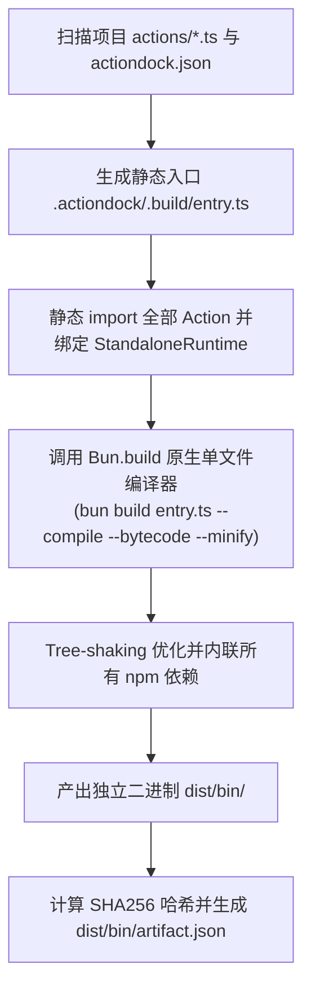

# 构建编译与 Skill 分发

# 背景

在传统的 AI Agent 工具分发与部署模式中，团队通常面临极高的运维成本与环境不确定性：

- **繁琐的环境准备**：目标机器或沙箱容器必须预先安装对应版本的 Node.js、Bun、Python 解释器与包管理工具。
- **体积庞大与网络依赖**：分发工具需要连同数万个文件的 `node_modules` 或庞大的 Python 虚拟环境一同打包，且部署时经常需要联网执行 `npm install`。
- **依赖冲突与版本漂移**：目标环境中的全局依赖或子依赖版本不兼容，导致同一套工具在开发者电脑上正常，而在生产沙箱中运行失败。

ActionDock 2.0 确立了**零安装独立二进制**与**自包含 Agent Skill 交付包**的分发标准。通过 Bun 原生单文件编译引擎，将整个 Action Package 打包为单文件可执行程序，目标环境无需安装任何运行时即可直接执行。

---

# 独立二进制构建原理 (`ac build`)



### 单包单二进制设计
ActionDock 将一个 Package 内的所有 Action 聚合编译进**同一个独立可执行文件**中（例如 `./bin/github-tools`）：
- **杜绝体积膨胀**：避免每个 Action 单独打包导致的体积冗余，几十个 Action 共享单份运行时体积（通常约 40~50MB）。
- **统一工具门面**：通过子命令分发（`./bin/pkg list`、`./bin/pkg describe`、`./bin/pkg run`），完全符合现代 CLI 工具规范。

---

# 全平台交叉编译

借助 Bun 原生内置的跨平台交叉编译能力，在单台开发机上（例如 macOS）无需 Docker 或目标平台工具链，即可直接构建全平台可执行文件：

| 目标平台标识 (`--target`) | 目标操作系统与架构 | 适用场景 |
| :--- | :--- | :--- |
| `host`（默认） | 当前编译宿主机操作系统与架构 | 本地开发与快速测试 |
| `linux-x64` | Linux x86_64 (64-bit) | 绝大多数云服务器、Kubernetes 容器 |
| `linux-arm64` | Linux ARM64 (64-bit) | AWS Graviton、树莓派等 ARM 服务器 |
| `darwin-arm64` | macOS ARM64 (Apple Silicon M1/M2/M3/M4) | 现代化 Mac 电脑 |
| `darwin-x64` | macOS x86_64 (Intel) | 旧款 Intel 架构 Mac |
| `windows-x64` | Windows x86_64 (64-bit `.exe`) | Windows 开发机与服务器 |

### 交叉编译命令示例

```bash
# 编译为当前宿主架构
ac build

# 交叉编译为 Linux 生产服务器二进制
ac build --target linux-x64 --out dist/bin/my-tools-linux-x64

# 交叉编译为 Apple Silicon Mac 二进制
ac build --target darwin-arm64 --out dist/bin/my-tools-darwin-arm64

# 交叉编译为 Windows 二进制并开启代码压缩
ac build --target windows-x64 --minify --out dist/bin/my-tools.exe
```

> [!TIP]
> 交叉编译适用于纯 TypeScript/JS 及其纯 JS npm 依赖；若 Action 引用了包含原生 C/C++ 动态链接库的 npm 扩展包，建议在目标系统的 CI 流水线中执行构建。

---

# 构建元数据清单 (`artifact.json`)

每次构建完成后，ActionDock 会在输出目录下自动生成结构化的 `artifact.json` 元数据文件：

```json
{
  "packageId": "team4u.github-tools",
  "name": "GitHub Tools",
  "version": "1.0.0",
  "description": "GitHub 自动化运维与代码评审工具集",
  "target": "linux-x64",
  "actions": [
    "github.list-prs",
    "github.get-pr",
    "github.review-pr",
    "github.comment-pr"
  ],
  "bunVersion": "1.4.0",
  "lockHash": "34cbb9a4087e812a",
  "buildHash": "a9b8c7d6e5f41234",
  "createdAt": "2026-08-30T08:00:00.000Z"
}
```

---

# Skill 交付包导出 (`ac export skill`)

通过 `ac export skill` 命令，将 Action Package 打包为标准 Agent Skill 交付包。

### 源码型 Skill 导出（默认推荐）
```bash
ac export skill
```
输出目录为 `dist/<package-name>-skill/`，包含 `SKILL.md`、`actiondock.json`、`package.json`、`actions/*.ts` 与 `playbooks/*.md`。无需编译，体积小，跨平台通用，可直接被预装了 ActionDock 运行时的 AI Agent 通过 `ac link` 动态加载。

### 独立便携型 Skill 导出 (`--standalone`)
若目标机器未安装 ActionDock / Bun 运行时，可导出包含预编译单文件二进制的便携 Skill：
```bash
# 当前宿主平台
ac export skill --standalone

# 交叉编译至 Linux x64
ac export skill --standalone --target linux-x64
```
输出目录包含 `SKILL.md`、`actiondock.skill.json`、`bin/<package-name>` 与 `playbooks/*.md`。

### 任务驱动按需导出
在复杂项目中，推荐使用 `--playbook` 参数针对特定任务精准打包（源码型与独立型均支持）：
```bash
ac export skill --playbook review-pr
```
- **自动依赖裁剪**：系统自动读取 `playbooks/review-pr.md` Frontmatter 中的 `actions` 依赖，仅导出该任务所需的 Action，剔除其余代码。
- **纯净产物**：导出的 `playbooks/` 仅含选中的 SOP，生成的 `SKILL.md` 仅包含相关 Action，杜绝 Agent 提示词冗余。

### 自动 ZIP 归档
```bash
ac export skill --archive                      # 生成 dist/<pkg>-skill.zip
ac export skill --standalone --archive         # 生成 standalone ZIP
```

---

# 导出的 Skill 目录结构对比

### 源码型 Skill（默认）
```text
dist/github-tools-skill/
├── SKILL.md                  # 面向 AI Agent 的主引导手册（包含 ac link 与限定 ID 说明）
├── actiondock.json          # Package 清单
├── package.json             # 依赖声明
├── actions/                 # TypeScript Action 源码文件
│   └── review-pr.ts
└── playbooks/                # 任务 SOP Markdown 目录
    └── review-pr.md
```

### 独立便携型 Skill (`--standalone`)
```text
dist/github-tools-skill/
├── SKILL.md                  # 面向 AI Agent 的主引导手册（指向 ./bin/github-tools）
├── actiondock.skill.json     # 机器可读的结构化清单（包含全量 Action Schema）
├── playbooks/                # 任务 SOP Markdown 规程目录
│   └── review-pr.md
└── bin/
    └── github-tools          # 独立自包含二进制
```

---

# 独立编译契约一致性保证

ActionDock 保证在**源码开发态**与**独立编译态**下行为 100% 严格一致：

| 特性 | 本地开发态 (`ac run`) | 独立二进制态 (`./bin/pkg run`) | 一致性保证 |
| :--- | :--- | :--- | :--- |
| **输入/输出校验** | Ajv JSON Schema 校验 | Ajv JSON Schema 校验 | 完全一致 |
| **配置解析优先级** | 5 级配置回退（CLI > DB > Env > Default） | 5 级配置回退（CLI > DB > Env > Default） | 完全一致 |
| **持久化存储模型** | SQLite `runtime.db` | SQLite `~/.actiondock/data/<pkg>/runtime.db` | 表结构与 TTL 机制完全一致 |
| **输出 Envelope** | `stdout` 标准 JSON Envelope | `stdout` 标准 JSON Envelope | 完全一致 |
| **日志通道** | `stderr` 格式化日志 | `stderr` 格式化日志 | 完全一致 |
| **超时与取消** | 支持 `--timeout` 与 `Ctrl+C` 信号 | 支持 `--timeout` 与 `Ctrl+C` 信号 | 完全一致 |

---

# 文档导航

- [Skill 设计哲学与交付规范](skill-guide.md)：深入学习 Skill 交付包设计理念与 Agent 生命周期。
- [Playbook SOP 编写规范](playbook-guide.md)：为 Skill 编写高质业务操作规程。
- [AI Agent 接入指南](agent-integration.md)：将导出的 Skill 接入各类主流 Agent 宿主。
