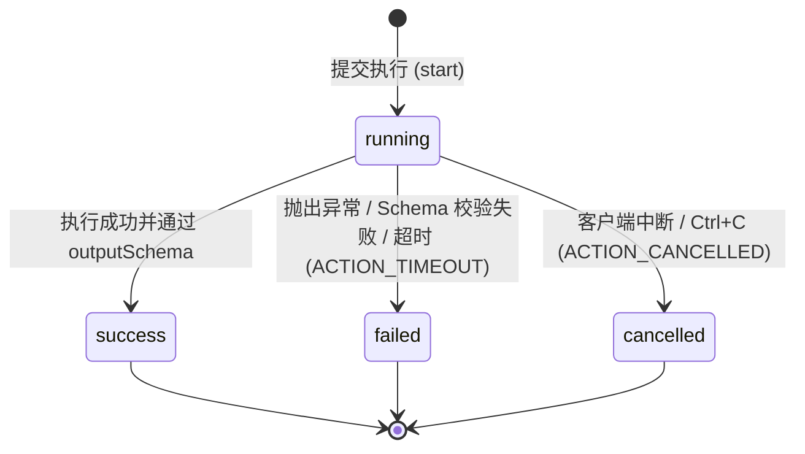

# 安全加固、MCP Adapter 与执行生命周期设计

- **架构状态**：Implemented
- **适用版本**：ActionDock 2.0+
- **核心定位**：确立 ActionDock 2.0 的安全防御底线、Model Context Protocol (MCP) 适配器规范以及完整的执行生命周期模型（Timeout / Cancel / Async Task）。

---

# 架构设计五大核心原则

```mermaid
graph TD
    subgraph 统一领域内核 (Core Domain Engine)
        ActionDef["ActionDefinition<br/>(Schema / Types / Logic)"] --> ActionRunner["ActionRunner (唯一执行核心)"]
        ActionRunner --> Storage[("RuntimeStorage<br/>(SQLite runs / state / config)")]
        ActionRunner --> ExecMgr["ExecutionManager<br/>(内存句柄 / AbortController)"]
    end

    subgraph 接入层 (Multi-Channel Ingress)
        CLI["CLI 门面 (ac run)"] --> ActionRunner
        HTTP["HTTP Runner (ac serve)"] --> ActionRunner
        MCP["MCP Adapter (ac mcp / STDIO / HTTP)"] --> ActionRunner
    end

    ActionRunner --> Context["ActionContext (ctx.config / state / log / signal)"]
    Context --> Exec["action.run(input, ctx)"]
```

- **`ActionRunner` 是唯一执行核心**：无论是本地 CLI（`ac run`）、远程 HTTP Runner（`ac serve`）还是 MCP Server（`ac mcp`），所有 Action 的调用必须统一流经 `ActionRunner`，完全享有输入/输出 Schema 严格校验、SQLite 执行记录与循环调用防御。
- **MCP 不实现第二套 Runtime**：MCP Tool 调用直接映射为 Action 执行，Schema 自动转换，执行历史无缝写入 SQLite `runs` 表。
- **HTTP API 不实现第二套任务状态**：统一复用 SQLite `runs` 数据模型与 `runId` 标识，`runId` 等价于全局任务句柄。
- **统一执行上下文与取消信号**：在 `ActionContext` 中引入标准 Web API `AbortSignal`（`ctx.signal`），实现跨协议全链路协作式取消。
- **安全默认（Secure by Default）**：网络服务默认仅绑定 `127.0.0.1`，公网暴露强制要求 Token 鉴权，移除 URL Query Token，默认关闭跨域，敏感配置文件应用严格的 POSIX `0o600` 权限。

---

# 安全加固规范 (Security Hardening)

### 默认绑定与非 Loopback 强制认证
* **默认监听**：`ac serve` 与 `ac mcp serve` 默认仅绑定回环地址 `127.0.0.1`。
* **强制鉴权**：当绑定到 `0.0.0.0` 或非 Loopback 地址时，若未配置 `--token` 或 `ACTIONDOCK_TOKEN`，服务**直接拒绝启动**；若确需在受信内网无认证运行，必须显式传入 `--allow-insecure-no-auth`。

### 移除 URL Query Token 与时间恒定比较
* 彻底废弃 `?token=xxx` URL 参数认证支持，防止 Token 被代理服务器日志、访问日志或历史记录泄露；仅允许 `Authorization: Bearer <token>` 请求头。
* 采用 `crypto.timingSafeEqual` 进行恒定时间字符串比较，杜绝针对 Token 的时序侧信道攻击。

### CORS 默认关闭与白名单机制
* 默认不返回 `Access-Control-Allow-Origin` 响应头，阻止任意恶意网页通过浏览器跨域静默调用本地 Runner。
* 仅当通过 `--cors-origin <url>` 显式指定时，才按白名单返回对应 CORS 标头。

### 请求 Body 限制与调试信息隐藏
* 默认请求 Body 最大限制为 `1 MiB`（可通过 `--max-body` 调整），超出时返回 `413 REQUEST_TOO_LARGE`。
* `GET /api/v1/health` 与 `GET /api/v1/info` 默认不返回宿主机绝对路径 `projectRoot`，仅在传入 `--expose-debug-info` 时用于本地开发排障。

### Profile TokenEnv 与文件权限加固
* Profile 推荐使用 `--token-env <ENV_NAME>` 关联环境变量名，避免在 `~/.actiondock/profiles.json` 中明文持久化 Token。
* 配置文件与 SQLite 数据文件在 POSIX 系统上强制应用 `0o600` 文件权限与 `0o700` 目录权限保护。

---

# Model Context Protocol (MCP) 适配器规范

ActionDock 在 `packages/mcp`（`@actiondock/mcp`）中实现了官方 MCP 规范：

### Schema 零冗余映射
* 基于 `@modelcontextprotocol/server`，将 Action 的 JSON Schema 自动转换为标准 MCP Tool Input/Output Schema，无需额外维护 MCP 清单。

### 双模 Transport
* **STDIO 模式 (`ac mcp`)**：标准输入输出通信，适用于 Claude Code、Cursor、VS Code 等本地 Agent / 桌面 IDE 直连。
* **Streamable HTTP 模式 (`ac mcp serve`)**：标准 HTTP 通信（端点 `/mcp`），适用于微服务或容器化远程部署。

### 双向取消链路
* MCP 客户端发出的取消请求（`ctx.mcpReq.signal`）无缝注入 Action 内部的 `ctx.signal`，实现跨协议协作取消。

---

# 执行生命周期、超时与异步任务



### `ActionRunner.start()` 与 `ExecutionHandle`
拆分基础执行原语，同时支持同步等待与后台异步追踪：

```ts
export interface ExecutionHandle {
  runId: string;
  result: Promise<ExecutionResult>;
  cancel(reason?: string): boolean;
}
```
* `runner.start(...)` 立即返回 `ExecutionHandle` 与 `runId`，用于后台异步任务调度与内存生命周期控制。
* `runner.execute(...)` 等价于 `runner.start(...).result`，完全保持原有同步调用的向后兼容。

### `ExecutionManager` 内存句柄管理
* 内存中活跃任务句柄注册表，追踪当前进程中正在执行中的 Action Promise。
* 提供 `register`、`get`、`cancel`、`list` 与 `clear` 操作，当 Action 执行终态达成（无论成功或失败）自动注销。

### 超时机制与终态保证
* 传入 `timeoutMs` 时，`ActionRunner` 创建计时器并在超时时触发内部 `AbortController.abort()`。
* 执行流程通过 `Promise.race([actionPromise, abortPromise])` 竞速。超时统一归类为终态 `status = "failed"`，错误码为 `ACTION_TIMEOUT`。
* 主动取消归类为终态 `status = "cancelled"`，错误码为 `ACTION_CANCELLED`。
* 内部设立 `finalized` 幂等标志，防止因底层非协作式 JS 耗时导致的“迟到 Promise”二次覆写 `RunRecord`。

### 异步执行模型边界（Server-Lifetime Asynchronous Execution）
* **Run 元数据持久化**：所有的 `RunRecord`（包括入参、状态、耗时、异常）均持久化在 SQLite 中。
* **Server 生命周期绑定**：异步执行依赖当前长运行的 `ac serve` 进程（内存中的 `ExecutionManager` 与 Active Promise）。若 `ac serve` 进程被重启，未完成的任务将中止，不会自动重放（ActionDock 专注于轻量 Toolchain，不内置重型分布式分布式队列）。

---

# 验收标准清单 (Acceptance Checklist)

- [x] **S01**：`ac serve` 默认只监听 `127.0.0.1`。
- [x] **S02**：`0.0.0.0` 且无 Token 启动失败。
- [x] **S03**：`0.0.0.0` 且有 Token 启动成功。
- [x] **S04**：URL `?token=xxx` 请求返回 401。
- [x] **S05**：`Authorization: Bearer <token>` 验证成功。
- [x] **S06**：默认不返回 `Access-Control-Allow-Origin`。
- [x] **S07**：配置 `--cors-origin` 后按白名单返回。
- [x] **S08**：超大 Body 返回 413 `REQUEST_TOO_LARGE`。
- [x] **S09**：默认不暴露 `projectRoot` 宿主机绝对路径。
- [x] **S10**：Profile 支持 `tokenEnv` 并应用 `0o600` 文件权限。
- [x] **E01**：旧 Action 零修改平滑运行，新 Action 可读取 `ctx.signal`。
- [x] **E02**：CLI 与 Standalone 支持 `--timeout`，超时记录为 `ACTION_TIMEOUT`。
- [x] **E03**：CLI 捕获 `Ctrl+C` 传播取消信号，记录为 `ACTION_CANCELLED`。
- [x] **E04**：HTTP Server 支持 `mode = "async"` 返回 `202 Accepted`。
- [x] **E05**：HTTP Server 提供 `GET /api/v1/runs/:id` 与 `POST /api/v1/runs/:id/cancel`。
- [x] **E06**：`ac runs show` 与 `ac runs cancel` 支持 `--profile` 远程操作。
- [x] **E07**：本地单次执行严格拒绝 `--async` 与 `ac runs cancel` 并提供明确指引。
- [x] **M01**：MCP Tools 自动映射自 ActionDefinition，Schema 零冗余。
- [x] **M02**：MCP 调用统一经由 `ActionRunner` 并写入 SQLite `runs`。
- [x] **M03**：MCP 客户端取消直通 Action 内部 `ctx.signal`。
- [x] **M04**：MCP STDIO 与 HTTP Transport 具备一致的安全与执行语义。
- [x] **M05**：MCP Tasks 扩展支持异步 Tool 调用（`execution: { mode: "async" }` 返回 `taskId`）。
- [x] **M06**：MCP Tasks `tasks/get` 端点支持查询任务进度与结果。
- [x] **M07**：MCP Tasks `tasks/cancel` 端点支持协作式中断取消（直通 `ctx.signal`）。
- [x] **M08**：MCP Tasks `tasks/list` 端点支持任务历史分页与过滤。

---

# 文档导航

- [Model Context Protocol 适配器指南](mcp-integration.md)：详细了解 MCP STDIO 与 HTTP 部署。
- [多环境与远程云机器调度指南](remote-and-profiles.md)：深入掌握 Profile 与 HTTP Runner 运维。
- [错误代码与排错手册](error-codes.md)：查阅运行时错误码与异常处理。
