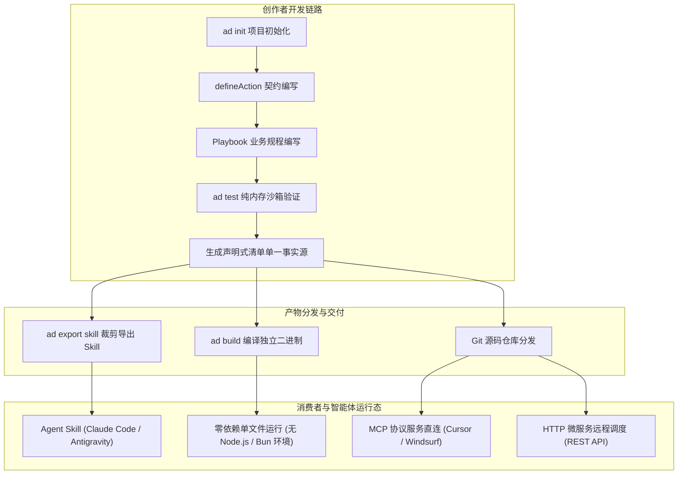
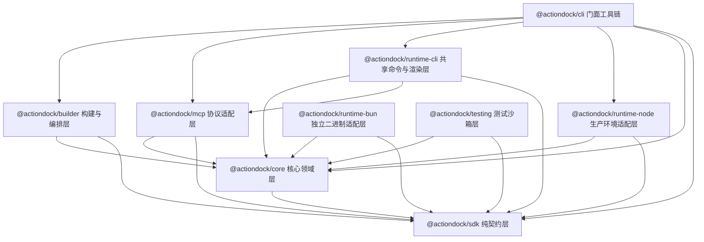
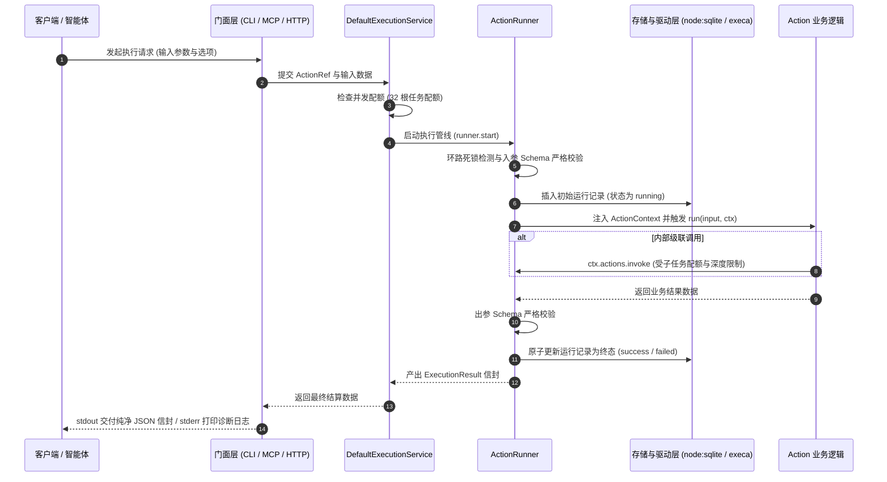

# 核心架构与设计概览

ActionDock 2.0 是面向智能体的 Action 与 Skill 开发、测试、构建与分发工具链，旨在连接工具创作者与智能体使用者，实现能力的定义、验证、裁剪与多模态分发。

---

## 核心架构与全景生命周期

ActionDock 围绕工具的完整生命周期构建，实现开发态与消费态的全面解耦：

---

## 智能体自编码时代的工业底座

当今软件研发正在经历深刻范式转移：绝大部分动作代码由智能体编写，人的重心则聚焦于架构设计、业务规范与安全准入。

在这一背景下，工具工具链的核心诉求发生了根本转变：
- 瓶颈不再是降低简单代码的编写难度，因为智能体生成几十行类型注解与契约模板只需瞬间。
- 真正严峻的考验变成了：智能体编写的代码是否可靠、能否自主测试修复、复杂业务下会不会失控执行，以及能否跨机器环境零成本交付。

### 与临时脚本及普通框架的本质区别

| 评估维度 | 临时手写脚本 | 普通协议封装库 | ActionDock 工业级底座 |
| :--- | :--- | :--- | :--- |
| 业务流程把控 | 无规程约束，智能体易产生参数幻觉或步骤错乱 | 仅暴露裸接口，缺乏安全红线与前后置顺序 | 人定规程，通过 Playbook 确立作业时序与安全红线 |
| 代码质量保证 | 几乎无自动化测试，依赖人工手动联调验证 | 依赖外部网络与真实数据库，测试缓慢脆弱 | 内置纯内存沙箱与确定性时钟，智能体自主测试并闭环自愈 |
| 多端分发能力 | 深度绑定特定宿主环境，换机器容易报错中断 | 仅支持单一协议或需要宿主预装运行环境与包依赖 | 编译为零外部依赖的单文件独立二进制产物，脱离环境泥潭 |
| 资产交付形态 | 零碎散落的代码文件，无法跨项目复用与协作 | 孤立的工具函数，缺乏操作规程与上下文指引 | 原子能力与规程编排融合，导出为自包含智能体技能资产 |

### 三大本质差异的架构落地

- **从失控的裸调用，到规程约束的标准化资产**：
  普通工具库直接把底层接口交给大模型，在面对包含前置检查、多步流转的复杂任务时，模型极易出现顺序倒错、遗漏验证甚至误删生产数据的严重失误。ActionDock 践行人定规程、智能体写实现的协作理念。人负责编写操作规程 Playbook，沉淀步骤时序、分支判定与安全红线；智能体依据契约编写具体的原子 Action。两相结合，交付的不再是孤立的函数，而是内嵌专家经验与业务红线的自包含技能资产。
- **从碰运气的生成代码，到纯内存沙箱自愈闭环**：
  智能体编写代码最大的隐患在于偶发幻觉与边界遗漏。如果每次验证都需要启动后台服务、连接远程数据库，智能体很难进行高频可靠的自测。ActionDock 提供了由确定性虚拟时钟、模拟进程与内存存储构成的测试套件。智能体生成代码后可在毫秒级运行沙箱测试；一旦发生断言失败，可依据结构化错误信息精准修复代码，直至全量测试通过，彻底杜绝隐患代码带病交付。
- **从脆弱的环境泥潭，到零外部依赖的终极交付**：
  依赖宿主机器的运行环境是导致工具分发故障的主要根源。Node.js 版本不匹配、包管理器依赖下载失败或系统权限受限常常使工具无法运行。ActionDock 调度编译器管线，将代码及其运行时、轻量持久化驱动打包为单文件独立二进制产物。目标机器无需预装 Node.js 或 Bun，随处复制即可直接提供本地命令行、MCP 协议或技能调度。

---

## 面向 Node.js 的分层解耦体系

ActionDock 2.0 全面以 Node.js 22.12.0 或更高版本为生产级运行基座，将系统解耦拆分为 9 个职责明确的独立子包。各层之间通过强类型契约与接口抽象进行交互，杜绝跨层耦合。

### 9 个子包的分工与定位

- **契约规范层**：
  - `@actiondock/sdk`：极简纯契约层，零外部运行时依赖。仅提供动作声明函数（`defineAction`）、运行时上下文接口（`ActionContext`）、进程调度抽象（`ProcessAPI`）、日志接口（`Logger`）与配置状态定义。工具包编写者仅需引入该包，即可获得完整的类型约束与代码提示。
- **核心领域层**：
  - `@actiondock/core`：框架的核心业务领域层。封装项目配置解析、Schema 校验、运行记录存储抽象、事件汇聚总线、核心执行引擎（`ActionRunner`）以及统一调度协调服务（`DefaultExecutionService`）。本层完全平台无关，通过接口与具体的操作系统底层能力解耦。
- **运行时适配层**：
  - `@actiondock/runtime-node`：Node.js 生产环境适配驱动。针对 Node.js 22.12.0 或更高版本原生环境提供实体驱动实现，包括基于 `node:sqlite` 的同步事务存储驱动、基于 `execa` 的进程调度器、基于 `tsx` 的 TypeScript 源码无编译动态加载器，以及基于 `node:http` 和 Web Streams 的流式服务转换器。
  - `@actiondock/runtime-bun`：Bun 独立二进制适配驱动。专为独立二进制产物提供适配实现，包含针对 `bun:sqlite`、`Bun.serve` 与 `Bun.spawn` 的专属驱动封装。
  - `@actiondock/runtime-cli`：共享运行时命令与渲染层。提取 CLI 门面与独立二进制产物共用的命令组织结构、参数解析体系与标准输出信封格式化渲染能力。
- **构建与编排层**：
  - `@actiondock/builder`：构建编排规划器与导出器。负责构建计划生成、依赖拓扑分析、独立单文件二进制编译调用，以及依据 Playbook 规程将项目裁剪导出为轻量化 Agent Skill 资产。
- **协议适配层**：
  - `@actiondock/mcp`：Model Context Protocol 协议适配层。负责将 Action 自动映射为标准 MCP 工具，支持 STDIO 与 HTTP 两种传输通道，并负责双向取消信号传递与输出流纯净性保障。
- **门面工具链**：
  - `@actiondock/cli`：命令行顶层门面工具包。聚合所有子包能力，向终端用户与智能体暴露统一的 `ad` 命令行工具，提供初始化、运行、测试、服务管理、配置查询与构建导出等全量操作能力。
- **测试沙箱层**：
  - `@actiondock/testing`：单元测试与集成测试沙箱。提供纯内存存储、可推进模拟时钟、模拟进程调度器与事件捕获器，在无需任何真实外设的场景下，完整复用生产环境核心执行语义。

---

## 全链路执行数据流

ActionDock 内部采用统一的执行通道，无论通过何种形式发起调用，请求均遵循严格确定的数据流向：

- **触发入口解包**：CLI 参数、MCP 工具调用或 HTTP 请求被相应门面转换为标准调用请求。
- **配额与并发检查**：统一执行协调服务校验当前系统的活跃根任务配额，避免资源耗尽。
- **防御校验与状态登记**：核心执行引擎进行调用环路检测与模式校验，并向存储引擎写入初始状态为 `running` 的运行记录。
- **受控上下文执行**：构造包含隔离状态存储、配置读取、进程调度与协作式中断信号的上下文对象，驱动业务函数执行。
- **严格出参校验与终态转移**：校验输出结果合法性，推动状态机转移至不可逆的单一终态（`success`、`failed`、`cancelled`、`timed_out`、`interrupted`）并落盘。
- **通道物理隔离交付**：纯净结果信封流向标准输出供下游机器解析，所有过程日志与诊断信息流向标准错误。

---

## 声明式清单单一事实源设计理念

在传统工具生态中，往往通过动态导入代码来扫描和发现工具定义。这种方式在生产构建和智能体场景下面临严峻挑战：

- **传统动态扫描的痛点**：动态加载未受信或复杂的模块会导致意外的代码副作用，例如意外初始化第三方客户端、连接远程数据库、读取敏感环境配置。此外，在仅需要元数据的静态分析环境中，缺失运行环境或外部依赖会导致模块导入失败。
- **单一事实源定义**：ActionDock 采用声明式清单文件 `actiondock.manifest.json` 作为系统元数据的唯一事实源。清单以无副作用的纯 JSON 格式精确记录每个 Action 的入口文件路径、输入输出模式规范、静态依赖调用链（`uses`）、标签与注解元数据。
- **无副作用静态分析与构建规划**：构建规划器（Planner）与 Skill 导出器在解析项目结构时，直接依据声明式清单构建依赖图拓扑，无需加载执行任何业务代码。
- **精确按需裁剪与能力提取**：在导出 Agent Skill 或构建独立二进制时，框架可根据 Playbook 所声明调用的 Action 清单，精确计算闭包依赖，执行无副作用的静态依赖分析与资产裁剪，杜绝无关依赖被打包。

---

## 双轨阅读路径导引

针对不同角色的核心诉求，建议选择以下路径展开探索：

### 使用者与智能体操作者
> 目标：将现有的 Action Package 或 Skill 快速接入到工作流、IDE 或智能体中。

- [消费与接入总览](../consumer/overview.md)：了解多种接入方式的适用场景与选型。
- [Agent Skill 使用指南](../consumer/use-as-skill.md)：通过技能管理工具快速安装并供智能体自主调用。
- [接入 Cursor / Windsurf / IDE (MCP 服务)](../consumer/use-as-mcp.md)：将 Action 作为 MCP 服务接入主流智能体编辑器。
- [独立二进制与免环境运行](../consumer/standalone-run.md)：在无 Node.js 环境的机器上直接运行独立可执行程序。
- [消费端配置与凭证注入](../consumer/configuration.md)：配置凭据、环境变量与存储参数。

---

### 工具创作者与开发者
> 目标：编写高质量、类型安全、带操作规程的 Action Package 并发布分发。

- [快速上手开发](../developer/quick-start.md)：从零初始化项目并实现首个 Action。
- [深入业务 Action 开发](../developer/first-action.md)：状态持久化、配置读取与外部系统集成。
- [编写 Playbook 规程](../developer/playbooks.md)：为智能体编写标准化作业指导书与安全红线。
- [单元测试与沙箱验证](../developer/testing.md)：利用测试沙箱进行纯内存秒级验证。
- [构建、打包与 Skill 导出](../developer/build-and-export.md)：编译单文件独立二进制，导出适配主流智能体的技能资产。
