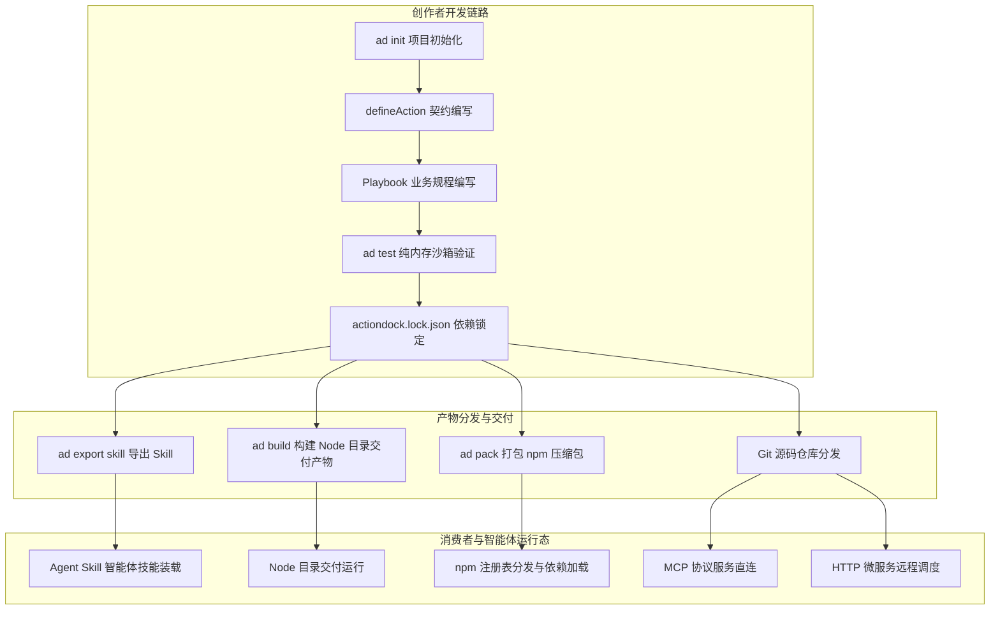
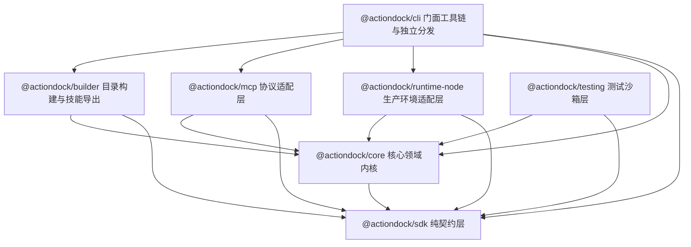
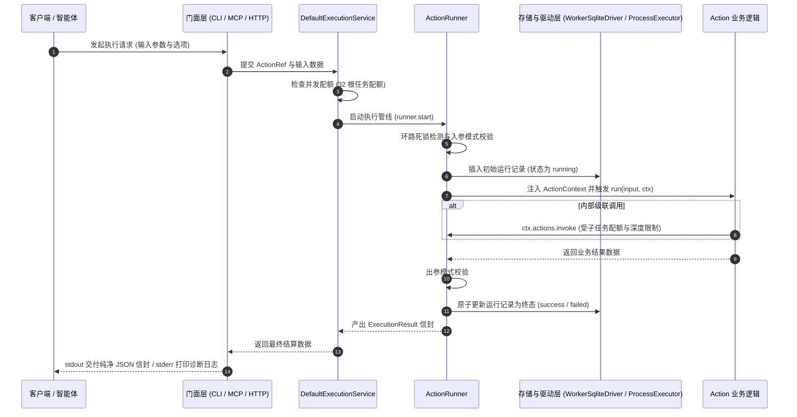

# 核心架构与设计概览

ActionDock 2.0 是面向智能体的 Action 与 Skill 开发、测试、构建与分发工具链，旨在连接工具创作者与智能体使用者，实现能力的定义、验证、裁剪与多模态分发。

---

## 核心架构与全景生命周期

ActionDock 围绕工具的完整生命周期构建，实现开发态与消费态的全面解耦：

---

## 智能体自编码时代的工业底座

当今软件研发正在经历深刻范式转移：绝大部分动作代码由智能体编写，人的重心则聚焦于架构设计、业务规范与安全准入。

在这一背景下，工具链的核心诉求发生了根本转变：
- 瓶颈不再是降低简单代码的编写难度，因为智能体生成几十行类型注解与契约模板只需瞬间。
- 真正严峻的考验变成了：智能体编写的代码是否可靠、能否自主测试修复、复杂业务下会不会失控执行，以及能否跨机器环境零成本交付。

### 与临时脚本及普通框架的本质区别

| 评估维度 | 临时手写脚本 | 普通协议封装库 | ActionDock 工业级底座 |
| :--- | :--- | :--- | :--- |
| 业务流程把控 | 无规程约束，智能体易产生参数幻觉或步骤错乱 | 仅暴露裸接口，缺乏安全红线与前后置顺序 | 人定规程，通过 Playbook 确立作业时序与安全红线 |
| 代码质量保证 | 几乎无自动化测试，依赖人工手动联调验证 | 依赖外部网络与真实数据库，测试缓慢脆弱 | 内置纯内存沙箱与确定性时钟，智能体自主测试并闭环自愈 |
| 多端分发能力 | 深度绑定特定宿主环境，换机器容易报错中断 | 仅支持单一协议或需要宿主预装复杂环境 | 构建自包含 Node 交付目录或标准 npm 压缩包，标准化交付 |
| 资产交付形态 | 零碎散落的代码文件，无法跨项目复用与协作 | 孤立的工具函数，缺乏操作规程与上下文指引 | 原子能力与规程编排融合，导出为自包含智能体技能资产 |

### 三大本质差异的架构落地

- 从失控的裸调用，到规程约束的标准化资产：普通工具库直接把底层接口交给大模型，在面对包含前置检查、多步流转的复杂任务时，模型极易出现顺序倒错、遗漏验证甚至误删生产数据的严重失误。ActionDock 践行人定规程、智能体写实现的协作理念。人负责编写操作规程 Playbook，沉淀步骤时序、分支判定与安全红线；智能体依据契约编写具体的原子 Action。两相结合，交付的不再是孤立的函数，而是内嵌专家经验与业务红线的自包含技能资产。
- 从碰运气的生成代码，到纯内存沙箱自愈闭环：智能体编写代码最大的隐患在于偶发幻觉与边界遗漏。如果每次验证都需要启动后台服务、连接远程数据库，智能体很难进行高频可靠的自测。ActionDock 提供了由确定性虚拟时钟、模拟进程与内存存储构成的测试套件。智能体生成代码后可在毫秒级运行沙箱测试；一旦发生断言失败，可依据结构化错误信息精准修复代码，直至全量测试通过，彻底杜绝隐患代码带病交付。
- 从脆弱的环境泥潭，到标准化目录与依赖锁定交付：依赖宿主机器随意变动的运行环境是导致工具分发故障的主要根源。ActionDock 2.0 统一原生基座为 Node.js >=24.12.0，基于 `actiondock.lock.json` 与原子事务锁定依赖，并通过 `ad build` 生成内嵌锁定依赖的自包含 Node.js 目录交付产物，或通过 `ad pack` 打包为标准 npm 产物，彻底脱离环境混乱与版本漂移。

---

## 面向 Node 24 的分层解耦体系

ActionDock 2.0 全面以 Node.js >=24.12.0 为生产级运行基座，将系统解耦收敛为 7 个职责明确的核心子包。各层之间通过强类型契约与接口抽象进行交互，杜绝跨层耦合。

### 7 个子包的分工与定位

- 契约规范层：
  - [@actiondock/sdk](file:///root/code/action-dock/packages/sdk/README.md)：极简纯契约层，零生产依赖。仅提供动作声明函数（`defineAction`）、运行时上下文接口（`ActionContext`）、配置读取接口（`Config`）、持久化状态接口（`StateStore`）、动作互调接口（`ActionInvoker`）、结构化日志接口（`Logger`）与统一进程调度接口（`ProcessAPI`，仅含 `exec` 与 `spawn` 方法）。测试工具已全面收敛至测试包。
- 核心领域层：
  - [@actiondock/core](file:///root/code/action-dock/packages/core/README.md)：框架的核心业务领域内核。提供统一调用门面 [ActionDockTarget](file:///root/code/action-dock/packages/core/src/target/types.ts)（LocalTarget、RemoteTarget、IpcTarget）、数据目录排他锁 [DataDirLock](file:///root/code/action-dock/packages/core/src/storage/data-dir-lock.ts)（提供 `DATA_DIR_IN_USE` 与 `DATA_DIR_RECOVERY_REQUIRED` 冲突保护）、依赖原子事务 [beginTransaction](file:///root/code/action-dock/packages/core/src/project/transactions.ts)、结构化异常 TargetError、核心执行引擎 [ActionRunner](file:///root/code/action-dock/packages/core/src/execution/runner.ts) 与调度协调服务 [DefaultExecutionService](file:///root/code/action-dock/packages/core/src/execution/service.ts)。彻底废弃旧版清单机制。
- 运行时适配层：
  - [@actiondock/runtime-node](file:///root/code/action-dock/packages/runtime-node/README.md)：Node.js 生产环境适配驱动。针对 Node.js >=24.12.0 原生环境提供实体驱动实现，包括基于 worker_threads 的非阻塞存储驱动 [WorkerSqliteDriver](file:///root/code/action-dock/packages/runtime-node/src/worker-sqlite-driver.ts)、基于原生 ESM 与原生类型擦除的源码模块加载器 [NodeModuleLoader](file:///root/code/action-dock/packages/runtime-node/src/module-loader.ts)、进程执行器 [ExecaProcessExecutor](file:///root/code/action-dock/packages/runtime-node/src/process-executor.ts) 以及基于 `node:http` 的流式服务容器 [NodeHttpServer](file:///root/code/action-dock/packages/runtime-node/src/http-server.ts)。
- 构建与交付层：
  - [@actiondock/builder](file:///root/code/action-dock/packages/builder/README.md)：构建编排规划器与交付导出器。负责依赖规划 [SelectionPlanner](file:///root/code/action-dock/packages/builder/src/planner.ts)、Node.js 目录交付产物构建（`ad build`）、npm 标准包打包（`ad pack`），以及依据 Playbook 规程将项目导出为轻量化 Agent Skill 资产（`ad export skill`，支持 `--mode source` 与 `--mode node`）。彻底删除原 BunCompiler 外部编译器。
- 协议适配层：
  - [@actiondock/mcp](file:///root/code/action-dock/packages/mcp/README.md)：Model Context Protocol 协议适配层。负责将 Action 自动映射为标准 MCP 工具，支持 STDIO 与 HTTP 两种传输通道，并负责双向取消信号传递与输出流纯净性保障。
- 门面与工具链层：
  - [@actiondock/cli](file:///root/code/action-dock/packages/cli/README.md)：命令行顶层门面工具与分发器。聚合所有子包能力，向终端用户与智能体暴露统一的 `ad` 命令行工具，内置标准化信封输出渲染与统一调度，提供初始化、运行、测试、服务管理、配置查询、依赖增删与构建导出等全量操作能力。
- 测试沙箱层：
  - [@actiondock/testing](file:///root/code/action-dock/packages/testing/README.md)：单元测试与集成测试沙箱框架。全面收敛 [createTestRuntime](file:///root/code/action-dock/packages/testing/src/runtime.ts) 测试运行时、[FakeClock](file:///root/code/action-dock/packages/testing/src/clock.ts) 确定性虚拟时钟、[MockProcessExecutor](file:///root/code/action-dock/packages/testing/src/process.ts) 进程模拟器与 [MemoryStorage](file:///root/code/action-dock/packages/testing/src/storage.ts) 纯内存存储，在无需任何真实外设的场景下，完整复用生产环境核心执行语义。

---

## 全链路执行数据流

ActionDock 内部采用统一的执行通道，无论通过何种形式发起调用，请求均遵循严格确定的数据流向：

- 触发入口解包：CLI 参数、MCP 工具调用或 HTTP 请求被相应门面转换为标准调用请求。
- 配额与并发检查：统一执行协调服务校验当前系统的活跃根任务配额，避免资源耗尽。
- 防御校验与状态登记：核心执行引擎进行调用环路检测与模式校验，并向存储引擎写入初始状态为 `running` 的运行记录。
- 受控上下文执行：构造包含隔离状态存储、配置读取、进程调度与协作式中断信号的上下文对象，驱动业务函数执行。
- 严格出参校验与终态转移：校验输出结果合法性，推动状态机转移至不可逆的单一终态（`success`、`failed`、`cancelled`、`timed_out`、`interrupted`）并持久化。
- 通道物理隔离交付：纯净结果信封流向标准输出供下游机器解析，所有过程日志与诊断信息流向标准错误。

---

## 依赖管理与锁定设计理念

ActionDock 2.0 采用 `actiondock.lock.json`（规范版本 lockfileVersion: 1）作为项目依赖锁定的单一事实源：

- 依赖锁定与校验：记录每个依赖包的精确版本与完整性校验和，确保不同开发环境与 CI 构建的一致性。
- 原子事务机制：在执行 `ad add` 与 `ad remove` 时，底层通过快照与回滚机制确保 `package.json`、`actiondock.json` 与 `actiondock.lock.json` 保持同步修改，任何环节报错自动原子回滚。
- 无副作用静态分析与构建规划：构建规划器与 Skill 导出器在解析项目结构时，直接依据声明式元数据构建依赖图拓扑，无需提前执行业务代码。
- 精确按需裁剪与能力提取：在导出 Agent Skill 或构建 Node 交付产物时，框架可根据 Playbook 所声明调用的 Action 清单，精确计算闭包依赖，执行无副作用的静态依赖分析与资产裁剪，杜绝无关依赖被打包。

---

## 双轨阅读路径导引

针对不同角色的核心诉求，建议选择以下路径展开探索：

### 使用者与智能体操作者
> 目标：将现有的 Action Package 或 Skill 快速接入到工作流、IDE 或智能体中。

- [消费与接入总览](file:///root/code/action-dock/docs/consumer/overview.md)：了解多种接入方式的适用场景与选型。
- [Agent Skill 使用指南](file:///root/code/action-dock/docs/consumer/use-as-skill.md)：通过技能管理工具快速安装并供智能体自主调用。
- [接入开发工具 MCP 服务](file:///root/code/action-dock/docs/consumer/use-as-mcp.md)：将 Action 作为 MCP 服务接入主流智能体编辑器。
- [Node 交付产物与运行](file:///root/code/action-dock/docs/consumer/standalone-run.md)：运行自包含 Node.js 目录交付产物与离线依赖。
- [消费端配置与凭证注入](file:///root/code/action-dock/docs/consumer/configuration.md)：配置凭据、环境变量与存储参数。

---

### 工具创作者与开发者
> 目标：编写高质量、类型安全、带操作规程的 Action Package 并发布分发。

- [快速上手开发](file:///root/code/action-dock/docs/developer/quick-start.md)：从零初始化项目并实现首个 Action。
- [深入业务 Action 开发](file:///root/code/action-dock/docs/developer/first-action.md)：状态持久化、配置读取与外部系统集成。
- [编写 Playbook 规程](file:///root/code/action-dock/docs/developer/playbooks.md)：为智能体编写标准化作业指导书与安全红线。
- [单元测试与沙箱验证](file:///root/code/action-dock/docs/developer/testing.md)：利用测试沙箱进行纯内存毫秒级验证。
- [构建打包与 Skill 导出](file:///root/code/action-dock/docs/developer/build-and-export.md)：构建 Node 目录交付产物与 npm 打包，导出适配主流智能体的技能资产。
