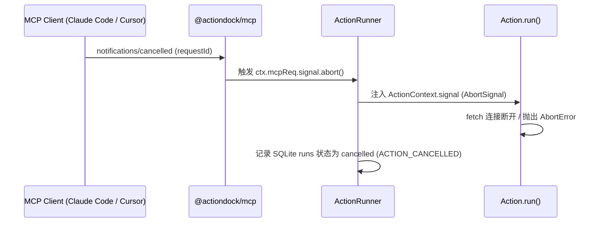

# Model Context Protocol (MCP) 适配器指南

# 背景

Model Context Protocol (MCP) 是业界领先的开放协议，旨在统一 AI Agent、大语言模型与外部工具/数据源之间的交互。

然而，手动为每个项目编写 MCP 服务端往往面临诸多重复与挑战：
- **大量样板代码**：需手动编写 JSON-RPC 2.0 序列化、Schema 转换与错误分发逻辑。
- **缺乏调用追踪与持久化**：每次 Tool 调用结束后上下文丢失，无法回溯历史入参出参及性能耗时。
- **取消链路割裂**：当 IDE 或客户端取消操作时，服务端的网络请求与后台计算仍在持续，造成资源泄漏。
- **多工具包聚合困难**：将散落在不同代码库中的工具暴露给同一个 Agent 时，容易发生名称冲突与配置污染。

ActionDock 2.0 在 `packages/mcp`（`@actiondock/mcp`）中提供了原生的 MCP 适配器，支持将任意 ActionDock Package 一键暴露为符合 MCP 标准的 Tool Server。

---

# 架构与核心设计原则

```mermaid
graph TD
    Host["MCP Host<br/>(Claude Code / Cursor / VS Code / Windsurf)"]
    
    subgraph 通信传输层 (Transports)
        Host -->|STDIO 进程流| STDIO["STDIO Transport (ac mcp)"]
        Host -->|Streamable HTTP| HTTP["HTTP Transport (ac mcp serve)"]
    end

    subgraph @actiondock/mcp 适配层
        STDIO --> Adapter["MCP Adapter 核心门面"]
        HTTP --> Adapter
        Adapter --> ToolMap["fromJsonSchema 零冗余映射"]
        Adapter --> TasksExt["MCP Tasks 异步长任务扩展"]
    end

    subgraph 统一执行引擎
        ToolMap --> Runner["ActionRunner (唯一执行核心)"]
        TasksExt --> ExecMgr["ExecutionManager (取消与生命周期)"]
        Runner --> Storage[("SQLite runs 运行历史记录")]
    end
```

- **唯一执行核心**：MCP 不实现第二套 Runtime，所有 Tool 调用统一经由 `ActionRunner` 执行，完全享有入参出参 Ajv 严格校验、SQLite 执行记录与循环调用防御。
- **Schema 零重复定义**：直接基于 `@modelcontextprotocol/server` 的 `fromJsonSchema`，自动转换 Action 定义的 JSON Schema。
- **全链路取消穿透**：客户端发送的 `notifications/cancelled` 自动接入 Action 内部的 `ctx.signal`，实现跨协议响应式中断。
- **统一安全模型**：HTTP 模式下复用 Bearer Token 强制认证、Loopback 绑定安全默认值与 CORS 白名单策略。

---

# STDIO 模式（本地 Agent / 桌面 IDE 直连）

STDIO 模式是桌面端 AI 编程助手的首选模式。`ac mcp` 保证 `stdout` 仅输出符合协议的 JSON-RPC 消息，所有日志均写入 `stderr`。

### 启动命令与参数选项

```bash
# 启动当前项目目录所在 Package 的 MCP 服务
ac mcp

# 多目录聚合：同时加载并暴露多个本地项目目录
ac mcp -d /path/to/github-tools -d /path/to/slack-tools
ac mcp -d /path/to/github-tools,/path/to/slack-tools

# 多 Package 聚合：指定已 link 到全局注册表的 package ID
ac mcp --package github-tools --package slack-tools
ac mcp --package github-tools,slack-tools

# 全局注册表模式：聚合暴露全局 Registry 中所有已 link 的 Packages
ac mcp --all

# 配置单次 Tool 调用执行超时（如 30s）
ac mcp --timeout 30s
```

---

### 主流 MCP 客户端配置指南

#### Claude Code (`~/.claude/mcp.json` 或项目 `.claude/mcp.json`)
```json
{
  "mcpServers": {
    "my-tools": {
      "command": "bunx",
      "args": [
        "@actiondock/cli",
        "mcp",
        "-d",
        "/absolute/path/to/github-tools",
        "-d",
        "/absolute/path/to/slack-tools"
      ]
    }
  }
}
```

#### Cursor (`settings.json` 或 Cursor Settings > MCP)
```json
{
  "mcpServers": {
    "my-tools": {
      "command": "ac",
      "args": ["mcp", "-d", "/absolute/path/to/my-tools"]
    }
  }
}
```

#### VS Code (Claude / Copilot MCP 插件)
```json
{
  "mcpServers": {
    "my-tools": {
      "command": "ac",
      "args": ["mcp", "--all"]
    }
  }
}
```

---

# Streamable HTTP 模式（远程微服务部署）

HTTP 模式将 ActionDock MCP 作为独立微服务部署，提供标准 `/mcp` 端点与 `/health` 健康检查接口。

### 启动命令与生产配置

```bash
# 本地测试（默认监听 127.0.0.1:5178）
ac mcp serve --port 5178

# 多目录/多包聚合暴露
ac mcp serve -d ./pkg-github -d ./pkg-slack --port 5178

# 生产环境公网暴露（强制要求 Token 鉴权）
export ACTIONDOCK_MCP_TOKEN="super-secret-token"
ac mcp serve \
  --host 0.0.0.0 \
  --port 5178 \
  --token-env ACTIONDOCK_MCP_TOKEN \
  --cors-origin "https://agent.example.com" \
  --max-body 2mb
```

### HTTP 安全选项速查

| 参数选项 | 说明与安全规范 |
| :--- | :--- |
| `-H, --host <host>` | 绑定 IP 地址。绑定到 `0.0.0.0` 时强制要求 Token，否则拒绝启动。 |
| `-p, --port <port>` | 监听端口（默认 `5178`）。 |
| `--token-env <env>` | **推荐**：指定包含 Token 的环境变量名，避免命令行明文泄露。 |
| `-t, --token <token>` | 明文传入 Bearer Token。 |
| `--allow-insecure-no-auth` | 显式允许在非 Loopback 地址上无 Token 运行（仅限隔离受信任内网）。 |
| `--cors-origin <origin>` | 允许跨域调用的 CORS Origin 白名单（默认不返回跨域标头）。 |
| `--max-body <size>` | 请求 Body 最大字节限制（默认 `1mb`，支持 `500kb`、`5mb` 等）。 |

---

# Tool 映射与防冲突机制

### 映射规范矩阵

| ActionDock 概念 | MCP 概念 | 映射规则 |
| :--- | :--- | :--- |
| `action.id` (无冲突) | `tool.name` | 保持严格一致（如 `github.list-prs`、`k8s.get-pods`） |
| `action.id` (多包冲突) | `tool.name` | 自动命名空间前缀：`${packageId}_${actionId}`（如 `pkg-a_echo` 与 `pkg-b_echo`） |
| `action.description` | `tool.description` | 单包直传；多包自动追加 `[packageId]` 来源前缀 |
| `action.inputSchema` | `tool.inputSchema` | 通过 `fromJsonSchema` 自动转为 MCP Tool Input Schema |
| `action.outputSchema`| `tool.outputSchema` | 通过 `fromJsonSchema` 自动转为 MCP Tool Output Schema |
| `runner.execute()` | `tool.handler` | 内部自动路由至对应 Package 的 `ActionRunner` |

### 响应格式规范

#### 成功调用 (`result.ok: true`)
```json
{
  "content": [
    {
      "type": "text",
      "text": "{\"ok\":true,\"runId\":\"01JXYZ...\",\"data\":{\"total\":5}}"
    }
  ],
  "structuredContent": {
    "total": 5
  }
}
```
* `content` 中保留 ActionDock 标准 JSON Envelope（包含全局可溯源的 `runId`）。
* `structuredContent` 提供纯净 Action 输出，符合 `outputSchema` 契约。

#### 业务与校验失败 (`result.ok: false`)
```json
{
  "isError": true,
  "content": [
    {
      "type": "text",
      "text": "{\"ok\":false,\"runId\":\"01JXYZ...\",\"error\":{\"code\":\"INPUT_VALIDATION_FAILED\",\"message\":\"...\"}}"
    }
  ]
}
```
* 业务异常与参数校验不通过均映射为 `isError: true`，**避免抛出协议层 JSON-RPC 异常破坏 MCP 会话**。

---

# 取消传播机制 (Cancellation)

当 MCP 客户端发送取消通知时：



---

# MCP Tasks 长任务扩展 (`io.modelcontextprotocol/tasks`)

ActionDock 原生支持官方 MCP Tasks 扩展，使 AI Agent 能够通过 MCP 协议调度与追踪异步长耗时工作流：

### 契约映射原则
* **任务标识**：`MCP taskId` 完全等价于 ActionDock 全局 `runId`。
* **状态映射**：
  - `running` $\rightarrow$ `working`
  - `success` $\rightarrow$ `completed`
  - `failed` $\rightarrow$ `failed`
  - `cancelled` $\rightarrow$ `cancelled`
* **持久化保障**：统一存取自 SQLite `runs` 表，无需维护第二套 Task 存储。

### 异步 Tool 调用
在调用 `tools/call` 时传入 `execution: { mode: "async" }`，服务端立即返回 `taskId` 并在后台异步执行：
```json
{
  "ok": true,
  "runId": "01JXYZ...",
  "taskId": "01JXYZ...",
  "status": "running"
}
```

### Tasks 协议端点
- **`tasks/get`** ：跨 Package 查询指定 Task 的执行进度、输入、输出或错误详情：
  ```json
  { "method": "tasks/get", "params": { "taskId": "01JXYZ..." } }
  ```
- **`tasks/cancel`** ：主动中断正在后台执行的长任务（直通底层 `ctx.signal`）：
  ```json
  { "method": "tasks/cancel", "params": { "taskId": "01JXYZ...", "reason": "用户取消" } }
  ```
- **`tasks/list`** ：聚合列出所有已加载 Package 下的近期 Task 执行记录（按时间倒序）：
  ```json
  { "method": "tasks/list", "params": { "limit": 20 } }
  ```

---

# 调试与排错 (MCP Inspector)

推荐使用官方 MCP Inspector 进行本地可视化调试：

```bash
npx @modelcontextprotocol/inspector ac mcp --dir ./examples/github-tools
```

---

# 文档导航

- [AI Agent 接入与集成指南](agent-integration.md)：将 MCP 与 Skill 接入各类主流 Agent。
- [安全加固与执行生命周期设计](design-security-mcp-execution.md)：深入学习 MCP 适配器底层架构与验收标准。
- [CLI 命令行参考手册](cli-reference.md)：查看 `ac mcp` 全量参数。
