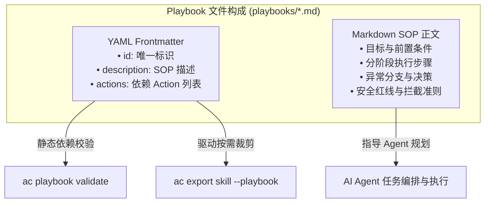

# Playbook SOP 编写规范与最佳实践

# 背景

AI Agent 具备强大的意图理解与推理能力，但在执行复杂领域任务（如故障排查、服务发布、代码审查、数据库运维）时，仅靠查看零散的 Tool API Schema 往往面临严重困难：

- **调用先后顺序混乱**：Agent 不清楚哪些是前置检查操作、哪些是核心变更操作、哪些是后置验证操作。
- **缺乏业务安全红线**：无法通过静态 Schema 约束业务底线（例如“生产环境必须先打 Tag”、“变更前必须备份数据”、“绝对禁止静默删除”）。
- **异常应对无章可循**：遇到特定的业务错误码或非 200 返回时，Agent 容易陷入无效的死循环重试或盲目放弃。**Playbook 就是写给 AI Agent 的标准操作规程** (Standard Operating Procedure，SOP)。它使用结构化 Markdown 语言清晰告知 Agent 任务目标、分阶段操作步骤、分支决策与安全防护红线。

---

# Playbook 结构规范

Playbook 统一存放在项目的 `playbooks/` 目录下（例如 `playbooks/review-pr.md`）。文件由两部分组成：
- **YAML Frontmatter**：声明元数据与 Action 依赖清单。
- **Markdown 正文**：结构化的 SOP 操作手册。



---

# 标准 Playbook 编写模板

```markdown
---
id: review-pr
description: GitHub Pull Request 自动化代码审查与规范检查 SOP
actions:
  - github.get-pr
  - github.list-files
  - github.review-pr
  - github.comment-pr
---

# GitHub Pull Request 自动化审查标准操作规程 (SOP)

本 SOP 指导 AI Agent 如何对仓库中的 Pull Request 执行代码审查、架构评估与合规性检查。

## 前置条件与检查

* 确认已获取待评审的仓库名（`repo`，格式如 `team4u/framework`）和 PR 编号（`prNumber`）。
* 调用 `github.get-pr` 获取 PR 基础元数据（标题、作者、基础分支与变更摘要）。
* 若 PR 当前处于 `draft`（草稿）状态或已被 `closed`，中止操作并提示用户。

## 分阶段审查流程

### 获取变更文件清单与代码差异
* 调用 `github.list-files` 获取本次 PR 涉及的所有变更文件路径与行数统计。
* 重点检查是否包含敏感配置文件（如 `.env`、`credentials.json`、私钥证书等）。

### 执行自动化审查与质量判定
* 调用 `github.review-pr` 进行代码规范、单测覆盖率与潜在 Bug 扫描。
* 判定规则：
  - 若变更行数大于 800 行且未拆分：提出“建议拆分 PR”的警告意见。
  - 若存在高风险安全漏洞：判定为 `REJECTED`。
  - 常规修复与特性更新：判定为 `APPROVED`。

### 发表审查意见与总结
* 汇总审查结论，调用 `github.comment-pr` 在 PR 评论区发表结构化评审报告。

## 安全红线（Agent 必须严格遵守）

> [!CAUTION]
> - **严禁自动合并 PR**：无论评审结果是否通过，一律不得调用任何合并操作，合并权限仅归人类所有。
> - **禁止在评论中泄露内部敏感信息**：若在代码中发现敏感 Token，仅提示“发现硬编码凭据”，严禁将明文回显至评论区。
```

---

# CLI 管理与语法校验

ActionDock CLI 提供了全套 Playbook 脚手架与校验工具：

### 快速脚手架创建 Playbook
```bash
ac playbook create review-pr \
  --desc "GitHub PR 自动化审查 SOP" \
  --actions github.get-pr github.review-pr github.comment-pr
```

### 列出与模糊意图检索 Playbook
```bash
ac playbook list                        # 列出所有 Playbook
ac playbook list pr deploy              # 多关键字模糊查找
ac playbook list -i "pr|review"         # 正则意图过滤
```

### 查看 Playbook 详情与元数据
```bash
ac playbook show review-pr [--json]
```

### 校验 Playbook 合法性与依赖完整性
```bash
ac playbook validate
```

`ac playbook validate` 会执行严格的静态检查：
- 检查 Frontmatter 是否包含必填的 `id` 属性。
- 检查 Frontmatter 中声明的 `actions` 列表中的每个 Action ID 是否在当前项目中真实存在。
- 若存在未实现的 Action ID，CLI 会输出精确的告警提示，防止悬空依赖。

---

# 任务驱动按需打包 (Playbook-Driven Export)

在拥有数十个 Action 的复杂项目中，可以通过指定 Playbook 一键导出该任务所需的最小自包含 Skill 包：

```bash
ac export skill --playbook review-pr
```

### 自动 Tree-shaking 裁剪机制
- **自动提取依赖闭包**：ActionDock 读取 `playbooks/review-pr.md` Frontmatter 中的 `actions` 列表。
- **二进制按需编译**：仅将这几个关联的 Action 及其代码依赖编译进独立二进制 `./bin/github-tools`，剔除其余无关 Action。
- **SOP 目录净化**：导出的 `playbooks/` 文件夹中仅包含选中的 Playbook，生成的 `SKILL.md` 仅列出相关功能，极大节约 Agent 提示词上下文。

---

# 编写最佳实践

- **步骤清晰且具操作性**：使用序号与分阶段小标题（如“阶段 1：前置检查”），明确指出每一步调用哪个 Action ID。
- **设立明确的防御红线**：使用 `> [!CAUTION]` 警示块列出不可逾越的业务红线，LLM 在阅读时具备极高的注意力权重。
- **提供分支与容错指引**：明确说明遇到特定状态（如 HTTP 404、已合并、资源锁定）时的替代分支逻辑。

---

# 文档导航

- [Skill 设计哲学与交付规范](skill-guide.md)：深入学习 Skill 交付包构成与分发模式。
- [Action 编写指南](action-authoring.md)：为 Playbook 实现底层的强类型 Action。
- [构建编译与 Skill 分发](build-and-export.md)：掌握任务驱动打包与单文件编译。
