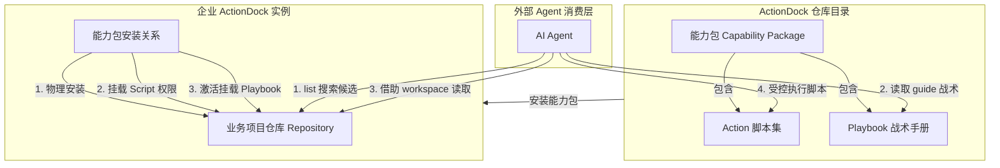

# 任务手册 (Playbook)：为 Agent 配置战术导览与工具能力

AI 助手在进入复杂的企业级项目或排查复杂的线上告警时，最容易犯的错误有两个：一是不知道从哪里下手，盲目遍历目录或胡乱猜测；二是缺少风险防范意识，直接在未核实的上下文里运行高危脚本，造成线上故障。

**任务手册 (Playbook)** 是 ActionDock 平台核心的**战术级任务导览资产**。它不以自动执行为目的，而是为外部 AI Agent 挂载一个面向特定复杂业务场景的“专家工具箱与行动战术指南”。

---

## 一句话理解

**Playbook（任务手册）** 是 ActionDock 在数据库中统一治理的动态资产。当企业将某个“能力包（Capability Package）”安装到目标业务仓库时，它会为该仓库的 AI Agent 动态挂载一套**集成了多维意图、安全边界、专属脚本工具以及排查路径指南的“战术手册组合包”**。

---

## 核心区别：Playbook vs. Agent 原生 Skill

许多开发者容易把 Playbook 和 Skill 混在一起谈。这里说的 Skill，指的是 Claude、Codex 一类 Agent 自身会加载并遵循的原生 Skill 机制，不是 ActionDock 的 Skills 管理或分发能力。原生 Skill 也能承载场景导览、工具使用规则和输出要求。差异主要在承载方式：当能力需要深度绑定仓库内脚本、知识、风险边界和排查路径时，Playbook 更容易组织、维护和交付，也不需要再单独准备一份 Agent 原生 Skill。

### 1. Agent 原生 Skill
* **能力覆盖**：可以承载场景指导、工具调用习惯、输出规范，理论上也能覆盖部分 Playbook 会做的事。
* **更适合放什么**：跨项目复用的行为规则、工作习惯、固定流程和通用工具守则。
* **绑定方式**：主要依赖 Skill 自身内容和 Agent 已有的工具能力，不天然绑定某个仓库里的脚本、知识文件和停止条件。
* **交付方式**：通常需要作为 Agent 侧的一个独立 Skill 来管理和发布。
* **典型例子**：代码评审规范、先读文档再编码、调试流程、固定输出格式。

### 2. Playbook（任务手册）
* **能力覆盖**：同样在做场景导览，但更适合承载深到仓库内部的业务能力聚合。
* **更适合放什么**：某个业务场景里该查什么、读什么、用什么脚本、何时停止。
* **绑定方式**：天然绑定仓库、`knowledgeRefs`、`scriptRefs`、`riskLevel`、`stopConditions` 和 `guideMarkdown`。
* **交付方式**：由 ActionDock 在运行时通过候选搜索和详情读取动态提供，跟随能力包与仓库映射生效，不需要额外发布一个独立 Skill。
* **典型例子**：退款超时排查、计费异常诊断、发布事故处置。

### 维度对比

| 维度 | Agent 原生 Skill | Playbook |
| :--- | :--- | :--- |
| **能力覆盖** | 也能承载场景指导与工具使用规则 | 也能承载场景指导，更适合深度业务聚合 |
| **更适合放什么** | 跨项目复用的通用行为、流程、规范 | 特定仓库或业务域里的排查手册、内部操作导览 |
| **上下文绑定** | 主要依赖 Skill 自身内容和 Agent 工具能力 | 显式绑定仓库、知识、脚本和风险边界 |
| **内部资产聚合** | 可以写进去，但组织和维护更重 | 原生聚合 `knowledgeRefs`、`scriptRefs`、`stopConditions` 等 |
| **是否需要单独发布 Skill** | 往往需要单独管理和发布 | 不需要额外发布独立 Skill |
| **运行时消费** | Agent 本地加载后遵循 | Agent 运行时通过 `list` 搜索候选，再用 `get` 读取详情 |
| **适合的场景** | 代码评审规范、调试守则、输出格式、工具调用规则 | 退款超时排查、计费异常诊断、发布事故处置 |

---

## 核心概念与数据模型

在 ActionDock 中，任务手册由 **Playbook Group（分组）** 与 **Playbook（单篇手册）** 两级结构构成。

### 1. Playbook Group（分组）
为了防止海量 Playbook 造成意图识别泛滥，Playbook 必须归属于特定的 Group。Group 通常对应一个业务域或一类排查科目（如 `billing-diagnosis` 计费诊断组）。

* **ID**：全局唯一标识，如 `billing-diagnosis`。
* **名称**：分组的人类可读名称。
* **描述**：说明该分组负责解决什么领域的任务。
* **关联仓库 (defaultRepositoryIds)**：该分组下的任务默认适用于哪些项目仓库。

### 2. Playbook（单篇手册）
Playbook 是战术信息的核心载体，其物理实体（Java Model）结构定义如下：

```java
public class Playbook {
    private String id;                           // 全局唯一标识 (例如 refund-failure)
    private String name;                         // 手册名称 (例如 "退款失败排查")
    private String description;                  // 详细的任务说明
    private List<String> tags;                   // 任务标签
    private PlaybookRiskLevel riskLevel;         // 风险等级 (LOW / MEDIUM / HIGH)
    private List<String> repositoryIds;          // 适用的具体项目仓库 ID 列表
    private List<PlaybookKnowledgeRef> knowledgeRefs; // 关联的知识文件或 Note 路径列表
    private List<PlaybookScriptRef> scriptRefs;  // 推荐使用的脚本/工具列表
    private String guideMarkdown;                // 供给 Agent 阅读的行动指南 Markdown
    private List<String> stopConditions;         // 硬性停止/阻断条件
    private boolean enabled;                     // 是否启用
}
```

### 关键属性深度解析

#### 1) 知识引用 (`knowledgeRefs`)
Playbook 不内联庞大的项目文档本身，而是像一个“指针”指向仓库中的关键知识点，支持两类：
* `FILE`：指向仓库中具体相对路径的文档（例如 `docs/runbooks/refund-runbook.md`）。
* `NOTE`：针对特定仓库的临时性排查叮嘱，直接存放在 Playbook 内。

#### 2) 脚本引用 (`scriptRefs`)
Playbook 关联的一系列可用 Action 脚本工具。
> [!IMPORTANT]
> **这绝不是表示自动化的工作流 DSL，也不代表系统会自动按顺序执行这些脚本。**
> 它仅仅是告诉 Agent：“针对这个排查，你可以使用这几个指定的脚本来获取数据或运行动作。在运行前，你必须去查询它们的 Schema 并核实参数。”

#### 3) 停止条件 (`stopConditions`)
这是防止 AI 盲目执行的“安全熔断阀”。例如，`["缺少关键上下文", "需要高风险写操作", "已确认根因"]`。一旦 Agent 发现满足其中任一条件，必须立刻终止任务，并向人类求助。

---

## 架构与分发机制

Playbook 并非孤立存在，它是与 **Action 脚本**、**项目仓库（Repository）** 深度交织的。在 ActionDock 中，它们是以“一群能力”的形式分发并挂载的：



这种设计带来的核心工程优势：
1. **零污染与隔离性**：Playbook 绑定在能力包和特定的业务仓库上。Agent 访问 `Repo A` 时，只会被配给与 `Repo A` 相关的 Playbooks，不会被 `Repo B` 的垃圾手册污染意图空间。
2. **能力与知识的一致性**：脚本、Playbook、相关知识库文档打包在一个包里分发。一旦升级能力包，脚本的入参 schema 发生变更，对应的 Playbook 排查路径和停止条件同步更新，防止 Agent 拿着过时的 SOP 执行新脚本。

---

## 消费端 Agent 消费全路径

当外部 Agent 被唤醒去解决一个特定的任务时，推荐的标准消费路径如下：

### 第一步：搜索候选任务手册（List）
用户输入：“昨晚 Billing 服务有告警，退款好像卡住了，怎么查？”
1. Agent 从用户描述里提取核心关键词，例如 `退款`、`告警`、`卡住`、`超时`。
2. Agent 调用 `list` 接口拉摘要候选，并结合 `repositoryId`、`tag` 或 `keyword` 过滤：
   ```bash
   actiondock playbook list --repository-id "billing-service" --keyword "退款 超时" --json
   ```
3. 系统返回匹配到的 Playbook ID（如 `refund-failure`）。

### 第二步：载入详情与安全审查
Agent 决不能直接运行任何脚本，而是先读取 Playbook 的完整详情：
```bash
actiondock playbook get refund-failure --json
```
Agent 必须依次解析并遵守返回的数据：
1. **查看 `riskLevel`**：如果是 `HIGH`，意味着该任务排查存在极高风险，Agent 必须加倍小心，随时准备停止并请求人工介入。
2. **记录 `stopConditions`**：加载停止条件，将其写入自己的 System Prompt/内存中，作为全程监控的“熔断指标”。
3. **读取 `knowledgeRefs`**：发现排查所依赖的参考文件路径。

### 第三步：顺藤摸瓜调查项目（Knowledge）
Agent 拿着 `knowledgeRefs` 中指定的相对路径，通过统一的 `actiondock-workspace` 插件（如 `viewTextFile`），去读取目标仓库的背景资料、接口约定或 DDL，补充任务所缺少的静态背景事实。

### 第四步：受控且安全地调用脚本（Scripts）
1. Agent 按照 `guideMarkdown` 中推荐的排查逻辑，发现可以调用关联的 `scriptRefs` 中的某个脚本（例如 `query-log`）。
2. 调用脚本前，Agent **必须先查询其 Schema 契约**：
   ```bash
   actiondock script schema query-log --json
   ```
3. 补齐所需的输入参数，受控执行，获得排查输出。

### 第五步：熔断与总结
* **触发熔断**：在执行中，一旦命中任意 `stopConditions`（如发现需要修改数据库配置，属于“高风险写操作”），Agent 必须立刻终止，将中间证据链展示给用户，并请求人工确认。
* **顺利完成**：若排查出根因并解决，Agent 向用户汇总：**命中的 Playbook**、**安全水位控制**、**排查中阅读的文档与执行的脚本**，以及**最终结论**。

---

## 作者态维护

研发人员可以通过 CLI 工具直接对 Playbook 进行增删改查：

```bash
# 创建或更新单篇 Playbook（推荐走定义文件以避免命令行转义地狱）
actiondock playbook create --definition-file ./playbook.json --json
actiondock playbook update refund-failure --definition-file ./playbook.json --json

# 删除单篇 Playbook
actiondock playbook delete refund-failure --json
```

管理后台还支持按 JSON bundle 导入/导出任务手册，格式为：

```json
{
  "version": 1,
  "exportedAt": "2026-05-31T00:00:00.000Z",
  "playbooks": []
}
```

导入的任务手册会作为本地可编辑资产保存；仓库托管关系仍通过“发布到仓库”或能力包安装维护。

---

## 常见问题 (FAQ)

### Q: 既然有了项目知识库 (ACTIONDOCK.md)，为什么还需要 Playbook？
* **项目知识库（ACTIONDOCK.md）** 属于“静态地图”。它告诉 Agent：这个仓库里有什么、文件怎么分布、基本的架构是什么。它回答的是 **“WHAT”**。
* **Playbook（任务手册）** 属于“动态战术 SOP”。它针对的是具体的事件（如告警、特定异常），回答的是 **“HOW”** —— 即当某个故障发生时，应该按照什么步骤、调用哪段脚本、在什么边界停下来。

### Q: 为什么意图匹配不使用更时髦的 LLM 语义向量匹配 (Vector Search)？
* **稳定性重于一切**。在企业生产环境或告警排查中，我们需要的是“确定性”。向量匹配存在一定的概率偏差，可能会因为用户长句中的语气词污染，把退款超时的排查匹配到用户注销的手册上，导致 Agent 执行错误的危险指令。
* 正则与精确关键词匹配能够提供 **100% 的意图确定性分发**，极易被研发人员维护，且排错路径极短。

### Q: 我应该何时编写 Playbook，何时编写 Agent 原生 Skill？
两者有重叠。判断标准看你是在补一套通用规则，还是在组织一份深度绑定仓库内部资产的场景手册。
* 当你要给 Agent 增加**跨项目复用的行为约束、操作习惯、输出规范或工具使用规则**时，写 **Agent 原生 Skill**。常见例子包括代码评审规范、调试流程、输出格式约束、工具调用守则。
* 当你要把某个业务场景里的**仓库知识、脚本入口、排查路径和风险边界**组织成一份可在运行时动态提供的任务手册时，写 **Playbook**。这类内容原生 Skill 也能描述，但 Playbook 更容易聚合内部能力，也不需要再单独发布一个 Skill。常见例子包括退款超时排查、计费异常诊断、发布事故处置。

---

> [返回目录](user-manual.md) | 下一步：了解 [AI 能力](ai-capabilities.md)
