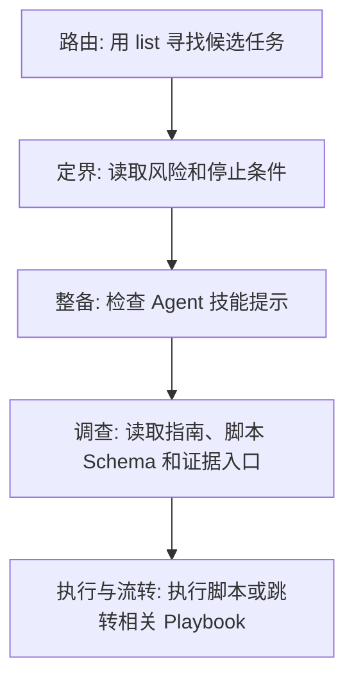

# 任务手册 (Playbook)：Agent 的任务装配协议

Playbook 是 Agent 进入业务项目时读取的任务装配协议。它把一次任务所需的边界、证据、动作、Agent 能力提示和任务导航放在同一份定义里，让 Agent 先收窄任务，再进入项目知识和脚本执行。

这份文档面向两类读者：维护 Playbook 的研发人员，以及按 ActionDock 协议解析与执行 Playbook 的 Agent 实现者。

---

## Playbook 解决的问题

企业项目里的排查材料通常分散在 runbook、源码、日志平台、数据库说明和脚本工具里。Agent 如果直接进入这些材料，会先面对几类判断：

- 当前问题属于哪个任务。
- 哪些材料和脚本与这个任务有关。
- 哪些情况必须停止，交给人确认。
- 当前排查已经判断到哪一步。
- 下一步是继续当前任务、切到另一本 Playbook，还是停下来等人确认。
- 哪些动作现在不该做。

这些判断不能等 Agent 读完一堆文档后再归纳。生产排障里，边界要先到。

Playbook 把任务入口前移到 `playbook list` 和 `playbook get` 两个阶段。`playbook list` 给出可预演的候选任务摘要，`playbook get` 则只加载命中的任务定义。Agent 拿到任务定义后，再按定义里的引用选择脚本、查询 Schema、读取项目知识并决定是否执行动作。

```bash
actiondock playbook list --enabled --intent "退款|refund|失败|failure" --json
actiondock playbook get refund-failure --json
```

这套协议给 Agent 提供可审计的工作边界，不替 Agent 写死步骤。

## 为什么不把排查场景全做成 Skill

Agent Skill 适合承载跨项目复用的通用能力，例如读取文件、调用 CLI、检索官方文档、访问云厂商工具或解析某类标准格式。业务排查场景会跟着项目代码、接口、表结构和 runbook 变化，把每个场景都做成 Skill，会把业务变化带进 Agent 运行时。

从上下文噪声角度看，业务排查场景的基数极其庞大。如果将每个排查场景都打包成常驻 Skill，会导致 Agent 的工具集急剧膨胀。在日常开发、功能编写或普通重构场景下，这些高度特化的排查工具无需被召回。将它们全部载入，不仅污染运行时上下文，还容易引发工具误用，从而降低 Agent 执行主流开发任务时的准确率并增加 Token 消耗。

从规范性与安全性（Standardization）的角度来看，普通的 Agent Skill 属于松散的、无模式约束的提示词或逻辑封装。如果任由开发者随意编写排查类 Skill，产出的质量将极难对齐——可能有人只写了一段模糊的自然语言，有人遗漏了核心的风险阻断逻辑，有人则写死了特化脚本。

Playbook 则是定义了一套标准的手册装配协议。它通过强类型 Schema 约束，迫使手册作者必须在统一的信息模型下思考：必须隔离出风险等级（`riskLevel`）、必须显式定义阻断边界（`stopConditions`）、必须声明证据依赖（`knowledgeRefs`）与候选动作（`scriptRefs`）。这种高度规范化的模型使得所有排障手册具备了统一的安全底线与契约合法性（可由平台静态校验），这是自由且松散的 Skill 无法提供的组织级规范保障。

Playbook 归项目，Skill 归 Agent 运行环境。项目侧只声明“这次任务建议用哪些能力和材料”，不负责安装或发布 Agent Skill。

| 维度 | Agent Skill | Playbook |
|------|-------------|----------|
| 适合承载 | 跨项目通用能力，例如官方文档检索、云 CLI、标准格式解析 | 项目内任务边界，例如退款失败、支付超时、慢查询定位 |
| 生命周期 | 随 Agent 运行环境安装和升级 | 随项目仓库和能力包发布 |
| 消费方式 | Agent 自己决定是否可用 | ActionDock 通过 `list/get` 分发任务定义 |
| 风险 | 业务场景过多时会膨胀运行时上下文 | 只在命中任务后加载详情 |

这也是 `agentSkillRefs` 存在的原因：Playbook 可以提示当前执行的 Agent 使用某个已具备的 Skill，但不把业务场景重新包装成 Skill。

## 为什么不只写进项目知识库

项目知识库适合保存事实：模块说明、接口字段、数据库表、日志位置、runbook 原文、源码入口。它回答“材料在哪里”。

从信息检索的效率来看，中大型项目的知识库庞大，单个仓库内可能包含成百上千篇文档。如果完全依赖知识库，Agent 在面对线上故障时，需要先在大批文档中执行语义搜索，再逐篇阅读和判断。这种全局扫描与理解的过程极其耗时，而且容易引入不相关的文档噪声，消耗大量 Token，甚至导致 Agent 在排障过程中偏离主线。

Playbook 聚焦于“这次任务怎么收窄”。它为特定任务提供一条精简的“导航路径”，直接声明了本次任务必须查阅的少量核心证据（`knowledgeRefs`）、前置停止条件（`stopConditions`）和候选动作。如果把这些边界都埋在项目知识库里，让 Agent 临场去检索和归纳，不仅边界来得太晚，排障过程也会变成低效的文档漫游。


## Playbook 让排查结果变成下一步判断

很多排查流程跑完脚本后并没有结束。脚本能返回日志、状态和指标，但用户要的是当前证据说明了什么、接下来查哪里、哪些动作现在不能做。

Playbook 给 Agent 提供这层判断所需的边界。`riskLevel` 和 `stopConditions` 决定是否停下来等人确认，`scriptRefs` 给出当前任务内可选的动作池，`relatedPlaybookRefs` 给出可能的下一本手册。这些边界把日志、状态和指标整理成几类判断：

- 结论：当前证据已经支持到什么程度。
- 推荐下一步：继续执行哪个低风险查询，或切到哪一本相关 Playbook。
- 当前不建议：哪些脚本、修复、重试或人工改数现在不该做。
- 人工确认：哪些补偿、回滚、生产写操作或权限动作需要用户确认。

Playbook 的输出会多一层诊断报告。Agent 可以说明“支付成功但订单未更新，下一步应排查支付回调；人工改库先不要做”，用户也不必回到手册列表里重新猜下一站。

这层能力有一条边界：推荐下一步不是自动编排。切换到相关 Playbook 前，Agent 需要说明证据为什么指向它；切换后重新读取目标 Playbook 的风险等级、停止条件、指南和资源引用。

## 装配信息模型

一篇 Playbook 给 Agent 装配五类信息。

| 类型 | 字段 | 作用 | ActionDock 处理方式 |
|------|------|------|--------------------|
| 边界 | `riskLevel`、`stopConditions`、`repositoryIds` | 限定任务所属项目、风险等级和停止条件 | 校验基础格式，随详情返回给 Agent 端 |
| 证据 | `knowledgeRefs`、`guideMarkdown` | 指向项目知识、runbook 和任务判断依据 | `knowledgeRefs` 可解析为 `NOTE` 或仓库内 `FILE` |
| 动作 | `scriptRefs` | 提供候选脚本池 | 校验脚本存在，Agent 端只查询选中脚本的 Schema |
| Agent 能力提示 | `agentSkillRefs` | 提示当前执行的 Agent 可优先使用的 Skill | 只校验 `skillId` 非空，不安装、不发布、不检查是否存在 |
| 任务拓扑 | `relatedPlaybookRefs` | 提供相关任务导航 | 校验关系枚举和非自引用，不自动展开 |

这五类信息共同定义一次临时任务装配。Agent 可以按任务现场调整顺序和工具选择，但不能绕过风险边界。

## 字段语义

### `riskLevel`

`riskLevel` 标记任务风险，支持 `LOW`、`MEDIUM`、`HIGH`。Agent 端检测到 `HIGH` 级别风险时，应把写操作、生产权限、数据修复与批量脚本执行放入人工确认路径。

### `stopConditions`

`stopConditions` 是任务停止条件，例如：

- 缺少订单 ID、租户 ID、环境名等关键上下文。
- 需要生产数据权限，但用户没有明确授权。
- 即将执行高风险写操作。
- 已确认根因，继续运行脚本只会增加风险。

Agent 在任务过程中要持续对照这些条件。命中后停止，并向用户说明缺什么或为什么需要人工确认。

### `guideMarkdown`

`guideMarkdown` 是给 Agent 阅读的任务指南。它可以写排查顺序、判断分支、常见误判、日志关键词和业务背景，但不能被 Agent 端强行解析为固定的步骤 DSL。

适合写进 `guideMarkdown` 的内容：

- 当前任务的判断标准。
- 需要优先观察的业务对象、日志字段、接口名、表名。
- 某些动作前必须补齐的上下文。
- 常见错误路径，例如“退款状态为 `PENDING` 时不要直接重试打款脚本”。

不适合写进 `guideMarkdown` 的内容：

- 大段项目文档原文。应放进 `knowledgeRefs` 指向的文件。
- 固定执行脚本序列。应让 Agent 基于 schema 和现场信息选择脚本。
- 跨任务跳转规则。应放进 `relatedPlaybookRefs`。

### `knowledgeRefs`

`knowledgeRefs` 是证据入口，不是知识正文仓库。它支持两类引用：

- `NOTE`：短说明，适合写“先读退款流程背景，再看 runbook”这类项目内提示。
- `FILE`：仓库内相对路径，例如 `docs/runbooks/refund-runbook.md`。

Agent 读取知识时要先形成问题清单，再按清单读取相关 `NOTE` 和 `FILE`。存在 `knowledgeRefs` 不代表要全量阅读所有引用。

### `scriptRefs`

`scriptRefs` 是候选动作池。它只表示“这些脚本可能用于当前任务”，不表示必须执行，也不表示执行顺序。

Agent 应根据用户问题、`guideMarkdown` 和 `scriptRefs[].purpose` 选择最小脚本集。默认选 1 个，确有并行排查路径时最多选 3 个。只对选中的脚本查询 Schema，再用 Schema 字段反推需要补齐的上下文。

### `agentSkillRefs`

`agentSkillRefs` 是给当前执行 Agent 的 Skill 提示。它告诉 Agent：“如果你的运行环境已经有这个 Skill，可以优先考虑。”

典型用途：

- 需要查官方文档时，提示使用 `openai-docs`、`aws-docs`、`kubernetes-docs` 之类的文档检索 Skill。
- 需要调用云厂商 CLI 时，提示使用团队封装过的云工具 Skill。
- 需要访问团队私有知识或标准诊断工具时，提示使用私有 Agent Skill。

ActionDock 不会安装这些 Skill，也不会检查它们是否存在。即便某个 `agentSkillRefs[].required` 为 `true`，平台也只把它作为语义提示交给消费端。原因很简单：Agent Skill 属于运行环境，ActionDock 不掌握不同 Agent 的安装状态。

### `relatedPlaybookRefs`

`relatedPlaybookRefs` 构成任务拓扑，只做导航。支持三种关系：

- `RELATED`：同一问题域里的相关任务，例如退款失败和支付回调异常。
- `FOLLOW_UP`：当前任务确认某类结果后，建议继续处理的后续任务，例如定位到数据库慢查询后跳到慢查询手册。
- `FALLBACK`：当前专用手册不适用时的退路，例如回到 `generic-project-investigation`。

Agent 端不能自动继承、合并或递归加载被引用的 Playbook。跳转前必须重新执行 `playbook get`，重新读取新任务的 `riskLevel`、`stopConditions`、`guideMarkdown` 和资源引用。

这条限制防止 Playbook 变成隐式工作流。相关任务只负责导航，不负责自动编排。

## 五阶段执行协议

Agent 执行 Playbook 时遵循以下五个步骤：路由（Route）、定界（Bound）、整备（Equip）、调查（Investigate）以及执行与流转（Act/Handoff）。



### 1. 路由 (Route)：寻找候选任务

先用用户问题提取领域词、症状词和动作词，构造 `--intent` 正则，按意图搜索候选任务手册。

```bash
actiondock playbook list --enabled --intent "退款|refund|失败|failure" --json
```

如果用户已明确项目，或候选过多需要收窄，再追加项目过滤。用户没有给出项目且必须按项目判断时，先列出项目仓库并请用户确认：

```bash
actiondock repository list --purpose project --intent "退款|refund|失败|failure" --json
actiondock playbook list --repository-id billing-service --enabled --intent "退款|refund|失败|failure" --json
```

`playbook list` 只返回摘要字段，例如 `id`、`name`、`description`、`riskLevel`、`tags`、`repositoryIds`、启用状态和托管状态。它不返回 `guideMarkdown`、`knowledgeRefs`、`scriptRefs`、`agentSkillRefs`、`relatedPlaybookRefs` 和 `stopConditions`。

如果 `--intent` 没有命中，CLI 会退回同一过滤条件下的全量摘要列表。Agent 应从摘要里继续判断，仍无法判断或当前 Playbook 无法覆盖任务时，再使用通用项目调查兜底机制（Fallback）。

### 2. 定界 (Bound)：明确执行边界

命中 Playbook 后读取完整详情。

```bash
actiondock playbook get refund-failure --json
```

Agent 端读取详情后，先处理 `repositoryIds`、`riskLevel` 和 `stopConditions`。这一步完成前，不查询脚本 Schema，不运行脚本，也不进入大范围项目搜索。

### 3. 整备 (Equip)：检查 Agent 技能提示

读取 `agentSkillRefs`，判断当前 Agent 环境是否已有对应 Skill。可用则优先使用，不可用则继续走普通证据检索和脚本 Schema 路径。

`agentSkillRefs` 不能作为硬依赖处理。缺少某个提示的 Skill 时，Agent 可以向用户说明“建议能力不可用”，但不能假设 ActionDock 会补装。

### 4. 调查 (Investigate)：检索指南与证据

阅读 `guideMarkdown`，并根据用户问题、任务阶段和 `scriptRefs[].purpose` 选择最小相关脚本集。默认选 1 个，确有并行排查路径时最多选 3 个，只对选中的脚本查询 Schema。

```bash
actiondock script schema query-refund-log --json
```

查询 Schema 的目的不是立即执行脚本，而是确认入参契约：必填字段、枚举值、格式要求和参数来源。随后整理临时问题清单：

- 用户当前问题要定位什么。
- 当前任务里要先确认哪些业务对象。
- 哪些字段可能来自用户输入、`guideMarkdown`、脚本 Schema、`ACTIONDOCK.md`、`knowledgeRefs` 或源码。
- 哪些停止条件可能被触发。

随后进入项目知识库：先分析并解析（Resolve）目标仓库，读取 `ACTIONDOCK.md`，再按问题清单读取 `knowledgeRefs` 指向的 `NOTE` 和 `FILE`。文档不足或疑似过期时，再查源码。

### 5. 执行与流转 (Act/Handoff)：执行动作与任务跳转

只有在问题清单已经补齐、风险可接受、没有命中停止条件时，才补齐参数并按脚本执行协议运行选中脚本。

执行或调查结束后，Agent 应把当前证据整理成可行动判断：当前结论是什么、是否有推荐下一步、哪些动作暂时不建议做、是否需要人工确认。没有明确下一步时，不强行给推荐；证据不足时直接说明缺口。

如果当前任务不匹配、证据指向另一个问题域，或者专用排查失败，可以读取 `relatedPlaybookRefs` 做人工可见的任务跳转。例如：

- 专用退款失败手册无法覆盖当前现象，跳到 `generic-project-investigation`，关系为 `FALLBACK`。
- 日志显示失败来自数据库慢查询，跳到 `database-slow-query`，关系为 `FOLLOW_UP`。
- 用户同时问支付回调异常，提示可查看 `payment-callback-failure`，关系为 `RELATED`。

跳转后重新执行五阶段协议，不能把上一个 Playbook 的脚本、知识引用或停止条件自动带过去。

## 通用项目调查兜底 (Fallback)

没有命中可用 Playbook，或当前 Playbook 无法覆盖任务时，Agent 仍然按同一套目标驱动流程工作，只是使用通用指南替代 `guideMarkdown`。

```text
根据用户当前问题定位项目知识、脚本参数和下一步动作。先判断是否需要脚本；需要脚本时，只从脚本摘要中选择与用户问题最相关的脚本。默认 1 个，最多 3 个。先看选中脚本 Schema，再用 Schema 字段、字段描述、枚举值和用户问题生成知识检索问题清单。只围绕问题清单读取项目知识、文档或源码。
```

通用兜底的停止条件：

- 缺少目标项目仓库 ID。
- 未找到 `ACTIONDOCK.md` 或项目知识入口为空。
- 需要高风险写操作。
- 需要生产数据权限但用户尚未确认。
- 无法判断是否应使用专用 Playbook。

## 配置示例

下面的退款失败排查示例展示了一篇 Playbook 如何同时声明证据、候选动作、Agent 能力提示和任务导航。

```json
{
  "id": "refund-failure",
  "name": "退款失败排查",
  "description": "定位退款失败根因并给出下一步建议",
  "tags": ["refund", "payment"],
  "riskLevel": "MEDIUM",
  "repositoryIds": ["billing-service"],
  "knowledgeRefs": [
    { "type": "NOTE", "repositoryId": "billing-service", "markdown": "先看退款流程背景，再读 runbook。" },
    { "type": "FILE", "repositoryId": "billing-service", "path": "docs/runbooks/refund-runbook.md" }
  ],
  "scriptRefs": [
    { "scriptId": "query-refund-log", "purpose": "查询退款相关日志" },
    { "scriptId": "query-payment-status", "purpose": "查询支付网关侧退款状态" }
  ],
  "agentSkillRefs": [
    { "skillId": "openai-docs", "purpose": "需要确认 OpenAI API 行为或错误码时使用", "required": false },
    { "skillId": "team-cloud-cli", "purpose": "需要读取团队云平台诊断信息时使用", "required": false }
  ],
  "relatedPlaybookRefs": [
    { "playbookId": "generic-project-investigation", "relation": "FALLBACK", "purpose": "当前专用手册不适用时退回通用项目调查" },
    { "playbookId": "database-slow-query", "relation": "FOLLOW_UP", "purpose": "日志显示退款查询被数据库慢查询拖慢时继续定位" },
    { "playbookId": "payment-callback-failure", "relation": "RELATED", "purpose": "用户同时反馈支付回调异常时参考" }
  ],
  "guideMarkdown": "先读取 ACTIONDOCK.md，确认 billing-service 的退款模块入口。拿到 refundId 或 orderId 后，优先查看 docs/runbooks/refund-runbook.md 中的状态流转说明，再决定是否查询退款日志。没有订单标识时停止，不要运行查询脚本。",
  "stopConditions": ["缺少关键上下文", "需要高风险写操作", "已确认根因"],
  "enabled": true
}
```

保存 Playbook 时，平台会进行严格的生命周期与关联校验：

- **保存强校验**：
  - `guideMarkdown` 非空。
  - `scriptRefs.scriptId` 必须非空且指向已存在脚本。
  - `agentSkillRefs.skillId` 必须非空（但仍只做 Agent 能力提示，不校验 Skill 本身是否存在）。
  - `relatedPlaybookRefs.playbookId` 必须非空、不能指向当前 Playbook、且引用的目标 Playbook 必须在本地已存在。
  - `relatedPlaybookRefs.relation` 只能是 `RELATED`、`FOLLOW_UP`、`FALLBACK`。
  - `NOTE` 的 `markdown` 非空。
  - `FILE` 的 `path` 是仓库内相对路径。
- **删除与卸载保护**：
  - 手动删除或卸载某本 Playbook 时，系统将扫描所有已存在的 Playbook；若发现有其他手册引用了当前手册 ID，则阻断删除并返回 conflict（`PLAYBOOK_IN_USE` 错误）及引用方列表。
- **能力包重写与依赖规则**：
  - **保留 Agent Skill 提示**：安装能力包时将完整保留并保存 `agentSkillRefs`。
  - **同包引用 ID 重写**：安装能力包时重写 `relatedPlaybookRefs.playbookId`：如果目标在同一能力包内，改为运行时的内部 Playbook ID；否则保持原 ID 且要求本地已存在该引用的外部相关手册。支持包内以任意顺序相互引用，且在整体随包卸载时允许一起安全删除。
  - **更新/卸载断链保护**：如果卸载或更新能力包会移除被“包外”Playbook 引用的手册，则该操作会被系统阻断。

## 管理命令

Playbook 的复杂字段建议通过定义文件维护，避免在命令行里手写多行 Markdown 或 JSON。

```bash
actiondock playbook create --definition-file ./playbook.json --json
actiondock playbook update refund-failure --definition-file ./playbook.json --json
actiondock playbook delete refund-failure --json
```

维护时把 Playbook 当成项目资产处理：随代码、runbook、脚本和能力包一起评审。变更风险边界、停止条件和相关任务导航时，应按排障场景复查一次消费路径。

## FAQ

### 既然有 `ACTIONDOCK.md`，为什么还需要 Playbook？

`ACTIONDOCK.md` 是项目知识入口，告诉 Agent 项目怎么读。Playbook 是任务入口，告诉 Agent 当前问题怎么收窄。

没有 Playbook 时，Agent 要从项目知识里自行判断“这是退款失败、支付超时还是库存回滚”。有 Playbook 时，Agent 先用摘要路由到任务，再按任务定义读取证据和脚本。

### 为什么 `agentSkillRefs` 不校验 Skill 是否存在？

Agent Skill 属于 Agent 的宿主运行环境，ActionDock 无法知道不同 Agent 装了哪些 Skill。平台如果强行校验，会把项目资产和运行环境绑死，反而降低 Playbook 的可移植性。

`agentSkillRefs` 只表达偏好：有这个 Skill 就优先用，没有就走普通证据检索和脚本 Schema 路径。

### 为什么 `relatedPlaybookRefs` 不自动合并其他 Playbook？

不同 Playbook 可能有不同风险等级、停止条件、知识引用和脚本池。自动合并会让 Agent 分不清哪个边界生效，也会把一个导航关系变成隐式工作流。

正确做法是显式跳转：读取相关 Playbook 的详情，重新执行路由（Route）、定界（Bound）、整备（Equip）、调查（Investigate）以及执行与流转（Act/Handoff）流程。

### 什么时候写在 `guideMarkdown`，什么时候用 `relatedPlaybookRefs`？

仍在当前任务内的判断，写进 `guideMarkdown`。例如退款状态怎么读、哪些日志字段要看、没有订单 ID 时停止。

已经进入另一个任务的内容，放进 `relatedPlaybookRefs`。例如退款失败定位到数据库慢查询后，继续排查慢查询；专用手册不适用时，退回通用项目调查。

### 为什么意图匹配不直接用向量检索？

`playbook list --intent <regex>` 的价值在于可预演和可审计。研发人员能直接看到某个关键词会命中哪些任务，排错路径很短。

向量检索适合知识材料召回，但任务入口需要更强的确定性。Playbook 先用摘要和正则收窄任务，再把证据检索交给后续阶段。

---

> [返回目录](user-manual.md) | 下一步：了解 [AI 能力](ai-capabilities.md)
