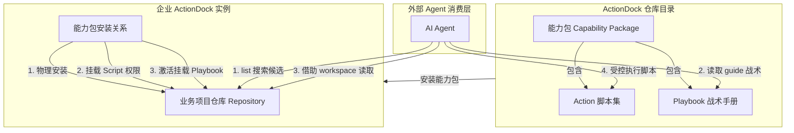

# 任务手册 (Playbook)：为 Agent 配置战术导览与工具能力

当 AI 助手进入复杂的企业项目或排查线上故障时，容易面临两个典型问题：一是难以快速定位入手点，导致盲目检索目录；二是缺乏风险防范机制，在未核实的上下文里运行高危脚本。

**任务手册 (Playbook)** 是 ActionDock 平台核心的战术级任务导览资产。它主要为外部 AI Agent 提供面向特定业务场景的工具集与行动指南，限制执行的风险边界。

---

## 一句话理解

Playbook 属于 ActionDock 在数据库中统一治理的动态资产。当在目标项目仓库上安装特定的能力包时，系统会为该仓库的 AI Agent 动态挂载包含意图、安全边界、专属脚本工具以及排查路径指南的战术手册组合。

---

## 核心区别：Playbook vs. Agent 原生 Skill

此处指 Agent 自身加载并遵循的 Skill 机制，区别于 ActionDock 的能力管理。这两者在承载方式、上下文绑定及分发路径上存在明显差异。

### 1. Agent 原生 Skill
* **定义与范畴**：承载跨项目复用的行为规则、工作习惯、通用流程和工具守则。
* **绑定方式**：依赖 Skill 自身内容，不与特定项目仓库的本地脚本、知识文件和安全熔断条件深度绑定。
* **交付方式**：需作为 Agent 侧的独立配置进行发布和维护。
* **典型实例**：代码评审规范、先阅读文档再编码、通用调试流程。

### 2. Playbook (任务手册)
* **定义与范畴**：承载深度绑定项目仓库的业务领域排查手册和内部操作导览。
* **绑定方式**：显式绑定项目仓库，原生聚合知识引用、脚本工具、安全水位和阻断条件。
* **交付方式**：由 ActionDock 在运行时动态提供，跟随能力包与仓库的映射关系自动生效，无需单独发布 Skill。
* **典型实例**：退款超时排查、计费异常诊断、发布故障处置。

### 维度对比

| 对比维度 | Agent 原生 Skill | Playbook |
| :--- | :--- | :--- |
| **更适合的场景** | 跨项目复用的通用行为、流程与输出规范 | 特定项目仓库或业务域内的排查手册与操作导览 |
| **上下文绑定** | 依赖 Skill 自身定义与 Agent 侧工具 | 显式绑定项目仓库、知识库、脚本与安全边界 |
| **内部资产聚合** | 无法直接且动态地聚合项目内脚本和文档指针 | 原生聚合 `knowledgeRefs`、`scriptRefs` 等资源 |
| **交付与分发** | 往往需要在 Agent 端单独进行管理和发布 | 随能力包安装自动映射生效，Agent 运行时按需调取 |

---

## 核心概念与数据模型

任务手册是战术信息的实体载体，对应 Java 层的 `Playbook` 领域对象与物理模型。

### 1. Playbook 核心数据模型

以下是 ActionDock 核心领域模型中 `Playbook` 对象的 Java 定义，用于在服务端存储和管理单篇手册的属性：

```java
public class Playbook {
    private String id;                                // 全局唯一标识 (例如 refund-failure)
    private String name;                              // 手册名称 (例如 "退款失败排查")
    private String description;                       // 详细的任务说明
    private List<String> tags = new ArrayList<>();    // 任务标签
    private PlaybookRiskLevel riskLevel;              // 风险等级 (LOW / MEDIUM / HIGH)
    private List<String> repositoryIds = new ArrayList<>(); // 适用的项目仓库 ID 列表
    private List<PlaybookKnowledgeRef> knowledgeRefs = new ArrayList<>(); // 知识引用列表
    private List<PlaybookScriptRef> scriptRefs = new ArrayList<>();       // 关联脚本工具引用列表
    private String guideMarkdown;                     // 供给 Agent 阅读的行动指南 Markdown
    private List<String> stopConditions = new ArrayList<>(); // 阻断或停止执行的条件列表
    private boolean enabled = true;                   // 是否启用
    private boolean managed;                          // 是否受托管
}
```

该实体完整映射了任务手册的物理结构。其中，知识引用（`knowledgeRefs`）与脚本引用（`scriptRefs`）是与项目仓库资源产生交互的关键桥梁。

### 2. 知识引用

以下是知识引用 `PlaybookKnowledgeRef` 对象的 Java 定义，支持项目仓库内物理文件和内联的临时提示信息：

```java
public class PlaybookKnowledgeRef {
    private PlaybookKnowledgeRefType type = PlaybookKnowledgeRefType.FILE; // 引用类型：FILE / NOTE
    private String repositoryId; // 项目仓库 ID
    private String path;         // 仓库内相对路径 (仅在 FILE 类型时有效)
    private String markdown;     // 内联的说明内容 (仅在 NOTE 类型时有效)
}
```

通过将知识解耦为相对路径指针（`FILE`）或临时说明（`NOTE`），Playbook 无需内嵌庞大的文档主体，保持了数据模型的轻量。

### 3. 脚本工具引用

以下是脚本工具引用 `PlaybookScriptRef` 对象的 Java 定义，用于关联候选执行工具：

```java
public class PlaybookScriptRef {
    private String scriptId; // 脚本 ID
    private String purpose;  // 脚本用途说明，辅助 Agent 评估是否需要调用
}
```

必须明确的是，脚本引用并不是顺序执行的工作流定义，而是一个受控的候选工具池。Agent 在消费时必须主动查询具体脚本的 Schema 契约来安全调用。

---

## 架构与分发机制

Playbook 并非孤立存在，而是与 Action 脚本、项目仓库深度关联，作为能力包的一部分进行分发与激活。


```mermaid
flowchart TD
    subgraph RepoCatalog[ActionDock 仓库目录]
        Pkg[能力包 Capability Package]
        Pkg -->|包含| Scripts[Action 脚本集]
        Pkg -->|包含| Playbooks[Playbook 战术手册]
    end

    subgraph UserDock[企业 ActionDock 实例]
        TargetRepo[业务项目仓库 Repository]
        PkgInstallation[能力包安装关系]
        
        PkgInstallation -->|1. 物理安装| TargetRepo
        PkgInstallation -->|2. 挂载 Script 权限| TargetRepo
        PkgInstallation -->|3. 激活挂载 Playbook| TargetRepo
    end

    RepoCatalog -->|安装能力包| UserDock
    
    subgraph AgentRuntime[外部 Agent 消费层]
        Agent[AI Agent]
        Agent -->|1. list 搜索候选| TargetRepo
        Agent -->|2. 读取 guide 战术| Playbooks
        Agent -->|3. 借助 workspace 读取| TargetRepo
        Agent -->|4. 受控执行脚本| Scripts
    end
```

上面的架构图展示了从能力包打包、企业安装映射到外部 Agent 动态消费的完整链路。这种解耦带来了两个工程优势：
1. **零污染与隔离性**：Playbook 绑定在特定的业务仓库上。Agent 访问仓库 A 时，只会被配给与该仓库相关的 Playbook，避免了无关配置污染意图空间。
2. **能力与知识的一致性**：脚本、文档与 Playbook 同包分发。一旦能力包升级，脚本的入参 Schema 发生变更，Playbook 排查路径和停止条件同步更新，防止 Agent 拿着过时的 SOP 执行新脚本。

---

## 消费端 Agent 消费全路径

当外部 Agent 接收到排查项目、接口、数据库、日志或告警类任务时，推荐按照以下确定性的步骤开展工作。

### 第一步：确认目标项目仓库 ID
Agent 需首先获取当前运行的项目仓库标识。若用户未在输入中提供，Agent 需先调用命令列出可用项目仓库并提请用户确认：
```bash
actiondock repository list --purpose project --json
```
该命令返回系统内当前挂载的项目仓库清单，用于明确排查的物理边界。

### 第二步：搜索候选任务手册 (List)
Agent 基于关键词与已确定的仓库 ID，调用 `list` 接口获取可能匹配的任务手册候选摘要：
```bash
actiondock playbook list --repository-id "billing-service" --keyword "退款超时" --json
```
`playbook list` 接口仅返回简要的候选列表，不包含 `guideMarkdown`、`knowledgeRefs`、`scriptRefs` 以及 `stopConditions` 等详情字段，以减少单次意图识别的 Token 消耗。

### 第三步：载入完整详情 (Get)
当检索到匹配的专用 Playbook ID 后，Agent 必须调用读取命令获取其完整定义：
```bash
actiondock playbook get refund-failure --json
```
该命令返回特定 Playbook 的全部配置，为接下来的安全验证和排查提供指导依据。

### 第四步：安全与导览审查
在获取详情后，Agent 必须严格按照以下确定性顺序解析和部署上下文：
1. **核实安全水位**：查看 `riskLevel`。若为 `HIGH`，意味着该手册包含高风险行为，Agent 需进入严密防范状态，随时准备中止并提请人工确认。
2. **记录阻断条件**：解析 `stopConditions`，将这些规则作为全局熔断指标写入内存，在后续排查中持续监控。
3. **理解行动指南**：阅读 `guideMarkdown`，确认当前任务所处的阶段，提取需要解决的核心问题、业务对象、故障类型和检索关键词。

### 第五步：选择相关脚本并读取 Schema
Agent 结合用户问题、行动指南和脚本用途说明（`scriptRefs[].purpose`），从工具池中选择最相关的脚本。
* 默认只选择 1 个最相关的脚本；若存在并行的排查路径，最多选择 3 个。
* 对未选中的无关脚本，**禁止**查询 Schema，防止意图空间过载。
* 若无法评估相关性，优先查询项目知识或询问用户，不得批量拉取所有脚本的配置。
* 对选中的脚本调用查询 Schema 命令：
```bash
actiondock script schema query-log --json
```
该命令返回脚本入参的字段类型、描述与必填项约束，用于指导接下来的知识检索。

### 第六步：生成问题清单并定向检索知识
根据脚本 Schema 字段、字段描述、枚举约束以及用户当前问题，Agent 维护一个待补齐的临时问题清单（例如业务 ID 格式、配置项取值等），并通过 `actiondock-workspace` 定向读取项目知识：
1. 先调用 `actiondock repository resolve --repository-id <repositoryId> --json` 获取并阅读 `ACTIONDOCK.md`。
2. 仅使用 `ACTIONDOCK.md` 确定项目入口、目录规则、推荐文档和禁搜目录。
3. 严格围绕问题清单，读取 `knowledgeRefs` 中指定的 `NOTE` 和 `FILE`。
4. 如果知识仍不完整，使用清单中的关键词定向搜索文档，仅在文档与真实实现疑似不一致时才查阅源码。**禁止**无目标地全量扫描仓库。

### 第七步：受控且安全地调用脚本
当问题清单补齐、风险可控且没有满足任何一条阻断条件时，Agent 补齐脚本参数并安全执行，获取排查输出。

### 第八步：熔断与总结
* **触发熔断**：在执行过程中，一旦命中任何一条 `stopConditions`（如检测到必须修改线上数据库、或缺乏关键上下文参数），Agent 必须立刻终止，向用户展示当前证据链，并请求人工确认。
* **正常结束**：若定位到根因或完成处理，Agent 向用户汇总：**命中的 Playbook**、**安全风险等级**、**实际调用的脚本**、**参考的项目文档**以及**最终结论**。

---

## 通用项目调查 Fallback 机制

若 `playbook list` 没有返回任何匹配的专用 Playbook，Agent 必须采用以下 Fallback 兜底机制，以确保未覆盖场景下的排查质量。

### 1. 通用引导文本 (Fallback Guide)

没有专用 Playbook 时，使用以下通用指南替代 `guideMarkdown`：

```text
根据用户当前问题定位项目知识、脚本参数和下一步动作。先判断是否需要脚本；需要脚本时，只从脚本摘要中选择与用户问题最相关的脚本。默认 1 个，最多 3 个。先看选中脚本 schema，再用 schema 字段、字段描述、枚举值和用户问题生成知识检索问题清单。只围绕问题清单读取项目知识、文档或源码。
```

### 2. 最小执行路径
1. 确定目标项目仓库 ID。
2. 判断是否需要脚本。需要时，列出脚本摘要并筛选出最相关的脚本，不批量查询 Schema。
3. 仅对选中的脚本进行 Schema 契约查询。
4. 整合用户问题与脚本 Schema，生成待补齐的问题清单。
5. 检索并解析 `ACTIONDOCK.md`，用于确定检索入口和禁搜目录。
6. 严格围绕问题清单，定向读取项目知识或源码。
7. 信息足够且风险可控时，安全执行脚本。

### 3. 兜底阻断条件
在 Fallback 排查中，如遇以下情况，Agent 必须立刻终止并向用户求助：
* 缺少目标项目仓库 ID。
* 未找到 `ACTIONDOCK.md` 或项目知识入口为空。
* 需要高风险写操作。
* 需要生产数据权限但用户尚未确认。
* 无法判断是否应当选用特定的专用 Playbook。

---

## 作者态维护与管理

研发人员可以通过 CLI 命令直接对 Playbook 进行维护。由于复杂字段（如 `guideMarkdown` 和知识引用）包含大量多行文本，推荐使用配置文件方式以避免复杂的命令行转义。

### 1. 常用维护命令

以下是用于创建、更新和删除任务手册的 CLI 命令：

```bash
# 创建单篇任务手册
actiondock playbook create --definition-file ./playbook.json --json

# 更新单篇任务手册
actiondock playbook update refund-failure --definition-file ./playbook.json --json

# 删除单篇任务手册
actiondock playbook delete refund-failure --json
```

上述命令可以高效地对手册资产进行持久化管理，并返回 JSON 格式的执行结果。

### 2. 配置文件示例

以下是进行 Playbook 增删改查时推荐的本地 JSON 定义文件示例：

```json
{
  "id": "refund-failure",
  "name": "退款失败排查",
  "description": "定位退款失败根因并给出下一步建议",
  "tags": ["refund", "payment"],
  "riskLevel": "MEDIUM",
  "repositoryIds": ["billing-service"],
  "knowledgeRefs": [
    { "type": "NOTE", "repositoryId": "billing-service", "markdown": "先看退款流程背景，再读 runbook。" },
    { "type": "FILE", "repositoryId": "billing-service", "path": "docs/runbooks/refund-runbook.md" }
  ],
  "scriptRefs": [
    { "scriptId": "query-log", "purpose": "查询退款相关日志" }
  ],
  "guideMarkdown": "先读取 ACTIONDOCK.md，再查看 refund-runbook.md。",
  "stopConditions": ["缺少关键上下文", "需要高风险写操作", "已确认根因"],
  "enabled": true
}
```

定义文件中各属性需符合物理校验规则。保存时，系统会校验 `guideMarkdown` 非空、关联脚本存在以及 `FILE` 路径的有效性。

---

## 常见问题 (FAQ)

### Q: 既然有了项目知识库 (ACTIONDOCK.md)，为什么还需要 Playbook？
* **项目知识库 (ACTIONDOCK.md)**：属于项目的“静态地图”，旨在向 Agent 描述仓库的目录规则、核心模块分布和框架设计，回答的是 **"WHAT"** 的问题。
* **Playbook (任务手册)**：属于特定事件或故障的“动态战术 SOP”，旨在指导 Agent 在特定场景下的处理逻辑、适用脚本和熔断时机，回答的是 **"HOW"** 的问题。

### Q: 为什么意图匹配不使用更时髦的 LLM 语义向量匹配 (Vector Search)？
* 生产环境或告警排查需要极高的“确定性”。向量匹配可能因为用户长句中的语气词污染产生匹配偏移，例如将退款超时的排查错误分配到注销账号的手册上，导致 Agent 执行错误的写操作。
* 精确的关键词和正则匹配能够提供 100% 的意图确定性，易于研发人员维护，且排错路径极短。

### Q: 我应该何时编写 Playbook，何时编写 Agent 原生 Skill？
* **编写 Agent 原生 Skill**：当需要定义**跨项目复用**的行为规则、工作习惯、输出格式规范或工具使用约束时（例如代码评审风格、通用 Git 提交流程）。
* **编写 Playbook**：当需要将**特定项目或业务域**内的排查知识、专用脚本、执行路径和熔断边界组织在一起，在运行时由系统动态挂载并分发给 Agent 时。

---

> [返回目录](user-manual.md) | 下一步：了解 [AI 能力](ai-capabilities.md)
