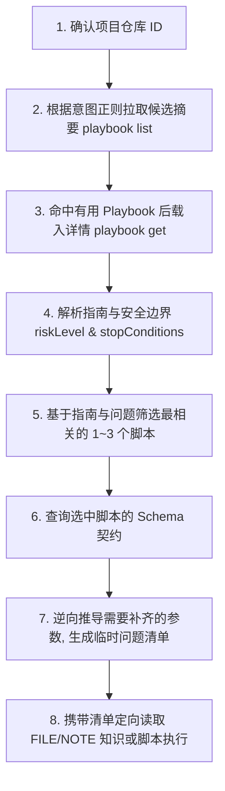

# 任务手册 (Playbook)：让 Agent 先拿到任务边界

在复杂的企业级项目或线上故障排查中，AI Agent 往往面临两个核心难题：一是容易迷失在庞大的代码库目录中，导致上下文检索成本高昂；二是缺乏风险防范意识，容易在未经验证的情况下盲目运行敏感脚本，引发线上故障。

**任务手册 (Playbook)** 是 ActionDock 平台专为解决上述问题设计的**战术级约束与导览资产**。它不以自动化执行为目的，而是为 Agent 动态挂载一套安全的水位边界、专属的工具箱以及结构化的排查路径指南。

---

## 为什么要把任务边界前置

Playbook 关注的不是“把排查经验写在哪里”，而是“Agent 在一次具体任务里，先拿到什么边界”。

两个替代方案很容易想到：一个排查场景写成一个 Agent Skill，或者把所有排查手册都写进项目知识库，再让一个通用 Skill 去搜索。它们在小规模场景里都能工作，问题会在排障场景变多之后出现。

### 1. 排查经验不能全塞进 Skill：避免 “Skill 膨胀与维护地狱”

在传统的开发模式中，为每一个特定的业务场景（如退款失败、数据库慢查询、Webhook 丢包）手写、打包并发布一个 Agent Skill，会迅速将团队拖入维护泥潭。

当排障场景增长到几十个时，Agent 将面临两难选择：
* **全量加载**：将数十个不相关的排障规则和私有工具塞进同一个上下文，导致 Context 迅速膨胀并引发严重的推理偏离。
* **手动点名**：要求用户（或上游路由系统）先判断“当前故障到底该用哪一个特定的 Skill”，将路由责任交还给人类。

ActionDock 通过 **“Skill 归平台，Playbook 归项目”** 的分层设计彻底解耦了这两者：

* **Agent 原生 Skill 负责“通用感官与底层物理能力”**：
  它是底座级的系统基建，定义了 Agent 跨项目、跨业务的底层操作（如文件读写、CLI 命令执行、数据库通用检索）。原生 Skill 属于全局静态加载，一次编写，全局复用。
* **Playbook 负责“跟着代码走的战术地图与交战守则”**：
  它是轻量级、声明式的战术配置（JSON + Markdown），直接存放在项目 Git 仓库中。它不定义如何具体执行，而是为特定场景声明一条排查指南（`guideMarkdown`）、一组受控的候选脚本（`scriptRefs`）、相关的知识指针（`knowledgeRefs`）和熔断条件（`stopConditions`）。

| 维度 | Agent 原生 Skill | Playbook |
| :--- | :--- | :--- |
| **角色定位** | 骨骼与通用感官（决定 Agent “能做什么”） | 战术地图与交战守则（决定 Agent “针对当前任务怎么做”） |
| **存放位置** | Agent 运行时或平台侧（全局静态加载） | 业务项目 Git 仓库中（随代码迭代与分发） |
| **扩展成本** | 高（需要开发、测试、打包并重新安装 Skill） | 极低（声明式 JSON + Markdown，秒级动态匹配） |

通过这种分层，Agent 凭借通用的原生 Skill，在进入具体项目时利用 Playbook 协议瞬间装配出针对该场景的“临时特种战术”，既隔绝了上下文污染，又彻底免去了业务级 Skill 的开发与维护成本。

### 2. 排查手册不能只埋在知识库

另一个方案是把“退款失败排查”“支付超时排查”“库存回滚检查”都写到项目知识库里，比如放进 `docs/runbooks/`，再让一个通用 Skill 先读 `ACTIONDOCK.md`，然后搜索这些文档。

这个方案把 Skill 数量降下来了，但把任务路由埋进了知识检索里。

当用户说“这笔退款为什么失败”时，Agent 需要先判断三件事：这属于哪个任务场景，这个场景允许看哪些知识和脚本，什么条件下必须停止。如果这些信息都放在知识库文档里，Agent 必须先检索、阅读、理解，再临时归纳任务边界。

边界来得太晚。

项目知识库适合保存事实：项目有哪些模块，接口字段是什么意思，数据库表怎么设计，日志在哪里，runbook 原文怎么写。Playbook 负责选择任务边界：当前问题属于哪个任务，先读哪些证据，哪些脚本是候选工具，风险等级是什么，哪些条件出现后必须停止。

生产排障里，边界应该先于材料。Agent 先拿到 Playbook 给出的任务边界，再进入 `ACTIONDOCK.md` 和项目知识库取证。

### 3. Playbook 是可预演的路由资产

把排查场景做成 Skill，或者把手册全文放进项目知识库，很难在任务开始前预演 Agent 最终会装载何种边界。Skill 的水位边界藏在 Agent 运行环境内，知识库的边界则藏在文档正文深处；两者都需等 Agent 实际运行并阅读后，才能确认路由是否正确。

Playbook 的关键差异在 list 阶段就暴露出来：

```bash
actiondock playbook list --repository-id billing-service --enabled --intent "退款|refund|payment" --json
```

这条命令只返回摘要：`id`、`name`、`description`、`riskLevel`、`tags`、`repositoryIds`、启用状态和托管状态。研发人员、值班同学和 Agent 看到的是同一份候选清单，可以直接判断“这次问题会被路由到哪个手册”。如果 `--intent` 没有命中，CLI 会自动退回同一查询条件下的全量列表，Agent 不会因为关键词没写准就卡死。

这就是 Playbook 比通用 Skill 或知识库更适合作为排障入口的地方：它把任务路由从“阅读后的模型推断”前移成“可查询、可审计、可预演的资产发现”。

---

## 核心设计哲学

### 1. 声明式约束优于程序式执行

许多传统的脚本平台倾向于将运维 SOP 设计为类似于 Jenkins Pipeline 或 YAML 工作流的自动执行 DSL。然而，线上故障排查是一个高度动态且不可预测的过程，静态的工作流在面对未知错误状态时极易中断或引发次生灾害。

Playbook 采用了截然不同的**声明式约束**理念：
* **不决定步骤顺序**：Playbook 关联的脚本引用（`scriptRefs`）仅代表一个受控的候选工具池，而非按特定顺序强制执行的步骤列表。
* **交付自主决策权，控制边界**：系统在运行时将安全边界（阻断条件、风险评级）和推荐工具集交付给 Agent，由大语言模型基于实时状态自主决策调用顺序。
* **熔断机制优先**：通过显示声明阻断条件（`stopConditions`），在 Agent 意图偏离安全水位或确认根因时强制要求人工介入，确保线上安全。

### 2. 双阶段消费协议：轻量化上下文治理

如果将所有的排查手册、脚本 Schema 和参考文档在 Agent 初始化时全量灌入，会迅速耗尽大模型的上下文窗口，并由于信息噪声导致推理偏离。

为此，Playbook 在接口和命令行层面设计了**双阶段消费协议**：

```text
       [用户问题输入]
              │
              ▼
  1. 意图摘要发现 (List 阶段)  ───► 只返回 ID、名称与标签，极低 Token 损耗
              │
              ▼
  2. 详情载入与解析 (Get 阶段)  ───► 精确载入对应 Playbook 的 Markdown 指南与边界
```

这种分离设计确保了 Agent 能够在第一阶段利用轻量级的元数据进行快速的意图匹配；仅在确认匹配到特定任务场景后，才在第二阶段拉取完整的安全限制与执行指南，实现上下文噪声控制。

---

## 核心概念模型

从设计层面来看，一篇任务手册由四个维度的声明构成，它们共同定义了 Agent 的活动空间：

```
┌─────────────────────────────────────────────────────────────┐
│                      Playbook 核心定义                       │
├──────────────────────────────┬──────────────────────────────┤
│          1. 安全水位          │          2. 战术指南          │
│   - riskLevel (LOW/MED/HIGH) │   - guideMarkdown (SOP)      │
├──────────────────────────────┼──────────────────────────────┤
│          3. 资源映射          │          4. 阻断机制          │
│   - knowledgeRefs (知识指针)  │   - stopConditions (熔断条件) │
│   - scriptRefs (安全脚本池)    │                              │
│   - agentSkillRefs (外部提示)  │                              │
│   - relatedPlaybookRefs (导航) │                              │
└──────────────────────────────┴──────────────────────────────┘
```

### 1. 安全水位 (Security Level)
通过 `riskLevel`（如 `LOW`、`MEDIUM`、`HIGH`）静态声明场景的风险级别。这是 Agent 执行过程中的高空雷达，能让 Agent 在高风险写操作前自动进入审慎状态。

### 2. 战术指南 (Tactical Guide)
由 `guideMarkdown` 承载，是一篇非结构化的 Markdown 文档。它提供给大模型阅读，不交给执行引擎解析成步骤 DSL。它指导 Agent 如何逐步解构问题、应该观察哪些日志特征以及采取何种排查姿态。

### 3. 资源映射 (Resource Mapping)
* **知识引用 (`knowledgeRefs`)**：不在数据库中复制大篇文档，只保存知识指针（`FILE` 类型指向仓库内相对路径，`NOTE` 类型承载特定仓库的临时叮嘱）。保持了手册自身的轻量。
* **脚本引用 (`scriptRefs`)**：将具备执行权限的 Action 脚本与特定的 Playbook 绑定，限制了 Agent 仅能调配当前场景所需的最小工具集。
* **外部 Agent Skill 引用 (`agentSkillRefs`)**：只提示消费端 Agent 可以使用自己已安装的 Skill。ActionDock 不校验、不安装、不发布这些 Skill，也不把它们视为平台资产依赖。
* **相关任务手册引用 (`relatedPlaybookRefs`)**：只做导航提示，支持 `RELATED`、`FOLLOW_UP`、`FALLBACK`。消费端不应自动继承、合并或递归加载被引用手册。

### 4. 阻断机制 (Circuit Breaker)
由 `stopConditions`（如 `["缺少关键参数", "需要高风险写操作", "已确认根因"]`）定义。这是规避 AI 盲目重试或失控的关键屏障。Agent 在执行中必须将这些条件作为全局不变量持续监控，一旦触发即刻熔断。

---

## 消费端 Agent 消费协议流程

当 Agent 介入排查时，必须严格遵循平台制定的 8 步消费协议。这一流程的核心是**逆向推导与定向检索**，而非无目标的盲目遍历：


```mermaid
flowchart TD
    Start[1. 确认项目仓库 ID] --> Search[2. 根据意图正则拉取候选摘要 playbook list]
    Search --> Fetch[3. 命中有用 Playbook 后载入详情 playbook get]
    Fetch --> Review[4. 解析指南与安全边界 riskLevel & stopConditions]
    Review --> Select[5. 基于指南与问题筛选最相关的 1~3 个脚本]
    Select --> Schema[6. 查询选中脚本的 Schema 契约]
    Schema --> Derive[7. 逆向推导需要补齐的参数, 生成临时问题清单]
    Derive --> Read[8. 携带清单定向读取 FILE/NOTE 知识或脚本执行]
```

1. **确认项目仓库 ID**：锁定物理边界，防止多项目配置交叉污染。
2. **候选搜索 (List)**：用 `playbook list --intent <regex>` 做轻量级检索，快速匹配意图；未命中时 CLI 自动退回全量候选摘要。
3. **载入详情 (Get)**：加载专用 Playbook。
4. **安全与导览审查**：先将阻断条件写入内存作为全局熔断器，再阅读指南提取故障特征。
5. **筛选脚本**：不盲目读取所有脚本，根据需要只挑选 1 到 3 个高度相关的工具。
6. **查询 Schema**：仅对选中的脚本获取输入参数契约。
7. **逆向生成问题清单**：根据 Schema 参数的必填性、枚举和格式要求，**反向推导**自己需要获取哪些具体的上下文（如特定的订单 ID、日志字段或表名），列出临时问题清单。
8. **定向知识检索与受控执行**：带着问题清单定向查阅 `ACTIONDOCK.md` 和关联文档。禁止无目标的扫描。在参数就绪且没有触发任何熔断条件的前提下，安全运行脚本并进行归纳总结。

---

## 兜底机制：通用项目调查 Fallback

好的设计应当提供完美的容错和退化路径。当系统没有匹配到特定场景的专用 Playbook 时，Agent 会退化到**通用项目调查流程**。

### 1. 声明式通用指南 (Fallback Guide)

系统会使用一段精心设计的高抽象通用引导文本替代专用的 `guideMarkdown`：

```text
根据用户当前问题定位项目知识、脚本参数和下一步动作。先判断是否需要脚本；需要脚本时，只从脚本摘要中选择与用户问题最相关的脚本。默认 1 个，最多 3 个。先看选中脚本 schema，再用 schema 字段、字段描述、枚举值和用户问题生成知识检索问题清单。只围绕问题清单读取项目知识、文档或源码。
```

### 2. 最小执行路径与阻断
即便在没有手册的未知场景中，Agent 仍必须遵循同样的“Schema 逆向推导 -> 定向检索”逻辑。同时，系统设置了默认的物理防线作为阻断条件：
* 缺少目标项目仓库 ID 时自动中止。
* 未找到 `ACTIONDOCK.md` 或项目知识入口为空时中止。
* 涉及高风险写操作或需要生产数据权限但用户尚未确认时中止。

---

## 声明与配置契约

平台研发人员在发布能力包时，可以通过声明本地 JSON 配置文件来定义 Playbook 的拓扑结构。

### 1. 配置声明示例

以下是设计一篇 Playbook 时推荐的逻辑定义文件格式示例，展示了其简洁的拓扑关系：

```json
{
  "id": "refund-failure",
  "name": "退款失败排查",
  "description": "定位退款失败根因并给出下一步建议",
  "tags": ["refund", "payment"],
  "riskLevel": "MEDIUM",
  "repositoryIds": ["billing-service"],
  "knowledgeRefs": [
    { "type": "NOTE", "repositoryId": "billing-service", "markdown": "先看退款流程背景，再读 runbook。" },
    { "type": "FILE", "repositoryId": "billing-service", "path": "docs/runbooks/refund-runbook.md" }
  ],
  "scriptRefs": [
    { "scriptId": "query-log", "purpose": "查询退款相关日志" }
  ],
  "agentSkillRefs": [
    { "skillId": "openai-docs", "purpose": "需要查官方 OpenAI API 文档时使用", "required": false }
  ],
  "relatedPlaybookRefs": [
    { "playbookId": "generic-project-investigation", "relation": "FALLBACK", "purpose": "当前专用手册不匹配时退回通用项目调查" }
  ],
  "guideMarkdown": "先读取 ACTIONDOCK.md，再查看 refund-runbook.md。",
  "stopConditions": ["缺少关键上下文", "需要高风险写操作", "已确认根因"],
  "enabled": true
}
```

定义文件中描述了场景所需的全部上下文指针。保存时，系统会对其进行格式合法性校验，保证运行时分发无误。

### 2. 本地管理 CLI

平台提供了 CLI 管理指令，供 AI Agent 或研发人员在终端提交、更新与删除 Playbook 定义：

```bash
# 创建任务手册
actiondock playbook create --definition-file ./playbook.json --json

# 更新任务手册
actiondock playbook update refund-failure --definition-file ./playbook.json --json

# 彻底移除任务手册
actiondock playbook delete refund-failure --json
```

这些管理指令采用声明式文件载入（`--definition-file`），避免了直接在命令行编写多行 Markdown 导致的格式转义地狱。

---

## FAQ

### Q: 既然有了项目知识库 (ACTIONDOCK.md)，为什么还需要 Playbook？
知识库是证据层，Playbook 是任务路由层。

`ACTIONDOCK.md` 和项目文档回答“材料在哪里”：项目有哪些模块，文件从哪里读，接口和数据库事实是什么，日志和 runbook 原文在哪里。

Playbook 回答“这次任务怎么收窄”：当前问题属于哪个任务，先读哪些证据，哪些脚本是候选工具，风险等级是什么，哪些条件出现后必须停止。

把排查手册全部写进知识库，会让 Agent 先进入一堆材料，再自己归纳任务边界。Playbook 把边界前置：先确定任务，再进入知识库取证。

### Q: 为什么不是“一个通用 Skill 搜索所有知识库手册”？
通用 Skill 能统一入口，但它仍然要先进入知识材料再判断任务。它解决的是“用哪个 Skill”的问题，没有解决“这次任务的边界在哪里”的问题。

Playbook 把边界放在知识库前面。`playbook list --intent <regex>` 先给出可预演的候选摘要，`playbook get` 再加载唯一任务的完整指南。知识库仍然保留 runbook 原文、接口事实、数据库说明和源码路径，但不承担任务路由。

这样做的代价是多维护一个轻量资产；收益是 Agent 每次进入项目时，先拿到风险等级、停止条件、候选脚本和知识指针，而不是在一堆文档里临时归纳这些边界。

### Q: 为什么意图匹配不直接使用 RAG 向量检索？
* **确定性重于一切**。在企业生产环境或告警排查中，我们需要的是“绝对确定”。RAG 检索存在一定的概率偏差，可能会因为用户长句中的语气词污染，把退款超时的排查匹配到用户注销的手册上，导致 Agent 执行错误的危险写操作。
* 正则与精确关键词匹配能够提供 100% 的意图确定性分发，极易被研发人员维护，且排错路径极短。


---

> [返回目录](user-manual.md) | 下一步：了解 [AI 能力](ai-capabilities.md)
