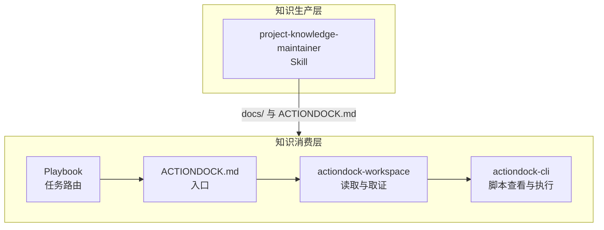

# 项目知识库：给 AI 一条确定的项目理解路径

AI 进入项目后，最缺的往往不是语法知识或框架 API，而是项目事实——数据库用哪个、接口返回什么格式、排查问题该从哪入手。这些信息散落在 DDL、配置文件、脚本说明和目录约定中，AI 看得到文件，却不知道该先读哪个。

ActionDock 的做法是修好入口和读取路径，让 AI 从一个固定起点出发，自己顺着原始材料往下走。这一做法背后有五层核心设计：

---

## 为什么不用 RAG

RAG 的标准流程：把项目内容切块、做嵌入、存向量库、检索时再拼回来。这套链路需要嵌入服务、分块策略、向量数据库、检索调优，每个环节都要持续维护。对结构化程度高的项目，投入产出不成比例。

检索本身还有不确定性。AI 拿到的是检索系统挑出来的片段，信息可能跨越文件边界，可能落在检索阈值以下—— RAG 反而成了信息缺失的来源。

ActionDock 的选择是把入口和读取能力做扎实。入口固定，后续探索开放。

---

## 知识生产靠协议约束

项目知识的生产方式决定它的质量上限。让 AI 一次性生成文档，内容会很快偏离事实——模型把临时推断的信息当成项目事实，在证据不足时用看似合理的猜测填补空白。

ActionDock 把这个过程交给 `project-knowledge-maintainer` 这一技能。它是一套带约束的知识生产协议，有几个硬规则：

**证据必须来自原始材料。** 结论可以引用代码、配置、DDL、测试、日志或现有文档，不可凭空编造。证据不足的地方，允许跳过或标记待确认，不允许塞入未经核实的内容。

**先规划，后执行。** 技能先形成完整的文档预期—— `Plan A` 回答“这个范围内应该有哪些文档”，`Plan B` 再挑出这次要执行的部分。文档的完整性和执行批次分开，不会因为一次任务范围有限，就把项目知识缩减为仅剩眼前几个文件。

**大范围任务拆两步。** 文档结构由 `Domain Planner` 先发现各领域的文档库存，再由 `Global Planner` 合并成整体视图。结构发现与具体构建分开，执行阶段不需要临时决定文档边界。

**完成需要验证。** 阶段完成的判断标准是 `Validator` 检查结果是否落到了文档、是否符合契约、是否需要修补。动作做过不算完成。

---

## 入口固定为 `ACTIONDOCK.md`

知识生成之后，下一个问题是“从哪里开始读”。ActionDock 把入口固定在项目根目录下的 `ACTIONDOCK.md`。

这个文件只做三件事：告诉调用方项目应该先看什么、给出文档的阅读顺序和关键词线索、把入口稳定下来。它不负责搜索，不负责总结仓库内容，也不替 AI 做推理。

职责收窄换来的是稳定性。AI 每次进入项目不用重新猜第一步，也不依赖仓库里各种 `README` 是否恰好写得完整。

---

## 工作区访问统一走 `actiondock-workspace`

拿到入口之后，AI 需要继续读目录、读文档、读源码，必要时还要探测环境。很多系统默认项目仓库就在本地文件系统，可以直接用文件命令扫—— ActionDock 不做这个假设，项目可能在远端，ActionDock 也可能运行在另一台机器上。

工作区访问统一走 `actiondock-workspace` 插件，核心动作只有六个：

- `listDirectory`：查看目录结构
- `viewTextFile`：读取文本文件
- `findFiles`：按模式查找文件
- `searchText`：在文件内容中搜索关键词
- `getSystemInfo`：了解运行环境的可见性
- `exec`：执行本机 Shell 命令，参数与脚本运行时 `shell.exec` 对齐

这几个动作覆盖了“沿入口继续调查项目”所需的最小操作集。它们把读取行为固定在一致边界内——后续的读目录、读文件、搜文本，都不能默认改用调用方本地的命令。

---

## Playbook 路由、知识协议和执行分层

有了入口、能读文件之后，下一步是把知识变成动作。ActionDock 把项目类任务拆成三层：

**Playbook 路由层** 回答“这是什么任务、应该先走哪段 guide、什么时候停、哪些脚本可能有用”。AI 处理项目相关问题时，先搜索任务手册；没有专用手册时，使用 `actiondock-cli` 文档内的通用项目调查 fallback。

**项目知识协议** 回答 Playbook guide 和选中脚本 Schema 提出的问题。它由 `ACTIONDOCK.md`、`docs/` 和 `actiondock-workspace` 组成，是下游取证路径，不再作为单独的 Agent Skill 入口。

**执行层**（`actiondock-cli`）回答“怎么调用、参数是什么、怎么执行”——选择相关脚本、查看选中脚本结构定义（Schema）、发起执行。

这几件事混在一起，AI 容易跳过任务理解或在庞大知识库里泛读。分层之后，`guideMarkdown` 和选中脚本 Schema 会先形成问题清单，再由项目知识协议定向回答。`domain`、`dbType`、`idTree` 这类参数，往往需要先从项目知识里找出来，用户不会直接给出。

---

## 知识存放在仓库里

知识库独立于代码存放，就会和代码产生同步问题。分支删了、合并了、回滚了，知识库不会自动跟着变。AI 拿到的可能是过期的设计决策，也可能是另一个分支还没合入的信息——排查问题时这种干扰尤其危险。

ActionDock 让知识跟着代码走。知识文件放在仓库里，跟着分支创建、合并进入 `master`、删除时一起消失。三个直接好处：

**隔绝分支干扰。** AI 在当前分支上工作时，读到的永远是当前分支的知识内容。集中式知识库要做到这一点，要么给每条知识打分支标签（代价高），要么接受信息污染（代价更高）。

**协议标准化，不需要按业务定制 Skill。** 知识的入口（`ACTIONDOCK.md`）和存放位置（`docs/`）在所有项目中统一，`actiondock-cli` 的 Playbook 消费协议会带着用户问题、guide 和选中脚本 Schema 去搜索项目知识。不需要为数据库信息、接口规范这类领域知识单独打包定制 Skill。

**知识可分发，团队快速复用。** 知识随代码进入 `master`，团队成员拉取代码就自动获得完整的项目理解路径。新成员加入、新环境搭建，不需要额外配置知识库、导入索引或运行预处理步骤。

---

## 典型路径

以生产告警排查为例：

1. **查任务手册。** 先按意图正则搜索 Playbook；用户已明确项目或候选过多时，再用仓库过滤收窄。命中专用手册后先读取风险和停止条件，再读 `guideMarkdown`。如果 `--intent` 没有命中，CLI 会自动退回同一过滤条件下的全量摘要列表，避免因为关键词没写准就中断。
2. **选相关脚本。** 根据用户问题、guide 阶段和 `scriptRefs[].purpose` 选择最小相关脚本集，不遍历所有脚本。
3. **看选中脚本 Schema。** 用字段名、字段描述、required、enum 和默认值生成待补齐问题清单。
4. **定向取证。** 解析 `ACTIONDOCK.md` 确认入口、目录规则和禁搜目录，再通过 `actiondock-workspace` 围绕问题清单读取文档或搜索源码。
5. **执行脚本。** 问题清单补齐、风险可接受且没有命中停止条件后，才补齐参数并执行脚本。

AI 沿 Playbook guide $\rightarrow$ 相关脚本 Schema $\rightarrow$ 问题清单 $\rightarrow$ 项目知识取证 $\rightarrow$ 脚本执行的顺序推进，比盲扫仓库可靠。

---

## 架构全景

Playbook 路由、入口、协议、工作区访问、执行分层、仓库存储——边界确定后，项目知识从“看起来很全的说明材料”变成了 AI 能稳定依赖的读取路径。
