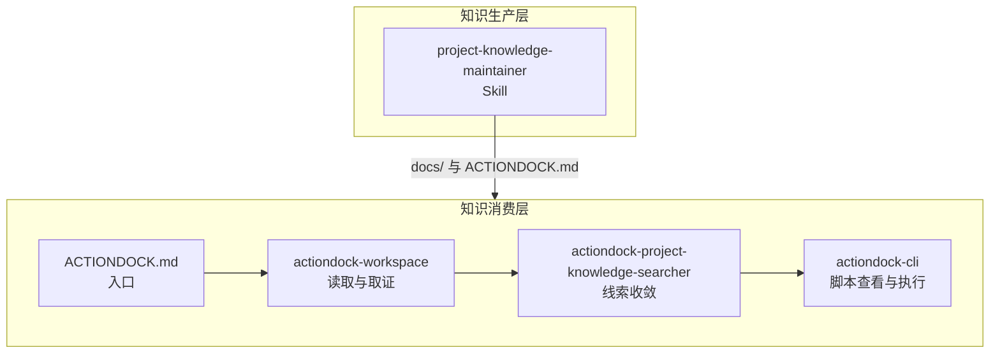

# 项目知识库：让 AI 真正理解你的项目

AI 进入真实项目之后，最容易出错的地方，通常不是语法，也不是框架 API，而是项目事实。它知道怎么写代码，却不知道这个项目的边界、数据语义、脚本约定和排查路径到底是什么。

很多系统处理这个问题时，第一反应都是再加一层知识库，再加一层检索，再加一层索引。但 ActionDock 的判断不是这样。项目知识的关键，不是把内容堆得更多，而是先给 AI 一条稳定、可验证、跨环境一致的进入路径。

所以这篇文档不再按功能清单展开，而是按几个工程决策来讲清楚：为什么项目知识要这样设计，这些决策各自解决了什么问题，以及它们最后是怎么连成一条工作链路的。

---

## 一、为什么不走 RAG

提到项目知识，最常见的答案就是 RAG。把仓库内容切块、做嵌入、建索引、再让模型按语义检索，看起来很完整，也很符合今天大家对“知识库”的直觉。

ActionDock 没有走这条路。

原因很直接：在项目理解这个场景里，RAG 增加的复杂度，往往大于它带来的确定性收益。

项目里的高价值信息，本来就不是均匀分布的。构建文件、DDL、配置、README、runbook、脚本说明、目录约定，这些内容天然带有结构，也天然有入口。对于这种信息，最可靠的方式通常不是先切碎、再检索，而是让 AI 从一个稳定入口出发，沿着目录和引用关系继续读原文。

RAG 的问题不只在于重。它还会额外引入一层不可控性。模型看到的不是完整文件，而是检索系统挑出来的片段。只要证据恰好跨文件、跨分块边界，或者落在低分区域，结论就会失去上下文。

ActionDock 的选择是另一条路：平台不替 AI 预先“理解项目”，而是把入口、边界和读取能力准备好，让 AI 自己沿着原始材料走下去。

这背后的判断很朴素。项目理解不是问答检索，更像调查。调查最重要的不是“先准备多少答案”，而是“先确认从哪里开始查”。

---

## 二、知识生成是 Skill，不是一次性 Prompt

项目知识的第一步，不是写文档，而是约束文档怎么被写出来。

如果这件事只靠一次性 Prompt，结果通常会很快漂移。模型会把这次对话里临时提到的信息，当成项目里的长期事实；也会在证据不足的时候，用看起来顺的推断把空白补上。这样的文档读起来像那么回事，但经不起复查。

ActionDock 把知识生成收敛成一个明确能力：`project-knowledge-maintainer`。

这不是“一个会写 Markdown 的助手”，而是一套带边界的知识生产协议。它把项目知识的生成过程从一次性的临场发挥，变成了可重复执行的工作流。

这里有几个关键约束。

### 证据边界先于表达边界

结论必须回到原始证据：代码、配置、DDL、测试、日志和现有文档。证据不足时，可以跳过，可以记录待确认项，但不能伪造内容。

这条规则的价值，不在于让文档更保守，而在于让文档可复查。项目知识一旦进了 AI 的工作流，错误就会被放大。比起“先写满”，更重要的是“只写有根据的”。

### 先规划，再执行

知识维护不是想到哪写到哪。Skill 会先形成完整预期，再决定本轮执行什么。

这里的拆分是 `Plan A` 和 `Plan B`：

- `Plan A` 先回答“这个范围内应该有哪些文档”
- `Plan B` 再回答“这次真正要落哪些文档”

这样做的结果是，文档的完整性和本轮的执行批次被分开了。系统不会因为一次任务范围有限，就把项目知识天然压扁成只剩眼前这几个文件。

### 大任务里，结构发现和落地执行分开

当范围变大之后，文档结构不再由执行阶段临场决定，而是先交给 `Domain Planner` 发现各领域的文档库存，再由 `Global Planner` 合并成整体视图。

这个设计解决的是一个很现实的问题：项目知识最容易丢的，不是正文，而是覆盖面。没有显式规划时，模型会倾向于只写自己已经看见、而且最容易写出来的部分。

### 完成不是“做过动作”，而是“通过验证”

Skill 末端还有 `Validator`。阶段完成不是主观判断，而是看结果是否真的落到了文档、是否符合契约、是否需要修补。

所以 `project-knowledge-maintainer` 真正解决的，不是“生成文档”这件事本身，而是让知识生成这条链路具备约束、节奏和复查点。

---

## 三、入口固定为 `ACTIONDOCK.md`

项目知识生成出来之后，第二个问题不是“怎么搜”，而是“从哪里开始读”。

ActionDock 把这个入口固定为项目根目录下的 `ACTIONDOCK.md`。

这个决策看起来很保守，但它解决的是稳定性问题。只要入口是固定的，AI 每次进入一个陌生项目时，就不用重新猜第一步，也不用依赖仓库里各种 README 是否恰好写得完整。

更重要的是，`ACTIONDOCK.md` 的职责被刻意收窄了。它只负责三件事：

1. 告诉调用方这个项目应该先看什么
2. 给出文档阅读顺序和关键词线索
3. 把“项目知识从哪里进入”稳定下来

它不负责搜索，不负责总结整仓库，也不负责替 AI 做推理。

这样的切分有一个直接好处：入口层足够稳定。拿到入口，不等于已经理解项目；但没有入口，后面的阅读路径就很容易失控。ActionDock 先把第一步固定住，再把后续的探索交给统一的读取能力。

---

## 四、工作区访问收敛到 `actiondock-workspace`

拿到 `ACTIONDOCK.md` 之后，AI 还需要继续读目录、读文档、读源码，必要时探测环境。

很多系统在这里会默认一个前提：项目仓库就在当前机器的本地文件系统里，所以可以直接用本地文件命令扫仓库。这个假设在 ActionDock 里并不成立。

项目可能在远端。ActionDock 也可能运行在另一台机器。只要这个前提成立，本地文件命令就不再可靠。

所以 ActionDock 把后续的工作区访问统一收敛到 `actiondock-workspace`。这不是为了多包一层，而是为了明确边界：入口解析和仓库内容读取，是两件不同的事；读取能力必须走统一门面，不能偷渡成本地假设。

对于项目知识消费，这里最重要的是几类读取动作：

| 动作 | 作用 |
|------|------|
| `listDirectory` | 看目录结构，确认下一步读哪里 |
| `viewTextFile` | 读文本文件，支持按行查看 |
| `findFiles` | 按模式找文件 |
| `searchText` | 在项目里搜文本证据 |
| `getSystemInfo` | 了解工作区和环境可见性 |
| `executeShellCommand` | 在受控边界内补充只读式环境检查 |

这几类能力连在一起，刚好覆盖“沿入口继续调查项目”需要的最小动作集。

### 它真正解决的不是读取，而是边界

这个插件最重要的价值，不是“能读文件”，而是把读取动作固定在一致边界内。

**项目不一定在本地。** 所以解析出仓库根目录之后，后续继续读目录、读文件、搜文本，都不能默认改用调用方自己的本地命令。

**访问需要受控。** 工作区访问会受 `baseDir` 约束，环境探测和命令执行也有自己的限制条件。平台提供的是可用能力面，而不是无限制穿透。

**调用方式需要统一。** 无论是脚本运行时、CLI 还是 Agent，本质上走的是同一套工作区读取边界。这样一来，“如何读项目”就不会因为调用入口不同而分裂成几套逻辑。

所以这一步的核心不是“给 AI 更多工具”，而是“把进入项目后的读路径统一起来”。

---

## 五、搜索知识与执行脚本分层

当入口有了，工作区也能进入之后，最后一个问题才是：知识怎么变成动作。

ActionDock 在这里继续做了一次克制的拆分。

项目知识搜索，和脚本执行，不是同一层能力。

前者解决的是“应该看什么、应该用什么、还缺哪些上下文”；后者解决的是“具体怎么调用、参数长什么样、最后怎么执行”。如果把两件事混在一起，AI 很容易跳过知识确认，直接冲到执行层。

所以 ActionDock 把这两层拆开：

| 层级 | 职责 | 对应能力 |
|------|------|----------|
| 搜索者 | 顺着项目知识入口继续定位文档、线索和脚本上下文 | `actiondock-project-knowledge-searcher` |
| 执行者 | 查看脚本、理解 schema、真正发起执行 | `actiondock-cli` |

这个分层非常重要，因为脚本执行经常依赖项目上下文。像 `domain`、`dbType`、`idTree` 这种参数，很多时候并不是用户直接给出的，而是要先从项目知识里找出来。

在这套设计里，项目知识库不是脚本执行的附件，而是脚本执行前的前置条件。

团队分发也沿用同一条思路。项目知识可以作为知识源安装进来，但安装之后的消费路径不变，仍然是先进入项目入口，再继续读取文档和工作区内容，最后才进入执行层。分发的不是一堆孤立 Markdown，而是一套稳定的进入方式。

---

## 使用路径：一条更可靠的项目理解链路

把上面的几个决策连起来，ActionDock 最终想得到的，不是一个“什么都能回答”的知识系统，而是一条更可靠的项目理解链路。

典型场景是生产告警排查。

第一步，不是先扫源码，而是先解析项目入口。先确认这个项目把哪些文档当作正式阅读路径，哪些目录值得优先看，哪些只是噪声。

第二步，再通过 `actiondock-workspace` 继续读。需要看 runbook，就读 runbook；需要看诊断手册，就读诊断手册；需要确认某个目录下还有哪些补充材料，就先列目录；需要交叉验证一个术语在多少地方出现，再做文本搜索。

第三步，只有当问题已经被收敛到一个具体操作时，才进入脚本层。先看脚本列表，再看 schema，先补齐脚本依赖的项目上下文，再决定是不是真的要执行。

这条顺序看起来比“直接搜代码”更慢，但它在真实项目里通常更稳。因为它先解决的是阅读顺序，而不是搜索速度。

可以把这条路径概括成四步：

1. 先拿入口
2. 再读文档
3. 必要时进入工作区继续取证
4. 最后才把知识转成脚本执行

这就是 ActionDock 对“项目知识库”这个词的理解。它不是一个静态材料堆，而是一条进入真实项目的工作流。

---

## 架构全景

```mermaid
flowchart TB
  subgraph Production[知识生产层]
    A[project-knowledge-maintainer<br/>Skill]
  end

  A -->|docs/ 与 ACTIONDOCK.md| Consumption[知识消费层]

  subgraph Consumption[知识消费层]
    B[ACTIONDOCK.md<br/>入口]
    C[actiondock-workspace<br/>读取与取证]
    D[actiondock-project-knowledge-searcher<br/>线索收敛]
    E[actiondock-cli<br/>脚本查看与执行]
  end

  B --> C
  C --> D
  D --> E
```

---

## 小结

这套设计背后的共同逻辑很简单：项目知识的价值，不在于多存一批文档，而在于让知识真正进入 AI 的工作流。

ActionDock 为此做的几件事都很克制：

- 不用 RAG 预先替 AI 猜答案，而是把入口和读取路径修好
- 不把知识生成交给一次性 Prompt，而是交给有契约的 Skill
- 不让 AI 重新猜第一步，而是固定 `ACTIONDOCK.md` 作为入口
- 不假设仓库一定在本地，而是用 `actiondock-workspace` 统一读取边界
- 不把搜索和执行混成一层，而是先确认上下文，再进入脚本

当这些边界都稳定下来之后，项目知识库才不再是一份“看起来很全”的说明材料，而是 AI 真正能够依赖的项目进入路径。
