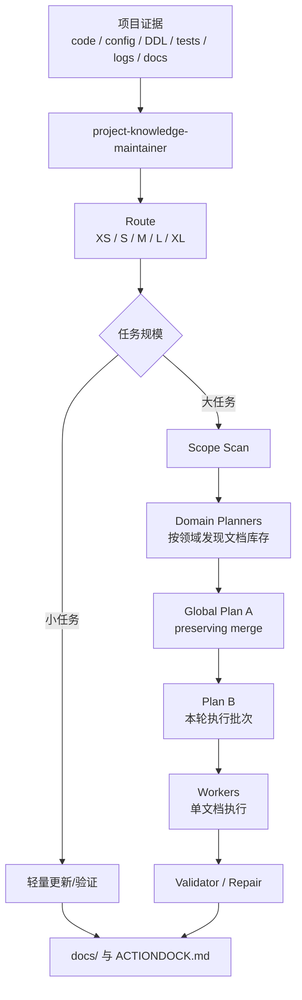
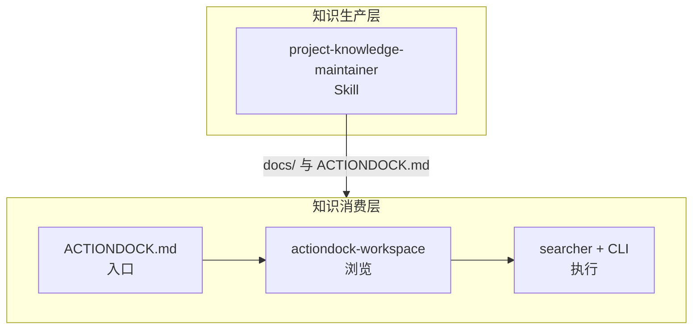

# 项目知识库：让 AI 真正理解你的项目

AI 辅助编程已经很常见，但一旦问题进入具体项目，模型最容易失手的地方往往不是语法，也不是框架 API，而是项目事实。它知道"怎么写"，却不知道"这个项目到底是什么样子"。

这也是项目知识库需要解决的核心问题。目标不是再堆一份文档集合，而是给 AI 一条稳定、可验证、跨环境一致的理解路径：先知道去哪里看，再知道怎么看，最后才是怎么执行。

在 ActionDock 里，这条路径被拆成了几层明确的能力：知识生产、入口定位、工作区浏览、脚本执行，以及团队分发。

---

## 痛点：把代码喂给 AI，为什么还不够？

第一个问题是上下文不稳定。业务规则、数据语义、排查路径、脚本参数依赖，通常分散在代码、配置、DDL、README、日志样例和运维约定里。单次 Prompt 可以补一点上下文，但无法保证持续更新，更无法约束结论一定绑定证据。

第二个问题是知识和使用脱节。很多"代码知识库"的思路停留在"先生成一批文档"，但没有继续回答：AI 拿到这些文档后，下一步怎么定位脚本、怎么补齐参数、怎么进入真实排查链路。结果就是知识存在，但没有进入工作流。

第三个问题更基础：系统不能假设项目一定在本地。只要 ActionDock 运行在远端，或者项目仓库位于另一台机器，直接用本地文件命令扫描仓库的做法就会失效。知识入口和工作区访问如果没有明确边界，AI 的行为很快会从"理解项目"滑向"碰运气"。

### 为什么不用 RAG

提到项目知识，很容易想到 RAG（Retrieval-Augmented Generation）。向量嵌入、语义检索、分块索引——这套组合已经成为"给 AI 喂项目信息"的标准答案。但 ActionDock 没有走这条路。

原因很直接：在项目理解这个场景里，RAG 的复杂度投入和收益不成比例。

RAG 要跑起来，至少需要一套嵌入服务、分块策略、向量数据库和检索质量调优。每个环节都是维护负担，而最终产出本质上还是"把项目内容切成片段再拼回去"。对于结构化程度高的项目——有明确的构建文件、DDL、配置约定和代码组织规则——AI 完全有能力从入口文件出发，沿着依赖关系和目录结构直接阅读原文，而不需要先由系统预先索引再检索。

更重要的是，RAG 在检索环节引入了一层不可控性。模型拿到的是检索系统选出的片段，而不是完整的上下文。当项目知识需要绑定的证据恰好跨文件、跨分块边界，或者落在检索阈值以下的低分区域时，RAG 反而会成为信息缺失的来源。

实际证据来自 Claude Code 本身。Claude Code 的文件导航能力几乎完全建立在 grep、find、glob 这些基础工具上。没有向量索引，没有语义检索，没有分块——AI 根据任务判断应该搜什么、去哪里搜，然后直接读取原始文件。这种"入口引导 + 按需检索 + 原文直读"的模式，在大量真实代码理解场景中已经被验证是高效且可靠的。

ActionDock 选择的是"把路修好，让 AI 自己走"，而不是"把沿途风景都拍下来，再让 AI 看照片猜路"。

---

## 设计：为什么这条链路要拆开

### 1. 知识生成是 Skill，不是一次性 Prompt

项目知识的第一步不是写文章，而是定义维护规则。如果把维护要求散落在一次性 Prompt 里，AI 会倾向于用一次性上下文代替持续有效的知识——模型会把"这次对话里提到的"当成"项目里一直存在的"。

为什么会这样？因为项目事实散在代码、配置、DDL、测试、日志和现有文档里。如果没有先约束证据来源，模型很难区分"这次推断出来的结论"和"从原始证据推导出来的事实"。

ActionDock 把这部分能力放进 `project-knowledge-maintainer` 技能，让知识生成过程本身成为可维护的约束。Skill 的价值在于把这些设计取舍固化成可重复执行的入口。

这套 Skill 不是固定的重流程模板，而是先做路由，再决定展开到什么深度。它的热路径非常克制：运行前先读 `references/contract.json`、`references/formatter.md` 和 `references/playbook.md`，然后根据任务规模在 XS / S / M / L / XL 之间选择协议。小修补走轻路径，大范围刷新才会展开完整链路。

**证据边界。** 结论必须回到代码、配置、DDL、测试、日志或现有文档；证据不足时，允许跳过，允许写入报告，但不允许伪造内容。`contract.json` 把证据优先级和失败条件写进去。没有证据就不产出，空心文档进不了正式知识库。

**规划边界。** 先形成完整的文档预期，再进入执行。Skill 把这一步拆成 `Plan A` 和 `Plan B`：`Plan A` 描述这个范围内应该有哪些文档，`Plan B` 再从里面挑出本轮真正执行的批次。

**角色边界。** 大任务里，文档结构由 `Domain Planner` 负责发现，不再交给执行阶段临场决定。各领域先分别产出文档库存，再由 `Global Planner` 做 preserving merge，保留文档广度、规范路径、记录依赖，但不能为了减少工作量把领域规划压扁。

**完成边界。** 这套 Skill 明确要求 `subagent > serial`，并且把"动作做过"和"阶段完成"严格区分开。阶段被委派后必须等待结果，最终是否完成不由主观信心决定，而由 `Validator` 判断。


```mermaid
flowchart TD
  A[项目证据<br/>code / config / DDL / tests / logs / docs] --> B[project-knowledge-maintainer]
  B --> C[Route<br/>XS / S / M / L / XL]
  C --> D{任务规模}
  D -->|小任务| E[轻量更新/验证]
  D -->|大任务| F[Scope Scan]
  F --> G[Domain Planners<br/>按领域发现文档库存]
  G --> H[Global Plan A<br/>preserving merge]
  H --> I[Plan B<br/>本轮执行批次]
  I --> J[Workers<br/>单文档执行]
  J --> K[Validator / Repair]
  E --> L[docs/ 与 ACTIONDOCK.md]
  K --> L
```

### 2. 入口收敛到 `ACTIONDOCK.md`

知识生成出来之后，还需要一个稳定入口。ActionDock 把入口固定为项目根目录下的 `ACTIONDOCK.md`。

这个设计非常克制。`ACTIONDOCK.md` 只负责三件事：告诉调用方这个项目应该先看什么、给出文档阅读顺序和关键词指引、把"项目知识从哪里开始读"稳定下来。

对应的平台能力也很单一：`actiondock repository resolve --repository-id <id> --json` 只做定位和读取，返回项目根目录、入口路径以及 `ACTIONDOCK.md` 原文。它不做搜索，不做语义理解，也不会替调用方自动展开整棵仓库。

这种切分看起来保守，但正是它让入口层保持稳定。对于 `GIT` 类型项目仓库，`repository resolve` 也不会隐式触发同步；同步是独立动作，入口解析是独立动作。系统边界清晰，调用方也不会把"拿到入口"误认为"已经掌握项目"。

### 3. `actiondock-workspace` 是工作区边界

如果说 `ACTIONDOCK.md` 解决的是"从哪里开始读"，那么 `actiondock-workspace` 解决的就是"接下来如何真的去读"。

项目仓库被解析出来之后，并不意味着它就在当前本地文件系统里，也不意味着任何调用方都可以直接用本地文件命令扫仓库。ActionDock 把这部分能力收敛到内置系统插件，让目录浏览、文本读取、环境探测和受控 Shell 执行都通过统一门面完成。

核心动作有六个，涵盖文件读取、搜索和系统信息：

| 动作 | 说明 |
|------|------|
| `viewTextFile` | 读取文本文件，支持行范围指定 |
| `listDirectory` | 列出目录内容，返回文件和子目录 |
| `findFiles` | 按名称模式搜索文件 |
| `searchText` | 在文件中搜索文本内容 |
| `getSystemInfo` | 获取工作区、系统、Shell 和命令信息 |
| `executeShellCommand` | 执行 Shell 命令，支持超时和输出限制 |

这几个动作看上去只是工具接口，但设计价值在于它们把"仓库内容访问"从"调用方自己的本地假设"里剥离出来了。

**项目可能运行在远端。** 此时 `repository resolve` 返回的是项目根路径和入口内容，后续继续读目录、读文件、执行命令，都必须走系统插件，不能默认用调用方所在机器的本地文件命令代替。

**访问需要受控。** `actiondock-workspace` 会把路径访问限制在 `baseDir` 范围内；Shell 执行支持 `allowedCommands`、超时和输出限制，失败时会返回自动探测到的可用 shell / 命令环境；`getSystemInfo` 默认只返回工作区、Shell 和常用命令探测结果。

**能力需要统一。** 无论是脚本运行时里的 `plugins.invoke(...)`，还是通过 CLI 的 `actiondock plugin invoke actiondock-workspace ...`，调用的是同一套动作和参数约定。Groovy、Python、CLI 和 Agent 最终共享同一个"如何进入工作区"的能力面。

### 4. 搜索知识和执行脚本分层

项目知识被定位出来、工作区也能进入之后，最后一个问题才是：如何把知识转成动作。

ActionDock 继续分层：

| 层级 | 职责 | 工具 |
|------|------|------|
| 搜索者 | 指导 AI 先找入口、再找文档、再找脚本 | `actiondock-project-knowledge-searcher` |
| 执行者 | 真正列出脚本、查看参数 schema、执行 | `actiondock-cli` |

这两层分开的意义很实际。搜索者解决的是"应该看什么、应该用什么"；CLI 解决的是"具体怎么调用"。如果把两者混在一起，AI 很容易直接跳到执行层，却没有先补齐脚本需要的项目上下文。

在项目相关问题上，推荐顺序不是"直接跑命令"，而是先沿着知识入口确认问题范围，再根据文档和脚本 schema 决定真正的执行动作。

---

## 使用：一条更可靠的项目理解路径

典型场景是生产告警排查。假设某个支付服务出现异常，合理的处理顺序是这样的：

### 1. 先取入口，而不是先扫源码

```bash
actiondock repository resolve --repository-id billing-service --json
```

拿到 `ACTIONDOCK.md` 后，先确定这个项目的阅读入口在哪里，哪些文档是面向排查的，哪些目录不值得优先搜索。

### 2. 需要深入时，通过 Workspace 继续浏览

如果入口文档指向了诊断手册、流程文档或数据表说明，再通过 `actiondock-workspace` 继续查看具体内容：

```bash
actiondock plugin invoke actiondock-workspace viewTextFile \
  --path <root>/docs/diagnosis/runbook.md --json
```

如果需要先看目录结构，也可以先列目录；如果需要确认运行环境里有哪些命令可用，再调用 `getSystemInfo`。关键不是命令本身，而是入口之后的工作区访问始终走统一边界。

### 3. 再决定要不要执行脚本

当问题已经被收敛到具体排查动作时，再进入 CLI：

```bash
actiondock script list --json
actiondock script schema query-mysql-json --json
```

重点是先看脚本 schema，再补齐脚本依赖的项目上下文，例如 `domain`、`dbType`、`idTree` 之类的参数从哪里来。项目知识库在这里不是附件，而是脚本执行前的前置条件。

### 4. 让知识、工具和执行形成闭环

一旦找到了合适脚本，后续才进入数据库查询、日志查询或其他执行动作。知识库提供的是"查什么、为什么查、结果怎么解释"，脚本提供的是"如何真正执行"。

这条顺序看起来比"直接搜索代码"更慢，但它更可靠。AI 不是一上来盲扫仓库，而是沿着"入口 -> 文档 -> Workspace -> 脚本"的顺序推进。项目知识因此真正进入了工作流，而不是停留在一组静态说明文档里。

---

## 分发：团队协作也复用这套入口模型

项目知识一旦进入日常工作流，就不能只停留在单仓库本地使用。团队协作真正需要的是：别人在安装之后，也能沿着同一条路径消费知识，而不是重新学习一套新的入口。

ActionDock 对此采用的是知识源机制。项目知识可以作为 `CAPABILITY` 仓库里的 knowledge source 发布，团队成员通过 `repository:knowledge-install` 安装后，系统会自动把它注册为 `PROJECT` 仓库。后续的消费方式不变，仍然是：

1. `repository resolve`
2. 读取 `ACTIONDOCK.md`
3. 需要深入时进入 `actiondock-workspace`
4. 需要执行时转到 CLI

分发的不是一堆零散 Markdown，而是"标准入口 + 标准浏览边界 + 标准执行顺序"。团队共享的不只是知识内容，也是知识的使用方式。

---

## 架构全景


```mermaid
flowchart TB
  subgraph Production[知识生产层]
    A[project-knowledge-maintainer<br/>Skill]
  end

  A -->|docs/ 与 ACTIONDOCK.md| Consumption[消费层]

  subgraph Consumption[知识消费层]
    B[ACTIONDOCK.md<br/>入口]
    C[actiondock-workspace<br/>浏览]
    D[searcher + CLI<br/>执行]
  end

  B --> C
  C --> D
```

---

## 结语

项目知识库真正有价值的地方，不是把所有信息都集中到一起，而是让 AI 在进入一个陌生项目时不至于走错第一步。

ActionDock 的做法并不追求把平台变成一个全知全能的知识系统，而是把几个关键边界固定下来：

- **知识怎么生产**：由 Skill 和契约约束
- **知识从哪里进入**：由 `ACTIONDOCK.md` 统一
- **项目内容怎么继续浏览**：由 `actiondock-workspace` 承担
- **知识怎么转成动作**：由搜索者和 CLI 分层衔接

当这些边界清楚之后，项目知识才不再是一份"给人看的补充材料"，而是真正进入 AI 工作流的一部分。
