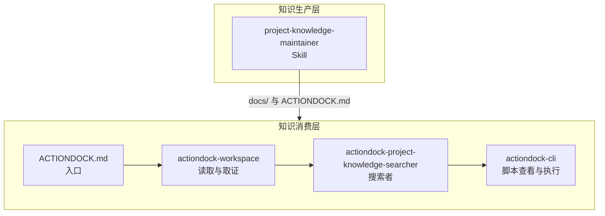

# 项目知识库：让 AI 真正理解你的项目

AI 进入真实项目之后，最容易出问题的地方往往不是语法，也不是框架 API，而是项目事实。它知道怎么写代码，却不知道这个项目用的是哪个数据库、接口的返回格式是什么、排查问题该从哪里入手。

处理这个问题，常见的思路是建一套知识库：把代码切块、做嵌入、搞检索，看起来很完整。但 ActionDock 没有走这条路。原因不是 RAG 不好，而是这个场景下它的代价太高，收益却不明显。

项目里的关键信息——构建配置、DDL、脚本说明、目录约定——本身就有结构，也有明确的入口。与其把它们打碎再拼回去，不如给 AI 一条稳定的路：告诉它从哪里开始读，剩下的让它自己顺着原始材料走。

基于这个判断，ActionDock 的项目知识体系围绕几个核心决策展开。

---

## 为什么不走 RAG

RAG 需要一整套基础设施：嵌入服务、分块策略、向量数据库、检索调优。每个环节都要维护，最后产出的却是"把项目内容切碎再拼回来"。对于结构化程度高的项目，这个投入不划算。

更麻烦的是检索本身引入的不确定性。AI 拿到的是系统挑出来的片段，不是完整的上下文。当需要的信息跨越文件边界，或者落在检索阈值以下时，RAG 反而成了信息缺失的来源。

ActionDock 的选择是把入口和读取能力修好，让 AI 自己去找需要的内容。入口是固定的，但后续的探索是开放的。

---

## 知识生成是一套协议，不是写文档

项目知识的生产方式，决定了它的质量上限。如果只是让 AI 一次性生成文档，内容会很快漂移——模型会把这次对话里临时推断的信息当成项目事实，在证据不足时用看似合理的猜测填补空白。

ActionDock 把这个过程收敛成一个叫 `project-knowledge-maintainer` 的 Skill。这不是"会写 Markdown 的助手"，而是一套带约束的知识生产协议。

**证据必须来自原始材料。** 结论可以引用代码、配置、DDL、测试、日志或现有文档，但不能凭空编造。证据不足的地方，允许跳过或标记待确认，但不允许塞入未经核实的内容。

**先规划，后执行。** 维护知识不是想到哪写到哪。Skill 会先形成完整的文档预期——`Plan A` 回答"这个范围内应该有哪些文档"，`Plan B` 再从里面挑出这次真正要落地的部分。这样做的好处是，文档的完整性和执行批次分开了，不会因为一次任务范围有限，就把项目知识压成只剩下眼前这几个文件。

**大任务拆成两步走。** 当范围变大时，文档结构由 `Domain Planner` 先发现各领域的文档库存，再由 `Global Planner` 合并成整体视图。结构发现和落地执行是分开的两步，不会让执行阶段临时决定文档边界。

**完成需要验证。** 阶段完成不是"动作做过"，而是由 `Validator` 检查结果是否真的落到了文档、是否符合契约、是否需要修补。

---

## 入口固定为 `ACTIONDOCK.md`

知识生成之后，第二个问题是"从哪里开始读"。ActionDock 把这个入口固定为项目根目录下的 `ACTIONDOCK.md`。

这个文件只做三件事：告诉调用方这个项目应该先看什么、给出文档的阅读顺序和关键词线索、把项目知识的入口稳定下来。它不负责搜索，不负责总结仓库内容，也不替 AI 做推理。

职责收窄的好处是入口层足够稳定。AI 每次进入项目，不用重新猜第一步，也不依赖仓库里各种 README 是否恰好写得完整。

---

## 工作区访问统一收敛到 `actiondock-workspace`

拿到入口之后，AI 需要继续读目录、读文档、读源码，必要时还要探测环境。很多系统默认项目仓库就在本地文件系统里，可以直接用文件命令扫。但这个假设在 ActionDock 里不成立——项目可能在远端，ActionDock 也可能运行在另一台机器。

所以 ActionDock 把工作区访问统一收敛到 `actiondock-workspace` 插件。核心动作只有几个：

- `listDirectory` 看目录结构
- `viewTextFile` 读文本文件
- `findFiles` 按模式找文件
- `searchText` 搜文本证据
- `getSystemInfo` 了解环境可见性
- `exec` 在需要时执行本机 Shell 命令，参数与脚本运行时 `shell.exec` 对齐

这几类动作覆盖了"沿入口继续调查项目"需要的最小动作集。重要的是，它们把读取动作固定在一致边界内——后续的读目录、读文件、搜文本，都不能默认改用调用方本地的命令。

---

## 搜索知识和执行脚本分层

有了入口、能读文件之后，最后一步是让知识变成动作。ActionDock 在这里又做了一次分层：搜索知识和脚本执行，不是同一层能力。

**搜索者**负责"应该看什么、应该用什么、还缺什么上下文"。这是 `actiondock-project-knowledge-searcher` 技能做的事——当 AI 处理项目相关问题时，先拿入口，再顺着文档定位线索，而不是上来就猜项目结构。

**执行者**负责"具体怎么调用、参数是什么、最后怎么执行"。通过 `actiondock-cli` 列出脚本、查看 schema、真正发起执行。

这两件事混在一起，AI 容易跳过知识确认，直接冲到执行层。分层之后，项目知识不是脚本执行的附件，而是执行前的前置条件。像 `domain`、`dbType`、`idTree` 这类参数，往往不是用户直接给出的，而是需要先从项目知识里找出来。

---

## 为什么知识随代码走，而不是集中存储

如果知识库是独立于代码的集中式系统，它和代码之间就必然存在同步问题。分支删了、合并了、回滚了，知识库里的内容却不会自动跟着变。AI 拿到的可能是已经过期的设计决策，也可能是另一个分支上还没合入的信息——这些干扰在排查问题时尤其危险。

ActionDock 的做法是让知识跟着代码走。知识文件放在仓库里，跟着分支创建、跟着合并进入 master、跟着删除一起消失。这样做有三个直接的好处。

**隔绝分支干扰。** AI 在当前分支上工作时，读到的永远是当前分支的知识内容。不存在读到其他分支未合并信息的情况，也不需要在知识查询里加入分支过滤逻辑。集中式知识库要做到这一点，要么给每条知识打分支标签（代价高），要么接受信息污染（代价更高）。

**技能标准化，不需要按业务定制。** 因为知识的入口（`ACTIONDOCK.md`）和存放位置（`docs/`）在所有项目中是统一的，标准技能 `actiondock-project-knowledge-searcher` 就能自动搜索所有项目知识。不需要为数据库信息、接口规范这类领域知识单独打包定制技能——搜索者沿着统一入口走就行。

**知识可分发，团队快速复用。** 知识随代码进入 master 分支，团队成员拉取代码就自动获得完整的项目理解路径。新成员加入、新环境搭建，不需要额外配置知识库、导入索引或者运行预处理步骤。

---

## 典型使用路径

以生产告警排查为例，合理的处理顺序是这样的：

**第一步，取入口。** 先解析 `ACTIONDOCK.md`，确认这个项目的阅读入口在哪里，哪些文档是面向排查的，哪些目录不值得优先搜索。

**第二步，读文档。** 通过 `actiondock-workspace` 继续读。需要看 runbook 就读 runbook，需要看诊断手册就读诊断手册，需要确认某个目录下还有什么材料就先列目录。

**第三步，进脚本层。** 当问题已经收敛到具体操作时，先看脚本列表，再看 schema，补齐脚本依赖的项目上下文，最后才决定是否执行。

这条路径看起来比"直接搜代码"慢一些，但更可靠。AI 不是一上来盲扫仓库，而是沿着入口→文档→工作区→脚本的顺序推进。

---

## 架构全景

```mermaid
flowchart TB
  subgraph Production[知识生产层]
    A[project-knowledge-maintainer<br/>Skill]
  end

  A -->|docs/ 与 ACTIONDOCK.md| Consumption[知识消费层]

  subgraph Consumption[知识消费层]
    B[ACTIONDOCK.md<br/>入口]
    C[actiondock-workspace<br/>读取与取证]
    D[actiondock-project-knowledge-searcher<br/>搜索者]
    E[actiondock-cli<br/>脚本查看与执行]
  end

  B --> C
  C --> D
  D --> E
```

---

## 小结

ActionDock 对项目知识的设计，核心思路是"让知识真正进入 AI 的工作流"，而不是堆一批静态文档。具体做了几件事：

- 不走 RAG 预索引，而是修好入口和读取路径
- 知识随代码走而非集中存储，隔绝分支干扰，技能标准化，团队可分发复用
- 不把知识生成交给一次性 Prompt，而是用有契约的 Skill 约束
- 固定 `ACTIONDOCK.md` 作为入口，不让 AI 重新猜第一步
- 用 `actiondock-workspace` 统一工作区访问边界，不依赖本地假设
- 搜索和执行分层，搜索者负责定位知识，执行者负责真正执行

这些边界稳定之后，项目知识才不再是"看起来很全的说明材料"，而是 AI 真正能依赖的项目理解路径。
