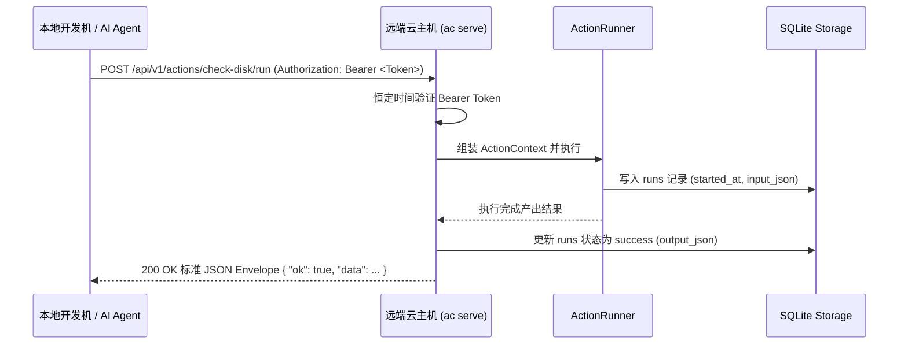

# 多环境与远程云机器调度指南

# 背景

在现代 AI Agent 与企业自动化工作流中，任务往往需要跨越复杂的异构基础设施（例如：阿里云生产机房、AWS 海外节点、内部私有云或本地测试网段）：

- **基础设施异构分散**：不同主机处于不同网络区域，难以使用单一中心化系统纳管。
- **重型代理（Agent Daemon）运维沉重**：传统远程调度框架要求在每台主机部署复杂的常驻守护进程与配置管理，升级与运维成本高昂。
- **返回契约与可观测性割裂**：使用 SSH 脚本远程执行时，日志与返回值混杂在一起，难以结构化捕获与处理。

ActionDock 2.0 提供了极简的 **Profile** （命名环境配置）与**ac serve** （轻量 HTTP Runner）机制，让 AI Agent 和开发者能够无缝调度分布在不同云厂商的主机与环境，享受统一的标准 JSON Envelope 输出与全生命周期追踪。

---

# 核心架构



---

# 快速上手指南

## 第一步：在远端云机器上启动服务 (`ac serve`)

登录到远端云服务器，进入 Action Package 目录（或已通过 `ac link` 注册全局包的环境），启动极轻量的 HTTP Runner：

```bash
# 本地回环监听（默认 127.0.0.1:5177）
ac serve --port 5177 --token my-secret-token-12345

# 暴露给局域网或公网网卡（0.0.0.0 强制要求配置 Token，或传入 --allow-insecure-no-auth）
ac serve \
  --host 0.0.0.0 \
  --port 5177 \
  --token my-secret-token-12345 \
  --cors-origin "https://agent.example.com" \
  --max-body 1mb
```

控制台展示服务就绪信息：
```text
======================================================
  ActionDock 2.0 HTTP Runner Server
======================================================
  * Listening on:    http://0.0.0.0:5177
  * Project:         Cloud Ops (org.cloud-ops)
  * Authentication:  Bearer Token Enabled
  * CORS Origins:    https://agent.example.com
  * Max Body Size:   1mb
  * Health Endpoint: http://0.0.0.0:5177/api/v1/health
======================================================
```

---

## 第二步：在本地配置 Profile (`ac profile add`)

在本地机器上，使用 `ac profile add` 将远端云机器注册为命名 Profile。**推荐使用 --token-env 关联环境变量名**，避免明文持久化 Token：

```bash
# 推荐方式：通过环境变量注入 Token
export ACTIONDOCK_ALIYUN_PROD_TOKEN=my-secret-token-12345
ac profile add aliyun-prod \
  --server http://114.115.116.117:5177 \
  --token-env ACTIONDOCK_ALIYUN_PROD_TOKEN \
  --desc "阿里云华东生产节点"

# 标准命名自动推导：
# 若 Profile 命名为 aws-test，ActionDock 会自动检索环境变量 ACTIONDOCK_AWS_TEST_TOKEN
export ACTIONDOCK_AWS_TEST_TOKEN=aws-secret-xyz
ac profile add aws-test \
  --server https://aws-runner.example.com \
  --desc "AWS 美西测试节点"
```

> [!NOTE]
> **配置文件权限保护**：本地配置文件 `~/.actiondock/profiles.json` 会自动应用 POSIX `0o600` 文件权限与 `0o700` 目录权限保护。

---

## 第三步：测试连通性与查看状态

```bash
# 列出所有配置的 profile（敏感 Token 默认自动脱敏）
ac profile list

# 查看包含明文 Token 的详情
ac profile list --reveal
ac profile show aliyun-prod --reveal

# 测试与阿里云节点的连接延迟和健康状态
ac profile test aliyun-prod
```

输出示例：
```text
[OK] Connected to http://114.115.116.117:5177 (28ms) - Version: 2.0.0, Status: ok
```

---

## 第四步：调度远端 Action 执行

### 单次执行时指定 `--profile`
```bash
ac run check-disk --profile aliyun-prod -i '{"mount": "/data"}'
```

### 检索远端机器上的可用 Action
```bash
ac action list --profile aliyun-prod -i "disk|log"
```

### 切换默认 Profile
如果一段会话内都需要针对该云节点执行：
```bash
ac profile use aliyun-prod

# 之后执行命令默认自动发往 aliyun-prod
ac run clean-logs
```

### 切回本地直接执行
```bash
ac profile use local
```

---

# 优先级与解析规则

当发起 Action 执行或元数据查询时，目标主机的解析优先级由高到低依次为：

- **CLI 命令行显式参数**：`--server <url>` 与 `--token <token>`（最高优先级）
- **CLI 命令行显式参数**：`--profile <name>`
- **环境变量**：`ACTIONDOCK_SERVER_URL` 与 `ACTIONDOCK_TOKEN`
- **环境变量**：`ACTIONDOCK_PROFILE`
- **当前激活的 Profile**：`~/.actiondock/profiles.json` 中的 `currentProfile`
- **本地默认执行** （`local`）

### Token 多级解析优先级
- CLI 显式参数 `--token <token>`
- Profile 显式声明的 `tokenEnv` 环境变量
- 命名推导环境变量 `ACTIONDOCK_<PROFILE>_TOKEN` 或 `<PROFILE>_TOKEN`
- Profile 中存储的 Token（兼容历史）
- 全局兜底环境变量 `ACTIONDOCK_TOKEN`

---

# 异步任务执行与生命周期管理

针对执行耗时较长的后台操作（如大数据量同步、集群批量巡检），ActionDock 支持标准异步长任务模式：

### 提交异步任务 (`--async`)
```bash
ac run sync-database --profile aliyun-prod --async -i '{"database": "analytics"}'
```

服务端立即返回 `202 Accepted` 并输出 Run ID 与初始状态：
```json
{
  "ok": true,
  "runId": "01JXYZ...",
  "status": "running"
}
```

> [!IMPORTANT]
> **生命周期原则**：本地单次执行（`ac run` 未指定常驻 server）属于短进程。为防止后台异步任务随 CLI 退出被系统强杀，CLI 会明确拦截并提示使用 `--server`、`--profile` 或启动 `ac serve`。

### 查询远端执行详情 (`ac runs show`)
```bash
ac runs show 01JXYZ... --profile aliyun-prod [--json]
```

### 取消正在运行中的任务 (`ac runs cancel`)
```bash
ac runs cancel 01JXYZ... --profile aliyun-prod --reason "手动终止"
```

---

# HTTP Runner REST API 规范

ActionDock HTTP Runner 暴露标准的 RESTful 接口：

| HTTP 方法与路径 | 功能说明 | 请求 Header / Body | 成功响应 |
| :--- | :--- | :--- | :--- |
| `GET /api/v1/health` | 服务端健康检查与版本 | Bearer Token（可选） | `200 { "status": "ok", "version": "2.0.0" }` |
| `GET /api/v1/info` | 项目元数据与 Actions 清单 | Bearer Token | `200 { "ok": true, "id": "...", "actions": [...] }` |
| `GET /api/v1/actions` | 列出可调用的 Actions（支持 `?intent=`） | Bearer Token | `200 [ { "id": "...", "description": "..." } ]` |
| `GET /api/v1/actions/:id` | 获取单个 Action 的 Schema 详情 | Bearer Token | `200 { "id": "...", "inputSchema": {...} }` |
| `POST /api/v1/actions/:id/run` | 执行 Action（同步阻塞 / 异步后台） | `{ "input": {}, "config": {}, "execution": { "mode": "sync"\|"async", "timeoutMs": 30000 } }` | 同步: `200 { "ok": true, "runId": "...", "data": ... }`<br>异步: `202 { "ok": true, "runId": "...", "status": "running" }` |
| `GET /api/v1/runs/:runId` | 获取指定 Run 记录的最新状态与结果 | Bearer Token | `200 { "id": "...", "status": "success", "output": ... }` |
| `POST /api/v1/runs/:runId/cancel` | 取消指定在运行中的 Run 任务 | `{ "reason": "client abort" }` | `200 { "ok": true, "runId": "...", "status": "cancelled" }`<br>已终态: `409 RUN_ALREADY_FINISHED`<br>不存在: `404 RUN_NOT_FOUND` |

---

# 文档导航

- [安全加固与执行生命周期设计](design-security-mcp-execution.md)：深入学习认证、CORS 与生命周期安全模型。
- [CLI 命令行参考手册](cli-reference.md)：查看 `ac profile` 与 `ac serve` 全量子命令。
- [AI Agent 接入与集成指南](agent-integration.md)：在 Agent 中编排跨云 Action 调度。
