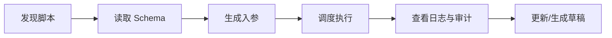

# ActionDock：脚本即 Skill

> 不再为每个脚本手写 Skill，让脚本成为可发布、可调用、可审计的工具能力。

---

## 自动化从脚本开始，到工具收尾

很多自动化任务，最初都只是一个本地脚本。

脚本可能用来清理临时文件、同步数据、生成报表、检查服务状态，或者调用内部系统。最初阶段，只要跑通即宣告完成。

然而，一旦脚本开始变得有用，问题就会显现：

脚本被复制到服务器、 CI 、项目目录或文档中；参数变更了，调用方未同步；依赖升级了，旧副本仍在运行。一旦出错，很难追溯是谁在什么时间、传入了什么参数执行了该脚本。

随着时间推移，该脚本可能还会被定时任务、 Webhook 、其他脚本，甚至 AI Agent 调用。

至此，脚本已默默演变成隐形的基础设施。

核心诉求也随之改变：

> 脚本需要能够被稳定、安全、可审计地调用。

ActionDock 正是为此而生。

---

## “脚本即 Skill” 的契约精髓

在 ActionDock 中，“脚本即 Skill” 并不意味着需要为每个脚本额外生成一份说明文件，而是指：

> 脚本自身的 Schema 、发布版本、权限边界和执行记录，天然构成了 AI 可理解、可调用、可审计的工具契约。

除了源码，一个脚本还定义了：

* 脚本 ID ：工具标识
* `inputSchema` ：输入参数契约
* `outputSchema` ：返回结果契约
* 发布快照：稳定版本边界
* 执行记录：审计来源
* 权限和 Toolset ： AI 可见范围

当脚本仅在本地运行时，关注点通常仅限于输入输出以及能否跑通。一旦脚本进入团队协作、生产环境或 AI Agent 的工具链，管理复杂度便会上升：

* 谁有权执行它？
* 脚本需要哪些参数，其中哪些是必填项？
* 返回值是什么结构？
* 调用失败时如何排查？
* 当前运行的是哪个版本？
* AI Agent 是否有权限调用它？
* 调用记录能否追溯？

传统做法是在脚本之外维护多套说明：在 CLI 文档、 REST API 、管理后台表单、 AI Prompt 或 Skill 里各写一遍。一旦脚本修改，这些说明极易脱节。

ActionDock 将这些约定全部收拢到脚本定义中。脚本定义本身就是工具契约，无需额外维护独立的描述文件。

---

## 核心基础：单份 Schema 驱动所有入口

ActionDock 将脚本的输入、输出和执行约定统一收拢至脚本定义中。

以下是脚本定义的示例：

```json
{
  "id": "hello-groovy",
  "name": "Hello Groovy",
  "type": "GROOVY",
  "source": "def name = input.name ?: \"World\"\nreturn [message: \"Hello, \" + name + \"!\", upperName: name.toUpperCase()]",
  "inputSchema": {
    "type": "object",
    "properties": {
      "name": {
        "type": "string",
        "title": "Name"
      }
    }
  },
  "outputSchema": {
    "type": "object",
    "properties": {
      "message": {
        "type": "string",
        "title": "Message"
      },
      "upperName": {
        "type": "string",
        "title": "Upper Name"
      }
    }
  }
}
```

这份定义为所有调用入口所共用：

* CLI 基于它解析命令行参数。
* 管理台基于它生成交互表单。
* REST API 基于它校验输入输出数据。
* AI Agent 基于它理解工具的调用规范。

因此，同一个脚本既可以通过 CLI 执行：

```bash
actiondock script run hello-groovy --name alice --json
```

也可以通过 REST API 调用：

```bash
curl -X POST http://localhost:5177/api/scripts/hello-groovy/execute \
  -H 'Content-Type: application/json' \
  -d '{"input":{"name":"alice"},"mode":"SYNC"}'
```

还能直接在管理台生成的表单中运行。

Schema 成了人、系统和 AI 共同理解脚本的通用语言。

---

## 实战场景：应对底层接口变更

假设有一个底层脚本叫 `query-log`，用于查询内部日志系统。它接收服务名和时间范围，返回原始日志或聚合结果。

返回的 JSON 结构如下：

```json
{
  "logs": [],
  "total": 1234,
  "queryTime": "2026-05-13T10:20:00Z"
}
```

该脚本基础却实用。有人在其上编写服务异常分析脚本，有人在 CI 中用它做部署验证，有人将其接入监控告警，还有人让它成为 AI Agent 的调试工具。每个调用方都在 `query-log` 之上叠加了一层自身的业务逻辑。

然而，一旦内部日志系统升级， API 发生变化（例如日志格式调整、返回字段重命名或认证方式变更），问题就会爆发。

如果是传统模式，每个调用方都需要手动修改本地的 `query-log` 副本。麻烦在于，无法查清该脚本被复制到了多少台服务器、运行着多少个版本，或者修改了哪些字段。最终只能逐台服务器检索文件，并期望没有人在使用老旧版本。

在 ActionDock 中，`query-log` 是一份发布在平台上的统一脚本。

当底层 API 变更时，只需修改并重新发布这一个脚本的实现。只要 `query-log` 的 `inputSchema` 保持不变，所有调用方都无需做出任何改动，甚至对底层的接口变更毫无感知。

调用方获取到的是新版日志数据，字段名相符，认证通过，省去了繁琐的适配工作。

这就是“脚本即 Skill” 的价值：将基础能力统一收拢至平台，使依赖方能专注于自身业务逻辑，无需关注底层实现的变更。

---

## 版本管理：区分草稿与发布状态

脚本越是实用，越不可随意修改源码。

当脚本被定时任务、 Webhook 、 AI Agent 或其他脚本依赖时，随手修改源码会带来极大风险。可能只是为了调试一个临时字段，却不小心干扰了线上稳定流程的运行。

ActionDock 将脚本状态严格划分为“草稿”与“已发布”两种。

* **草稿**：专用于开发、调试与试运行。
* **已发布**：发布后平台将锁定代码，生成一个稳定的版本快照。

定时任务、脚本互调、 Webhook 触发以及 AI 工具调用，应当强制指向已发布版本，防止草稿的修改对生产流程造成冲击。

这使得脚本具备了轻量工具的演进能力：

* 开发阶段可快速调整与调试。
* 发布后自动锁定，确立稳定的调用边界。
* 发生故障时，可快速回溯版本历史。
* 支持一键回滚至上一个稳定版本。

发布脚本，即是发布一项长期稳定的工具服务。

---

## 执行记录与审计：保障生产环境可追溯

自动化任务越关键，越需要清晰的执行轨迹。

如果脚本被手动运行、定时任务触发、 Webhook 调用或 AI Agent 消费后，没有留下统一的痕迹，一旦出错，排查将无从下手。

ActionDock 会自动持久化每次脚本执行的完整上下文：

* **触发源**：标识执行的触发用户或系统。
* **脚本版本**：锁定执行时所处的具体版本快照。
* **输入参数**：记录传入的完整参数。
* **输出结果**：记录返回的结构化响应。
* **运行状态**：标识成功或失败。
* **日志步骤**：保留控制台输出的详细执行日志。
* **异常信息**：记录失败时的完整堆栈和错误提示。

当外部 Webhook 触发脚本时，平台同样会生成审计日志，并在脚本输入中注入请求来源的元数据。

这确保了脚本的每次运行均可复盘、可解释、可审计。

AI 调用同样处于该审计体系内。当 Agent 调用 ActionDock 中的工具脚本时，调用记录会如实记录至平台。你可以随时回溯 AI 调用的时间、传入参数、返回结果，以及失败发生时的具体上下文。

---

## 配置隔离：免去多环境硬编码

脚本不应将环境信息直接硬编码在源码中。

开发、测试与生产环境往往使用不同的服务地址、 Token 、数据库连接、监控端点和通知通道。若这些信息直接写死在脚本里，脚本的管理、审计与同步会变得极其繁琐。

ActionDock 设计了集中的配置管理层。

脚本与插件均可通过 `config.get()` 或 `${config.key}` 动态引用配置项。敏感凭证可以标记为 Secret ，平台会在管理台界面和 API 响应中对其进行自动脱敏处理。

由此，你无需为每台服务器单独维护一套脚本。脚本定义、 Schema 以及调用入口完全保持一致，唯一的变量只是注入的配置值。

---

## 脚本互调与运行时能力

ActionDock 在管理单个脚本之余，还支持脚本之间的协同调用、插件扩展、状态共享以及系统级命令执行。

平台原生支持 Groovy 与 Python 两种脚本语言。无论使用何种语言，两者在运行时享有的能力完全一致。平台会自动为脚本注入以下运行时对象：

| 注入对象 | 核心作用 |
| :--- | :--- |
| `scripts` | 触发并调用其他已发布的脚本能力 |
| `plugins` | 调用已注册的平台插件动作 |
| `state` | 读写跨执行共享的持久化状态 |
| `config` | 读取平台全局配置项与环境变量 |
| `log` | 输出结构化的执行日志 |
| `shell` | 执行本机 shell 命令，并获取 `stdout` 、 `stderr` 与退出状态码 |
| `context` | 读取当前的执行 ID 、触发模式以及本次执行的产物目录约定路径 |

> [!NOTE]
> `context.artifactDir` 仅提供符合约定的路径，平台不会自动创建或回收目录。有写入产物需求的脚本需自行创建目录；无产物输出的脚本执行时，也不会产生多余的空目录。

Groovy 与 Python 脚本之间支持跨语言无缝互调：

* **Groovy 调用 Python 脚本**：
  ```groovy
  def result = scripts.invoke("python-data-converter", [input: rawData])
  ```
* **Python 调用 Groovy 脚本**：
  ```python
  result = scripts.invoke("groovy-helper", {"input": rawData})
  ```

`scripts.invoke(...)` 仅能调用已发布的脚本版本。目标脚本的输入参数与返回值，必须与其发布的 Schema 保持一致。

---

## 插件编排：流程与能力的解耦

脚本擅长灵活的流程编排，但底层的基础能力不应全部塞进脚本源码中。

内部 SDK 封装、专有系统对接、统一鉴权服务、加密签名算法、消息队列及数据库客户端、复杂文件格式解析等底层模块，如果让每个脚本各自维护，必然会导致大量重复代码。

ActionDock 提供了高扩展性的插件机制。

插件专注于收拢稳定且通用的底层接口，避免逻辑散落在各处。通常由平台或基础设施团队将复杂的系统交互封装为标准插件，而业务及运维人员则使用轻量级脚本，灵活编排这些插件能力。

* **Groovy 调用插件**：
  ```groovy
  def result = plugins.invoke("my-plugin", "hello", [name: "world"])
  ```
* **Python 调用插件**：
  ```python
  result = plugins.invoke("my-plugin", "hello", {"name": "world"})
  ```

对脚本作者而言，底层的具体实现基于 Groovy 、 Python 还是 Java 插件完全透明，所有能力均通过统一的接口规范进行调用。

---

## 智能编排：脚本反向调用 AI 能力

除了支持外部 AI 客户端通过 Skill 发现与调用脚本，ActionDock 还内置了 AI 模型与 Agent 驱动能力。

此时，脚本不再局限于执行固定的条件分支，还能直接引入大语言模型进行推理决策。

若采用传统方式在脚本中引入 AI ，开发者需要自行对接模型 API 、管理鉴权密钥、组装 HTTP 请求体、处理文本响应并手动实现用量计费与错误重试。一旦脚本数量变多，安全合规审计与接口升级将极难维护。

ActionDock 在平台侧统一集成了模型配置。脚本作者能够直接调用内置的 AI 运行时，无缝对接聊天（Chat）、结构化输出（Structured Output）、向量化（Embedding）或自主代理（Agent）能力。

实际应用场景：

* **告警收敛**：运维脚本自动采集监控数据，调用模型分析指标并自动给出异常诊断摘要。
* **智能工单**：读取客服原始描述，让模型自动提取关键字段并标记优先级。
* **智能报表**：在统计并输出结构化指标后，由模型为非技术人员自动撰写易懂的业务周报摘要。

这种设计使脚本从传统的“固化脚本”演进为“可自组织、可调度 AI 能力的智能化工作流”。

---

## 内置 Skill ：贯穿脚本的完整生命周期

当脚本自身具备了 Schema 、版本快照、配置脱敏、环境隔离与 AI 互调能力后， AI 客户端便无需通过漫长的 Prompt 去猜测调用规范。 ActionDock 提供了一个系统级内置 Skill ，使外部 AI 能够动态加载脚本元数据，并在运行时动态发现和执行相应的工具。

内置 Skill 能够覆盖脚本生命周期的各个阶段：



以人机协作为例：

```text
用户：“帮我查一下有哪些已发布的脚本。”
  ↓
AI：调用内置 Skill，执行命令行 actiondock script list。
  ↓
用户：“执行 hello-groovy 脚本，传入参数 name=alice。”
  ↓
AI：自动读取 hello-groovy 对应的 inputSchema，格式化入参，执行 actiondock script run hello-groovy --name alice --json。
  ↓
ActionDock：向 AI 客户端回传标准的 JSON 结果与执行日志。
```

除了直接调用，内置 Skill 还支持辅助开发。例如，向 AI 发送指令：

```text
“帮我写一个脚本，输入服务名与部署环境，去请求其健康度接口。
若失败则返回报错原因；若成功则返回 HTTP 状态码、响应延时及校验时间。”
```

AI 将自动生成符合 ActionDock 标准的脚本草稿包（含源码、 `inputSchema` 、 `outputSchema` 、示例入参及错误处理逻辑）。该包将被推送到平台的草稿箱，开发人员可在管理台界面试跑、微调，通过审核后发布为稳定版本。一经发布，即可自动进入 AI 的动态调用网络中。

ActionDock 不仅充当了 AI 调度脚本的运行网关，还构建了一套让 AI 能够自主辅助生成、校验、发布与迭代脚本的闭环开发体系。

---

## 接入模式一：动态路由模式

ActionDock 提供了两种向 AI 暴露脚本的途径。第一种是**动态路由模式**。

在该模式下， AI 客户端通过平台内置的 ActionDock Skill 查询可用脚本列表、读取所需的 Schema 定义，最后调用统一的 `runScript` 接口远程执行目标脚本。

**核心优势**：

* **免维护成本**：开发者无需为每个新增脚本独立维护一份 Skill 描述。
* **实时更新**：脚本一经发布， AI 客户端即可实时读取最新的入参规范，避免逻辑滞后。
* **适合海量工具**：在内部自动化流程较多、脚本更迭频繁的平台化场景中尤为适用。

动态路由的核心逻辑：

> AI 优先理解 ActionDock 的统一网关，再通过网关动态加载并调用具体脚本。

---

## 接入模式二：独立工具化模式

第二种是**独立工具化模式**。

在这种模式下，平台会将被授权为 `TOOL` 类型的脚本，直接注册为 Agent 工具链中的原子工具。

对应的工具名称映射如下：

```text
script.<scriptId>
```

脚本定义的 `inputSchema` 会无缝转化为该工具的入参约束， AI Agent 无需阅读复杂的 Prompt 说明即可精准传递参数。

此模式非常适合那些调用频率高、逻辑稳定，且需要作为基础能力常驻 Agent 工具库的脚本。

高频原子工具示例：

* `script.check-service-health`
* `script.notify-team`
* `script.create-incident-ticket`
* `script.generate-weekly-report`

独立工具化的核心逻辑：

> 常用脚本直接作为标准组件，平铺在 Agent 的基础工具箱（Toolset）中。

这两种模式在平台中并不冲突，它们共享同一套脚本源码、 Schema 契约、发布快照与执行记录，仅在对外的暴露形态上有所差异。

---

## 安全边界与 Agent Profile

“脚本即 Skill” 绝不意味着所有脚本都能被 AI 无限制地触发。在 ActionDock 中，脚本必须经历“发布 -> 标记为 `TOOL` 类型 -> 加入指定 Toolset” 三道流程，才会被允许对 Agent 暴露。

为了实现权限的精细化控制，平台引入了 **Agent Profile** 的概念。不同 Agent Profile 绑定不同 Toolset 后，不同模型、业务场景和用户角色可见的工具边界将实现完全隔离。

一个完整的 Agent Profile 包含以下核心要素：

* **Model Profile**：定义模型底层配置，包括调用商、模型版本及鉴权密钥（API Key）。
* **Toolset / Direct Tools**：声明该 Agent 拥有权限调用的工具白名单。
* **Skill**：提供面向特定场景的元指令、决策约束和工作指南。

以“运维告警场景”为例，对应的 Skill 指南配置如下：

```markdown
# 运维告警处理规范

## 触发背景
当收到系统服务告警后，需快速评估告警级别，并按照不同等级流程进行收敛与通知。

## 可用工具
* `check-service-health`：检查当前服务实例健康状态
* `query-service-metrics`：查询服务核心性能指标（QPS/时延/错误率）
* `notify-team`：向对应开发/运维组推送告警详情

## 执行流程
1. 立即运行 `check-service-health` 检查目标实例是否存活。
2. 调用 `query-service-metrics` 获取过去 15 分钟内的性能波动指标。
3. 综合错误率与实例存活状态，判定告警级别：
   * 若达到 P1 或 P2 级别，调用 `notify-team` 进行紧急群组通知。
4. 生成本次排查事件的结构化分析报告，并推荐后续跟进人。
```

在这种分工下，业务 Skill 专门负责定义“何时调用、遵循何种规则”，而 ActionDock 的脚本定义则专门维护“工具的具体输入参数与执行机制”。两层契约边界分明，让整个系统的维护成本降到了最低。

---

## 仓库机制：资产的发现与版本同步

当团队内部积累了海量的脚本和工具后，管理的核心痛点往往会转向资产的分发效率：“团队成员如何快速发现新工具？如何保障所有人的运行版本与上游同步？”

ActionDock 引入了 **Repository（仓库）** 机制来解决这一分发难题。

一个合规的 ActionDock 仓库可承载多种类型的系统资产：

* 脚本工具与已注册插件
* Webhook 资产配置
* AI 能力包与模型配置模板
* 场景 Skills 指南
* 定时调度模板与多环境配置模板

仓库支持从 Git 、 HTTP 订阅或本地文件目录进行拉取与同步。

同步完成后，团队成员即可通过管理台界面或 CLI 工具直接发现、一键安装和在线升级这些资产。

仓库资产除了源码，还支持携带相关的外部物理依赖、调度模板和环境参数模板。在安装过程中，平台会提示是否同步安装所需的系统级依赖，规避了“工具安装成功，运行环境残缺”的尴尬局面。

此外，仓库还支持“本地工作副本”与“上游源仓库”之间的状态跟踪。

用户可直接将仓库中的工具或 Webhook 资产导入为本地工作副本进行二次开发。平台会自动在底层通过上游映射机制，持久化记录其版本来源、所属提交（Commit ID）、代码文件摘要，并提供四种状态跟踪：

* **已同步**（Synced）
* **本地有改动**（Local Changes）
* **远端有改动**（Remote Changes）
* **双端冲突**（Conflict）

由此，团队不仅可以在平台中灵活调试本地工作副本，还能始终保留与上游公共仓库的增量同步和一键升级通道。

---

## 多环境调度：统一的 CLI Profile 入口

ActionDock 提供了 **CLI Profile** 功能，使得单个命令入口能够弹性地路由至不同的服务器集群或目标运行环境中。

假设你在与 AI 协同处理一个跨节点排障任务：

> **用户**：“帮我读取 A 电脑上的 doc_1.txt 和 B 电脑上的 doc_2.txt，分析一下它们的内容差异。”

在这个场景下， AI 客户端通过 ActionDock Skill 加载对应的 Profile：

1. 优先切换至 `a` Profile，在 A 电脑上运行脚本读取内容。
2. 随后自动将目标 Profile 切换为 `b`，无缝调度 B 电脑上的对应脚本。

虽然底层指向的是两台完全物理隔离的机器，但对外的交互入口始终保持一致：

```bash
actiondock script run <scriptId> --profile <profileName>
```

运维人员无需频繁登录不同的服务器终端，即可实现多节点的协同调度。

---

## 对比：ActionDock vs 传统 Skill 模式

传统 Skill 模式在业务脚本之外，还需要开发者在外部平台中手动维护一套繁琐的 JSON 工具描述（如 OpenAPI JSON），极易在后续迭代中发生契约不同步的硬伤。 ActionDock 让脚本定义本身成为第一等公民和天然的工具契约。

下面是两者在核心开发场景下的对比：

| 维度项 | 传统 Skill 模式 | ActionDock 平台模式 |
| :--- | :--- | :--- |
| **工具描述维护** | 需要单独在控制台或代码中手写工具定义 | 脚本源码自带 Schema 定义与功能描述 |
| **参数参数约束** | 需在 Skill 平台中额外定义参数类型 | 直接利用脚本自带的 `inputSchema` |
| **响应输出结构** | 无法直接校验，由开发者自行约束格式 | 严格依据 `outputSchema` 进行数据清洗与校验 |
| **多环境版本一致性** | 脚本源码与 Skill 定义属于两套体系，极易脱节 | 发布快照为统一的逻辑边界，一发布两端同步 |
| **多入口接入** | CLI 、 API 与 AI 入口需要各自编写不同的描述适配器 | 统一读取底层的同一份 Schema，全入口共享 |
| **AI 发现流程** | 极度依赖 Prompt 长度描述所有工具 | 通过内置 Skill 实现轻量化的动态加载与发现 |
| **调用可审计性** | 开发者必须在脚本内自行实现复杂的日志打点与留存 | 执行日志与异常堆栈由平台统一捕获、归档和追溯 |

---

## 对比：ActionDock vs 可视化工作流平台

n8n 、 Dify 、扣子等可视化工作流工具，非常适合通过图形化拖拽节点来快速串联业务、验证原型想法。

但在面对团队级、高频且生命周期长的核心自动化场景时，企业更需要能够收敛为稳定脚本、高内聚内部工具或平台化能力的开发形态。

随着自动化链路的深入，流程复杂性会呈现指数级增长：

* 极其繁杂的条件判定与边界分支。
* 精细到代码级的异常处理与失败重试策略。
* 外部依赖包的严格复用与升级管理。
* 敏感配置项的安全加密与环境路由隔离。
* 代码的严格评审（Code Review）、历史版本回滚以及调用行为的安全审计。
* 需要对 AI Agent 提供确定性极高的 Schema 契约调用。

面对上述诉求，**用代码表达执行逻辑、用 Schema 定义入参契约、用版本快照隔离运行环境**，其长期可维护性与稳定性远远优于将海量逻辑堆砌在密密麻麻的可视化画布上。

以下是两者的核心应用差异对比：

| 评估维度 | 可视化逻辑工作流 | ActionDock 平台模式 |
| :--- | :--- | :--- |
| **主要面向人群** | 业务线人员、非技术配置人员 | 研发人员、 SRE 运维、平台工程团队 |
| **系统表达媒介** | 可视化画布与图形化节点 | 标准脚本源码、契约 Schema 与高内聚插件 |
| **核心复用模块** | 画布节点或工作流模板 | 脚本函数与已打包发布的物理插件 |
| **分支异常管理** | 依靠画布连线，节点多时会陷入“蜘蛛网”困局 | 基于原生代码控制结构，易于进行深度精细化调试 |
| **版本控制深度** | 依赖特定的可视化平台自身历史记录 | 支持代码级快照、 Git 上游拉取与一键快速回滚 |
| **Agent 工具暴露** | 需在外部额外配置工具的 Prompts 映射层 | 自动基于 `inputSchema` 编译为标准的工具卡片 |

ActionDock 的设计初衷绝非要彻底替代可视化编排软件，而是用于补齐其生态中缺失的关键一环：**把团队中已经或即将退化为脚本、零散微服务的孤立自动化资产，带回一套让开发者与运维人员感到舒适的现代化工程体系中。**

---

## 快速开始

通过 `npm` 全局安装并启动本地服务端：

```bash
npm install -g actiondock
actiondock server
```

启动完成后，在浏览器中打开管理台控制面板：

```text
http://localhost:5177/admin/app/scripts
```

在终端中执行内置的 Groovy 示例脚本：

```bash
actiondock script run hello-groovy --name alice --json
```

执行成功后，将返回以下标准的 JSON 格式响应：

```json
{
  "status": "SUCCESS",
  "output": {
    "message": "Hello, alice!",
    "upperName": "ALICE"
  }
}
```

后续可探索的进阶操作：

1. **Schema 驱动开发**：创建自定义脚本，为其补全精确的输入与输出 `inputSchema`。
2. **草稿调试**：在管理台直接在线编辑并调试未发布的脚本草稿。
3. **版本发布**：锁定脚本逻辑，生成稳定的已发布版本快照。
4. **智能调度**：通过内置 Skill 让 AI 客户端自动读取 Schema 并完成脚本调度。
5. **代码辅助**：让 AI 按照平台规范自动补全包含 Schema 与异常处理的脚本框架。
6. **运行时能力**：在脚本内部通过 `scripts` 或 `plugins` 联动调用其他工具和 AI 模型。
7. **环境适配**：配置并管理多套环境的 CLI Profile 接入点。
8. **团队分发**：将优质的本地资产发布到 Repository 仓库，共享给团队成员发现和更新。

---

## 总结

因为脚本带有 `inputSchema` ，所以 AI 能精准得知入参的格式；因为具备 `outputSchema` ，下游调用系统能直观掌握返回值结构；因为拥有发布快照，各依赖方可以拥有绝对稳定的运行边界；因为融合了权限与 Toolset ， AI 的调用权限被牢牢锁在安全底线内；因为记录了完整的执行上下文，每一次调试与线上运行均有迹可循。

在这里，脚本定义本身即是最精确的工具契约，开发者无需编写任何冗余的 Prompt 来说明工具的使用方法。

开发者的脚本依然可以保持其原汁原味的轻量形态。但通过 ActionDock 发布后，它已自动转变为一个高安全性、强可审计性且能无缝接入 AI Agent 生态的专业级 Skill 。

优秀的脚本并不罕见。罕见的是能够将海量脚本规范化、赋予其 Skill 契约，并保障其长期可靠运转的现代化工程体系。 ActionDock 致力于提供这一层坚固的工程底座。
