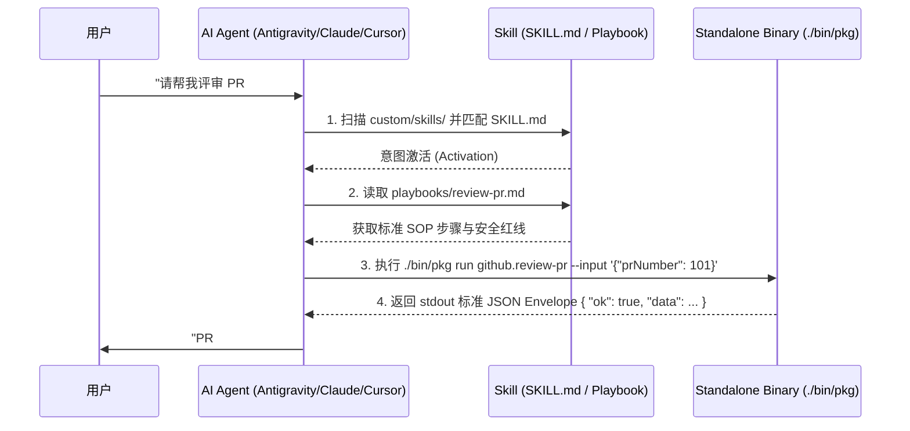

# Skill 设计哲学与交付规范

# 背景

在将工具提供给自主 AI Agent（如 Antigravity、Claude Code、Cursor、Windsurf 等）时，单纯提供 API 接口或可执行脚本往往无法达成理想的效果：

- **缺乏任务意图认知**：Agent 无法准确理解何时应该激活该工具包，容易在无关场景下误触发。
- **缺乏业务规程与安全边界**：复杂的运维或业务任务需要按固定顺序分步编排；若无 SOP 约束，Agent 容易发生顺序混乱或执行高风险的破坏性操作。
- **目标环境缺乏运行依赖**：在远程无外网的生产机器、轻量沙箱或开发机上，要求预装特定版本的 Node.js/Python 运行时往往导致交付失败。

在 ActionDock 2.0 中，**Skill（技能）**是面向 AI Agent 的最高级自包含交付物。它将 **原子工具（Action）**、**操作规程（Playbook）** 与 **认知引导（`SKILL.md`）** 深度融合，实现了“**认知、规程、执行三位一体**”的自包含交付。

---

# 核心模型：Action vs Playbook vs Skill

ActionDock 建立了清晰的三层能力模型：

```mermaid
graph TD
    subgraph Skill 技能交付包 (dist/*-skill/)
        SM["SKILL.md (Agent 认知与发现指南)"]
        Manifest["actiondock.skill.json (机器清单与全量 Schema)"]
        
        subgraph SOP 业务规程层
            PB["Playbooks (Markdown 任务操作规程)"]
        end

        subgraph 底层执行层
            Bin["bin/my-tools (自包含独立二进制)"]
            Actions["Actions (TypeScript 强类型原子能力)"]
        end
    end

    Agent["AI Agent / LLM"] -->|1. 意图发现与激活| SM
    Agent -->|2. 查阅操作步骤与红线| PB
    PB -->|3. 指导编排调用| Bin
    Bin -->|4. 执行原子能力| Actions
```

### 三者职责划分

| 层次 | 概念 | 载体形式 | 核心职责 |
| :--- | :--- | :--- | :--- |
| **底层** | **Action (动作 / 工具)** | `actions/*.ts` $\rightarrow$ 独立二进制 | 原子执行单元。声明输入/输出 JSON Schema，负责具体的 API 请求、数据处理或系统操作。 |
| **中层** | **Playbook (剧本 / SOP)** | `playbooks/*.md` | 业务操作规程。使用 Markdown 编写，指导 Agent 按照标准顺序、检查点和安全红线调用 Action。 |
| **顶层** | **Skill (技能交付包)** | 包含 `SKILL.md`、`playbooks/` 与 `bin/` 的目录或 ZIP | 最高级自包含交付实体。Agent 加载后无需安装任何运行时，即可立即可读、可懂、可执行。 |

---

# Skill 交付包的标准构成

通过 `ac export skill` 导出的 Skill 目录遵循业界通用的 Agent Skill 规范：

```text
dist/github-tools-skill/
├── SKILL.md                  # 面向 AI Agent 的主引导手册（含标准 YAML Frontmatter）
├── actiondock.skill.json     # 机器可读的结构化清单（包含全量 Action Schema）
├── playbooks/                # 业务操作规程 Markdown 目录
│   └── review-pr.md          # 领域任务 SOP
└── bin/
    └── github-tools          # 独立自包含二进制（目标机器无需预装 Node/Bun/Python/Java）
```

---

## 1. `SKILL.md` 规范与结构

`SKILL.md` 是 Agent 读取并理解 Skill 的第一入口。文件顶部包含标准的 YAML Frontmatter，正文说明工具使用方法与参数清单：

```markdown
---
name: github-tools
description: GitHub 自动化运维、Pull Request 评审与代码审查工具包
---

# GitHub Tools 技能指南

本技能为 AI Agent 提供 GitHub 相关的自动化操作与代码评审能力。

## 工具调用方式

使用本目录下的独立可执行文件 `./bin/github-tools` 进行工具调用。
**该工具为自包含二进制，无需安装任何外部运行环境。**

### 1. 发现可用 Action 清单
```bash
./bin/github-tools list --json
```

### 2. 查看 Action 详情与参数 Schema
```bash
./bin/github-tools describe <action-id> --json
```

### 3. 执行 Action
```bash
./bin/github-tools run <action-id> --input '{"param": "value"}'
```

## 可用 Action 清单
- `github.list-prs`：获取 GitHub 仓库的 PR 列表。
- `github.get-pr`：获取指定 PR 详情。
- `github.review-pr`：自动化代码评审并发表结论。
```

---

## 2. `actiondock.skill.json` 机器清单

为宿主程序或自动化工作流提供结构化元数据：

```json
{
  "schemaVersion": "2.0.0",
  "packageId": "team4u.github-tools",
  "name": "GitHub Tools",
  "version": "1.0.0",
  "description": "GitHub 自动化运维与代码评审工具集",
  "target": "host",
  "executable": "./bin/github-tools",
  "actions": [
    {
      "id": "github.list-prs",
      "description": "获取 GitHub 仓库的 Pull Requests 清单",
      "inputSchema": { ... },
      "outputSchema": { ... }
    }
  ],
  "exportedAt": "2026-08-30T08:00:00.000Z"
}
```

---

# 导出模式与精准打包

ActionDock 支持**全量打包**与**任务驱动按需打包（Playbook-Driven）**：

### 1. 全量导出（默认）
将项目内所有的 Action 与所有的 Playbook 一并打包：
```bash
ac export skill
```

### 2. 任务驱动按需导出（Playbook-Driven，推荐）
当项目包含多个业务领域的 SOP 和数十个 Action 时，可按特定任务进行按需精准打包：
```bash
ac export skill --playbook review-pr
```

- **依赖自动解析与 Tree-shaking 裁剪**：系统自动解析 `playbooks/review-pr.md` Frontmatter 中声明的 `actions` 依赖，仅将该任务所需的 Action 编译进二进制，剔除其余无关代码。
- **产物纯净无悬空**：导出的 `playbooks/` 中仅包含指定 SOP，`SKILL.md` 仅包含相关 Action，彻底避免 Agent 提示词上下文冗余。

### 3. 工具驱动按需导出
```bash
ac export skill --actions github.get-pr github.review-pr
```

---

# 跨平台分发与归档

基于 Bun 原生交叉编译能力，在单台开发机上即可直接导出全平台 Skill 包：

```bash
# 导出适配 Linux x86_64 服务器的 Skill
ac export skill --target linux-x64      # 产物输出至 dist/github-tools-skill-linux-x64/

# 导出适配 Apple Silicon Mac 的 Skill
ac export skill --target darwin-arm64   # 产物输出至 dist/github-tools-skill-darwin-arm64/

# 导出适配 Windows 的 Skill
ac export skill --target windows-x64    # 产物输出至 dist/github-tools-skill-windows-x64/

# 自动打包为 .zip 压缩归档文件
ac export skill --archive               # 生成 dist/github-tools-skill.zip
```

> [!TIP]
> 交叉导出时目录名会自动追加目标平台后缀，多平台构建互不覆盖，便于 CI/CD 矩阵分发。

---

# AI Agent 运行时生命周期



---

# Skill 设计原则与最佳实践

1. **零环境假设（Zero-Environment Assumption）**：Skill 包内的独立二进制必须自包含，绝不假定目标机器安装了 Node.js、Bun、Python 或系统级编译器。
2. **高内聚与领域聚焦**：一个 Skill 包应当聚焦明确的领域（如 `k8s-ops`、`git-workflow`），避免跨领域的无关联工具堆积。
3. **红线明确（Clear Guardrails）**：在 Playbook 中明确设立高危操作拦截线（如禁止未经确认直接物理删除数据库），规避 Agent 误操作风险。

---

# 文档导航

- [Playbook SOP 编写规范](playbook-guide.md)：深入学习标准操作规程的编写与语法校验。
- [构建编译与 Skill 分发](build-and-export.md)：掌握 `Bun.build` 单文件编译底层机制与交叉编译。
- [AI Agent 接入与集成指南](agent-integration.md)：将导出的 Skill 接入 Antigravity、Claude Code 与 Cursor。
