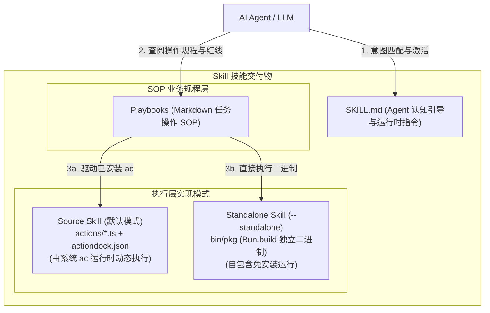
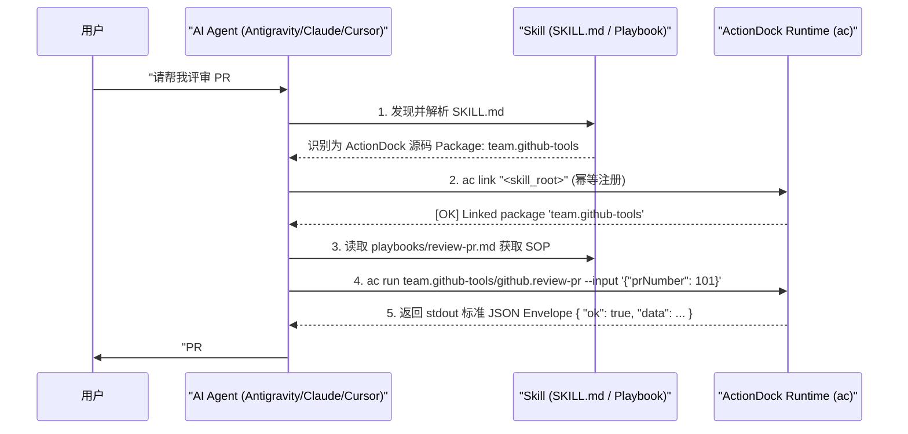

# Skill 设计哲学与交付规范

# 背景

在将工具提供给自主 AI Agent（如 Antigravity、Claude Code、Cursor、Windsurf 等）时，单纯提供 API 接口或可执行脚本往往无法达成理想的效果：

- **缺乏任务意图认知**：Agent 无法准确理解何时应该激活该工具包，容易在无关场景下误触发。
- **缺乏业务规程与安全边界**：复杂的运维或业务任务需要按固定顺序分步编排；若无 SOP 约束，Agent 容易发生顺序混乱或执行高风险的破坏性操作。
- **环境预装与分发成本的权衡**：
  - 若客户端已预装 ActionDock 运行时，直接分发轻量源码是最高效、跨平台且具备最高可观测性的方式；
  - 若目标沙箱为无依赖的纯裸机环境，则需要提供自包含的独立便携二进制。

在 ActionDock 2.0 中，**Skill** (技能)是面向 AI Agent 的自包含交付形态。它将**原子工具** (Action)、**操作规程** (Playbook)与**认知引导** (SKILL.md)深度融合，并支持**源码型 Skill** (默认)与**独立便携型 Skill**两种分发模型。

---

# 双模分发架构：Source Skill vs Standalone Skill

ActionDock 2.0 确立了清晰的两种技能分发模式：

```text
Source Skill (源码型 Skill，默认)
= SKILL.md + actiondock.json + package.json + actions/*.ts + playbooks/*.md
适用场景：目标环境已安装 ActionDock 运行时（ac 命令行）
核心优势：轻量（KB 级）、全平台通用免交叉编译、源码透明可调试、依赖自动安装

Standalone Skill (独立便携型 Skill，--standalone)
= SKILL.md + actiondock.skill.json + bin/* + playbooks/*.md
适用场景：目标环境为无 ActionDock/Node/Bun 的纯裸机沙箱或生产容器
核心优势：零环境依赖、单文件自包含、开箱即用
```

### 能力分层模型



---

# Skill 交付目录结构

### 源码型 Skill

执行 `ac export skill` 生成的标准目录：

```text
dist/github-tools-skill/
├── SKILL.md                  # 面向 AI Agent 的主引导手册（包含 ac link 与 Package-Qualified ID 指引）
├── actiondock.json          # Package 清单与配置定义
├── package.json             # 依赖声明（例如 @actiondock/sdk）
├── tsconfig.json            # TypeScript 编译配置（可选）
├── actions/                 # 原子 TypeScript Action 源码
│   ├── get-pr.ts
│   ├── list-prs.ts
│   └── review-pr.ts
└── playbooks/                # 业务操作规程 Markdown 目录
    └── review-pr.md          # 领域任务 SOP
```

### 独立便携型 Skill (Standalone Skill，`--standalone`)

执行 `ac export skill --standalone` 生成的目录：

```text
dist/github-tools-skill/
├── SKILL.md                  # 面向 AI Agent 的主引导手册（指向 ./bin/github-tools）
├── actiondock.skill.json     # 机器可读的结构化清单（包含全量 Action JSON Schema）
├── playbooks/                # 业务操作规程 Markdown 目录
│   └── review-pr.md
└── bin/
    └── github-tools          # 独立自包含可执行二进制
```

---

# `SKILL.md` 规范与交互约定

`SKILL.md` 是 Agent 读取并理解 Skill 的第一入口。文件顶部包含标准的 YAML Frontmatter。

### 源码型 `SKILL.md`（推荐规范）

在源码型 Skill 中，`SKILL.md` 引导 Agent 如何借助 ActionDock 完成幂等注册与执行：

```markdown
---
name: team-github-tools
description: GitHub 自动化运维与代码评审工具集
---

# GitHub Tools (team.github-tools)

本技能为 ActionDock 源码型 Package (Source Skill)。

## ActionDock 运行时 (ActionDock Runtime)

### 注册与链接 (Idempotent Setup)
在初次调用前，将包含本 `SKILL.md` 的目录解析为 `<skill_root>` 并执行：

    ac link "<skill_root>"

> `ac link` 具备天然幂等性，安全支持重复执行。

### 执行 Action (统一推荐 Package-Qualified ID)
为防止多技能场景下的 Action ID 冲突，推荐使用完整限定 ID：

    ac run team.github-tools/github.get-pr --input '{"repo":"owner/repo","prNumber":101}'

> **免注册本地执行**：若当前终端目录已在 `<skill_root>`，亦可直接执行 `ac run github.get-pr`。
```

---

# 导出命令详解 (`ac export skill`)

ActionDock 支持灵活的导出选项：

### 导出源码型 Skill（默认）
```bash
ac export skill
# 产物输出至 dist/<package-name>-skill/
```

### 导出独立自包含二进制 Skill
```bash
ac export skill --standalone
# 或交叉编译至指定平台
ac export skill --standalone --target linux-x64
```

### 任务驱动按需裁剪导出
当项目包含多个业务领域的 SOP 和数十个 Action 时，可按特定任务进行按需精准打包：
```bash
ac export skill --playbook review-pr
```

- **自动依赖裁剪**：系统自动解析 `playbooks/review-pr.md` Frontmatter 中声明的 `actions` 依赖，仅将该任务所需的 Action 复制或编译进产物。
- **纯净上下文**：导出的 `playbooks/` 仅含指定 SOP，`SKILL.md` 仅包含相关 Action，彻底避免 Agent 提示词上下文冗余。

### 自动归档压缩
```bash
ac export skill --archive               # 生成 .zip 压缩包
ac export skill --standalone --archive  # 生成 standalone .zip 压缩包
```

---

# AI Agent 运行时调用生命周期



---

# Skill 设计原则与最佳实践

- **源码优先**：在 AI 智能体工作流中，优先分发源码型 Skill，享有体积小、可查看、可修改、跨平台无编译负担的优势。
- **统一使用 Package-Qualified ID**：在 `SKILL.md` 与 Playbook 中，调用 Action 统一使用 `<package-id>/<action-id>`，确保全局多 Package 共存时不发生冲突。
- **任务驱动最小化交付**：对外发布时善用 `--playbook` 进行按需 Tree-shaking 导出，降低 Agent 上下文负担与幻觉风险。
- **红线明确**：在 Playbook 中明确设立高危操作拦截线（如禁止未经确认直接物理删除数据库）。

---

# 文档导航

- [Playbook SOP 编写规范](playbook-guide.md)：深入学习标准操作规程的编写与语法校验。
- [构建编译与二进制打包](build-and-export.md)：掌握 `ac build` 单文件独立编译底层机制与交叉编译。
- [AI Agent 接入与集成指南](agent-integration.md)：将导出的 Skill 接入各类主流 Agent 宿主。

