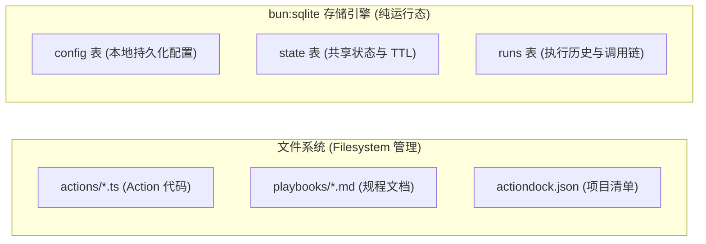
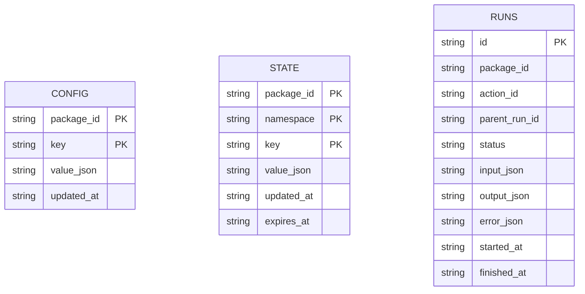

# 存储与状态管理机制

# 背景

在传统脚本与工具平台中，状态持久化与执行历史管理常常存在两极分化的缺陷：要么完全没有持久化能力（纯内存临时运行，进程退出状态即丢），要么强依赖外部重型数据库（如 MySQL / PostgreSQL），增加了极大的部署复杂度。

ActionDock 2.0 采用原生内嵌的轻量级嵌入式 SQLite 引擎（`bun:sqlite`），专注于管理运行态数据。具备**零外部服务依赖、零网络开销、毫秒级存取与天然环境隔离**的特性。

---

# 存储设计哲学与底线



- **数据与代码严格分离**：SQLite 数据库中**绝不存储代码、Action 源码或 Playbook 内容** （代码与元数据 100% 由文件系统与 Git 版本控制管理）。
- **仅管理运行态数据**：数据库专注于 3 类运行态数据：环境配置、持久化共享状态与执行历史记录。
- **进程内原生直连**：基于 Bun 内置的原生 SQLite 驱动，无网络 I/O 损耗，默认支持 WAL（Write-Ahead Logging）高并发读写模式。

---

# 物理数据库表结构全景

ActionDock 存储引擎在单个 SQLite 数据库文件中管理 3 张标准核心表：



---

## 运行时配置表 (`config`)

保存当前 Package 或全局环境下持久化设置的配置键值对。

```sql
CREATE TABLE IF NOT EXISTS config (
  package_id TEXT NOT NULL,          -- 包标识符（如 team.github-tools 或 __global__）
  key TEXT NOT NULL,                 -- 配置项键名
  value_json TEXT NOT NULL,          -- JSON 序列化后的配置值
  updated_at TEXT NOT NULL,          -- 最后更新时间 (ISO-8601)
  PRIMARY KEY (package_id, key)
);
```

---

## 持久化共享状态表 (`state`)

保存跨 Action 执行保留的业务持久化状态，支持命名空间隔离与生存时间 (TTL)。

```sql
CREATE TABLE IF NOT EXISTS state (
  package_id TEXT NOT NULL,          -- 所属 Package ID
  namespace TEXT NOT NULL,          -- 命名空间（默认为 "default"）
  key TEXT NOT NULL,                 -- 状态键名
  value_json TEXT,                   -- JSON 序列化后的状态值
  updated_at TEXT NOT NULL,          -- 最后更新时间 (ISO-8601)
  expires_at TEXT,                   -- 过期时间戳 (ISO-8601，为 NULL 表示永不过期)
  PRIMARY KEY (package_id, namespace, key)
);

CREATE INDEX IF NOT EXISTS idx_state_expires ON state(expires_at);
```

### TTL（生存时间）与惰性清理机制
- **写入支持 TTL**：调用 `ctx.state.set(key, val, 3600)` 时，系统自动计算 `expires_at = now + 3600s`。
- **读取自动校验**：`ctx.state.get(key)` 时，若当前时间已超过 `expires_at`，自动返回 `undefined` 并物理删除过期记录。
- **列表惰性剔除**：`ctx.state.keys()` 或 `ac state list` 时，自动过滤并批量清理已过期的 Key，保证状态库轻量高效。

---

## 执行历史与调用链记录表 (`runs`)

记录每次 Action 调用的执行详情、耗时、输入输出及级联关系。

```sql
CREATE TABLE IF NOT EXISTS runs (
  id TEXT PRIMARY KEY,               -- 唯一 Run ID (全局唯一有序标识符)
  package_id TEXT NOT NULL,          -- 所属 Package ID
  action_id TEXT NOT NULL,           -- 调用的 Action ID
  parent_run_id TEXT,               -- 父级 Run ID (用于追踪复合 Action 级联调用)
  status TEXT NOT NULL,              -- 运行状态: running / success / failed / cancelled
  input_json TEXT,                   -- 输入参数 JSON
  output_json TEXT,                  -- 输出数据 JSON
  error_json TEXT,                   -- 错误详情 JSON (含 code, message, details)
  started_at TEXT NOT NULL,          -- 启动时间 (ISO-8601)
  finished_at TEXT                   -- 结束时间 (ISO-8601)
);

CREATE INDEX IF NOT EXISTS idx_runs_action ON runs(package_id, action_id);
CREATE INDEX IF NOT EXISTS idx_runs_started ON runs(started_at DESC);
```

---

# 存储路径解析策略

ActionDock 根据运行模式自动解析 SQLite 数据库文件的存放位置，实现开发态与生产态的天然环境隔离：

| 运行模式 | 默认 SQLite 数据库路径 | 自定义覆盖方式 |
| :--- | :--- | :--- |
| **开发态** (`ac action run`) | `<项目根目录>/.actiondock/runtime.db` | 项目根目录 |
| **独立二进制态** (`./bin/pkg run`) | `~/.actiondock/data/<package-id>/runtime.db` | 命令行参数 `--data-dir <path>` |
| **单元测试态** (`createTestRuntime`) | 纯内存模拟（`MemoryStateStore`） | 内存即测即毁，零磁盘 I/O |

### 独立二进制指定自定义数据目录

在容器或特定隔离环境中，可通过 `--data-dir` 将数据存储重定向到挂载卷：

```bash
./dist/bin/github-tools --data-dir /var/data/my-agent run github.get-user --input '{"username": "torvalds"}'
```

---

# 数据库版本迁移机制 (`PRAGMA user_version`)

ActionDock 使用 SQLite 原生的 `PRAGMA user_version` 管理数据库结构演进：
- 每次打开数据库连接时，读取当前的 `user_version`。
- 若当前版本低于最新的 Schema 版本，系统按序执行增量 DDL 脚本。
- 迁移过程完全封装在单一事务中执行，若迁移失败自动回滚，确保本地数据文件绝不损坏。

---

# CLI 存储管理命令速查

```bash
# 状态管理 (State)
ac state list [prefix] [-i "<regex>"]     # 列出状态 Key
ac state get <key>                        # 查看状态值
ac state set <key> <json-val> [--ttl 60]  # 写入带 TTL 的状态
ac state delete <key>                     # 删除状态

# 执行历史管理 (Runs)
ac runs list [--action <id>] [--limit 20] # 查看执行历史
ac runs show <run-id>                     # 查看单次 Run 详情与错误堆栈
```

---

# 文档导航

- [ActionContext 核心能力详解](action-context.md)：学习在代码中使用 `ctx.config` 与 `ctx.state`。
- [安全加固与执行生命周期设计](design-security-mcp-execution.md)：深入学习 `ActionRunner` 与执行状态流转。
- [CLI 命令行参考手册](cli-reference.md)：查看 `ac state` 与 `ac runs` 全量参数。
