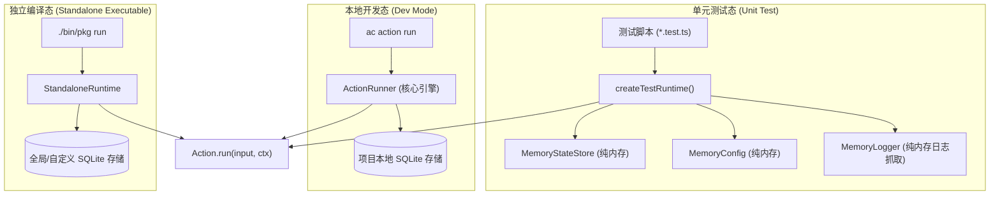

# 测试与验证指南

# 背景

在为 AI Agent 开发工具与能力时，自动化测试往往面临以下痛点：

- **外部依赖重，执行缓慢**：Action 经常依赖 SQLite 数据库、网络请求或配置中心，启动真实数据库或网络 Mock 服务导致单测耗时动辄数秒。
- **环境状态污染**：多个测试用例并发读写本地 SQLite 或磁盘文件，容易产生状态竞争与脏数据残留。
- **开发态与编译产物行为不一致**：Action 在本地源码开发态（`ac run`）正常，但编译为独立二进制（`ac build`）后因打包路径或依赖内联问题而运行异常。

ActionDock 2.0 提供了全套分层测试基础设施：
- **轻量纯内存单元测试** （`createTestRuntime`）：单测毫秒级完成，零磁盘 I/O，完全隔离。
- **独立编译契约测试** (Standalone Contract Testing)：保证开发态与独立二进制产物的输入/输出、配置优先级与状态持久化行为 100% 相同。

---

# 架构设计

ActionDock 在测试态、开发态与独立二进制态下保持统一的领域内核契约：



---

# 核心测试实践

## 基础 Action 单元测试

在项目的 `tests/` 目录下创建测试文件（如 `tests/get-user.test.ts`）：

```ts
import { describe, expect, it } from "bun:test";
import { createTestRuntime } from "@actiondock/sdk";
import getUserAction from "../actions/get-user";

describe("github.get-user 单元测试", () => {
  it("使用 Mock 配置与入参成功执行", async () => {
    // 创建内存测试运行时并预填 Mock 配置
    const runtime = createTestRuntime({
      config: {
        GITHUB_TOKEN: "mock-token-xyz",
      },
    });

    // 执行 Action
    const result = await runtime.run(getUserAction, {
      username: "torvalds",
    });

    // 断言返回值契约
    expect(result.id).toBeDefined();
    expect(result.name).toBe("Linus Torvalds");
    expect(result.url).toBe("https://github.com/torvalds");

    // 断言日志输出
    expect(runtime.logger.logs.some((l) => l.message.includes("torvalds"))).toBe(true);
  });
});
```

---

## 状态持久化与 TTL 过期测试

验证 Action 对 `ctx.state` 的写入、读取以及 TTL 自动过期行为：

```ts
import { describe, expect, it } from "bun:test";
import { createTestRuntime } from "@actiondock/sdk";
import syncDataAction from "../actions/sync-data";

describe("State 持久化与 TTL 测试", () => {
  it("测试状态读取、更新与过期剔除", async () => {
    const runtime = createTestRuntime({
      // 预填初始持久化状态
      state: {
        last_sync_id: "sync_001",
      },
    });

    // 第一次执行 Action
    await runtime.run(syncDataAction, { batchSize: 50 });

    // 验证状态是否已更新
    const updatedSyncId = await runtime.state.get<string>("last_sync_id");
    expect(updatedSyncId).toBe("sync_051");

    // 验证带有 TTL 的临时状态写入
    await runtime.state.set("temp_lock", "locked", 1); // 1 秒 TTL
    expect(await runtime.state.get("temp_lock")).toBe("locked");

    // 模拟等待 1.1 秒后再次获取
    await new Promise((resolve) => setTimeout(resolve, 1100));
    expect(await runtime.state.get("temp_lock")).toBeUndefined();
  });
});
```

---

## 复合 Action 与循环依赖测试

当测试包含 `ctx.actions.invoke` 的复合 Action 时，在 `createTestRuntime` 中注册子 Action：

```ts
import { describe, expect, it } from "bun:test";
import { createTestRuntime, defineAction } from "@actiondock/sdk";
import reviewPrAction from "../actions/review-pr";
import getPrAction from "../actions/get-pr";
import commentPrAction from "../actions/comment-pr";

describe("复合 Action 组合测试", () => {
  it("能够成功级联调用子 Action 并聚合结果", async () => {
    const runtime = createTestRuntime({
      actions: [getPrAction, commentPrAction], // 注册子 Action 依赖
    });

    const result = await runtime.run(reviewPrAction, {
      repo: "owner/repo",
      prNumber: 101,
    });

    expect(result.verdict).toBeDefined();
    expect(result.commentId).toBeGreaterThan(0);
  });

  it("当发生递归循环调用时抛出 ACTION_CYCLE_DETECTED", async () => {
    // 构造相互循环引用的 Action A 与 Action B
    const actionA: any = defineAction({
      id: "test.action-a",
      async run(input, ctx) {
        return await ctx.actions.invoke(actionB, input);
      },
    });

    const actionB: any = defineAction({
      id: "test.action-b",
      async run(input, ctx) {
        return await ctx.actions.invoke(actionA, input);
      },
    });

    const runtime = createTestRuntime({ actions: [actionA, actionB] });

    expect(runtime.run(actionA, {})).rejects.toThrow("ACTION_CYCLE_DETECTED");
  });
});
```

---

## 取消信号与超时测试

验证 Action 对 `ctx.signal` 的响应：

```ts
import { describe, expect, it } from "bun:test";
import { createTestRuntime } from "@actiondock/sdk";
import downloadAction from "../actions/download";

describe("取消信号测试", () => {
  it("外部触发 abort 时能够及时中断", async () => {
    const controller = new AbortController();
    const runtime = createTestRuntime({
      signal: controller.signal,
    });

    // 立即触发取消
    controller.abort();

    expect(runtime.run(downloadAction, { url: "https://example.com/bigfile" })).rejects.toThrow();
  });
});
```

---

## 独立编译契约测试

为了确保本地源码与编译产物的行为 100% 一致，在 CI 中编写契约测试直接调用编译后的独立二进制：

```ts
import { describe, expect, it } from "bun:test";
import { buildProject } from "@actiondock/core";

describe("独立编译契约测试", () => {
  it("验证编译后的独立二进制产物返回标准 JSON Envelope", async () => {
    // 编译项目为独立二进制
    const buildResult = await buildProject({
      projectRoot: ".",
      target: "host",
    });

    expect(buildResult.executablePath).toBeDefined();

    // 直接以系统子进程运行编译后的二进制产物
    const proc = Bun.spawnSync([
      buildResult.executablePath,
      "run",
      "github.get-user",
      "--input",
      '{"username": "torvalds"}',
    ], {
      stdout: "pipe",
      stderr: "pipe",
    });

    expect(proc.exitCode).toBe(0);

    // 解析 stdout 标准 JSON Envelope
    const outputJson = JSON.parse(proc.stdout.toString());
    expect(outputJson.ok).toBe(true);
    expect(outputJson.runId).toBeDefined();
    expect(outputJson.data.name).toBe("Linus Torvalds");
  });
});
```

---

# 运行测试命令

ActionDock CLI 与 Bun 原生 Test Runner 完全无缝兼容：

```bash
# 使用 ActionDock CLI 运行当前项目测试
ac test

# 匹配指定名称的测试文件
ac test get-user

# 使用 Bun 全局运行全仓库测试
bun test
```

---

# 测试最佳实践

- **单元测试保持纯内存**：单测一律使用 `createTestRuntime`，避免在测试中产生任何磁盘 SQLite 临时文件。
- **Schema 边界断言**：测试时除断言正常业务入参外，还应测试非法入参是否被 Ajv 拦截（抛出 `INPUT_VALIDATION_FAILED`）。
- **CI 必跑契约测试**：在自动化构建流水线中加入独立编译契约测试，确保无悬空外部引用。

---

# 文档导航

- [Action 编写指南](action-authoring.md)：学习标准 Action 编写规范与 Schema 约束。
- [ActionContext 详解](action-context.md)：深入掌握 5 大上下文核心机制。
- [构建编译与 Skill 分发](build-and-export.md)：将测试通过的项目构建为全平台独立二进制。
