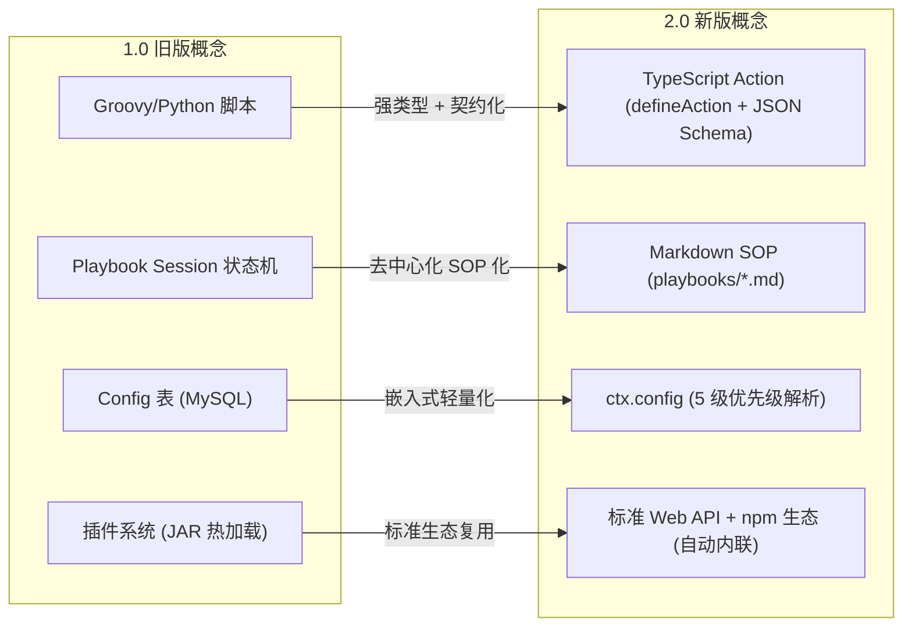

# 到 2.0 架构升级对比与迁移指南

# 背景与演进动因

ActionDock 1.0 最初定位为中心化的脚本治理平台（基于 Java 21 + Spring Boot 3 + JPA + Web Admin 控制台构建）。在 1.0 时代，系统主要面向人工运维与管理场景，由开发者在 Web 控制台上在线编辑脚本、配置定时调度并存储在中心化 MySQL 数据库中。

随着大语言模型与自主智能体（Autonomous AI Agents）的爆发，工具链的交付形态发生了范式转移：
- **AI Agent 不需要 Web 控制台**：Agent 需要的是**确定性、强类型、自包含且零环境依赖**的工具可执行实体。
- **告别庞大的常驻服务与数据库**：Agent 调用工具不应强依赖臃肿的 Java 虚拟机或外部关系数据库。
- **文件系统与 Git 优先**：代码、提示词与规程应当作为普通文件纳入代码仓库进行严格的版本管理与 Code Review。

ActionDock 2.0 是一次彻底的现代化重构：基于 **Bun + TypeScript + bun:sqlite + 原生单文件编译引擎**，全面转型为**面向 AI Agent 的 Action 与 Skill 开发、测试、构建与分发工具链**。

---

# 核心理念与架构对比矩阵

| 维度 | ActionDock 1.0 (旧版) | ActionDock 2.0 (新版) | 演进价值 |
| :--- | :--- | :--- | :--- |
| **产品定位** | 中心化脚本管理平台（带后端 Server、Admin UI、数据库、权限与定时调度） | 面向 AI Agent 的轻量级 Action / Skill 独立开发、测试与分发工具链 | 专注于 Agent 时代的极简工具链标准 |
| **技术栈** | Java 21 + Spring Boot 3 + JPA + Groovy / Python + React Admin UI | Bun + TypeScript + `bun:sqlite` + 原生单文件编译引擎 | 原生类型安全，极速冷启动，零资源浪费 |
| **运行形态** | 长期运行的常驻 Server 守护进程 + Web 控制台 | 零常驻守护进程（Zero-Daemon），纯 CLI 工具（`ac`）按需执行；远端按需启动 `ac serve` | 随用随启，杜绝资源常驻开销 |
| **交付形态**| 必须部署完整的 ActionDock 服务端才能运行脚本 | 编译为单个零外部依赖的自包含独立二进制 + 标准 SKILL.md |**零依赖独立交付**，分发后开箱即用 |
| **开发模型** | Web 页面在线编辑脚本，存在中心化数据库中 | 文件系统优先（Filesystem First），`actions/*.ts` 普通文件纳入 Git 管理 | 享受 IDE 补全、Git 分支合并与 CI/CD 流水线 |
| **依赖管理** | 复杂的动态 ClassLoader / 插件热插拔系统 | 标准 npm / TypeScript 原生模块导入（`import`）与自动补齐 | 复用海量 npm 生态，构建态自动 Tree-shaking |
| **持久化** | MySQL / PostgreSQL + JPA 重型关系数据库 | 内置 `bun:sqlite` 轻量嵌入式存储（仅管理运行态 Config/State/Runs） | 零外部 DB 依赖，毫秒级本地存取 |

---

# 核心概念映射与对照



| 1.0 旧概念 | 2.0 新概念 | 演进与变化说明 |
| :--- | :--- | :--- |
| **Script** (脚本)| **Action** (动作) | 从松散脚本演变为具备严格输入/输出 JSON Schema 和全类型安全的 Action（`defineAction`）。 |
| **Script Platform** (多语言平台)|**TypeScript 原生** | 统一为业界主流的 TypeScript，消除了跨语言上下文映射与复杂平台维护成本。 |
| **Playbook Session** (会话引擎)| **Markdown SOP** (操作规程) | 废弃复杂的内部会话状态机，Playbook 升级为纯粹提供给 AI Agent 阅读与编排的标准 SOP Markdown 文档。 |
| **Plugin System** (插件机制)|**npm / Web Standard API** | 废弃私有插件协议，直接使用现代 Web 标准（`fetch`、`Bun.spawn`、`Bun.file`）与海量 npm 生态包。 |
| **Config Store** (配置服务) | `ctx.config` | 统一 5 级优先级回退：CLI 覆盖 > 本地 SQLite > 全局 SQLite > 环境变量 > 声明默认值。 |
| **Shared State** (共享状态) | `ctx.state` | 延续跨执行持久化 Key-Value 理念，升级为基于 `bun:sqlite` 的原生轻量实现，支持命名空间与 TTL。 |
| **Profile** (多机器调度)|**ac profile + ac serve** | 远端使用极轻量 `ac serve` 接收请求，本地通过 `ac profile` 管理多云节点，执行格式保持严格一致的标准 JSON Envelope。 |

---

# 代码迁移示例

### 旧版 Groovy 脚本
```groovy
// 0 旧版动态脚本 (无静态类型、无 Schema 约束、依赖全局变量)
def name = input.name ?: "world"
def greeting = config.get("GREETING") ?: "Hello"
log.info("Greeting user ${name}")
return [message: "${greeting}, ${name}!"]
```

### 新版 TypeScript Action
```ts
// 0 新版 Action (全类型安全、严格 JSON Schema 校验、标准通道隔离)
import { defineAction } from "@actiondock/sdk";

export interface GreetInput {
  name: string;
}

export interface GreetOutput {
  message: string;
}

export default defineAction<GreetInput, GreetOutput>({
  id: "sample.greet",
  description: "向用户发送问候语",

  inputSchema: {
    type: "object",
    properties: {
      name: { type: "string", description: "用户名" },
    },
    required: ["name"],
  },

  outputSchema: {
    type: "object",
    properties: {
      message: { type: "string" },
    },
    required: ["message"],
  },

  async run(input, ctx) {
    const greeting = ctx.config.get("GREETING", "Hello");
    ctx.log.info(`Greeting user ${input.name}`);
    return {
      message: `${greeting}, ${input.name}!`,
    };
  },
});
```

---

# 迁移 FAQ

### Q: 旧版数据库中的历史数据需要迁移到 2.0 吗？
**A**：不需要。ActionDock 2.0 的设计理念是**文件系统优先**，所有的 Action 代码与 Playbook SOP 均直接存放在 Git 代码仓库的 `actions/` 与 `playbooks/` 目录下。SQLite 数据库仅在运行时按需自动生成，存放临时运行态数据。

### Q: 2.0 如何实现 1.0 的定时调度能力？
**A**：在 2.0 中，将 Action 编译为独立二进制后，可以通过系统原生的 `cron`、Kubernetes `CronJob` 或现代工作流编排工具（如 GitHub Actions、Temporal）直接触发 `./bin/pkg run <actionId>`，无需依赖庞大的 Java 后台常驻服务。

---

# 文档导航

- [快速上手指南](quick-start.md)：体验 2.0 极速工作流。
- [Action 编写指南](action-authoring.md)：学习 2.0 强类型 Action 开发规范。
- [构建编译与 Skill 分发](build-and-export.md)：掌握单文件独立编译与 Skill 导出。
